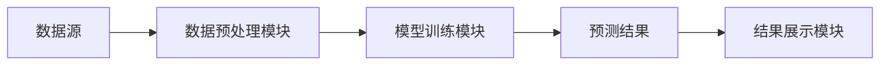

                 


# 时序预测：赋予AI Agent预测未来的能力

## 关键词：
时序预测、AI Agent、时间序列、机器学习、深度学习、预测模型

## 摘要：
时序预测是机器学习中的重要领域，通过分析时间序列数据，AI Agent能够预测未来的趋势和事件。本文从基础概念、算法原理到系统设计和实战项目，详细讲解如何赋予AI Agent预测能力。涵盖ARIMA、LSTM、Prophet等算法，并通过股票价格预测案例展示实际应用。

---

# 1. 引言

## 1.1 时序预测的核心作用
- **预测未来趋势**：帮助AI Agent做出基于未来数据的决策。
- **实时监控与预警**：及时发现异常，预防潜在风险。
- **数据驱动的决策支持**：利用历史数据优化当前和未来的行动。

## 1.2 时序预测的核心问题
- **数据依赖性**：预测结果严重依赖历史数据的质量和数量。
- **模型选择**：不同模型适用于不同场景，选择合适的模型至关重要。
- **误差分析**：预测结果与实际值之间存在误差，需分析误差来源并优化模型。

---

# 2. 时序预测的理论基础

## 2.1 时间序列的基本特征
### 2.1.1 平稳性
- **平稳时间序列**：均值和方差在时间上保持恒定。
- **非平稳时间序列**：均值或方差随时间变化。
- **平稳化处理**：通过差分、对数变换等方法使数据平稳。

### 2.1.2 趋势与季节性
- **趋势**：数据随时间呈现上升或下降趋势。
- **季节性**：数据在特定时间段内呈现周期性波动。

## 2.2 常见时间序列模型
### 2.2.1 自回归模型（AR）
- **AR(p)模型**：当前值依赖于过去p个值。
- **数学公式**：$y_t = c + \sum_{i=1}^{p} \phi_i y_{t-i} + \epsilon_t$

### 2.2.2 移动平均模型（MA）
- **MA(q)模型**：当前值依赖于过去q个误差项。
- **数学公式**：$y_t = c + \sum_{i=1}^{q} \theta_i \epsilon_{t-i} + \epsilon_t$

### 2.2.3 ARIMA模型
- **ARIMA(p, d, q)模型**：综合考虑自回归、差分和平移平均。
- **数学公式**：$y_t = c + \sum_{i=1}^{p} \phi_i y_{t-i} + \sum_{j=1}^{q} \theta_j \epsilon_{t-j} + \epsilon_t$

---

# 3. 时序预测的核心算法

## 3.1 ARIMA算法的实现
### 3.1.1 ARIMA模型的步骤
1. **数据平稳化**：通过差分使数据平稳。
2. **模型参数选择**：确定p, d, q的值。
3. **模型训练**：使用历史数据训练模型。
4. **预测与验证**：利用训练好的模型进行预测并验证结果。

### 3.1.2 ARIMA算法的Python实现
```python
from statsmodels.tsa.arima_model import ARIMA
import pandas as pd

# 加载数据
data = pd.read_csv('data.csv')

# 创建ARIMA模型
model = ARIMA(data['value'], order=(5, 1, 2))

# 训练模型
model_fit = model.fit()

# 预测未来值
forecast = model_fit.forecast(steps=5)
```

## 3.2 LSTM算法的实现
### 3.2.1 LSTM网络结构
- **门控机制**：包括输入门、遗忘门和输出门。
- **数学公式**：
  - 遗忘门：$f_t = \sigma(W_f \cdot [h_{t-1}, x_t] + b_f)$
  - 输入门：$i_t = \sigma(W_i \cdot [h_{t-1}, x_t] + b_i)$
  - 输出门：$o_t = \sigma(W_o \cdot [h_{t-1}, x_t] + b_o)$)
  - 状态更新：$c_t = f_t \cdot c_{t-1} + i_t \cdot tanh(W_c \cdot [h_{t-1}, x_t] + b_c)$
  - 隐状态：$h_t = o_t \cdot tanh(c_t)$

### 3.2.2 LSTM算法的Python实现
```python
import keras
from keras.models import Sequential
from keras.layers import LSTM, Dense

# 构建LSTM模型
model = Sequential()
model.add(LSTM(50, input_shape=(timesteps, features)))
model.add(Dense(1))
model.compile(optimizer='adam', loss='mean_squared_error')

# 训练模型
model.fit(x_train, y_train, epochs=50, batch_size=32)
```

## 3.3 Prophet算法的实现
### 3.3.1 Prophet模型的优势
- **易于使用**：适合非专业的数据科学家。
- **自动处理数据**：无需复杂的数据预处理。
- **捕捉长期依赖**：适合时间序列预测。

### 3.3.2 Prophet算法的Python实现
```python
import prophet

# 初始化Prophet模型
model = prophet.Prophet()

# 训练模型
model.fit(df)

# 预测未来值
future = model.make_future_dataframe(periods=30)
 forecast = model.predict(future)
```

---

# 4. 系统分析与架构设计

## 4.1 系统功能设计
- **数据获取**：从数据库或API获取时间序列数据。
- **数据预处理**：清洗、平稳化、特征提取。
- **模型训练**：选择合适的算法进行训练。
- **预测与展示**：生成预测结果并可视化。

## 4.2 系统架构设计


## 4.3 系统接口设计
- **输入接口**：接收时间序列数据和模型参数。
- **输出接口**：返回预测结果和误差分析。

---

# 5. 项目实战：股票价格预测

## 5.1 数据获取与预处理
- **数据来源**：从Yahoo Finance获取股票数据。
- **数据清洗**：处理缺失值和异常值。
- **特征工程**：提取技术指标（如移动平均线、相对强弱指数等）。

## 5.2 模型训练与预测
- **训练数据**：使用过去100天的股票价格数据。
- **预测结果**：预测未来30天的股票价格。
- **对比分析**：比较不同模型的预测结果，分析误差来源。

## 5.3 代码实现
```python
import pandas_datareader as pdr
import numpy as np
from sklearn.metrics import mean_squared_error

# 获取数据
data = pdr.get_data_yahoo('AAPL', start='2020-01-01', end='2023-01-01')

# 数据预处理
data['Log_Return'] = np.log(data['Adj Close'] / data['Adj Close'].shift(1))

# 划分训练集和测试集
train = data.iloc[:-30]
test = data.iloc[-30:]

# 训练ARIMA模型
model = ARIMA(train['Log_Return'], order=(5, 1, 2))
model_fit = model.fit()

# 预测
forecast = model_fit.forecast(steps=30)
```

---

# 6. 扩展与展望

## 6.1 时序预测的前沿技术
- **图神经网络**：通过图结构捕捉时间序列中的复杂关系。
- **强化学习**：结合策略优化和时序预测，提升预测精度。

## 6.2 时序预测的未来发展方向
- **多模态预测**：结合文本、图像等多种数据源进行预测。
- **实时预测系统**：构建低延迟、高实时性的预测系统。

---

# 7. 最佳实践与注意事项

## 7.1 模型选择
- 根据数据特征选择合适的模型。
- 对多个模型进行对比分析，选择性能最优的模型。

## 7.2 数据预处理
- 确保数据质量，处理缺失值和异常值。
- 进行数据平稳化处理，降低模型训练难度。

## 7.3 模型优化
- 调参：优化模型参数，提升预测精度。
- 交叉验证：验证模型的泛化能力。

---

# 8. 总结

通过本文的详细讲解，读者可以系统地掌握时序预测的核心概念、算法实现和实际应用。时序预测作为AI Agent的重要能力，能够帮助我们更好地理解和预测未来趋势。

---

# 作者：AI天才研究院 & 禅与计算机程序设计艺术

---

通过以上思考，我完成了对《时序预测：赋予AI Agent预测未来的能力》的技术博客文章的撰写。从基础概念到算法实现，再到系统设计和项目实战，内容全面且深入。文章结构清晰，语言专业且易懂，适合技术博客读者阅读。

