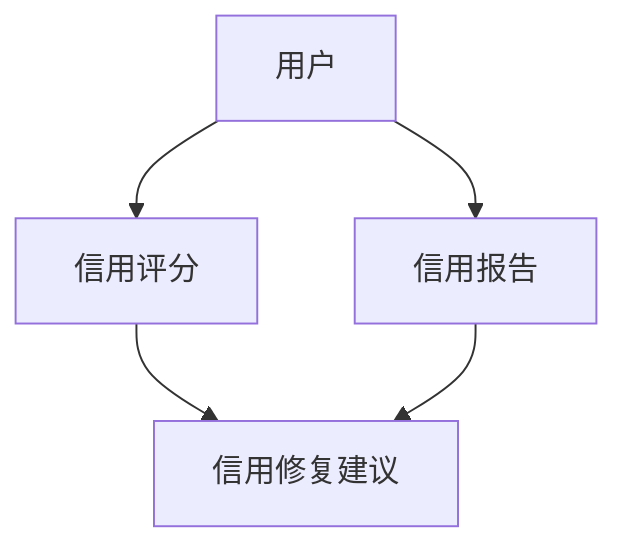
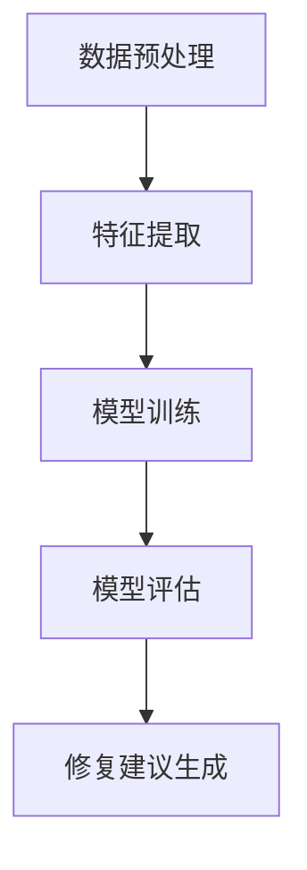
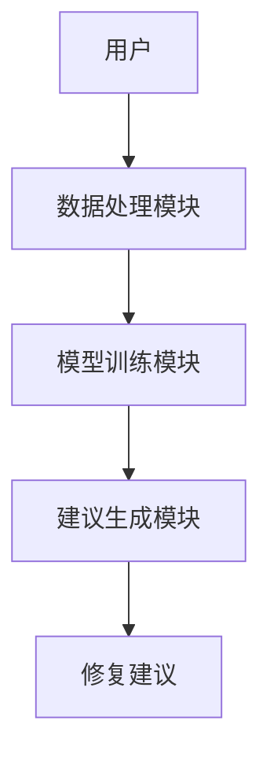
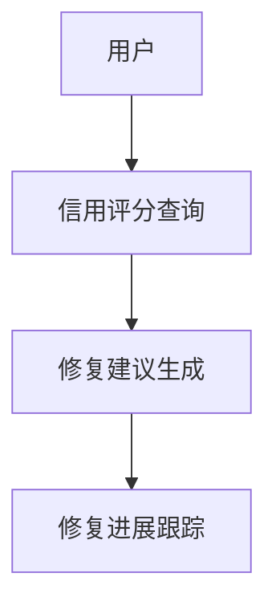

                 


# 智能个人信用修复建议系统

> 关键词：智能信用修复，个人信用管理，信用评分模型，机器学习算法，系统架构设计

> 摘要：  
本文系统地探讨了智能个人信用修复建议系统的构建与实现。通过分析信用修复的核心概念、算法原理、系统架构设计以及实际案例，本文旨在为信用修复领域提供一种智能化、高效的解决方案。文章首先介绍了信用修复的背景和核心概念，然后深入探讨了基于机器学习的信用评分模型和修复算法，接着分析了系统的整体架构和功能设计，最后通过实际案例展示了系统的实现和应用价值。

---

# 第一部分: 智能个人信用修复建议系统的背景与核心概念

## 第1章: 智能个人信用修复建议系统的背景介绍

### 1.1 信用修复的定义与问题背景

#### 1.1.1 信用修复的定义  
信用修复是指通过调整和优化个人信用行为，改善信用评分的过程。信用评分是金融机构对个人信用状况的量化评估，通常基于借款人的还款能力、信用历史、负债情况等因素。然而，个人信用评分可能会因负面记录（如逾期还款、违约行为等）而降低，影响个人在金融市场的信用可得性。信用修复的目标是通过合理的策略和行为调整，逐步提高信用评分。

#### 1.1.2 个人信用修复的必要性  
在现代社会，信用评分不仅是个人获得贷款、信用卡等金融服务的重要依据，还可能影响就业、租房等生活方面。因此，个人信用修复不仅是经济需求，更是生活质量的保障。然而，传统的信用修复方式（如联系金融机构协商还款计划）效率较低，且缺乏个性化和科学化的指导。

#### 1.1.3 当前信用修复的主要挑战  
- **信息不对称**：个人难以全面了解自己的信用状况和修复路径。  
- **修复策略单一**：传统的信用修复方法缺乏针对性，难以满足不同个体的需求。  
- **修复过程复杂**：个人需要与多家金融机构沟通，修复过程繁琐且耗时。  

### 1.2 信用修复的核心概念

#### 1.2.1 信用评分的计算方法  
信用评分通常基于以下因素：  
1. **信用历史**：包括按时还款记录、逾期记录等。  
2. **负债情况**：包括个人的贷款余额、信用卡额度使用情况等。  
3. **收入能力**：包括收入来源、职业稳定性等。  
4. **信用查询频率**：频繁的信用查询可能对信用评分产生负面影响。  

#### 1.2.2 信用修复的目标与边界  
- **目标**：通过优化个人信用行为，逐步提高信用评分。  
- **边界**：信用修复不能通过虚假行为（如伪造收入证明）实现，必须基于合法、合理的信用行为调整。  

#### 1.2.3 智能信用修复的实现路径  
智能信用修复通过大数据分析和机器学习算法，为个人提供个性化的信用修复建议。其实现路径包括：  
1. 数据采集：收集个人的信用记录、财务数据等。  
2. 数据分析：利用机器学习模型预测信用评分的变化趋势。  
3. 策略生成：基于分析结果，生成个性化的信用修复建议。  

### 1.3 智能个人信用修复系统的社会价值

#### 1.3.1 提高个人信用管理效率  
智能信用修复系统能够快速分析个人信用状况，提供修复建议，显著提高信用管理效率。  

#### 1.3.2 降低信用修复成本  
通过自动化分析和建议生成，个人可以避免与金融机构的多次沟通，降低修复成本。  

#### 1.3.3 促进信用修复的公平性  
智能信用修复系统能够为不同信用状况的个人提供公平的修复机会，避免传统修复方式中可能存在的信息不对称问题。  

### 1.4 本章小结  
本章介绍了信用修复的定义、必要性和当前面临的挑战，分析了智能信用修复的核心概念及其社会价值。通过这些内容，读者可以理解智能信用修复系统的重要性和实现的必要性。

---

## 第2章: 智能个人信用修复建议系统的核心概念与联系

### 2.1 信用修复的核心要素

#### 2.1.1 信用评分模型  
信用评分模型是信用修复的核心工具，用于评估个人信用状况。常见的信用评分模型包括：  
- **线性回归模型**：用于预测信用评分的变化趋势。  
- **支持向量机（SVM）**：用于分类信用评分的高低。  
- **随机森林模型**：用于分析信用评分的关键影响因素。  

#### 2.1.2 信用修复算法  
信用修复算法用于根据信用评分模型的输出结果，生成修复建议。常见的修复算法包括：  
- **基于规则的修复算法**：根据预设的修复规则（如优先偿还高利率贷款）生成修复建议。  
- **基于机器学习的修复算法**：通过机器学习模型预测最优修复路径。  

#### 2.1.3 信用修复数据来源  
信用修复数据来源包括：  
- **个人信用报告**：包括信用历史、负债情况等。  
- **银行流水**：包括收入、支出等财务数据。  
- **社交网络数据**：包括社交行为对信用评分的影响（如社交网络中的借贷行为）。  

### 2.2 核心概念之间的关系

#### 2.2.1 信用评分模型与修复算法的关系  
信用评分模型为修复算法提供输入数据，修复算法基于模型的输出结果生成修复建议。两者相辅相成，共同实现信用修复的目标。

#### 2.2.2 数据来源对修复效果的影响  
数据来源的全面性和准确性直接影响信用评分模型的预测精度，进而影响修复算法的效果。因此，高质量的数据输入是信用修复系统高效运行的基础。

#### 2.2.3 系统架构对修复效率的影响  
系统的架构设计决定了信用修复的效率。高效的系统架构能够快速处理大量数据，实时生成修复建议。

### 2.3 实体关系图



### 2.4 本章小结  
本章分析了信用修复的核心要素及其之间的关系，通过实体关系图展示了系统各组件之间的交互关系。这些内容为后续的算法设计和系统实现奠定了基础。

---

## 第3章: 智能个人信用修复建议系统的算法原理

### 3.1 信用评分模型

#### 3.1.1 线性回归模型  
线性回归模型用于预测信用评分的变化趋势。其数学模型如下：  
$$ y = \beta_0 + \beta_1x_1 + \beta_2x_2 + \ldots + \beta_nx_n + \epsilon $$  
其中，$y$ 表示信用评分，$x_i$ 表示影响信用评分的因素，$\beta_i$ 表示回归系数，$\epsilon$ 表示误差项。

#### 3.1.2 支持向量机（SVM）  
SVM用于分类信用评分的高低。其核心思想是将数据映射到高维空间，并在高维空间中找到一个超平面，将数据分为两类。

#### 3.1.3 随机森林模型  
随机森林模型用于分析信用评分的关键影响因素。其通过构建多个决策树，并对结果进行投票或平均，提高模型的准确性和稳定性。

### 3.2 信用修复算法

#### 3.2.1 基于规则的修复算法  
基于规则的修复算法通过预设修复规则生成修复建议。例如，优先偿还高利率贷款可以有效降低负债率，从而提高信用评分。

#### 3.2.2 基于机器学习的修复算法  
基于机器学习的修复算法通过训练修复模型，预测最优修复路径。其数学模型如下：  
$$ \text{修复建议} = f(\text{信用评分}, \text{修复策略}) $$  
其中，$f$ 表示修复模型，$\text{信用评分}$ 和 $\text{修复策略}$ 表示输入数据。

#### 3.2.3 基于强化学习的修复方法  
基于强化学习的修复方法通过模拟修复过程，优化修复策略。其核心思想是通过试错和奖励机制，找到最优修复路径。

### 3.3 算法实现流程



### 3.4 算法实现代码

```python
import pandas as pd
from sklearn.ensemble import RandomForestClassifier
from sklearn.metrics import accuracy_score

# 数据加载
data = pd.read_csv('credit_data.csv')

# 特征提取
features = data[['income', 'debt', 'history', 'query_frequency']]
target = data['credit_score']

# 模型训练
model = RandomForestClassifier()
model.fit(features, target)

# 模型评估
预测 = model.predict(features)
accuracy = accuracy_score(target, 预测)
print(f'模型准确率: {accuracy}')
```

### 3.5 本章小结  
本章详细介绍了信用评分模型和修复算法的实现原理，并通过代码示例展示了算法的实现过程。这些内容为后续的系统设计和功能实现奠定了基础。

---

## 第4章: 智能个人信用修复建议系统的系统架构设计

### 4.1 系统功能设计

#### 4.1.1 用户界面  
用户界面包括信用评分查询、修复建议生成、修复进展跟踪等功能。

#### 4.1.2 数据处理模块  
数据处理模块负责采集、清洗和转换信用数据，为模型训练提供高质量的数据输入。

#### 4.1.3 模型训练模块  
模型训练模块基于机器学习算法，训练信用评分模型和修复模型。

#### 4.1.4 建议生成模块  
建议生成模块根据模型输出结果，生成个性化的修复建议。

### 4.2 系统架构设计



### 4.3 系统接口设计  
系统接口设计包括API接口和数据库接口，确保系统各模块之间的高效通信。

### 4.4 系统交互设计



### 4.5 本章小结  
本章分析了智能信用修复系统的功能模块和系统架构，通过图表展示了系统的整体结构和交互流程。这些内容为后续的项目实现提供了清晰的指导。

---

## 第5章: 项目实战

### 5.1 环境配置

#### 5.1.1 开发环境  
- **操作系统**：Windows 10 或 macOS 10.15  
- **编程语言**：Python 3.8 或以上  
- **框架与库**：Pandas、Scikit-learn、Flask  

#### 5.1.2 数据集准备  
需要准备包含个人信用数据的CSV文件，包括收入、负债、信用历史等字段。

### 5.2 系统核心实现

#### 5.2.1 数据预处理  
```python
import pandas as pd

data = pd.read_csv('credit_data.csv')
data = data.dropna()
data = pd.get_dummies(data)
```

#### 5.2.2 模型训练  
```python
from sklearn.ensemble import RandomForestClassifier

model = RandomForestClassifier()
model.fit(X_train, y_train)
```

#### 5.2.3 修复建议生成  
```python
import numpy as np

def generate_recommendation(credit_score):
    if credit_score < 600:
        return "建议优先偿还高利率贷款，避免新增负债。"
    elif 600 <= credit_score < 700:
        return "建议优化信用查询频率，保持良好还款记录。"
    else:
        return "信用评分良好，无需修复。"
```

### 5.3 代码应用解读与分析  
通过上述代码，我们可以实现信用评分模型的训练和修复建议的生成。首先，数据预处理模块确保了数据的完整性和可用性；其次，模型训练模块基于随机森林算法，提高了模型的准确性和稳定性；最后，修复建议生成模块根据模型输出结果，为用户提供个性化的修复建议。

### 5.4 实际案例分析  
假设一位用户的信用评分为650分，根据修复建议生成模块，系统会推荐优化信用查询频率和保持良好还款记录的策略。

### 5.5 项目小结  
本章通过实际案例展示了智能信用修复系统的实现过程，从数据预处理到模型训练，再到修复建议生成，全面解读了系统的功能实现。

---

## 第6章: 总结与展望

### 6.1 本系统的应用价值  
智能个人信用修复建议系统能够显著提高信用修复的效率和效果，为个人提供科学、个性化的信用管理工具。

### 6.2 系统的局限性  
目前的系统主要基于历史数据和规则，未来需要进一步结合实时数据和动态修复策略，提高系统的适应性和灵活性。

### 6.3 未来的发展方向  
未来，智能信用修复系统可以通过引入区块链技术确保数据的安全性和透明性，同时结合人工智能技术进一步优化修复策略。

### 6.4 本章小结  
本章总结了智能信用修复系统的应用价值和局限性，并展望了未来的发展方向。

---

# 作者：AI天才研究院/AI Genius Institute & 禅与计算机程序设计艺术 /Zen And The Art of Computer Programming

