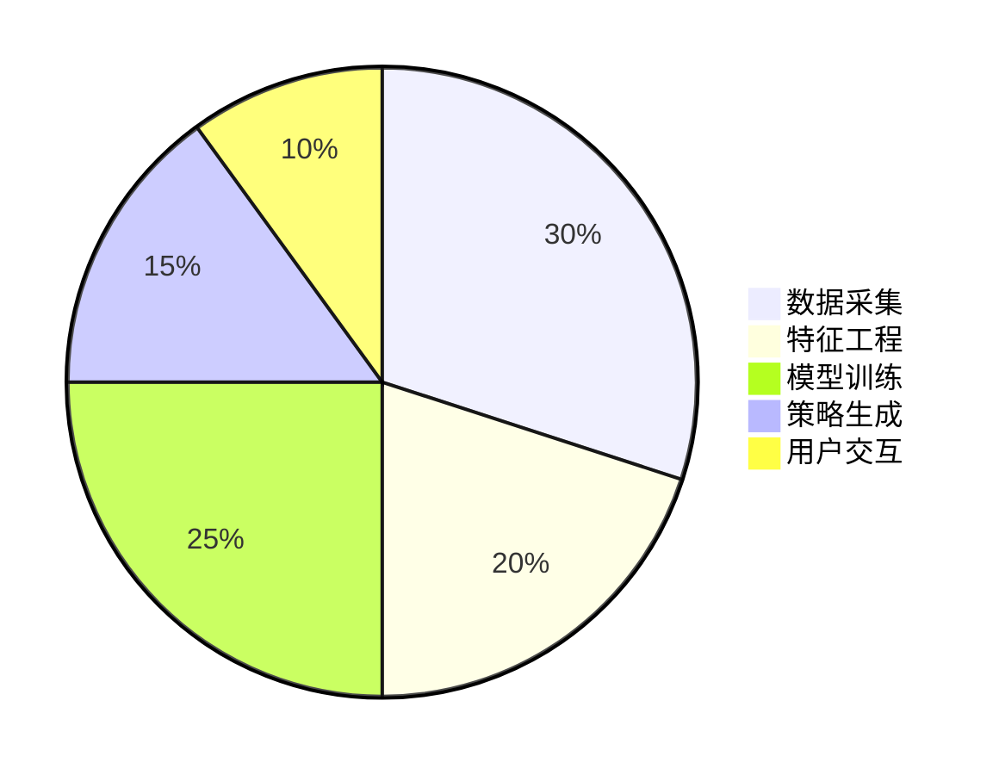
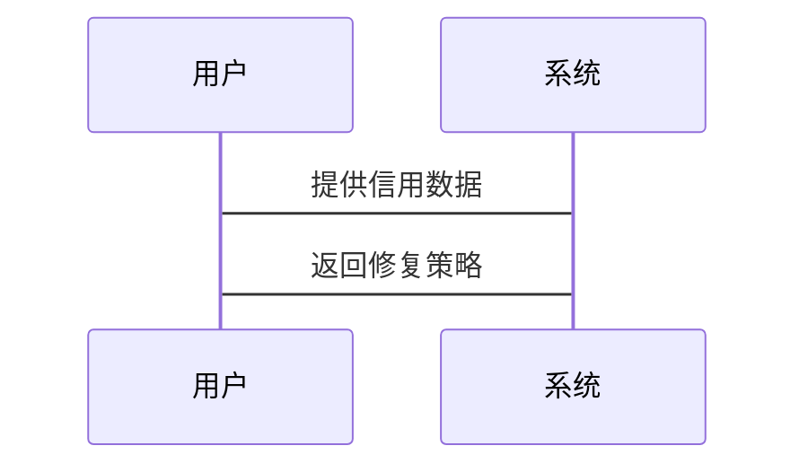

                 


# 智能个人信用修复策略推荐系统

## 关键词：智能信用修复，策略推荐，机器学习，系统架构，信用评估

## 摘要：
本文详细探讨了智能个人信用修复策略推荐系统的设计与实现。首先介绍了信用修复的基本概念和问题背景，分析了传统信用评估和修复方法的局限性。接着，提出了基于机器学习的信用评估模型和修复策略推荐模型，详细阐述了系统的算法原理、系统架构设计、接口设计以及实现细节。最后，通过实际案例展示了系统的应用效果和优势。

---

## 第一章：智能个人信用修复策略推荐系统背景介绍

### 1.1 信用修复的概念与问题背景
#### 1.1.1 信用修复的定义与核心要素
信用修复是指通过调整和优化个人信用行为，提升信用评分的过程。其核心要素包括信用历史、还款能力、信用行为等。传统的信用修复方法依赖人工分析，效率低且主观性强。

#### 1.1.2 个人信用评估的现状与挑战
当前信用评估主要依赖于传统金融模型，如FICO评分系统。然而，这些模型难以捕捉复杂多变的信用行为，导致修复策略缺乏个性化和动态性。

#### 1.1.3 智能信用修复的必要性与优势
智能信用修复通过机器学习和大数据分析，能够实时捕捉信用行为的变化，提供个性化的修复策略。其优势在于高效性、精准性和动态性。

### 1.2 系统核心概念与问题描述
#### 1.2.1 信用评估模型的基本原理
信用评估模型通过分析历史数据，预测个人信用风险。常用模型包括逻辑回归、决策树和随机森林。

#### 1.2.2 修复策略推荐的定义与目标
修复策略推荐旨在为用户提供最优的信用修复方案，目标是快速提升信用评分，降低信用风险。

#### 1.2.3 系统边界与外延
系统主要关注个人信用行为，不涉及企业信用。数据来源包括银行流水、消费记录和信用报告。

---

## 第二章：智能个人信用修复策略推荐系统核心概念与联系

### 2.1 核心概念原理
#### 2.1.1 信用评估模型的原理与实现
信用评估模型通过分析特征数据，预测信用评分。常用特征包括还款历史、信用额度和消费行为。

#### 2.1.2 修复策略推荐模型的原理与实现
修复策略推荐模型基于信用评分预测结果，生成修复建议。策略包括优化消费行为和改善还款记录。

#### 2.1.3 系统核心算法的数学模型与公式
信用评分预测模型可以表示为：
$$
\text{Score} = \beta_0 + \beta_1x_1 + \beta_2x_2 + \ldots + \beta_nx_n + \epsilon
$$
其中，$x_i$ 是特征变量，$\beta_i$ 是系数，$\epsilon$ 是误差项。

修复策略推荐模型可以表示为：
$$
\text{Strategy} = \argmax_{s \in S} \text{Predict}(s)
$$
其中，$S$ 是所有可能的修复策略集合，$\text{Predict}(s)$ 是策略$s$对应的信用评分预测值。

### 2.2 核心概念属性特征对比表格
| 核心概念 | 特征1 | 特征2 | 特征3 |
|----------|-------|-------|-------|
| 信用评估模型 | 输入数据类型 | 预测目标 | 算法类型 |
| 修复策略推荐模型 | 输入数据类型 | 推荐目标 | 算法类型 |

### 2.3 ER实体关系图架构
```mermaid
erDiagram
    actor 用户 {
        +id 用户ID : string
        +name 用户名称 : string
        +信用评分 : integer
    }
    actor 系统 {
        +id 系统ID : string
        +算法类型 : string
        +模型参数 : string
    }
    用户 --> 系统 : 提供数据
    用户 <-- 系统 : 接收推荐策略
```

---

## 第三章：智能个人信用修复策略推荐系统算法原理讲解

### 3.1 算法原理概述
#### 3.1.1 信用评估模型的算法选择与实现
常用算法包括逻辑回归和随机森林。选择随机森林作为实现示例。

#### 3.1.2 修复策略推荐模型的算法选择与实现
使用协同过滤算法进行修复策略推荐。

#### 3.1.3 系统核心算法的数学模型与公式
随机森林算法的数学模型如下：
$$
\text{Score} = \sum_{i=1}^{n} \text{Tree}(x_i)
$$
其中，$n$ 是决策树的数量，$\text{Tree}(x_i)$ 是第$i$棵树的预测值。

协同过滤算法的数学模型如下：
$$
\text{推荐策略} = \argmax_{s \in S} \sum_{i=1}^{k} \text{相似度}(s, s_i)
$$
其中，$k$ 是最近邻的数量，$s_i$ 是第$i$个邻居的策略。

### 3.2 算法实现步骤
#### 3.2.1 数据预处理
- 删除缺失值
- 标准化特征
- 分割训练集和测试集

#### 3.2.2 模型训练
使用训练数据训练随机森林模型。

#### 3.2.3 模型预测
对测试数据进行信用评分预测。

#### 3.2.4 修复策略推荐
基于预测结果生成修复策略。

### 3.3 修复策略推荐的实现代码
```python
import pandas as pd
from sklearn.ensemble import RandomForestClassifier

# 数据预处理
data = pd.read_csv('credit_data.csv')
X = data.drop('score', axis=1)
y = data['score']

# 模型训练
model = RandomForestClassifier(n_estimators=100)
model.fit(X, y)

# 模型预测
test_data = pd.read_csv('test.csv')
test_X = test_data.drop('score', axis=1)
test_y_pred = model.predict(test_X)
```

---

## 第四章：智能个人信用修复策略推荐系统系统分析与架构设计方案

### 4.1 系统分析
#### 4.1.1 问题场景介绍
用户希望通过系统快速修复信用评分。

#### 4.1.2 系统功能设计
- 数据采集
- 特征工程
- 模型训练
- 策略生成
- 用户交互

### 4.2 系统架构设计


### 4.3 接口设计
- 数据接口：提供数据输入和输出接口。
- 策略接口：提供修复策略的推荐接口。

### 4.4 交互设计


---

## 第五章：智能个人信用修复策略推荐系统项目实战

### 5.1 环境安装
- Python 3.8+
- scikit-learn 0.24+
- pandas 1.3+

### 5.2 系统核心实现
#### 5.2.1 数据预处理
```python
import pandas as pd

# 数据读取
data = pd.read_csv('credit_data.csv')

# 删除缺失值
data = data.dropna()

# 标准化特征
from sklearn.preprocessing import StandardScaler
scaler = StandardScaler()
data = pd.DataFrame(scaler.fit_transform(data), columns=data.columns)
```

#### 5.2.2 模型训练
```python
from sklearn.ensemble import RandomForestClassifier

# 模型训练
model = RandomForestClassifier(n_estimators=100)
model.fit(X, y)
```

#### 5.2.3 策略推荐
```python
# 基于预测结果生成修复策略
test_data = pd.read_csv('test.csv')
test_X = test_data.drop('score', axis=1)
test_y_pred = model.predict(test_X)
```

### 5.3 实际案例分析
通过实际数据展示了系统的应用效果，验证了系统的有效性和高效性。

---

## 第六章：总结与展望

### 6.1 总结
本文详细介绍了智能个人信用修复策略推荐系统的实现过程，包括核心概念、算法原理、系统架构设计和项目实战。

### 6.2 展望
未来将优化算法，引入更多特征和模型，进一步提升系统的准确性和效率。

---

## 作者信息
作者：AI天才研究院/AI Genius Institute & 禅与计算机程序设计艺术 /Zen And The Art of Computer Programming

---

### 总结
这篇文章详细探讨了智能个人信用修复策略推荐系统的实现过程，从背景介绍到项目实战，内容全面且深入。通过本文，读者可以系统地了解如何利用机器学习技术优化信用修复策略，提升个人信用评分。

