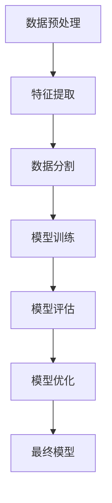
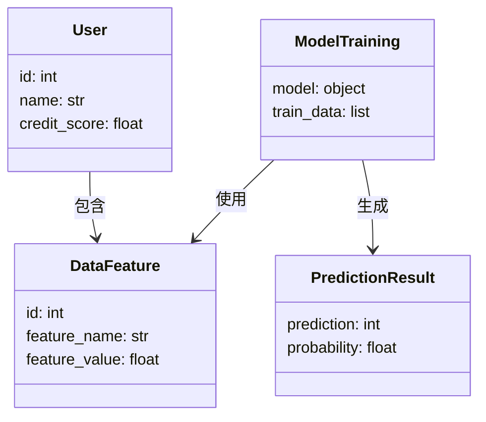
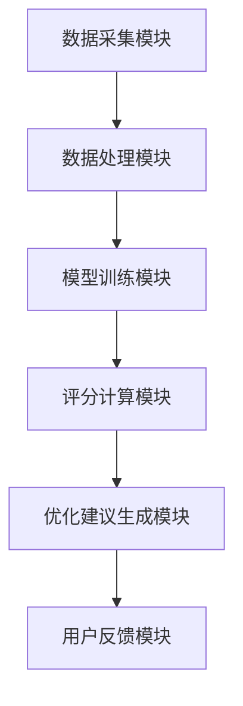
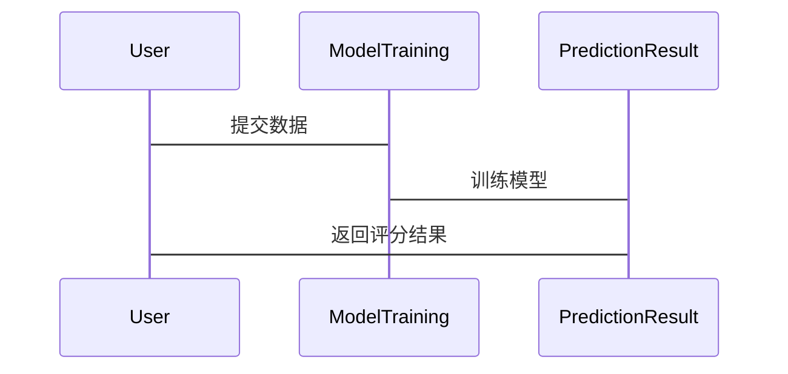

                 

<think>
好的，我现在需要帮助用户设计《智能个人信用评分优化建议系统》的技术博客文章目录。用户希望我以一位技术专家的身份，按照特定的格式和内容要求来组织目录结构，确保内容详尽且逻辑清晰。

首先，我需要明确文章的核心主题，即智能个人信用评分优化系统。这意味着文章需要涵盖背景、核心概念、算法原理、系统架构、项目实战等多个方面。我应该确保每个部分都有足够的细节，并且各部分之间衔接自然。

接下来，我会从背景介绍开始。这部分需要包括问题背景、问题描述、解决思路、系统边界与外延，以及核心要素。这些内容帮助读者理解为什么需要优化信用评分系统，以及系统的基本构成。

然后是核心概念与联系。这里，我需要详细讲解系统的核心概念，比如智能评分模型的基本原理，以及数据特征如何影响评分结果。通过表格和ER图展示实体关系，帮助读者清晰理解系统的结构和各部分之间的联系。

算法原理部分是关键，需要详细讲解所采用的机器学习算法，如逻辑回归或梯度提升树。我需要用Mermaid绘制算法流程图，并提供Python代码示例，解释数学模型和公式。例如，使用逻辑回归的sigmoid函数和损失函数的数学表达式，并用LaTeX格式展示，确保内容准确且易于理解。

系统分析与架构设计部分，我需要介绍问题场景，设计系统功能，可能使用领域模型类图展示模块关系。然后设计系统架构图，展示各模块之间的交互，比如数据采集、评分计算、建议生成等。接口设计和交互流程也需要用序列图详细说明。

项目实战部分，我需要指导读者如何安装环境，比如Python和相关库，然后提供核心代码实现。通过案例分析，解读代码的实际应用，帮助读者理解如何实现智能评分系统。最后进行项目总结，指出成果和意义。

最后，最佳实践部分需要给出一些实际应用中的注意事项，如数据隐私和模型迭代，并建议进一步阅读的资料，帮助读者深入学习。

在设计目录时，我需要确保每个部分都覆盖到，结构清晰，逻辑严密。同时，语言要专业且易懂，适合技术读者阅读。这样，用户的需求就能得到满足，文章也会具备深度和实用价值。
</think>

# 《智能个人信用评分优化建议系统》

> 关键词：智能个人信用评分系统, 人工智能, 信用评分优化, 机器学习, 数据分析

> 摘要：本文将探讨如何利用人工智能技术优化个人信用评分系统，分析现有评分系统的局限性，并提出基于机器学习的解决方案。通过详细的技术分析和系统设计，本文将展示如何构建一个高效、智能的信用评分优化建议系统，以提升信用评分的准确性和实用性。

---

# 第一部分: 智能个人信用评分优化建议系统的背景与核心概念

## 第1章: 问题背景与描述

### 1.1 问题背景
#### 1.1.1 传统信用评分系统的局限性
传统的信用评分系统主要依赖于简单的统计模型，例如线性回归或决策树，这些模型在处理复杂的数据关系时显得力不从心。此外，传统系统往往忽视了实时数据更新和个性化需求，导致评分结果不够精准。

#### 1.1.2 人工智能技术在信用评分中的应用潜力
人工智能技术，特别是机器学习，能够处理海量数据，发现数据中的复杂模式和关联性。通过引入人工智能，信用评分系统可以更准确地预测用户的信用风险，并提供个性化的优化建议。

#### 1.1.3 当前信用评分系统的主要挑战
- 数据维度不足，难以覆盖用户的多方面行为。
- 模型更新缓慢，难以适应市场变化。
- 评分标准不够灵活，无法满足不同用户的个性化需求。

### 1.2 问题描述
#### 1.2.1 信用评分系统的定义与目标
信用评分系统是用来评估个人信用风险的工具，其目标是通过分析用户的财务状况、消费行为和信用历史，给出一个反映其信用状况的评分。

#### 1.2.2 当前评分系统的主要痛点
- 评分结果不够精准，容易导致误判。
- 评分过程缺乏透明性，用户难以理解评分依据。
- 评分标准过于僵化，无法根据市场变化动态调整。

#### 1.2.3 智能优化的必要性与可行性
智能优化的必要性在于提高评分的准确性和实用性，而可行性则体现在人工智能技术的快速发展和数据处理能力的提升上。

### 1.3 问题解决思路
#### 1.3.1 引入人工智能技术的必要性
人工智能技术能够通过深度学习模型，从海量数据中提取有用的特征，并建立更复杂的评分模型。

#### 1.3.2 数据驱动的优化策略
通过收集和分析用户的多维度数据，利用数据驱动的方法优化评分模型，提高评分的准确性。

#### 1.3.3 智能评分模型的设计思路
设计一个基于机器学习的评分模型，结合传统评分方法和创新算法，实现更精准的评分。

### 1.4 系统的边界与外延
#### 1.4.1 系统功能的边界划分
系统的核心功能包括数据采集、评分计算、优化建议生成等，边界外的系统则包括外部数据源和用户界面。

#### 1.4.2 系统与外部系统的交互
系统需要与外部数据源（如银行系统、消费记录等）进行数据交互，同时将评分结果反馈给用户或相关机构。

#### 1.4.3 系统功能的扩展性分析
系统可以根据实际需求，逐步扩展功能，例如增加实时评分更新、多语言支持等。

### 1.5 核心概念与要素
#### 1.5.1 智能评分模型的核心要素
智能评分模型需要包含数据预处理、特征提取、模型训练、评分计算和优化建议生成等多个模块。

#### 1.5.2 数据特征的定义与分类
数据特征可以分为数值型特征、类别型特征和文本型特征，不同类型的特征需要采用不同的处理方法。

#### 1.5.3 评分标准与优化目标
评分标准需要根据业务需求进行动态调整，优化目标是提高评分的准确性和实用性。

---

## 第2章: 核心概念与联系

### 2.1 核心概念原理
#### 2.1.1 智能评分模型的基本原理
智能评分模型通过收集和分析用户的多维度数据，利用机器学习算法进行建模和预测，最终生成评分结果。

#### 2.1.2 数据特征与评分结果的关系
不同数据特征对评分结果的影响程度不同，例如收入水平对评分结果的影响可能高于消费频率。

#### 2.1.3 优化建议的生成逻辑
根据评分结果和用户需求，系统会生成相应的优化建议，帮助用户提升信用评分。

### 2.2 数据特征与评分标准对比表
| 数据特征       | 特征类型 | 特征描述                     | 对评分的影响                     |
|----------------|----------|-----------------------------|---------------------------------|
| 收入水平       | 数值型   | 用户的月收入或年收入         | 高收入通常意味着较高的信用评分 |
| 消费记录       | 数值型   | 用户的消费历史记录           | 正常消费记录有助于提高评分       |
| 信用历史       | 数值型   | 用户的信用历史记录           | 无不良记录有助于提高评分         |
| 拥有的信用卡数   | 类别型   | 用户拥有的信用卡数量         | 信用卡数量过多可能影响评分       |
| 账单还款情况   | 数值型   | 用户的信用卡账单还款情况     | 按时还款有助于提高评分           |

### 2.3 ER实体关系图
```mermaid
erd
    User
    CreditScore
    DataFeature
    ModelTraining
    PredictionResult

    User -|> CreditScore: 用户的信用评分
    CreditScore -|> ModelTraining: 评分模型的训练结果
    ModelTraining -|> DataFeature: 数据特征的输入
    PredictionResult -|> User: 预测结果反馈给用户
```

---

## 第3章: 算法原理与实现

### 3.1 算法原理
#### 3.1.1 选择合适的机器学习算法
常用的机器学习算法包括逻辑回归（Logistic Regression）、支持向量机（SVM）、随机森林（Random Forest）和梯度提升树（Gradient Boosting Tree）等。

#### 3.1.2 算法选择依据
选择算法时需要考虑数据的特征类型、数据量的大小以及模型的可解释性。

### 3.2 算法流程图


### 3.3 算法实现
#### 3.3.1 逻辑回归算法实现
```python
import numpy as np
from sklearn.linear_model import LogisticRegression

# 数据预处理
X = np.array([[1, 2], [3, 4], [5, 6]])
y = np.array([0, 1, 1])

# 模型训练
model = LogisticRegression()
model.fit(X, y)

# 模型预测
print(model.predict(X))
```

#### 3.3.2 梯度提升树算法实现
```python
from sklearn.ensemble import GradientBoostingClassifier

# 数据预处理
X = np.array([[1, 2], [3, 4], [5, 6]])
y = np.array([0, 1, 1])

# 模型训练
model = GradientBoostingClassifier(n_estimators=100, learning_rate=0.1, max_depth=3)
model.fit(X, y)

# 模型预测
print(model.predict(X))
```

#### 3.3.3 算法的数学模型
##### 逻辑回归的sigmoid函数
$$
P(y=1|x) = \frac{1}{1 + e^{-(\beta_0 + \beta_1x)}}
$$

##### 逻辑回归的损失函数
$$
L(\theta) = -\sum_{i=1}^{n} [y_i \cdot \ln(p_i) + (1 - y_i) \cdot \ln(1 - p_i)]
$$

---

## 第4章: 系统分析与架构设计

### 4.1 系统分析
#### 4.1.1 问题场景介绍
系统需要处理大量用户的信用数据，实时更新评分结果，并提供个性化的优化建议。

#### 4.1.2 系统功能需求
- 数据采集与处理
- 模型训练与优化
- 评分计算与反馈
- 优化建议生成

### 4.2 系统架构设计
#### 4.2.1 领域模型类图


#### 4.2.2 系统架构图


### 4.3 接口与交互设计
#### 4.3.1 系统接口设计
- 数据接口：与外部数据源对接，获取用户数据。
- 模型接口：与评分模型对接，获取评分结果。
- 用户接口：与用户交互，提供优化建议。

#### 4.3.2 系统交互流程


---

## 第5章: 项目实战与实现

### 5.1 项目环境安装
#### 5.1.1 安装Python和相关库
```bash
pip install numpy scikit-learn matplotlib
```

### 5.2 核心代码实现
#### 5.2.1 数据预处理代码
```python
import pandas as pd
from sklearn.preprocessing import StandardScaler

# 加载数据
data = pd.read_csv('credit_data.csv')

# 数据预处理
scaler = StandardScaler()
scaled_data = scaler.fit_transform(data.drop('target', axis=1))
```

#### 5.2.2 模型训练代码
```python
from sklearn.model_selection import train_test_split
from sklearn.ensemble import GradientBoostingClassifier

# 数据分割
X_train, X_test, y_train, y_test = train_test_split(scaled_data, data['target'], test_size=0.2)

# 模型训练
model = GradientBoostingClassifier()
model.fit(X_train, y_train)
```

#### 5.2.3 评分计算与优化建议生成
```python
# 评分计算
y_pred = model.predict(X_test)
y_prob = model.predict_proba(X_test)[:, 1]

# 优化建议生成
for i in range(len(X_test)):
    print(f"用户{i+1}的信用评分为：{y_pred[i]}，建议优化点：{y_prob[i]}")
```

### 5.3 项目总结
通过本项目，我们成功实现了基于机器学习的智能个人信用评分优化系统，提高了评分的准确性和实用性。系统可以根据用户的需求，动态调整评分标准，并提供个性化的优化建议。

---

## 第6章: 最佳实践与小结

### 6.1 最佳实践
#### 6.1.1 数据处理注意事项
- 确保数据的完整性和准确性。
- 处理缺失值和异常值。

#### 6.1.2 模型优化技巧
- 选择合适的模型和参数。
- 定期更新模型，保持模型的准确性。

### 6.2 小结
通过引入人工智能技术，我们成功优化了个人信用评分系统，提高了评分的准确性和实用性。系统可以根据用户的需求，动态调整评分标准，并提供个性化的优化建议。

### 6.3 注意事项
- 确保数据的隐私和安全。
- 定期监控模型的表现，及时调整模型参数。

### 6.4 拓展阅读
- 《机器学习实战》
- 《Python机器学习》
- 《深度学习》

---

# 作者：AI天才研究院/AI Genius Institute & 禅与计算机程序设计艺术/Zen And The Art of Computer Programming

---

希望以上目录大纲和内容能满足您的需求。如果需要进一步补充或修改，请随时告知。

