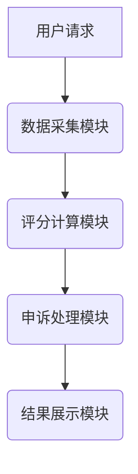

                 

# 智能个人信用评分申诉处理系统

---

## 关键词  
智能信用评分、人工智能、机器学习、申诉处理系统、信用评估、数据隐私

---

## 摘要  
随着人工智能技术的快速发展，个人信用评分系统逐渐从传统的规则驱动模式向智能化、自动化方向转变。本文将深入探讨智能个人信用评分申诉处理系统的构建与实现，分析其核心算法、系统架构以及实际应用场景。通过结合机器学习和深度学习技术，本文将提出一种高效的申诉处理解决方案，以提升信用评分的准确性和公平性。同时，本文还将探讨系统设计中的关键问题，如数据隐私保护、模型可解释性以及系统的实时性要求。

---

## 目录  
1. **智能个人信用评分申诉处理系统概述**  
   1.1 个人信用评分的重要性  
   1.2 申诉处理的必要性  
   1.3 智能个人信用评分申诉处理系统的概念  

2. **信用评分模型的核心要素**  
   2.1 数据来源与特征选择  
   2.2 模型选择与评估指标  
   2.3 模型的可解释性与公平性  

3. **AI算法原理与数学模型**  
   3.1 逻辑回归模型的数学公式  
   3.2 支持向量机模型的原理与应用  
   3.3 神经网络在信用评分中的应用  

4. **系统架构与功能设计**  
   4.1 系统功能模块划分  
   4.2 系统架构设计图  
   4.3 系统接口与交互流程  

5. **项目实战：智能信用评分申诉处理系统实现**  
   5.1 环境搭建与数据准备  
   5.2 模型训练与优化  
   5.3 申诉处理流程的自动化实现  

6. **总结与展望**  
   6.1 系统的优势与不足  
   6.2 未来发展方向  

---

## 第一部分: 智能个人信用评分申诉处理系统概述

### 第1章: 智能个人信用评分申诉处理系统概述

#### 1.1 个人信用评分的重要性  
个人信用评分是金融机构评估个人信用风险的重要工具，直接影响个人的贷款审批、信用额度以及利率水平。传统的信用评分主要依赖于规则和经验，存在效率低、覆盖面窄、公平性不足等问题。随着人工智能技术的发展，智能信用评分系统逐渐成为行业的新趋势。

#### 1.2 申诉处理的必要性  
在信用评分过程中，由于数据偏差、模型局限性或人为错误，评分结果可能会出现错误。个人对评分结果有申诉的权利，但传统的申诉处理流程复杂、耗时长，难以满足用户需求。智能化的申诉处理系统能够快速响应用户诉求，提高处理效率和准确性。

#### 1.3 智能个人信用评分申诉处理系统的概念  
智能个人信用评分申诉处理系统是一种结合人工智能技术的信用评分系统，能够在自动化评分的同时，智能化地处理用户的申诉请求。系统通过机器学习算法优化评分模型，同时利用自然语言处理技术分析用户申诉内容，快速定位问题并给出解决方案。

---

## 第二部分: 信用评分模型的核心要素

### 第2章: 信用评分模型的核心要素

#### 2.1 数据来源与特征选择  
信用评分系统的数据来源包括个人信用报告、银行流水、消费记录等。特征选择是模型构建的关键步骤，需要从大量数据中筛选出最具代表性的特征，如收入水平、信用历史、负债情况等。

#### 2.2 模型选择与评估指标  
常用的信用评分模型包括逻辑回归、决策树、随机森林和神经网络等。模型的选择需要结合数据特点和业务需求。评估指标包括准确率、召回率、F1分数以及ROC-AUC曲线等。

#### 2.3 模型的可解释性与公平性  
模型的可解释性是信用评分系统的重要属性，能够帮助用户理解评分结果的依据。同时，系统的公平性需要避免对特定群体的歧视，确保评分过程的透明性和公正性。

---

## 第三部分: AI算法原理与数学模型

### 第3章: AI算法原理与数学模型

#### 3.1 逻辑回归模型的数学公式  
逻辑回归是一种常用的分类算法，其核心公式为：  
$$ P(y=1|x) = \frac{1}{1 + e^{-(\beta_0 + \beta_1x)}} $$  
其中，$\beta_0$和$\beta_1$是模型的参数，$x$是输入特征。

#### 3.2 支持向量机模型的原理与应用  
支持向量机（SVM）通过构建超平面实现数据分类。其数学公式为：  
$$ y = \text{sign}(w \cdot x + b) $$  
其中，$w$是权重向量，$b$是偏置项，$x$是输入特征。

#### 3.3 神经网络在信用评分中的应用  
神经网络通过多层感知机（MLP）实现非线性分类。其网络结构包括输入层、隐藏层和输出层，能够处理复杂的特征关系。

---

## 第四部分: 系统架构与功能设计

### 第4章: 系统架构与功能设计

#### 4.1 系统功能模块划分  
系统主要包括数据采集模块、评分计算模块、申诉处理模块和结果展示模块。

#### 4.2 系统架构设计图  

#### 4.3 系统接口与交互流程  
系统通过API接口实现模块间的通信，用户通过前端界面提交申诉请求，系统后台处理并返回结果。

---

## 第五部分: 项目实战

### 第5章: 项目实战：智能信用评分申诉处理系统实现

#### 5.1 环境搭建与数据准备  
需要安装Python、TensorFlow、Scikit-learn等库，数据来源包括公开数据集和内部数据。

#### 5.2 模型训练与优化  
使用逻辑回归模型进行训练，并通过交叉验证优化模型参数。

#### 5.3 申诉处理流程的自动化实现  
通过自然语言处理技术分析用户申诉内容，自动生成解决方案并反馈给用户。

---

## 第六部分: 总结与展望

### 第6章: 总结与展望

#### 6.1 系统的优势与不足  
智能信用评分申诉处理系统具有高效、准确的特点，但模型的可解释性和数据隐私保护仍需进一步优化。

#### 6.2 未来发展方向  
未来可以探索更先进的AI技术，如图神经网络和强化学习，进一步提升系统的智能化水平。

---

## 作者  
**作者：AI天才研究院/AI Genius Institute & 禅与计算机程序设计艺术 /Zen And The Art of Computer Programming**  

---

通过以上内容，您可以根据需要进一步扩展和细化各个部分的内容，确保文章逻辑清晰、技术深度足够，并符合专业技术博客的写作要求。

