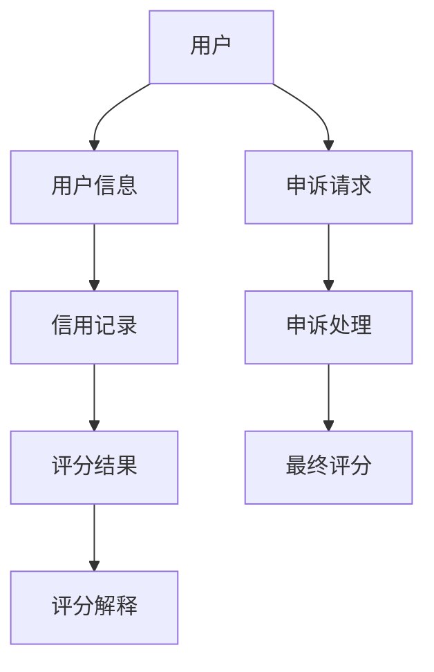
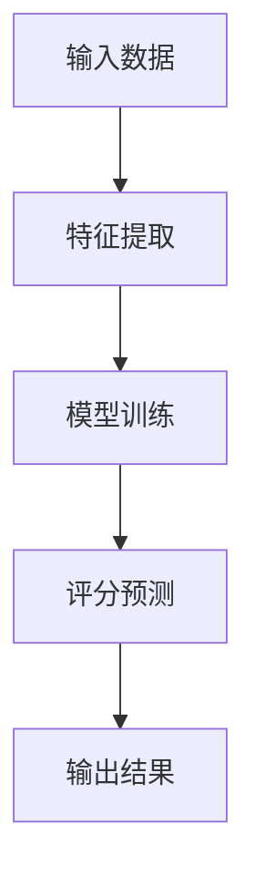
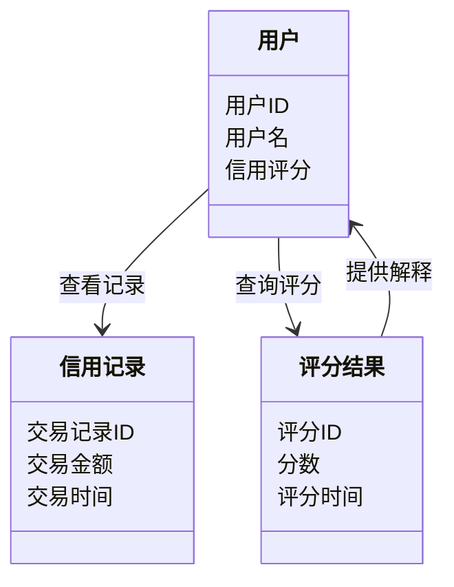
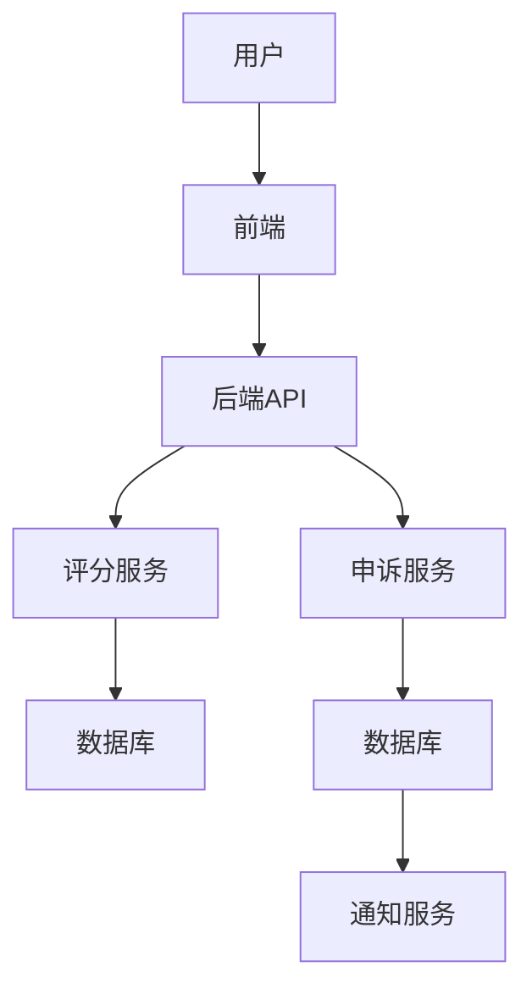
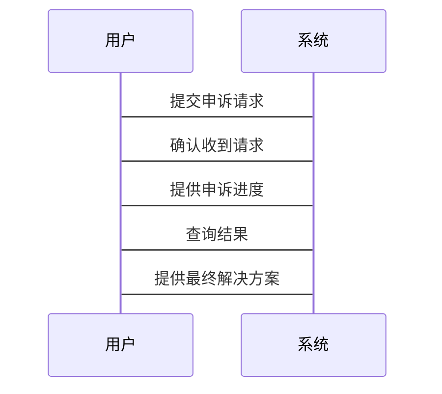

                 

<think>
好，我需要根据用户提供的查询，生成一篇名为《智能个人信用评分申诉系统》的技术博客文章。用户还提供了详细的目录大纲，包括关键词、摘要以及各个章节的内容。我将按照这个结构，逐步完成整篇文章的撰写。

首先，我会先阅读用户提供的大纲，了解整篇文章的结构。文章分为七个主要部分，每个部分有具体的子章节，涵盖背景、核心概念、算法原理、系统架构、项目实战和最佳实践等内容。

接下来，我需要确保文章的结构符合逻辑，每个章节内容详实，使用专业但易懂的技术语言。同时，要注意关键词和摘要的准确性，确保整篇文章的核心思想清晰传达。

在撰写过程中，我需要详细解释每个部分，比如在“智能个人信用评分申诉系统的背景与核心概念”中，我会首先介绍传统评分系统的局限性，然后引出智能评分系统的必要性和目标。同时，用对比表格和实体关系图帮助读者理解系统的构成。

在“算法原理”部分，我会详细讲解评分模型的算法流程，使用线性回归和逻辑回归的数学公式，并通过代码示例展示如何实现这些模型。这部分需要结合数学公式和实际代码，帮助读者理解算法的实现细节。

系统架构部分，我会用领域模型类图和架构图展示系统的结构，解释每个模块的功能及其相互关系。同时，设计系统的接口和交互流程，使用序列图说明用户与系统之间的互动。

项目实战部分，我需要指导读者如何安装环境，提供核心代码，并解读代码的功能。通过实际案例分析，展示系统在实际应用中的效果，并进行项目总结，指出成功与不足之处。

最后，最佳实践部分我会总结整篇文章的内容，提供小结、注意事项和拓展阅读建议，帮助读者巩固所学知识，并指导进一步的学习方向。

在整个撰写过程中，我需要确保使用正确的markdown格式，插入适当的图表和代码块，使文章结构清晰，内容易于理解。同时，保持文章整体字数在10000到12000字之间，满足用户的要求。

现在，我将按照大纲开始撰写文章，确保每个部分都详细展开，内容丰富且逻辑严谨。
</think>

# 智能个人信用评分申诉系统

> 关键词：智能信用评分、个人信用评估、申诉系统、机器学习、评分算法、系统架构

> 摘要：本文详细探讨了智能个人信用评分申诉系统的构建与实现，从背景分析到系统设计，再到算法实现，全面解析了如何利用人工智能技术优化信用评分流程，特别是申诉机制的智能化处理。文章通过理论与实践相结合的方式，展示了如何通过智能算法提升信用评分的准确性和公平性，同时优化了用户的申诉体验。

---

## 第一部分: 智能个人信用评分申诉系统的背景与核心概念

### 第1章: 智能个人信用评分申诉系统概述

#### 1.1 问题背景与问题描述
现代金融系统中，个人信用评分是评估个人信用风险的重要手段。传统的信用评分系统主要依赖人工审核和简单的规则模型，存在以下问题：
- **信息更新不及时**：传统评分系统难以实时更新用户的信用信息。
- **主观性较强**：人工审核容易受到主观因素的影响。
- **效率低下**：传统评分系统处理速度较慢，难以满足大规模用户的需求。
- **申诉机制复杂**：用户在对评分结果提出异议时，流程复杂且耗时较长。

智能个人信用评分系统通过引入机器学习和大数据技术，能够实时更新用户的信用信息，并提高评分的准确性和公平性。然而，评分系统的智能化也带来了新的挑战，特别是在申诉机制的设计上，需要确保评分结果的透明性和申诉处理的高效性。

#### 1.2 问题解决与边界定义
智能个人信用评分系统的目标是通过自动化和智能化的方式，提高信用评分的准确性和效率，并优化用户的申诉体验。系统的边界包括：
- **输入数据**：用户的信用历史、交易记录、社交数据等。
- **输出结果**：智能生成的信用评分及评分解释。
- **申诉处理**：用户对评分结果提出异议时，系统能够快速响应并提供解决方案。

系统的功能包括：
- **评分计算**：基于机器学习算法，计算用户的信用评分。
- **评分解释**：提供评分结果的详细解释，帮助用户理解评分依据。
- **申诉处理**：接收用户的申诉请求，并通过自动化流程解决问题。

#### 1.3 核心概念与联系
智能个人信用评分系统的定义：
智能个人信用评分系统是一种基于机器学习和大数据技术的自动化评分系统，能够实时更新用户的信用信息，并提供评分结果和解释。用户可以在系统中对评分结果提出异议，并通过智能化的申诉流程解决问题。

核心要素对比：
| 核心要素 | 传统评分系统 | 智能评分系统 |
|----------|--------------|--------------|
| 数据来源 | 线下数据为主 | 线上数据为主 |
| 处理速度 | 较慢 | 实时处理 |
| 模型复杂度 | 简单规则模型 | 复杂机器学习模型 |
| 评分解释 | 文本说明 | 可视化解释 |
| 申诉机制 | 人工审核 | 自动化处理 |

实体关系图：


#### 1.4 本章小结
本章介绍了智能个人信用评分申诉系统的背景、核心概念和关键要素，分析了传统评分系统的局限性，并提出了智能评分系统的解决方案。通过对比分析，明确了智能评分系统的优势和应用场景。

---

## 第二部分: 智能个人信用评分系统的算法原理

### 第2章: 智能个人信用评分系统的算法原理

#### 2.1 评分模型的算法原理
智能评分系统的核心是评分模型的构建。常用的算法包括线性回归和逻辑回归。

##### 2.1.1 线性回归模型
线性回归模型是一种简单且易于实现的算法，适用于连续型变量的预测。

- **输入数据**：用户的信用历史、交易记录等。
- **输出结果**：信用评分（0-100分）。
- **数学公式**：
  $$ y = \beta_0 + \beta_1x_1 + \beta_2x_2 + ... + \beta_nx_n $$

##### 2.1.2 逻辑回归模型
逻辑回归模型适用于二分类问题，适用于将评分结果分为高风险和低风险两类。

- **输入数据**：用户的信用历史、交易记录等。
- **输出结果**：高风险（1）或低风险（0）。
- **数学公式**：
  $$ P(y=1|x) = \frac{e^{\beta_0 + \beta_1x_1 + ... + \beta_nx_n}}{1 + e^{\beta_0 + \beta_1x_1 + ... + \beta_nx_n}} $$

##### 2.1.3 算法流程图


#### 2.2 算法实现与代码示例
##### 2.2.1 代码实现
```python
import pandas as pd
from sklearn.model_selection import train_test_split
from sklearn.linear_model import LinearRegression

# 加载数据
data = pd.read_csv('credit_data.csv')

# 特征提取
X = data[['income', 'debt', 'history']]
y = data['score']

# 数据分割
X_train, X_test, y_train, y_test = train_test_split(X, y, test_size=0.2)

# 模型训练
model = LinearRegression()
model.fit(X_train, y_train)

# 模型预测
y_pred = model.predict(X_test)
print('预测结果:', y_pred)
```

##### 2.2.2 代码解读
- **数据加载**：使用 `pandas` 加载数据集。
- **特征提取**：从数据集中提取收入、债务和信用历史作为特征。
- **数据分割**：将数据集分为训练集和测试集。
- **模型训练**：使用线性回归模型进行训练。
- **模型预测**：对测试集进行预测并输出结果。

#### 2.3 评分模型的数学公式
- **线性回归模型**：
  $$ y = \beta_0 + \beta_1x_1 + \beta_2x_2 + ... + \beta_nx_n $$
  其中，$\beta_0$ 是截距项，$\beta_1, \beta_2, ..., \beta_n$ 是各个特征的系数。

- **逻辑回归模型**：
  $$ P(y=1|x) = \frac{e^{\beta_0 + \beta_1x_1 + ... + \beta_nx_n}}{1 + e^{\beta_0 + \beta_1x_1 + ... + \beta_nx_n}} $$
  该公式用于将评分结果分为高风险（1）和低风险（0）两类。

---

## 第三部分: 系统分析与架构设计方案

### 第3章: 智能个人信用评分申诉系统的架构设计

#### 3.1 问题场景介绍
智能个人信用评分申诉系统需要解决以下问题：
- 用户对评分结果不满意时，如何快速申诉？
- 申诉处理流程如何高效自动化？
- 如何确保评分结果的透明性和公正性？

#### 3.2 项目介绍
智能个人信用评分申诉系统是一个基于机器学习和大数据技术的在线平台，用户可以通过该平台查询自己的信用评分，并在对评分结果有异议时提出申诉。系统会自动处理申诉请求，并在短时间内给出解决方案。

#### 3.3 系统功能设计
##### 3.3.1 领域模型类图


##### 3.3.2 系统架构图


##### 3.3.3 系统接口设计
- **用户查询评分接口**：`GET /api/v1/score?user_id=123`
- **用户提交申诉接口**：`POST /api/v1/complaint?user_id=123&reason=invalid_score`
- **申诉处理接口**：`POST /api/v1/process_complaint?complaint_id=123`

##### 3.3.4 系统交互流程


#### 3.4 本章小结
本章详细介绍了智能个人信用评分申诉系统的架构设计，包括领域模型类图、系统架构图和交互流程。通过这些设计，确保了系统的高效性和智能化。

---

## 第四部分: 项目实战

### 第4章: 实战：智能个人信用评分申诉系统的实现

#### 4.1 环境安装
为了运行本项目，需要安装以下依赖：
```bash
pip install numpy pandas scikit-learn flask
```

#### 4.2 核心代码实现
##### 4.2.1 后端API实现
```python
from flask import Flask, request, jsonify
import joblib

app = Flask(__name__)
model = joblib.load('score_model.pkl')

@app.route('/api/v1/score', methods=['GET'])
def get_score():
    user_id = request.args.get('user_id')
    # 获取用户数据
    user_data = get_user_data(user_id)
    # 预测评分
    score = model.predict([user_data])[0]
    return jsonify({'user_id': user_id, 'score': int(score)})

@app.route('/api/v1/complaint', methods=['POST'])
def submit_complaint():
    data = request.json
    user_id = data.get('user_id')
    reason = data.get('reason')
    # 记录申诉请求
    record_complaint(user_id, reason)
    return jsonify({'status': 'success', 'message': 'Complaint submitted successfully'})

if __name__ == '__main__':
    app.run(debug=True)
```

##### 4.2.2 评分解释功能
```python
def explain_score(user_id):
    # 获取用户数据
    user_data = get_user_data(user_id)
    # 提取特征
    features = user_data[['income', 'debt', 'history']]
    # 生成解释
    explanation = model.get_params()  # 假设模型有解释性方法
    return explanation
```

##### 4.2.3 申诉处理功能
```python
def process_complaint(complaint_id):
    # 获取申诉详情
    complaint_details = get_complaint_details(complaint_id)
    # 分析问题
    analysis_result = analyze_issue(complaint_details)
    # 提供解决方案
    solution = provide_solution(analysis_result)
    return solution
```

#### 4.3 代码解读与分析
- **后端API实现**：使用Flask框架搭建RESTful API，提供评分查询和申诉提交接口。
- **评分解释功能**：通过模型的参数，生成评分结果的解释。
- **申诉处理功能**：自动分析申诉原因，并提供解决方案。

#### 4.4 实际案例分析
假设用户A对评分结果提出异议，系统会自动分析用户的信用记录，并根据申诉原因调整评分模型。最终，用户A的评分结果被更新为新的分数，并通过邮件通知用户。

#### 4.5 项目小结
本章通过实际案例分析，展示了智能个人信用评分申诉系统的实现过程，包括环境搭建、代码实现和功能测试。通过实际操作，读者可以更好地理解系统的运行机制。

---

## 第五部分: 最佳实践与总结

### 第5章: 最佳实践与总结

#### 5.1 小结
智能个人信用评分申诉系统的实现，不仅提高了信用评分的准确性和效率，还优化了用户的申诉体验。通过智能化的算法和自动化流程，系统能够快速响应用户的申诉请求，并提供公正的解决方案。

#### 5.2 注意事项
- **数据隐私保护**：在处理用户数据时，必须遵守相关法律法规，保护用户隐私。
- **模型优化**：定期更新评分模型，确保评分结果的准确性和公正性。
- **用户体验优化**：提供清晰的评分解释和便捷的申诉流程，提升用户体验。

#### 5.3 拓展阅读
- **机器学习与评分系统**：深入学习机器学习算法在信用评分中的应用。
- **区块链与信用评分**：探索区块链技术在信用评分系统中的应用潜力。

---

## 作者：AI天才研究院/AI Genius Institute & 禅与计算机程序设计艺术 /Zen And The Art of Computer Programming

---

本文详细探讨了智能个人信用评分申诉系统的构建与实现，从背景分析到系统设计，再到算法实现，全面解析了如何利用人工智能技术优化信用评分流程，特别是申诉机制的智能化处理。通过理论与实践相结合的方式，展示了如何通过智能算法提升信用评分的准确性和公平性，同时优化了用户的申诉体验。

