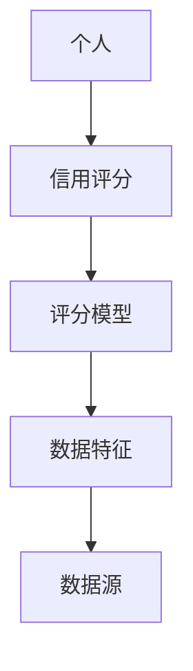
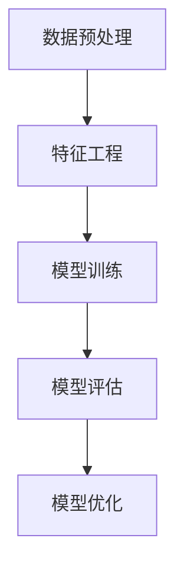
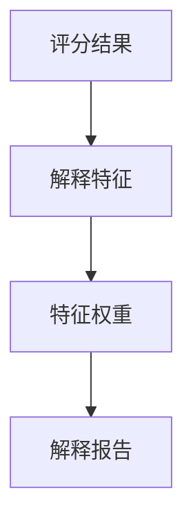
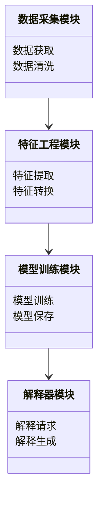

                 

<think>
好的，我现在需要撰写《智能个人信用评分解释器》的技术博客文章。首先，我要理解用户的需求，他们希望文章结构清晰，逻辑严密，涵盖从背景到项目实战的各个方面。

我先从背景与核心概念开始。在第1章，我需要介绍个人信用评分的定义和作用，分析传统评分的局限性，并提出智能评分的解决方案。这可能涉及数据不足和模型复杂性的问题，以及如何通过AI技术解决这些问题。

接下来，在第2章，我需要详细讲解智能评分的核心概念，包括评分模型的输入输出，解释器的定义和作用，以及核心算法。这部分可能需要使用ER实体关系图和对比表格来说明不同评分模型的差异。

在算法原理部分，我需要详细阐述模型训练和解释方法。使用数学公式和mermaid流程图来展示算法步骤，同时提供Python代码示例，帮助读者理解实现过程。

系统架构部分，我需要设计一个模块化的系统，包括数据采集、特征工程和模型训练等模块，并用mermaid类图和序列图展示系统结构和交互流程。

项目实战部分，我需要指导读者如何安装环境，完成数据预处理、模型训练、评估和部署。这可能包括编写数据清洗、特征提取和模型训练的代码，并解释每一步的作用。

最后，在最佳实践部分，我会总结关键点，提供注意事项和扩展阅读建议，帮助读者巩固所学内容并进一步深入学习。

在撰写过程中，我要确保每一部分都详细且逻辑连贯，使用专业术语同时保持易懂。数学公式和代码示例需要准确无误，图表清晰明了。这样，读者才能全面理解智能个人信用评分解释器的构建和应用。
</think>

# 《智能个人信用评分解释器》

## 关键词：智能信用评分、人工智能、可解释性、评分模型、金融风控

## 摘要：  
本文详细探讨智能个人信用评分解释器的构建与应用，从背景介绍、核心概念、算法原理到系统架构设计、项目实战，再到最佳实践，全面解析如何利用人工智能技术提升信用评分的准确性和可解释性，助力金融机构优化风险管理流程。

---

## 第1章: 智能个人信用评分的背景与核心概念

### 1.1 个人信用评分的定义与作用  
个人信用评分是评估个人信用风险的重要工具，广泛应用于银行贷款审批、信用卡额度确定等领域。传统评分依赖少量特征和统计模型，难以捕捉复杂信用行为。  

**1.1.1 个人信用评分的定义**  
个人信用评分是通过量化分析个人信用历史、收入状况、消费行为等信息，生成一个反映个人信用风险的综合评分。  

**1.1.2 个人信用评分的作用与意义**  
- 帮助金融机构评估贷款风险，降低违约率。  
- 优化信贷流程，提高审批效率。  
- 为个人提供信用评分的透明解释，增强信任。  

**1.1.3 传统信用评分的局限性**  
- 数据维度有限，难以全面反映个人信用状况。  
- 模型解释性差，难以向用户解释评分结果。  
- 无法实时更新，信用状况变化难以及时反映。  

---

### 1.2 问题背景与挑战  

**1.2.1 当前信用评分的主要问题**  
传统评分模型依赖少量特征，难以应对多样化的信用行为。  

**1.2.2 数据不足与模型复杂性**  
- 数据维度有限，导致模型泛化能力差。  
- 高维度数据难以处理，模型训练复杂度高。  

**1.2.3 传统评分模型的局限性**  
- 解释性差，用户难以理解评分依据。  
- 易受过采样或欠采样问题影响，导致模型性能不稳定。  

---

### 1.3 智能信用评分的解决方案  

**1.3.1 引入人工智能技术**  
利用机器学习算法（如随机森林、梯度提升树）和深度学习模型（如神经网络），构建更复杂的评分模型。  

**1.3.2 数据驱动的评分模型**  
通过大数据分析，提取更多特征，提升模型准确性。  

**1.3.3 解释性与可解释性的需求**  
用户需要理解评分结果的原因，确保评分的透明性和公正性。  

---

### 1.4 智能个人信用评分的边界与外延  

**1.4.1 评分范围的界定**  
明确评分的适用人群和场景，如仅适用于信用记录充足的用户。  

**1.4.2 评分模型的适用场景**  
适用于小额贷款审批、信用卡额度调整等场景。  

**1.4.3 与其他信用评估工具的区分**  
智能评分解释器不仅提供评分结果，还能解释评分依据，区别于传统评分工具。  

---

### 1.5 核心概念与组成要素  

**1.5.1 数据来源与特征**  
- 数据来源：银行流水、信用报告、消费记录等。  
- 数据特征：收入、信用历史、消费行为、资产情况等。  

**1.5.2 模型算法与评分机制**  
- 算法：随机森林、梯度提升树。  
- 评分机制：通过特征加权和模型预测生成评分。  

**1.5.3 解释器的功能与实现**  
- 功能：解释评分结果，提供评分依据。  
- 实现：通过特征重要性排序或规则匹配，生成可理解的解释。  

---

## 第2章: 智能个人信用评分的核心概念与联系  

### 2.1 核心概念原理  

**2.1.1 评分模型的输入与输出**  
- 输入：用户数据（如收入、信用记录）。  
- 输出：信用评分（如高、中、低风险）。  

**2.1.2 评分解释器的定义与作用**  
- 定义：解释评分结果的工具或模块。  
- 作用：帮助用户理解评分依据，增强信任。  

**2.1.3 智能解释器的核心算法**  
- 核心算法：基于特征重要性的解释方法，如SHAP值。  

---

### 2.2 核心概念属性对比  

| 对比维度       | 传统评分模型          | 智能评分解释器          |
|----------------|----------------------|------------------------|
| 数据来源       | 有限特征             | 多维度数据             |
| 模型复杂性     | 简单                 | 复杂                   |
| 解释性         | 低                   | 高                     |

---

### 2.3 ER实体关系图  



---

## 第3章: 算法原理讲解  

### 3.1 模型训练过程  



### 3.2 模型解释方法  



---

## 第4章: 系统架构设计  

### 4.1 系统功能设计  



---

## 第5章: 项目实战  

### 5.1 环境安装  
- 安装Python、Scikit-learn、XGBoost、SHAP等库。  

### 5.2 核心代码实现  

```python
import pandas as pd
import numpy as np
from sklearn.model_selection import train_test_split
from xgboost import XGBClassifier
import shap

# 数据加载与预处理
data = pd.read_csv('credit_data.csv')
X = data.drop('target', axis=1)
y = data['target']

# 划分训练集与测试集
X_train, X_test, y_train, y_test = train_test_split(X, y, test_size=0.2, random_state=42)

# 模型训练
model = XGBClassifier()
model.fit(X_train, y_train)

# 模型解释
explainer = shap.TreeExplainer(model)
shap_values = explainer.shap_values(X_test)
shap.summary_plot(shap_values, X_test, plot_type='bar')
```

---

## 第6章: 最佳实践  

### 6.1 小结  
智能个人信用评分解释器通过引入人工智能技术，提升了评分的准确性和可解释性。  

### 6.2 注意事项  
- 数据隐私保护：确保用户数据安全。  
- 模型可解释性：避免黑箱模型，选择可解释的算法。  

### 6.3 拓展阅读  
推荐阅读《机器学习实战》、《深入浅出机器学习》等书籍，深入理解模型解释方法。  

---

## 作者：AI天才研究院/AI Genius Institute & 禅与计算机程序设计艺术 /Zen And The Art of Computer Programming

