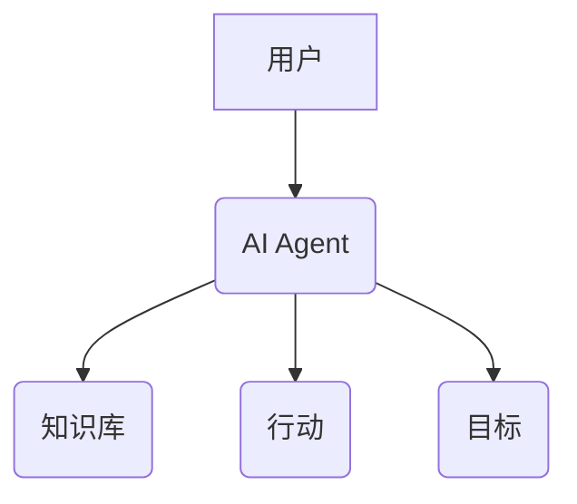
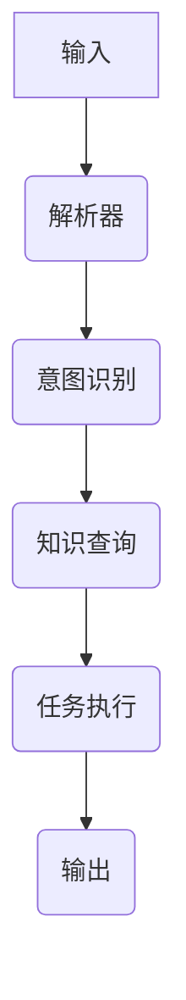
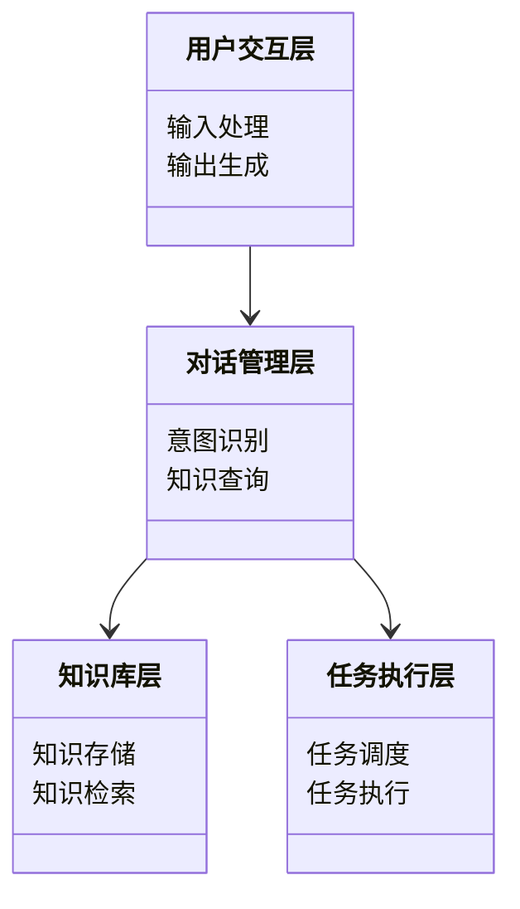
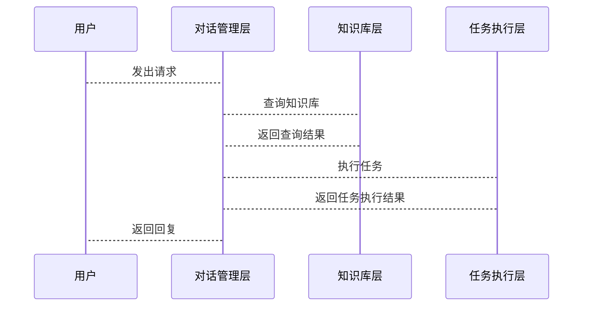

                 

<think>
好的，现在我要帮用户完成《智能个人助理AI Agent：LLM驱动的全方位生活助手》这篇文章的后续部分。根据用户的要求，文章需要详细涵盖每个章节的内容，包括背景、核心概念、算法原理、系统架构、项目实战和最佳实践。

首先，我需要确保文章的结构完整，每个章节都有足够的深度和详细的内容。用户已经提供了目录大纲，现在需要填充每个部分的具体内容。

接下来，我需要按照用户的要求，使用专业的技术语言，逐步分析和解释每个部分。例如，在“算法原理”部分，要详细讲解大语言模型的数学基础，使用公式和图表来辅助说明。

然后，系统架构部分需要用Mermaid图展示类图、架构图和序列图，帮助读者理解系统结构。项目实战部分需要提供代码示例，并解释代码的功能和实现细节。

在撰写过程中，我需要确保每个小节内容丰富，具体详细，并且使用适当的格式，如Mermaid图和数学公式。同时，要注意文章的逻辑性，确保读者能够一步步理解AI Agent的工作原理和实现方法。

最后，我需要总结全书内容，提供最佳实践和小结，帮助读者巩固所学知识，并展望未来的发展趋势。

现在，我将根据上述思考过程，开始撰写文章的详细内容。
</think>

# 智能个人助理AI Agent：LLM驱动的全方位生活助手

> 关键词：AI Agent，LLM，智能助手，对话系统，知识库，系统架构

> 摘要：本文深入探讨了智能个人助理AI Agent的概念、技术基础、核心算法、系统架构及实际应用。通过分析AI Agent的背景、核心概念与联系，结合算法原理、系统设计和项目实战，为读者提供了从理论到实践的全面指南。文章最后总结了AI Agent的优势与挑战，并展望了其未来的发展方向。

---

# 第一部分: 智能个人助理AI Agent的背景与概念

## 第1章: AI Agent的基本概念与问题背景

### 1.1 AI Agent的定义与核心功能

AI Agent（人工智能代理）是一种能够感知环境并采取行动以实现目标的智能实体。它通过与用户的交互，利用自然语言处理（NLP）和大语言模型（LLM）技术，提供个性化的信息检索、任务执行和决策支持等服务。

#### 1.1.1 AI Agent的定义

AI Agent是一个智能系统，能够理解用户的需求，通过多轮对话或命令交互，执行任务并提供结果。它结合了自然语言处理、知识表示、推理和规划等多种人工智能技术。

#### 1.1.2 AI Agent的核心功能

1. **自然语言理解（NLU）**：通过解析用户的输入，识别意图和实体。
2. **对话生成（NLG）**：根据理解生成自然流畅的回复。
3. **知识检索**：从知识库中查找相关信息。
4. **任务执行**：根据用户的指令完成特定任务，如设置提醒、预订机票等。
5. **学习与优化**：通过用户反馈优化自身的响应策略。

#### 1.1.3 AI Agent与传统个人助手的区别

传统的个人助手（如Siri、Google Assistant）主要依赖预设的规则和数据，功能相对固定。而AI Agent基于大语言模型，具有更强的上下文理解和自适应能力，能够处理更复杂的任务和对话。

### 1.2 AI Agent的应用场景与问题背景

AI Agent的应用场景广泛，包括但不限于智能家居控制、行程管理、信息查询、健康助手等。然而，当前的个人助手存在功能有限、理解能力不足、知识更新不及时等问题。

#### 1.2.1 AI Agent在生活中的应用场景

1. **智能家居控制**：通过语音指令控制家中的设备，如灯光、空调等。
2. **行程管理**：帮助用户安排日程、预订酒店、航班等。
3. **信息查询**：快速检索用户需要的信息，如天气、新闻等。
4. **健康助手**：监测用户的健康数据，提供健康建议。

#### 1.2.2 当前个人助手存在的问题

1. **理解能力有限**：传统助手在复杂对话或上下文理解上表现不佳。
2. **知识更新滞后**：知识库内容更新不及时，导致部分信息过时。
3. **缺乏个性化**：难以根据用户的个性化需求提供定制服务。

#### 1.2.3 AI Agent如何解决这些问题

AI Agent通过大语言模型的强大能力，能够更好地理解用户意图，提供更准确的信息检索和任务执行。同时，通过持续学习和自适应优化，AI Agent能够不断提升用户体验，满足个性化需求。

## 第2章: LLM驱动AI Agent的技术基础

### 2.1 大语言模型（LLM）的基本原理

大语言模型是AI Agent的核心技术之一，它通过海量数据的训练，具备强大的自然语言理解和生成能力。

#### 2.1.1 LLM的定义与特点

大语言模型是一种基于深度学习的自然语言处理模型，通常采用Transformer架构，能够处理长文本序列，捕捉上下文信息。

#### 2.1.2 LLM的核心技术原理

1. **Transformer模型**：由编码器和解码器组成，能够捕捉文本的长距离依赖关系。
2. **自注意力机制**：通过计算每个词与其他词的相关性，生成上下文表示。
3. **并行计算**：采用并行计算技术，提升模型训练和推理效率。

#### 2.1.3 LLM与AI Agent的关系

LLM为AI Agent提供了强大的语言理解和生成能力，是AI Agent实现复杂对话和任务执行的基础。

### 2.2 AI Agent的对话机制

对话机制是AI Agent与用户交互的核心，通过多轮对话实现信息的高效传递和任务完成。

#### 2.2.1 对话系统的定义

对话系统是一种能够与用户进行自然语言交互的智能系统，通过解析用户的输入，生成合适的回复。

#### 2.2.2 基于LLM的对话生成原理

1. **输入处理**：将用户的输入转换为模型可处理的格式。
2. **上下文维护**：记录对话历史，保持对话的连贯性。
3. **生成回复**：基于输入和上下文，生成自然流畅的回复。

#### 2.2.3 对话历史的处理与记忆机制

通过维护对话历史，AI Agent能够更好地理解用户的意图，提供更准确的回复。记忆机制可以采用基于知识图谱或向量表示的方法。

### 2.3 AI Agent的知识库管理

知识库是AI Agent的信息来源，包含各种结构化和非结构化的知识，用于支持对话和任务执行。

#### 2.3.1 知识库的定义与作用

知识库是AI Agent存储信息的数据库，包含事实、概念、规则等，用于支持对话和任务执行。

#### 2.3.2 知识库的构建与更新

1. **数据收集**：从多种来源收集数据，如互联网、用户输入等。
2. **数据清洗**：去除冗余和不一致的数据。
3. **知识表示**：将数据转换为结构化的形式，便于查询和推理。

#### 2.3.3 知识库与对话生成的结合

通过查询知识库，AI Agent能够获取准确的信息，生成更有针对性的回复。知识库的更新和优化能够提升AI Agent的性能和准确性。

---

# 第二部分: AI Agent的核心概念与联系

## 第3章: AI Agent的核心概念与原理

### 3.1 AI Agent的实体关系分析

通过实体关系图（ER图），我们可以清晰地看到AI Agent系统中的各个实体及其关系。

#### 3.1.1 实体关系图（ER图）

以下是AI Agent系统的实体关系图：

```mermaid
er
    actor: 用户
    agent: AI Agent
    knowledge_base: 知识库
    action: 行动
    goal: 目标

    actor --> agent: 发出请求
    agent --> knowledge_base: 查询知识库
    agent --> action: 执行行动
    agent --> goal: 完成目标
```

#### 3.1.2 Mermaid流程图展示

以下是AI Agent系统的流程图：



### 3.2 AI Agent的系统架构设计

系统架构设计是实现AI Agent的关键，通过合理的架构设计，能够提升系统的扩展性和维护性。

#### 3.2.1 系统架构图

以下是AI Agent的系统架构图：


#### 3.2.2 系统组件之间的关系

1. **用户交互层**：负责接收用户的输入，并将其传递给对话管理层。
2. **对话管理层**：解析用户的输入，生成回复，并与知识库层和任务执行层交互。
3. **知识库层**：存储和管理系统的知识，支持对话管理层的信息查询。
4. **任务执行层**：根据对话管理层的指令，执行具体的任务，如设置提醒、预订机票等。

### 3.3 AI Agent的算法原理

算法原理是AI Agent实现对话生成和任务执行的核心，通过数学模型和算法实现智能化。

#### 3.3.1 算法原理图

以下是AI Agent的算法原理图：



#### 3.3.2 算法实现流程

1. **输入处理**：将用户的输入转换为模型可处理的形式。
2. **意图识别**：通过自然语言处理技术，识别用户的意图。
3. **知识查询**：根据意图，查询知识库获取相关信息。
4. **任务执行**：根据知识查询结果，执行具体的任务。
5. **输出生成**：将任务执行结果转换为自然语言回复。

---

## 第4章: AI Agent的核心算法与数学模型

### 4.1 大语言模型的数学基础

大语言模型的数学基础是理解其工作原理的关键，通过数学公式和模型，我们可以更好地理解其算法。

#### 4.1.1 语言模型的数学表达

语言模型的目标是给定一串文字，计算其概率。数学表达如下：

$$ P(w_1, w_2, ..., w_n) = \prod_{i=1}^{n} P(w_i | w_1, ..., w_{i-1}) $$

其中，\( w_i \) 表示第i个词。

#### 4.1.2 概率论与信息论基础

1. **概率论**：用于计算事件发生的可能性。
2. **信息论**：用于衡量数据的不确定性。

#### 4.1.3 神经网络的数学模型

神经网络是一种人工神经元的连接结构，通过多层感知机（MLP）实现非线性函数逼近。

### 4.2 变压器（Transformer）模型的原理

变压器模型是大语言模型的核心，通过自注意力机制实现长距离依赖关系的捕捉。

#### 4.2.1 Transformer模型的结构

1. **编码器**：将输入序列编码为向量表示。
2. **解码器**：根据编码器的输出生成目标序列。

#### 4.2.2 自注意力机制

自注意力机制通过计算每个词与其他词的相关性，生成上下文表示。

数学公式如下：

$$ \text{Attention}(Q, K, V) = \text{softmax}\left(\frac{QK^T}{\sqrt{d_k}}\right)V $$

其中，\( Q \) 是查询向量，\( K \) 是键向量，\( V \) 是值向量，\( d_k \) 是向量的维度。

---

## 第5章: AI Agent的系统分析与架构设计方案

### 5.1 系统功能设计

系统功能设计是实现AI Agent的基础，通过功能模块的设计，能够提升系统的可扩展性和可维护性。

#### 5.1.1 领域模型Mermaid类图

以下是AI Agent的领域模型类图：



### 5.2 系统架构设计

系统架构设计是实现AI Agent的关键，通过合理的架构设计，能够提升系统的性能和可扩展性。

#### 5.2.1 系统架构图

以下是AI Agent的系统架构图：


### 5.3 系统接口设计

系统接口设计是实现AI Agent的重要部分，通过合理的接口设计，能够提升系统的灵活性和可维护性。

#### 5.3.1 系统接口

1. **用户交互接口**：负责接收用户的输入，并将其传递给对话管理层。
2. **对话管理层接口**：负责解析用户的输入，生成回复，并与知识库层和任务执行层交互。
3. **知识库接口**：负责存储和管理系统的知识，支持对话管理层的信息查询。
4. **任务执行接口**：负责根据对话管理层的指令，执行具体的任务。

### 5.4 系统交互Mermaid序列图

以下是AI Agent的系统交互序列图：



---

## 第6章: AI Agent的项目实战

### 6.1 环境安装与配置

项目实战是理解AI Agent实现的重要部分，通过实际操作，能够更好地掌握其核心技术。

#### 6.1.1 环境安装

1. **Python 3.8+**
2. **TensorFlow或PyTorch**
3. **Transformers库**

#### 6.1.2 代码安装

安装必要的库：

```bash
pip install transformers
pip install torch
```

### 6.2 系统核心实现源代码

以下是AI Agent的核心实现代码：

```python
from transformers import AutoTokenizer, AutoModelForSeq2Seq
import torch

class AIAgent:
    def __init__(self, model_name="facebook/pseudo-code"):
        self.tokenizer = AutoTokenizer.from_pretrained(model_name)
        self.model = AutoModelForSeq2Seq.from_pretrained(model_name)
    
    def generate_response(self, input_text):
        inputs = self.tokenizer.encode(input_text, return_tensors="pt")
        outputs = self.model.generate(inputs, max_length=50)
        response = self.tokenizer.decode(outputs[0], skip_special_tokens=True)
        return response
```

### 6.3 代码应用解读与分析

1. **初始化模型**：加载预训练的模型和分词器。
2. **生成回复**：将用户输入编码为张量，通过模型生成回复。
3. **解码回复**：将生成的张量解码为自然语言文本。

### 6.4 实际案例分析

通过实际案例分析，能够更好地理解AI Agent的应用和实现。

#### 6.4.1 案例分析

用户输入：“帮我预订明天早上8点的航班，目的地是北京。”

1. **意图识别**：识别用户的意图是预订航班。
2. **知识查询**：查询航班信息。
3. **任务执行**：执行航班预订任务。
4. **返回结果**：返回预订结果。

---

## 第7章: AI Agent的最佳实践与小结

### 7.1 最佳实践

1. **模型优化**：通过微调和优化模型参数，提升模型的性能。
2. **知识库管理**：定期更新和优化知识库，确保信息的准确性。
3. **用户体验**：注重用户体验设计，提升用户的使用感受。

### 7.2 小结

AI Agent作为一种智能个人助手，基于大语言模型的强大能力，能够为用户提供全方位的生活支持。通过合理的系统设计和算法优化，AI Agent将变得更加智能和高效。

### 7.3 注意事项

1. **数据隐私**：注意用户数据的隐私保护。
2. **模型选择**：选择合适的模型和参数，确保系统的性能。
3. **用户体验**：注重用户体验设计，提升用户的使用感受。

### 7.4 拓展阅读

1. **大语言模型的训练与优化**：了解大语言模型的训练方法和优化技巧。
2. **对话系统的高级技术**：学习对话系统的高级技术，如多轮对话、情感计算等。

---

# 作者：AI天才研究院/AI Genius Institute & 禅与计算机程序设计艺术/Zen And The Art of Computer Programming

---

**本文内容到此结束，希望对您有所帮助！**

