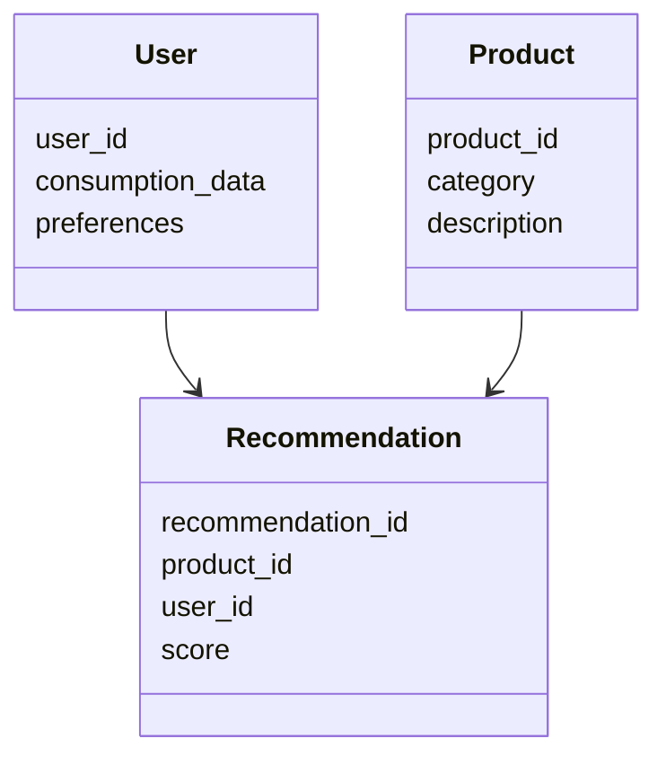
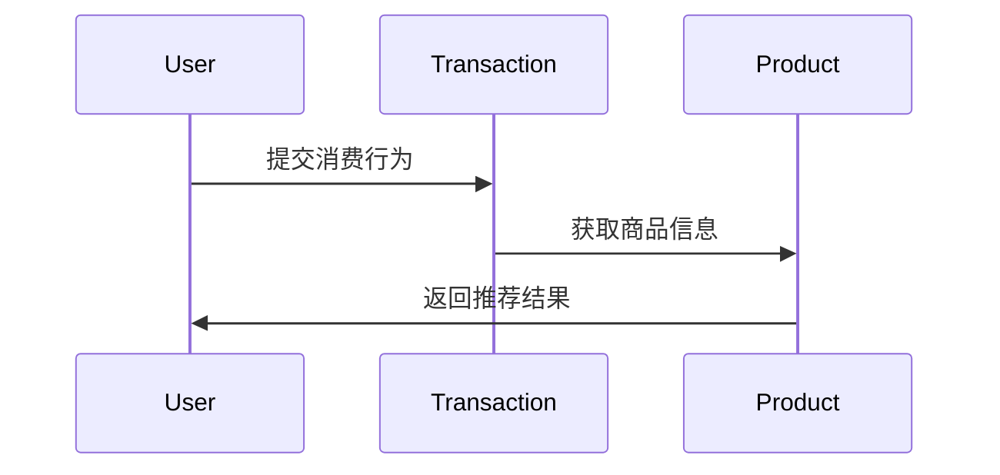

                 

<think>
嗯，用户现在给了我一个任务，让我写一篇技术博客，标题是《智能个人消费模式分析与建议系统》。首先，我需要理解这个主题。智能个人消费模式分析，听起来像是利用人工智能来分析个人的消费行为，然后给出建议。这可能涉及到数据分析、机器学习、推荐系统等领域。

用户希望文章结构清晰，有逻辑，用专业的技术语言，同时要有实际案例和代码示例。我需要按照用户提供的目录大纲来展开，确保每一章都有足够的细节，覆盖背景、核心概念、算法原理、系统架构、项目实战等部分。

首先，我得先写摘要，说明文章的核心内容和主题思想。然后，每章要细化，比如背景介绍、核心概念、算法原理、系统架构、项目实战、最佳实践等。用户还特别提到要包含图表，比如Mermaid图和数学公式，所以我要确保在适当的地方插入这些内容。

接下来，我需要考虑用户可能的深层需求。用户可能是一位技术专家，希望系统地了解智能消费分析的各个方面，包括理论和实践。因此，文章需要既详细又易懂，适合技术人员和决策者阅读。

在写背景介绍时，我应该从传统消费分析的局限性入手，引出智能分析的必要性。然后，详细讲解核心概念，比如系统组成和实体关系，用图表帮助读者理解。

算法部分，我需要选择合适的推荐算法，如协同过滤和基于内容的推荐，并用Mermaid流程图展示步骤。同时，提供Python代码示例，让读者可以实际操作。

系统架构设计部分，我需要介绍领域模型和架构图，展示系统各模块之间的关系。接口设计和交互流程图也很重要，帮助读者理解系统的运作方式。

项目实战部分，我需要从环境安装开始，逐步指导读者如何实现系统，包括数据预处理、模型训练和接口开发。用具体的案例，比如电商推荐系统，来展示实际应用。

最后，总结最佳实践，给出经验和注意事项，帮助读者在实际项目中避免常见问题。同时，扩展内容如系统优化和未来趋势，可以为读者提供更深入的见解。

整个过程中，我需要确保语言专业但不失清晰，逻辑严谨，结构紧凑。同时，遵守用户的格式要求，使用合适的Markdown标签，并在适当的位置插入图表和公式。

现在，我需要按照这个思路，逐步完成文章的撰写，确保每一部分都详细到位，满足用户的需求。
</think>

# 智能个人消费模式分析与建议系统

> 关键词：智能消费分析，推荐系统，机器学习，数据挖掘，消费行为分析

> 摘要：随着人工智能技术的快速发展，智能个人消费模式分析与建议系统成为个性化消费推荐的重要工具。本文从背景介绍、核心概念、算法原理、系统架构、项目实战等多方面，详细阐述了智能个人消费模式分析与建议系统的构建与实现过程，旨在为读者提供一个系统化、专业化的技术参考。

---

# 第一部分: 智能个人消费模式分析与建议系统概述

## 第1章: 背景介绍

### 1.1 智能个人消费模式的背景

#### 1.1.1 从传统消费分析到智能消费分析的转变
传统消费分析依赖于人工统计和简单的数据汇总，难以捕捉用户的个性化需求和潜在偏好。随着大数据和人工智能技术的普及，智能消费分析逐渐成为可能，通过机器学习算法和深度数据挖掘，实现精准的个性化推荐。

#### 1.1.2 技术驱动的消费模式变革
人工智能技术的快速发展，尤其是自然语言处理、深度学习和推荐算法的进步，为消费模式的智能化分析提供了技术基础。通过实时数据分析和用户行为建模，企业能够更精准地理解用户需求，优化产品和服务。

#### 1.1.3 智能消费分析的现实意义
智能消费分析能够帮助企业提升用户满意度、优化资源配置、提高销售转化率。通过对海量数据的深度挖掘，企业可以发现潜在的市场机会，制定更有针对性的营销策略。

### 1.2 问题背景与问题描述

#### 1.2.1 传统消费分析的局限性
传统消费分析方法依赖于简单的统计分析，难以应对复杂多变的用户需求和市场环境。例如，传统推荐系统可能无法捕捉用户的实时需求变化，导致推荐结果的准确性和相关性较低。

#### 1.2.2 智能消费分析的核心问题
智能消费分析的核心问题是如何通过机器学习算法和大数据技术，精准捕捉用户的消费偏好和行为特征，构建个性化的推荐模型，实现高效的个性化推荐。

#### 1.2.3 问题解决的思路与目标
通过数据挖掘、机器学习和自然语言处理等技术，构建用户行为分析模型，提取用户的消费特征，设计高效的推荐算法，实现个性化的消费建议。

### 1.3 问题解决与边界

#### 1.3.1 智能消费分析的解决方案
基于用户行为数据，构建推荐模型，实现个性化推荐。具体包括数据采集、特征提取、模型训练、推荐结果生成等步骤。

#### 1.3.2 系统的边界与外延
系统边界包括用户行为数据的采集、推荐算法的设计与实现、推荐结果的输出。外延部分涉及数据源的扩展、推荐策略的优化等。

#### 1.3.3 核心要素与组成结构
智能消费分析系统的核心要素包括用户数据、推荐算法、特征提取、结果输出等。组成结构包括数据层、算法层、应用层。

### 1.4 本章小结
通过本章的介绍，我们了解了智能消费分析的背景、核心问题、解决方案以及系统边界。接下来，我们将深入探讨系统的核心概念与联系。

---

## 第2章: 核心概念与联系

### 2.1 智能个人消费模式分析系统的核心概念

#### 2.1.1 智能消费分析的定义
智能消费分析是指利用人工智能技术，通过对用户消费行为数据的深度挖掘和分析，生成个性化的消费建议。

#### 2.1.2 系统的核心组成要素
- 用户数据：包括用户的消费记录、浏览行为、偏好等。
- 推荐算法：基于机器学习的推荐模型，如协同过滤、基于内容的推荐等。
- 特征提取：从用户行为数据中提取关键特征，用于推荐模型的训练。
- 推荐结果：基于模型预测的推荐结果。

#### 2.1.3 核心概念的属性特征对比
| 核心概念 | 属性特征 |
|----------|-----------|
| 用户数据 | 隐私性、实时性、多样性 |
| 推荐算法 | 精准性、可解释性、实时性 |
| 特征提取 | 相关性、可扩展性、稳定性 |
| 推荐结果 | 个性化、实时性、可调整性 |

### 2.2 实体关系架构

#### 2.2.1 ER实体关系图
```mermaid
graph LR
User(u) --> [消费行为] --> Transaction(t)
Transaction(t) --> [商品类别] --> Product(p)
Product(p) --> [用户偏好] --> Preference(pf)
User(u) --> [推荐结果] --> Recommendation(r)
```

### 2.3 核心概念的联系与依赖

#### 2.3.1 概念之间的关系
用户数据是推荐系统的基础，通过特征提取和推荐算法的处理，生成推荐结果。推荐结果反过来可以优化用户数据的采集和处理，形成闭环。

#### 2.3.2 依赖关系的分析
推荐算法依赖于特征提取和用户数据的质量。推荐结果的准确性依赖于算法的优化和模型的训练。

#### 2.3.3 关键路径的识别
用户数据 → 特征提取 → 推荐算法 → 推荐结果 → 用户行为反馈。

### 2.4 本章小结
通过本章的分析，我们了解了智能消费分析系统的核心概念及其联系。接下来，我们将深入探讨系统的算法原理与实现。

---

## 第3章: 算法原理与实现

### 3.1 推荐算法原理

#### 3.1.1 协同过滤算法
协同过滤是一种基于用户相似性或物品相似性的推荐算法。通过计算用户之间的相似性，将用户的行为数据进行聚类，生成推荐结果。

#### 3.1.2 基于内容的推荐算法
基于内容的推荐算法通过分析商品或服务的属性特征，结合用户的偏好，生成推荐结果。例如，通过分析用户的购买历史和偏好，推荐相似的商品。

#### 3.1.3 混合推荐模型
混合推荐模型结合了协同过滤和基于内容的推荐算法，通过将两种算法的结果进行融合，生成更精准的推荐结果。

### 3.2 算法实现流程

#### 3.2.1 数据预处理
数据预处理包括数据清洗、特征提取、数据归一化等步骤。例如，使用Python的pandas库对用户数据进行清洗和特征提取。

#### 3.2.2 模型训练
模型训练包括选择合适的推荐算法，调整模型参数，优化推荐结果的准确性和相关性。例如，使用协同过滤算法训练推荐模型。

#### 3.2.3 代码实现
以下是一个协同过滤算法的Python代码示例：
```python
import pandas as pd
from sklearn.metrics.pairwise import cosine_similarity

# 数据加载与预处理
data = pd.read_csv('user_consumption.csv')
data_matrix = data.pivot('user_id', 'product_id', 'rating').fillna(0)

# 计算余弦相似度
similarity_matrix = cosine_similarity(data_matrix.values)
```

### 3.3 本章小结
通过本章的介绍，我们了解了智能消费分析系统的算法原理与实现过程。接下来，我们将探讨系统的架构设计与实现。

---

## 第4章: 系统分析与架构设计

### 4.1 系统分析

#### 4.1.1 问题场景介绍
用户通过系统输入消费行为数据，系统通过推荐算法生成个性化消费建议。

#### 4.1.2 项目介绍
本项目旨在构建一个智能消费分析系统，实现用户消费行为的实时分析和个性化推荐。

### 4.2 系统功能设计

#### 4.2.1 领域模型


#### 4.2.2 系统架构设计
```mermaid
graph LR
    User(u) --> [消费行为] --> Transaction(t)
    Transaction(t) --> [商品类别] --> Product(p)
    Product(p) --> [用户偏好] --> Preference(pf)
    User(u) --> [推荐结果] --> Recommendation(r)
```

### 4.3 系统接口设计

#### 4.3.1 接口设计
- 用户接口：用户输入消费行为数据，获取推荐结果。
- 数据接口：与数据库交互，获取用户数据和商品数据。
- 推荐接口：调用推荐算法，生成推荐结果。

### 4.4 系统交互流程

#### 4.4.1 交互流程


### 4.5 本章小结
通过本章的介绍，我们了解了智能消费分析系统的架构设计与实现。接下来，我们将通过项目实战，进一步探讨系统的实现过程。

---

## 第5章: 项目实战

### 5.1 环境安装

#### 5.1.1 安装Python环境
安装Python 3.x以上版本，并安装必要的库，如pandas、numpy、scikit-learn。

#### 5.1.2 安装推荐算法库
安装协同过滤算法库，如surprise库。

### 5.2 系统核心实现

#### 5.2.1 数据预处理
使用pandas库对用户数据进行清洗和特征提取。

#### 5.2.2 模型训练
使用协同过滤算法训练推荐模型，调整模型参数，优化推荐结果。

#### 5.2.3 接口开发
开发用户接口，实现用户数据的输入和推荐结果的输出。

### 5.3 代码实现

#### 5.3.1 数据预处理代码
```python
import pandas as pd
import numpy as np

data = pd.read_csv('user_consumption.csv')
data_matrix = data.pivot('user_id', 'product_id', 'rating').fillna(0)
```

#### 5.3.2 模型训练代码
```python
from surprise import Dataset, SVD

data = Dataset.load_from_df(data_matrix, user_id='user_id', item_id='product_id')
svd = SVD()
s

