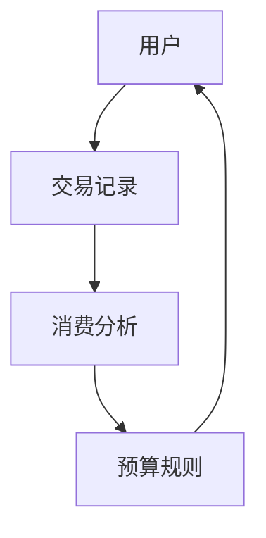
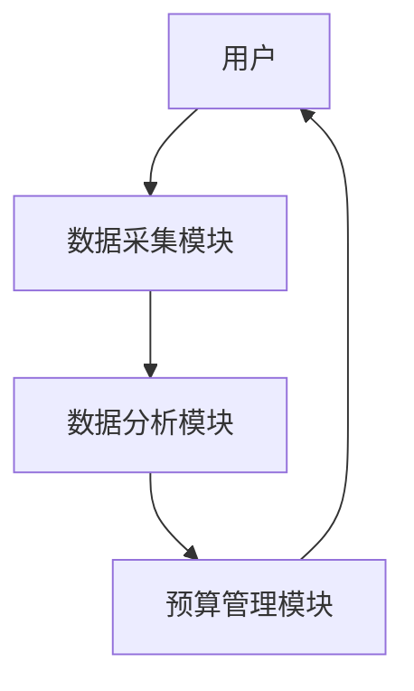
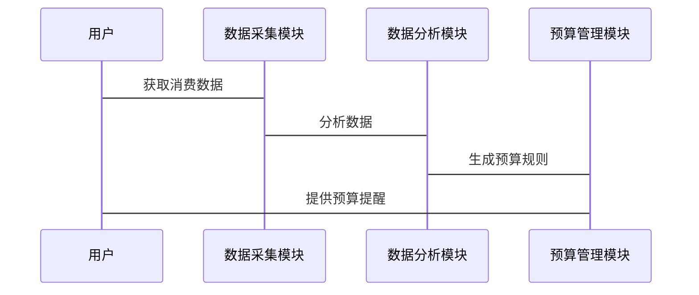

                 


# 《智能个人消费模式分析与预算管理系统》

## 关键词：智能消费分析，预算管理，聚类分析，神经网络，系统架构设计

## 摘要：本文将详细介绍智能个人消费模式分析与预算管理系统的背景、核心概念、算法原理、系统架构设计以及项目实战。通过分析个人消费数据，利用聚类分析和神经网络等算法，实现消费行为分析、预算优化和智能提醒等功能，帮助个人更高效地管理财务。本文将深入探讨系统设计的核心思想，并通过具体案例展示系统的实际应用。

---

## 第1章: 智能个人消费模式分析与预算管理系统的背景介绍

### 1.1 问题背景与问题描述

#### 1.1.1 传统个人消费管理的痛点
传统的个人消费管理方式通常依赖于手工记录和简单的表格统计，这种方式存在以下痛点：
- **数据分散**：消费记录可能分散在不同的平台（如支付宝、微信、银行App）中，难以统一管理。
- **分析效率低**：手动统计和分析消费数据耗时且容易出错。
- **缺乏智能性**：无法自动识别消费模式或提供优化建议。

#### 1.1.2 智能化消费管理的需求
随着人工智能技术的发展，智能化消费管理成为可能：
- **自动化数据收集与整理**：通过API或同步工具自动获取消费数据。
- **智能分析**：利用机器学习算法自动识别消费模式，预测未来消费趋势。
- **实时提醒与优化建议**：根据消费数据提供实时预算提醒和优化建议。

#### 1.1.3 问题边界与外延
本系统将关注以下范围：
- **目标用户**：个人用户，包括学生、上班族等。
- **数据范围**：用户的消费记录、收入记录、预算设置。
- **功能范围**：消费分析、预算管理、智能提醒。

### 1.2 问题解决思路与目标

#### 1.2.1 智能化消费管理的核心目标
- 提供个性化的消费分析报告。
- 自动生成合理的预算计划。
- 实时监控消费行为，提供预警。

#### 1.2.2 解决方案的总体思路
1. **数据采集**：通过API获取用户的消费数据。
2. **数据预处理**：清洗数据，提取关键字段。
3. **消费分析**：利用聚类分析识别消费模式。
4. **预算管理**：基于分析结果生成预算建议。
5. **用户交互**：通过App或网页提供可视化报告和提醒。

#### 1.2.3 系统边界与功能范围
- **功能边界**：不涉及借贷、投资等其他金融服务。
- **用户权限**：仅限用户本人的数据访问。

### 1.3 核心概念与系统架构

#### 1.3.1 核心概念的定义与属性
- **消费记录**：包括交易时间、金额、类别等。
- **预算规则**：包括各消费类别的预算上限。

#### 1.3.2 核心概念之间的关系
- 消费记录是预算管理的基础数据。
- 预算规则指导消费行为。

#### 1.3.3 系统架构的初步设想
- **数据层**：消费记录和预算规则的存储。
- **业务逻辑层**：消费分析和预算计算。
- **用户界面层**：可视化报告和提醒。

### 1.4 本章小结
本章介绍了智能个人消费模式分析与预算管理系统的背景，分析了传统消费管理的痛点和智能化管理的需求，明确了系统的核心目标和架构。

---

## 第2章: 智能个人消费模式分析与预算管理的核心概念与联系

### 2.1 核心概念的原理与特征

#### 2.1.1 智能消费分析的原理
智能消费分析通过聚类分析识别消费模式：
1. **数据预处理**：去除噪声数据。
2. **特征提取**：提取消费金额、类别、时间等特征。
3. **聚类分析**：将相似的消费行为归为一类。

#### 2.1.2 预算管理的核心特征
- **动态调整**：根据消费情况自动调整预算。
- **个性化**：根据用户消费习惯制定个性化预算。

#### 2.1.3 两者之间的关系
消费分析为预算管理提供数据支持，预算管理反过来指导消费行为。

### 2.2 核心概念的属性对比

#### 2.2.1 消费分析与预算管理的对比表格
| 属性       | 消费分析             | 预算管理             |
|------------|----------------------|----------------------|
| 目标       | 分析消费模式         | 制定预算计划         |
| 输入       | 消费记录             | 用户需求             |
| 输出       | 消费报告             | 预算规则             |
| 方法       | 聚类分析             | 规则引擎             |

#### 2.2.2 通过 Mermaid 绘制的核心概念 ER 实体关系图

```
```mermaid
erDiagram
    user {
        +userId : integer
        +userName : string
        +userBudget : float
    }
    transaction {
        +transId : integer
        +transDate : date
        +transAmount : float
        +transCategory : string
    }
    budgetRule {
        +ruleId : integer
        +ruleName : string
        +ruleThreshold : float
    }
    user --> transaction : "进行的交易"
    user --> budgetRule : "遵循的预算规则"
```
```

### 2.3 核心概念之间的关系分析

#### 2.3.1 数据流分析
- 用户消费数据 → 消费分析模块 → 生成消费报告。
- 消费报告 → 预算管理模块 → 生成预算规则。
- 预算规则 → 用户消费行为 → 影响未来的消费记录。

#### 2.3.2 通过 Mermaid 绘制的核心概念关系图

```

```

### 2.4 本章小结
本章详细阐述了智能个人消费模式分析与预算管理的核心概念，通过对比分析和实体关系图展示了它们之间的关系。

---

## 第3章: 智能个人消费模式分析与预算管理的算法原理

### 3.1 算法原理概述

#### 3.1.1 聚类分析与分类算法

##### 3.1.1.1 聚类分析的原理
聚类分析是一种无监督学习方法，通过将相似的数据点分组，发现数据中的潜在结构。常用算法包括K-means和DBSCAN。

##### 3.1.1.2 分类算法的应用
分类算法（如决策树、随机森林）可以用于预测消费类别。

#### 3.1.2 神经网络在消费预测中的应用
神经网络（如LSTM）可以用于时间序列预测，预测未来的消费趋势。

#### 3.1.3 预算优化
预算优化可以通过线性规划或遗传算法实现，找到最优的预算分配方案。

### 3.2 算法原理的数学模型

#### 3.2.1 聚类分析的数学模型
K-means算法的目标是最小化簇内平方和：

$$
\text{目标函数} = \sum_{i=1}^{k} \sum_{j=1}^{n_i} (x_j - \mu_i)^2
$$

其中，$k$是簇的数量，$n_i$是第$i$个簇中的样本数，$\mu_i$是第$i$个簇的中心。

#### 3.2.2 神经网络的数学模型
LSTM的结构包括输入门、遗忘门和输出门，通过 gates 来控制信息的流动。

### 3.3 算法实现的 Python 代码示例

#### 3.3.1 聚类分析实现
```python
from sklearn.cluster import KMeans
from sklearn.preprocessing import StandardScaler

# 数据预处理
scaler = StandardScaler()
scaled_data = scaler.fit_transform(consumption_data)

# 聚类分析
kmeans = KMeans(n_clusters=3, random_state=42)
clusters = kmeans.fit_predict(scaled_data)
```

#### 3.3.2 神经网络实现
```python
import tensorflow as tf
from tensorflow.keras import layers

model = tf.keras.Sequential([
    layers.LSTM(64, input_shape=(sequence_length, features)),
    layers.Dense(64, activation='relu'),
    layers.Dense(1)
])
```

### 3.4 本章小结
本章详细介绍了智能个人消费模式分析与预算管理系统中使用的算法原理，并通过代码示例展示了如何实现这些算法。

---

## 第4章: 智能个人消费模式分析与预算管理系统的架构设计

### 4.1 问题场景介绍

#### 4.1.1 系统功能模块
- 数据采集模块：通过API获取消费数据。
- 数据分析模块：进行消费模式分析。
- 预算管理模块：生成预算建议。
- 用户交互模块：提供可视化报告和提醒。

#### 4.1.2 系统交互流程
1. 用户登录系统。
2. 系统自动获取用户的消费数据。
3. 系统分析数据并生成报告。
4. 用户查看报告并设置预算规则。
5. 系统根据预算规则提供实时提醒。

### 4.2 系统架构设计

#### 4.2.1 系统功能设计
- 数据采集模块：负责数据的获取和存储。
- 数据分析模块：负责消费模式分析。
- 预算管理模块：负责预算规则的生成和执行。
- 用户交互模块：负责与用户的交互和数据展示。

#### 4.2.2 系统架构图

```

```

#### 4.2.3 系统接口设计
- 数据采集模块接口：`GET /api/consumption-data`
- 数据分析模块接口：`POST /api/analyze`
- 预算管理模块接口：`POST /api/budget`

### 4.3 系统交互流程图

```

```

### 4.4 本章小结
本章详细描述了智能个人消费模式分析与预算管理系统的架构设计，包括功能模块、系统架构图和交互流程图。

---

## 第5章: 智能个人消费模式分析与预算管理系统的项目实战

### 5.1 环境配置与数据准备

#### 5.1.1 环境配置
- 安装Python和相关库（如pandas、scikit-learn、TensorFlow）。
- 安装Jupyter Notebook用于开发和测试。

#### 5.1.2 数据准备
- 下载消费数据（如支付宝账单）。
- 数据清洗和预处理。

### 5.2 系统核心功能实现

#### 5.2.1 数据采集模块实现
```python
import requests

def get_consumption_data():
    # 示例API接口
    response = requests.get('https://api.example.com/consumption')
    return response.json()
```

#### 5.2.2 数据分析模块实现
```python
from sklearn.cluster import KMeans
import pandas as pd

def analyze_consumption(data):
    scaler = StandardScaler()
    scaled_data = scaler.fit_transform(data[['amount', 'category']])
    kmeans = KMeans(n_clusters=3)
    clusters = kmeans.fit_predict(scaled_data)
    return clusters
```

#### 5.2.3 预算管理模块实现
```python
def generate_budget_report(clusters, data):
    # 示例预算规则生成
    budget_rules = {}
    for cluster in clusters:
        # 假设每个簇对应一个消费类别
        category = data['category'][clusters == cluster].unique()[0]
        total = data['amount'][clusters == cluster].sum()
        budget_rules[category] = total * 0.9
    return budget_rules
```

### 5.3 实际案例分析

#### 5.3.1 案例数据展示
| 日期       | 金额   | 类别     |
|------------|--------|----------|
| 2023-01-01 | 300    | 餐饮     |
| 2023-01-02 | 200    | 购物     |
| 2023-01-03 | 100    | 娱乐     |
| ...        | ...     | ...      |

#### 5.3.2 分析结果展示
- 餐饮类消费占比30%，购物类消费占比40%，娱乐类消费占比20%。
- 建议娱乐类预算调整为200元。

### 5.4 系统优化与扩展

#### 5.4.1 系统优化建议
- 引入实时数据流处理，提升系统响应速度。
- 增加用户反馈机制，优化预算规则。

#### 5.4.2 功能扩展
- 假设增加借贷管理功能，帮助用户进行债务规划。

### 5.5 本章小结
本章通过实际案例展示了系统的实现过程，从数据准备到功能实现，再到结果分析，帮助读者理解系统的实际应用。

---

## 第6章: 智能个人消费模式分析与预算管理系统的最佳实践

### 6.1 小结与总结

#### 6.1.1 核心观点总结
- 智能消费分析和预算管理可以显著提升个人财务管理效率。
- 通过聚类分析和神经网络等算法实现智能化管理。

#### 6.1.2 系统架构设计的总结
- 系统架构清晰，功能模块划分合理。
- 系统交互流程简单明了。

### 6.2 注意事项与经验分享

#### 6.2.1 开发过程中的注意事项
- 数据安全：确保用户数据加密存储和传输。
- 系统性能：优化算法和数据库查询以提升性能。

#### 6.2.2 使用中的注意事项
- 定期备份数据，防止数据丢失。
- 及时更新预算规则，适应消费习惯的变化。

### 6.3 扩展阅读与深入学习

#### 6.3.1 推荐阅读
- 《数据挖掘导论》
- 《机器学习实战》

#### 6.3.2 学习建议
- 学习更多机器学习算法，提升系统的分析能力。
- 研究系统架构设计，提升系统的扩展性。

### 6.4 本章小结
本章总结了智能个人消费模式分析与预算管理系统的最佳实践，提供了开发和使用中的注意事项，并推荐了进一步学习的资源。

---

## 作者：AI天才研究院/AI Genius Institute & 禅与计算机程序设计艺术 /Zen And The Art of Computer Programming

---

**Note**: 以上是《智能个人消费模式分析与预算管理系统》的技术博客文章的目录结构和部分内容的详细展开。如果需要进一步补充具体章节的内容或调整文章结构，请随时告知！

