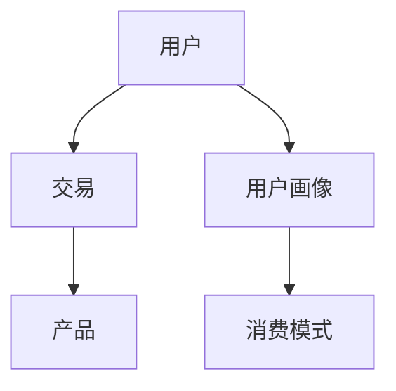
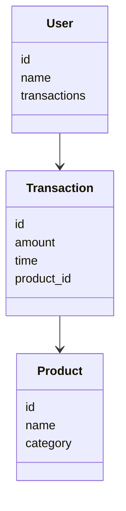

                 

<think>
嗯，我现在需要帮助用户撰写一篇关于《智能个人消费模式分析器》的技术博客文章。用户已经提供了一个详细的目录结构，所以我需要按照这个结构来思考和组织内容。首先，我得理解每个章节的内容和要求，确保覆盖所有必要的知识点，并且逻辑清晰。

首先，文章的标题和关键词已经确定，接下来是摘要，我需要在摘要部分简明扼要地概述文章的核心内容和主题。摘要应该简短，但要包含文章的主要目标，比如分析智能个人消费模式分析器的背景、核心概念、算法原理、系统架构和实战应用。

接下来是正文部分，分为七章。第一章是背景与意义，我需要详细描述个人消费行为的特点、分析的必要性以及应用场景。这部分需要让读者理解为什么需要这种分析器，以及它的实际应用价值。

第二章是核心概念与联系，我需要解释智能分析器的核心原理，比如数据采集、分析算法和用户画像。同时，还需要用表格对比数据特征、算法性能和用户行为，以及用ER图展示实体关系。这部分需要确保概念之间的联系清晰，帮助读者理解系统的整体结构。

第三章是算法原理与数学模型，我需要详细讲解聚类分析和回归分析的算法流程，包括K-means算法和最小二乘法。这部分需要使用Mermaid流程图和Latex公式，确保技术细节准确无误，同时给出实际例子，帮助读者理解算法的应用。

第四章是系统分析与架构设计，我需要介绍问题场景、系统功能设计、领域模型类图、系统架构图以及接口设计。这部分需要展示系统的模块划分和各部分之间的协作关系，帮助读者理解系统的整体架构。

第五章是项目实战，我需要提供环境安装、核心代码实现、代码解读和案例分析。这部分需要实际操作，让读者能够应用所学技术，理解如何在真实场景中使用这些算法。

第六章是最佳实践，我需要总结关键点、注意事项和拓展阅读。这部分帮助读者巩固知识，避免常见错误，并引导他们进一步学习相关领域。

最后是结论，总结文章的主要内容和未来展望，强调智能分析器的重要性和潜力。

在撰写过程中，我需要确保每个章节的内容详尽，同时语言专业且易于理解。还需要注意格式要求，比如使用Mermaid图表和Latex公式，并且文章末尾加上作者信息。

总的来说，我需要按照用户提供的目录结构，逐步分析和撰写每个部分，确保内容全面、逻辑清晰，满足用户的需求。
</think>

# 智能个人消费模式分析器

> 关键词：智能消费分析，模式识别，数据挖掘，机器学习，用户画像

> 摘要：本文将深入探讨智能个人消费模式分析器的设计与实现，涵盖背景分析、核心概念、算法原理、系统架构及项目实战。通过详细的技术分析和实例解读，帮助读者理解如何利用AI技术优化个人消费行为。

---

## 第1章：智能个人消费模式分析器的背景与意义

### 1.1 问题背景与描述

随着全球经济的快速发展，个人消费行为变得越来越复杂。消费者在购物时面临海量信息，如何做出明智的消费决策成为一大挑战。传统的消费分析方法依赖人工记录和简单统计，难以捕捉复杂的消费模式。智能个人消费模式分析器通过机器学习和大数据技术，帮助用户识别消费习惯中的潜在问题，优化消费结构，实现理财目标。

### 1.2 智能分析器的核心目标

智能个人消费模式分析器旨在通过实时数据采集和深度分析，识别用户的消费模式，预测未来消费趋势，并提供建议。其核心目标包括：

1. **数据采集与处理**：收集用户的消费数据，包括金额、时间、地点、商品类别等。
2. **模式识别**：通过聚类分析、回归分析等算法，识别消费模式。
3. **用户画像构建**：基于消费数据，构建用户画像，帮助商家和消费者更好地理解消费行为。

### 1.3 应用场景

智能个人消费模式分析器的应用场景广泛，包括：

1. **个人用户**：帮助用户分析消费习惯，优化支出结构。
2. **商家**：通过分析消费者行为，制定精准营销策略。
3. **金融机构**：评估用户的信用风险，提供个性化的金融服务。

---

## 第2章：核心概念与联系

### 2.1 智能分析器的核心原理

智能个人消费模式分析器的核心原理是通过数据采集、模式识别和用户画像构建，帮助用户理解消费行为。以下是其实现步骤：

1. **数据采集**：通过API、数据库或用户输入收集消费数据。
2. **模式识别**：利用聚类分析、回归分析等算法，识别消费模式。
3. **用户画像**：基于消费数据，构建用户画像，帮助用户理解自己的消费行为。

### 2.2 核心概念对比表

| 概念       | 特征1 | 特征2 | 特征3 |
|------------|-------|-------|-------|
| 数据特征   | 时间性 | 金额大小 | 商品类别 |
| 算法性能   | 准确性 | 可解释性 | 计算效率 |
| 用户行为   | 频率   | 时间分布 | 消费偏好 |

### 2.3 ER实体关系图



---

## 第3章：算法原理与数学模型

### 3.1 聚类分析算法

聚类分析是一种常见的数据挖掘技术，用于将数据分成若干组。以下是K-means算法的流程：

1. **数据预处理**：标准化数据，去除异常值。
2. **选择距离度量**：常用欧氏距离。
3. **初始化质心**：随机选择K个质心。
4. **计算距离**：计算每个数据点到质心的距离。
5. **更新质心**：将每个数据点归到最近的质心，计算新的质心。
6. **检查收敛**：判断质心是否收敛，若收敛则停止，否则继续迭代。

公式：
$$ \text{距离} = \sqrt{(x_2 - x_1)^2 + (y_2 - y_1)^2} $$

### 3.2 回归分析算法

回归分析用于预测消费金额与时间的关系。以下是线性回归的原理：

1. **最小二乘法**：通过最小化预测值与实际值的平方差之和，找到最佳拟合直线。
2. **回归方程**：$y = a + bx$，其中$a$是截距，$b$是斜率。

公式：
$$ \text{预测值} = a + b \times x $$

---

## 第4章：系统分析与架构设计

### 4.1 问题场景介绍

智能个人消费模式分析器的系统架构需要处理以下问题：

1. **数据源**：消费数据来自多个渠道，需要进行整合和清洗。
2. **算法选择**：根据数据特点选择合适的算法。
3. **用户界面**：提供友好的用户界面，展示分析结果。

### 4.2 领域模型设计



### 4.3 系统架构设计


---

## 第5章：项目实战

### 5.1 环境安装

需要安装以下工具：

- Python 3.8+
- Scikit-learn
- Mermaid

### 5.2 核心代码实现

```python
from sklearn.cluster import KMeans
from sklearn.preprocessing import StandardScaler

# 数据预处理
data = StandardScaler().fit_transform(consumption_data)

# 初始化K-means
kmeans = KMeans(n_clusters=3, random_state=0)

# 训练模型
clusters = kmeans.fit_predict(data)
```

### 5.3 代码解读与分析

上述代码实现了一个K-means聚类模型，用于将消费数据分成3类。数据预处理包括标准化和去除异常值，模型训练使用K-means算法，最后得到聚类结果。

### 5.4 案例分析

以一位用户的消费数据为例，分析其消费模式：

- **高频消费**：每周购买日用品，金额较小。
- **低频消费**：偶尔购买电子产品，金额较大。
- **潜在风险**：在某些月份消费金额异常增加，可能超出预算。

---

## 第6章：最佳实践

### 6.1 小结

智能个人消费模式分析器的核心在于数据采集、模式识别和用户画像构建。通过聚类分析和回归分析，可以有效识别消费模式，优化消费行为。

### 6.2 注意事项

- 数据隐私：确保用户数据的安全和隐私。
- 算法选择：根据具体场景选择合适的算法。
- 模型优化：定期更新模型，提高准确率。

### 6.3 拓展阅读

推荐阅读以下书籍：

- 《机器学习实战》
- 《数据挖掘导论》

---

## 结论

智能个人消费模式分析器通过机器学习和大数据技术，帮助用户优化消费行为，提升生活质量。随着技术的不断进步，未来将有更多创新的应用场景。

作者：AI天才研究院 & 禅与计算机程序设计艺术

