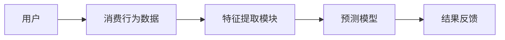
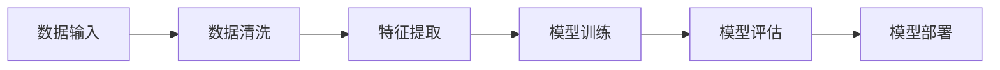
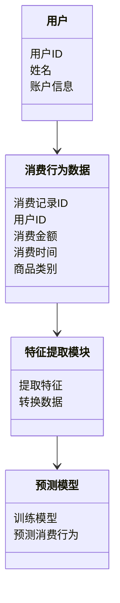
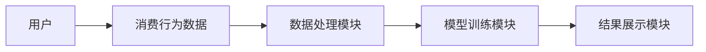
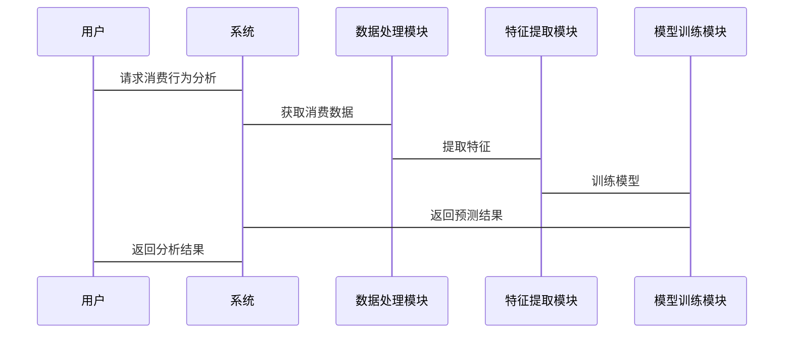

                 


# 智能个人消费行为分析系统

> 关键词：智能消费行为分析，数据挖掘，机器学习，系统架构，人工智能

> 摘要：本文深入探讨智能个人消费行为分析系统的构建与实现，从背景介绍、核心概念、算法原理、系统架构到项目实战，全面解析如何利用数据挖掘和机器学习技术，实现对个人消费行为的智能分析与预测。

---

# 第一部分: 智能个人消费行为分析系统背景与概述

## 第1章: 智能个人消费行为分析系统概述

### 1.1 问题背景与描述

#### 1.1.1 消费行为分析的必要性
在当今社会，消费行为分析是商业决策的重要依据。通过分析个人的消费行为，企业可以更好地理解消费者需求，优化产品设计，制定精准的营销策略。然而，传统的消费行为分析方法依赖人工统计和简单的数据汇总，效率低下且精度不足。随着大数据和人工智能技术的发展，如何利用智能技术实现消费行为的高效分析与预测成为一个重要研究方向。

#### 1.1.2 智能化消费行为分析的定义
智能个人消费行为分析系统是一种基于大数据和人工智能技术，能够自动采集、处理和分析个人消费数据，进而预测消费行为和趋势的系统。该系统通过整合多源数据，利用机器学习算法，实现对个人消费行为的深度理解和智能预测。

#### 1.1.3 系统的目标与意义
系统的目标是通过智能化的手段，实时或近实时地分析个人消费行为，挖掘消费模式和偏好，为企业和消费者提供个性化的产品推荐和服务。系统的意义在于提高商业决策的效率和精准度，同时为消费者提供更好的购物体验。

### 1.2 问题解决与边界

#### 1.2.1 系统如何解决消费行为分析问题
智能个人消费行为分析系统通过以下方式解决传统消费行为分析的痛点：
1. **数据采集**：系统能够从多源数据中自动采集消费数据，包括线上和线下的消费记录。
2. **特征提取**：利用数据挖掘技术，从原始数据中提取有用的特征，如消费频率、偏好类别等。
3. **行为预测**：通过机器学习算法，建立消费行为预测模型，预测未来的消费行为和趋势。

#### 1.2.2 系统的边界与外延
系统的边界包括：
- 数据来源：消费记录、用户行为数据、产品信息等。
- 用户范围：特定的个人或群体。
- 分析范围：消费行为的预测和分析。

系统的外延包括：
- 数据存储与管理：构建数据仓库，存储消费数据。
- 结果展示：生成可视化报告，供用户和企业决策参考。

#### 1.2.3 核心概念与系统结构
系统的核心概念包括：
- 数据采集模块：负责数据的获取和预处理。
- 特征提取模块：从数据中提取有用的特征。
- 模型训练模块：利用机器学习算法训练消费行为预测模型。
- 结果展示模块：将分析结果以可视化的方式呈现。

---

## 第2章: 核心概念与系统联系

### 2.1 核心概念原理

#### 2.1.1 数据采集与特征提取
数据采集是消费行为分析的基础。系统通过多种渠道（如电商平台、社交媒体等）采集用户的消费数据，包括消费金额、时间、商品类别等。特征提取是将原始数据转化为模型可识别的特征，例如：
- 消费频率：用户在一定时间内的消费次数。
- 消费偏好：用户偏好购买的商品类别。
- 消费能力：用户的消费金额水平。

#### 2.1.2 消费行为预测模型
消费行为预测模型是系统的核心部分。常见的预测模型包括：
- 线性回归模型：用于预测消费金额。
- 随机森林模型：用于分类消费行为类型。
- 神经网络模型：用于复杂的非线性预测。

#### 2.1.3 系统交互与反馈机制
系统通过用户界面与用户交互，用户输入查询条件，系统返回分析结果。反馈机制用于优化模型性能，例如根据用户反馈调整推荐策略。

### 2.2 核心概念对比表

| 核心概念 | 数据采集 | 特征提取 | 模型训练 |
|----------|----------|----------|----------|
| 数据来源 | 用户消费记录、线上数据、线下数据 | 消费金额、时间、商品类别 | 消费行为数据 |
| 方法 | 数据清洗、数据标准化 | PCA、LDA | 线性回归、随机森林、神经网络 |
| 目的 | 为模型提供干净的数据 | 提高模型性能 | 预测消费行为 |

### 2.3 系统实体关系图



---

# 第二部分: 智能个人消费行为分析系统算法原理

## 第3章: 算法原理与实现

### 3.1 数据预处理

#### 3.1.1 数据清洗与标准化
数据清洗是去除噪声数据，确保数据的准确性和一致性。标准化是将数据转换为统一的格式，例如将日期格式统一为ISO格式。

#### 3.1.2 特征工程与选择
特征工程是通过提取和选择特征来提高模型的性能。例如，使用PCA（主成分分析）减少特征维度，使用特征重要性分析选择关键特征。

#### 3.1.3 数据分割与训练集测试集划分
将数据划分为训练集和测试集，用于模型的训练和验证。

### 3.2 模型训练

#### 3.2.1 线性回归模型
线性回归模型用于预测连续型变量，例如消费金额。

公式：
$$ y = \beta_0 + \beta_1 x_1 + \beta_2 x_2 + \cdots + \beta_n x_n $$

#### 3.2.2 随机森林模型
随机森林是一种集成学习方法，通过构建多个决策树并进行投票或平均来提高模型的准确性。

#### 3.2.3 神经网络模型
神经网络模型用于处理复杂的非线性关系，例如使用深度学习模型进行消费行为分类。

### 3.3 模型评估与优化

#### 3.3.1 模型评估指标
常用的模型评估指标包括：
- �均方误差（MSE）
- 准确率（Accuracy）
- 召回率（Recall）

#### 3.3.2 超参数调优
通过网格搜索或随机搜索等方法，优化模型的超参数，例如学习率、树的深度等。

#### 3.3.3 模型部署与上线
将训练好的模型部署到生产环境，通过API接口提供实时预测服务。

---

## 第4章: 算法流程与代码实现

### 4.1 算法流程图



### 4.2 代码实现

#### 4.2.1 数据预处理

```python
import pandas as pd
from sklearn.preprocessing import StandardScaler

# 数据加载
data = pd.read_csv('consumption_data.csv')

# 数据清洗
data.dropna()
data['date'] = pd.to_datetime(data['date'])

# 特征提取
features = data[['amount', 'category', 'time']]
scaler = StandardScaler()
features_scaled = scaler.fit_transform(features)
```

#### 4.2.2 模型训练

```python
from sklearn.ensemble import RandomForestRegressor
from sklearn.metrics import mean_squared_error

# 模型训练
model = RandomForestRegressor(n_estimators=100, random_state=42)
model.fit(features_scaled, target)

# 模型评估
pred = model.predict(features_scaled)
mse = mean_squared_error(target, pred)
print('均方误差:', mse)
```

---

# 第三部分: 智能个人消费行为分析系统架构与设计

## 第5章: 系统架构设计

### 5.1 问题场景介绍
系统需要处理大量的消费数据，支持实时或近实时的消费行为分析和预测。

### 5.2 项目介绍
本项目旨在构建一个智能个人消费行为分析系统，通过数据挖掘和机器学习技术，实现对个人消费行为的智能分析与预测。

### 5.3 系统功能设计

#### 5.3.1 领域模型



### 5.4 系统架构设计



---

## 第6章: 系统接口与交互设计

### 6.1 系统接口设计
系统提供API接口，供其他系统或用户调用消费行为分析结果。

### 6.2 系统交互设计



---

## 第7章: 项目实战

### 7.1 环境安装

```bash
pip install pandas scikit-learn matplotlib
```

### 7.2 系统核心实现

```python
import pandas as pd
from sklearn.ensemble import RandomForestRegressor
from sklearn.metrics import mean_squared_error

# 数据加载
data = pd.read_csv('consumption_data.csv')

# 数据清洗
data.dropna()
data['date'] = pd.to_datetime(data['date'])

# 特征提取
features = data[['amount', 'category', 'time']]
target = data['label']

# 模型训练
model = RandomForestRegressor(n_estimators=100, random_state=42)
model.fit(features, target)

# 模型评估
pred = model.predict(features)
mse = mean_squared_error(target, pred)
print('均方误差:', mse)
```

### 7.3 实际案例分析
通过实际数据进行分析，展示系统的预测能力和实际应用效果。

---

## 第8章: 总结与展望

### 8.1 总结
本文详细介绍了智能个人消费行为分析系统的构建与实现，从背景、核心概念到算法实现和系统架构，全面解析了系统的各个组成部分。

### 8.2 注意事项
在实际应用中，需要注意数据隐私和安全问题，确保用户数据的合法性和合规性。

### 8.3 拓展阅读
建议进一步学习大数据技术、机器学习算法和系统架构设计的相关知识，以深入理解智能个人消费行为分析系统的实现细节。

---

作者：AI天才研究院/AI Genius Institute & 禅与计算机程序设计艺术 /Zen And The Art of Computer Programming

