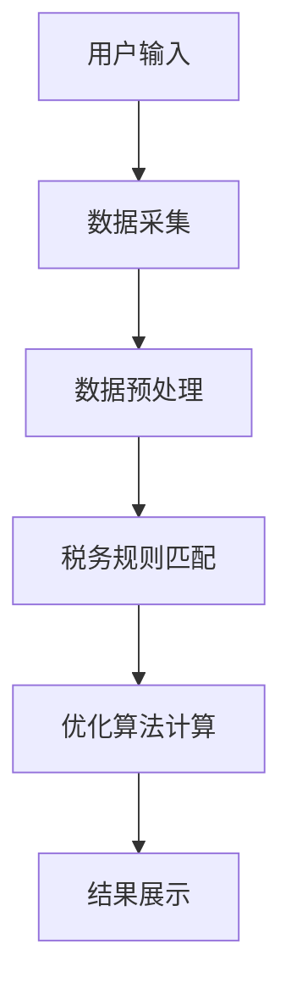
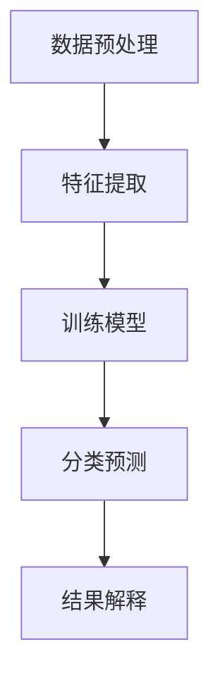
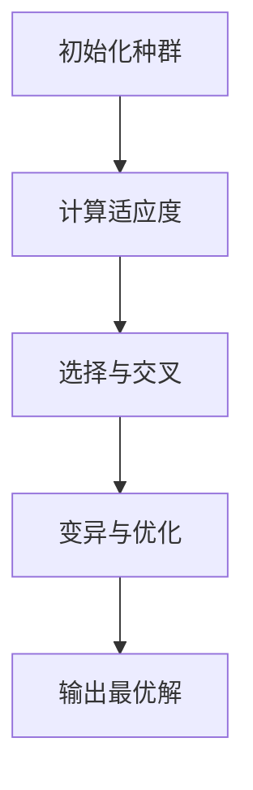
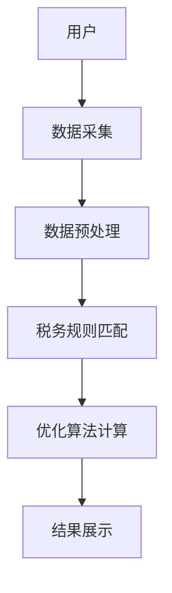
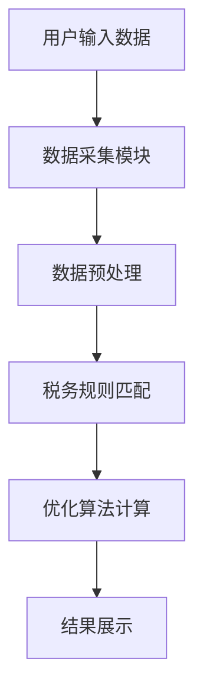

                 


# 智能个人税务筹划助手

## 关键词：人工智能、税务筹划、机器学习、数据处理、优化算法

## 摘要：  
智能个人税务筹划助手是一种基于人工智能技术的工具，旨在通过自动化和智能化的方式帮助个人优化税务规划，降低成本，并提高效率。本文从背景介绍、核心概念、算法原理、系统架构、项目实战等多个方面详细探讨智能税务助手的设计与实现，并通过实际案例分析展示其在税务筹划中的应用价值。  

---

# 第一部分: 智能个人税务筹划助手的背景与核心概念

## 第1章: 智能个人税务筹划助手的背景介绍

### 1.1 税务筹划的基本概念  
#### 1.1.1 税务筹划的定义  
税务筹划是指通过合法合规的方式，优化个人或企业的税务负担，使其在遵守税法的前提下，实现税负最小化或收益最大化。  

#### 1.1.2 税务筹划的核心目标  
- 最小化税负  
- 最大化税务优惠  
- 合规性与风险控制  

#### 1.1.3 税务筹划的边界与外延  
税务筹划的边界在于合法性，即必须在税法框架内进行；其外延则包括收入、支出、资产配置等多个方面。  

### 1.2 AI技术在税务筹划中的应用背景  
#### 1.2.1 传统税务筹划的痛点  
- 税务法规复杂多样，难以快速匹配最优方案。  
- 数据处理繁琐，人工计算效率低。  
- 税务环境动态变化，需要实时调整策略。  

#### 1.2.2 AI技术如何解决税务筹划问题  
- 自动化数据处理与分析。  
- 基于机器学习的税务规则匹配与优化。  
- 实时监控与动态调整。  

#### 1.2.3 智能税务助手的必要性  
随着税收政策的复杂化和个性化需求的增加，传统的税务筹划方式难以满足现代人的需求。智能税务助手通过自动化和智能化的方式，能够高效、精准地解决税务问题。  

## 第2章: 智能个人税务筹划助手的核心概念与联系  

### 2.1 智能税务助手的核心概念  
#### 2.1.1 数据采集与处理  
- 数据来源：收入、支出、资产、家庭成员信息等。  
- 数据预处理：清洗、标准化、特征提取。  

#### 2.1.2 税务规则与模型  
- 税收政策数据库：包括税率、扣除项、优惠政策等。  
- 税务规则匹配：基于规则的分类器。  

#### 2.1.3 优化算法与策略  
- 线性规划：目标函数与约束条件的数学建模。  
- 启发式算法：如遗传算法、模拟退火等。  

### 2.2 核心概念的ER实体关系图  
```mermaid
er
actor: 用户
goal: 税务筹划
vehicle: 智能税务助手
rule: 税务法规
algorithm: 优化算法
```

### 2.3 核心概念的流程图  


---

# 第二部分: 智能个人税务筹划助手的算法原理  

## 第3章: 支持向量机在税务优化中的应用  

### 3.1 支持向量机的基本原理  
#### 3.1.1 支持向量机的定义  
支持向量机（Support Vector Machine, SVM）是一种监督学习算法，常用于分类和回归问题。  

#### 3.1.2 支持向量机的数学模型  
$$\text{max} \frac{1}{2}||w||^2$$  
$$\text{subject to } y_i(w \cdot x_i + b) \geq 1, i=1,2,...,n$$  

### 3.2 支持向量机在税务优化中的应用  
#### 3.2.1 税务数据的特征提取  
- 收入来源：工资、投资收益、租金收入等。  
- 支出项目：生活开支、投资支出等。  

#### 3.2.2 税务优化的分类问题建模  
将税务优化问题转化为分类问题，例如：  
- 高收入者是否符合某种优惠政策。  
- 某种支出是否可以全部抵扣。  

### 3.3 支持向量机的实现流程图  


---

## 第4章: 决策树在税务优化中的应用  

### 4.1 决策树的基本原理  
#### 4.1.1 决策树的定义  
决策树是一种基于树状结构的分类模型，常用于特征选择和规则提取。  

#### 4.1.2 决策树的数学模型  
$$\text{熵公式：} H(S) = -\sum_{i=1}^{k} p_i \log p_i$$  
$$\text{信息增益：} g(S, a) = H(S) - H(S|a)$$  

### 4.2 决策树在税务优化中的应用  
#### 4.2.1 税务规则的特征选择  
- 收入类型：工资、利息、股息等。  
- 支出类型：教育支出、医疗支出等。  

#### 4.2.2 税务优化的决策树构建  
基于决策树算法，构建税务优化的规则树，例如：  
- 如果收入超过一定金额，则需要缴纳所得税。  
- 如果有符合条件的扣除项，则可以减少税负。  

---

## 第5章: 遗传算法在税务优化中的应用  

### 5.1 遗传算法的基本原理  
#### 5.1.1 遗传算法的定义  
遗传算法（Genetic Algorithm, GA）是一种基于生物进化论的优化算法，常用于解决复杂的组合优化问题。  

#### 5.1.2 遗传算法的数学模型  
$$\text{适应度函数：} f(x) = \text{目标函数值}$$  
$$\text{选择、交叉、变异操作：}$$  

### 5.2 遗传算法在税务优化中的应用  
#### 5.2.1 税务优化的数学建模  
将税务优化问题转化为数学优化问题，例如：  
- 最小化税负：$$\text{minimize } \sum \text{tax}$$  
- 最大化优惠：$$\text{maximize } \sum \text{deductions}$$  

#### 5.2.2 遗传算法的实现流程图  


---

# 第三部分: 智能个人税务筹划助手的系统分析与架构设计  

## 第6章: 系统分析与架构设计方案  

### 6.1 系统应用场景介绍  
智能税务助手可以应用于个人所得税、企业所得税、增值税等多种税务场景。  

### 6.2 系统功能设计  
#### 6.2.1 数据采集模块  
- 收集用户收入、支出、资产等数据。  
- 数据格式化与预处理。  

#### 6.2.2 税务规则匹配模块  
- 基于规则的分类器。  
- 税务优惠政策匹配。  

#### 6.2.3 优化算法模块  
- 应用支持向量机、决策树、遗传算法等优化模型。  
- 输出最优税务方案。  

### 6.3 系统架构设计  
#### 6.3.1 系统架构图  


#### 6.3.2 系统接口设计  
- 数据输入接口：API接口。  
- 结果输出接口：JSON格式。  

#### 6.3.3 系统交互流程图  


---

# 第四部分: 项目实战与案例分析  

## 第7章: 项目实战  

### 7.1 环境安装与配置  
#### 7.1.1 安装Python与相关库  
- 安装Python：Python 3.8及以上版本。  
- 安装库：scikit-learn、pandas、numpy。  

#### 7.1.2 安装开发环境  
- 安装Jupyter Notebook。  

### 7.2 核心代码实现  

#### 7.2.1 数据采集与预处理  
```python
import pandas as pd
import numpy as np

# 数据采集
data = pd.read_csv('tax_data.csv')

# 数据预处理
data.dropna(inplace=True)
data['income'] = data['income'].astype(int)
```

#### 7.2.2 税务规则匹配  
```python
from sklearn.tree import DecisionTreeClassifier

# 训练决策树模型
model = DecisionTreeClassifier()
model.fit(X_train, y_train)

# 预测结果
y_pred = model.predict(X_test)
```

#### 7.2.3 优化算法实现  
```python
from sklearn.svm import SVC

# 训练支持向量机模型
model = SVC()
model.fit(X_train, y_train)

# 预测结果
y_pred = model.predict(X_test)
```

### 7.3 实际案例分析  
以一个高收入者为例，分析如何通过智能税务助手优化其税后收入。  

---

## 第8章: 最佳实践与小结  

### 8.1 项目小结  
智能个人税务筹划助手通过AI技术实现了税务优化的自动化与智能化，能够有效降低税负，提高效率。  

### 8.2 最佳实践 tips  
- 数据隐私保护：确保用户数据的安全性。  
- 算法优化方向：引入深度学习模型，如神经网络。  
- 系统维护：定期更新税收政策库。  

### 8.3 拓展阅读  
- 推荐书籍：《机器学习实战》、《税收筹划与企业财务》。  

---

# 作者：AI天才研究院 & 禅与计算机程序设计艺术

