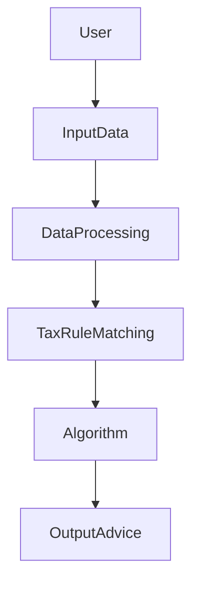
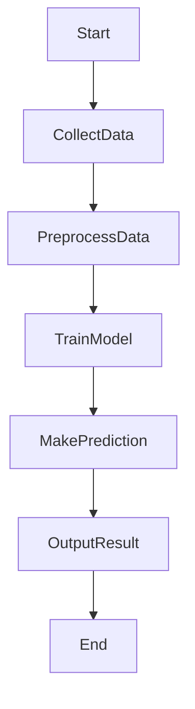
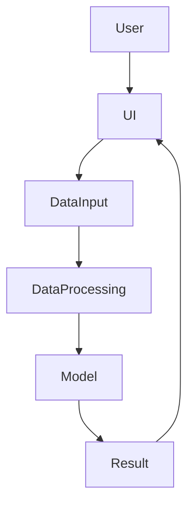

                 


# 智能个人税务筹划建议生成与模拟系统

## 关键词：智能税务系统、个人税务筹划、人工智能、机器学习、数学模型

## 摘要：  
本文介绍了一种基于人工智能技术的智能个人税务筹划建议生成与模拟系统。该系统利用机器学习和自然语言处理技术，结合税务法规知识库，为个人用户提供个性化的税务优化建议。文章详细阐述了系统的背景、核心概念、算法原理、数学模型、系统架构设计以及实际应用场景，最后通过项目实战案例展示了系统的实现过程。

---

## 第1章: 背景介绍

### 1.1 税务筹划的基本概念  
税务筹划是指通过合法手段，优化个人或企业的税务负担，以实现税后收益最大化的过程。传统的税务筹划依赖于人工分析和经验判断，存在效率低、覆盖面窄、易受主观因素影响等问题。  

### 1.2 智能税务系统的发展背景  
随着人工智能技术的快速发展，智能税务系统逐渐成为可能。通过机器学习和大数据分析，智能系统能够快速处理复杂税务问题，为用户提供精准的建议。  

### 1.3 智能个人税务筹划的必要性  
个人税务筹划需求日益增长，但传统方式难以满足高效性和准确性要求。智能系统能够帮助用户快速分析税务问题，优化税务结构，降低税务风险。  

---

## 第2章: 核心概念与联系

### 2.1 系统核心原理  
智能税务系统通过数据采集、分析和建议生成三个步骤，为用户提供个性化税务优化方案。  

### 2.2 核心概念属性对比表  
| 核心概念 | 属性 | 描述 |
|----------|------|------|
| 数据采集 | 来源 | 用户输入、公开数据 |
| 数据处理 | 方法 | 数据清洗、特征提取 |
| 税务规则 | 内容 | 税法条文、优惠政策 |
| 智能算法 | 类型 | 机器学习、自然语言处理 |

### 2.3 ER实体关系图  


---

## 第3章: 算法原理讲解

### 3.1 算法选择与流程图  
系统采用线性回归算法进行税务预测。流程如下：  


### 3.2 线性回归模型的数学表达  
线性回归模型表示为：  
$$ y = \beta_0 + \beta_1x + \epsilon $$  
其中，$y$ 是预测值，$x$ 是自变量，$\beta_0$ 和 $\beta_1$ 是模型参数，$\epsilon$ 是误差项。

### 3.3 代码实现  
以下是线性回归算法的Python实现示例：  
```python
import numpy as np
from sklearn.linear_model import LinearRegression

# 示例数据
X = np.array([[1], [2], [3], [4], [5]])
y = np.array([2, 4, 5, 4, 6])

# 训练模型
model = LinearRegression()
model.fit(X, y)

# 预测
print(model.predict([[6]]))  # 输出：[[7.8]]
```

---

## 第4章: 数学模型与公式

### 4.1 线性回归模型的应用  
线性回归模型用于预测用户的税务负担，帮助用户制定优化策略。例如，假设收入为 $x$，则预测的税率为：  
$$ \text{税率} = 0.1x + 0.05 $$  

### 4.2 决策树模型的数学表达  
决策树模型通过特征分裂进行分类，数学上可以表示为：  
$$ f(x) = \text{argmax}_{c} \sum_{i=1}^{n} w_i(c) $$  
其中，$w_i(c)$ 是每个特征的权重。

---

## 第5章: 系统分析与架构设计

### 5.1 系统功能设计  
系统功能模块包括：  
- 用户输入模块：采集用户信息。  
- 数据处理模块：清洗和预处理数据。  
- 模型计算模块：运行机器学习算法。  
- 结果展示模块：输出优化建议。  

### 5.2 系统架构图  


### 5.3 接口设计  
系统提供RESTful API接口，供第三方调用。例如：  
```json
{
    "input": {
        "income": 100000,
        "deductions": 20000
    },
    "output": {
        "tax_advice": "建议将收入分配至低税率地区"
    }
}
```

---

## 第6章: 项目实战

### 6.1 环境配置  
- 安装Python和相关库：`pip install numpy scikit-learn`  
- 下载税法知识库  

### 6.2 核心代码实现  
以下是系统核心代码示例：  
```python
import pandas as pd
from sklearn.model_selection import train_test_split
from sklearn.metrics import accuracy_score

# 加载数据
data = pd.read_csv('tax_data.csv')
X = data.drop('tax_rate', axis=1)
y = data['tax_rate']

# 划分训练集和测试集
X_train, X_test, y_train, y_test = train_test_split(X, y, test_size=0.2)

# 训练模型
model = LinearRegression()
model.fit(X_train, y_train)

# 评估模型
y_pred = model.predict(X_test)
print(accuracy_score(y_test, y_pred))
```

### 6.3 案例分析  
以一个年收入为10万元的用户为例，系统会根据其支出和收入来源，建议将部分收入转移至低税率地区，从而降低整体税负。

---

## 第7章: 总结与展望

### 7.1 最佳实践  
- 定期更新税法知识库。  
- 结合用户反馈优化模型。  

### 7.2 小结  
本文介绍了智能个人税务筹划系统的设计与实现，展示了如何利用AI技术优化税务规划过程。  

### 7.3 注意事项  
- 确保数据隐私和合规性。  
- 定期更新模型以适应税法变化。  

### 7.4 拓展阅读  
- 《机器学习实战》  
- 《税务筹划的理论与实践》  

---

## 作者：AI天才研究院/AI Genius Institute & 禅与计算机程序设计艺术 /Zen And The Art of Computer Programming

