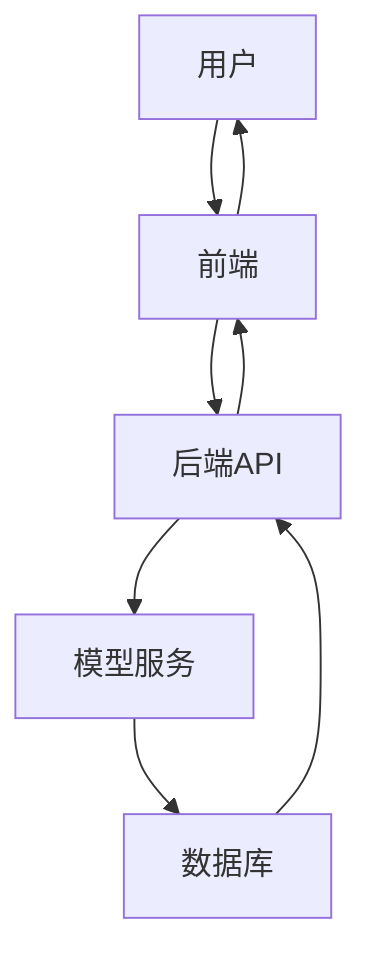
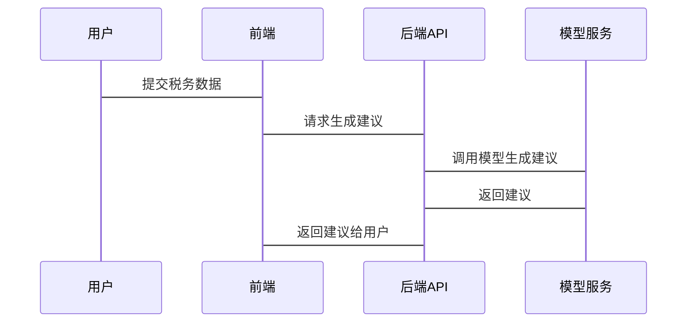

                 


# 智能个人税务筹划建议生成器

## 关键词：智能税务筹划，人工智能，大语言模型，税务优化，个人财务

## 摘要：本文介绍智能个人税务筹划建议生成器，利用AI技术帮助个人优化税务负担。通过背景介绍、核心概念、算法原理、系统架构和项目实战，全面分析生成器的实现与应用。

---

# 第一部分: 智能个人税务筹划建议生成器的背景与核心概念

## 第1章: 智能个人税务筹划建议生成器的背景与问题描述

### 1.1 税务筹划的背景与重要性

#### 1.1.1 税务筹划的基本概念
税务筹划是指通过合法手段优化个人或企业的税务负担，最大化经济利益。它关注税法的合理运用，而非偷税漏税。

#### 1.1.2 税务筹划的法律边界与合规性
税务筹划必须在法律允许的范围内进行，确保合规性。了解税法变化和执法力度是税务筹划的重要前提。

#### 1.1.3 税务筹划对个人财务优化的意义
税务筹划能帮助个人降低税务支出，合理规划收入与支出的时间安排，提升整体财务状况。

### 1.2 人工智能在税务筹划中的应用

#### 1.2.1 人工智能技术的基本概念
人工智能（AI）是指计算机系统模拟人类智能的技术，包括学习、推理和自适应能力。AI在税务领域的应用涵盖数据处理、模式识别和决策支持。

#### 1.2.2 人工智能在税务领域的优势
AI能够快速处理大量税务数据，发现潜在的节税机会，并提供个性化建议。通过机器学习模型，AI可以不断优化建议，提高准确性。

#### 1.2.3 个人税务筹划中的智能化需求
随着税法复杂化，个人需要更精准的税务建议。AI技术可以处理复杂数据，提供实时、个性化的税务优化方案。

### 1.3 智能个人税务筹划建议生成器的核心问题

#### 1.3.1 税务数据的收集与处理
收集个人收入、支出、资产等数据，并进行清洗和预处理，确保数据质量。

#### 1.3.2 税务策略的智能化生成
利用AI算法，分析数据生成最优税务策略，考虑多种可能性和风险。

#### 1.3.3 税务建议的个性化与合规性
根据个人情况生成个性化建议，确保建议的合规性，避免法律风险。

### 1.4 本章小结
本章介绍了税务筹划的重要性，AI在税务中的优势，以及生成器的核心问题。

---

## 第2章: 智能个人税务筹划建议生成器的核心概念

### 2.1 AI大模型在税务筹划中的应用原理

#### 2.1.1 大语言模型的基本原理
大语言模型（如GPT）通过大量数据训练，能够理解上下文并生成文本。在税务中，模型可以分析数据和生成建议。

#### 2.1.2 大语言模型在税务领域的适用性
模型能处理结构化和非结构化数据，适合复杂场景下的税务分析和策略生成。

#### 2.1.3 大语言模型的训练与优化
利用监督学习和微调技术，优化模型在税务数据上的表现。

### 2.2 税务数据的特征与处理方法

#### 2.2.1 税务数据的多样性与复杂性
税务数据包括收入、支出、资产等，类型多样，涉及多个税种和法规。

#### 2.2.2 数据清洗与预处理
处理缺失值、异常值和重复数据，确保数据准确性和一致性。

#### 2.2.3 数据标注与训练
对数据进行标注，构建训练集，训练模型识别关键信息。

### 2.3 税务策略生成的算法原理

#### 2.3.1 税务策略生成的逻辑框架
模型接收输入数据，分析后生成策略，涵盖收入、支出、资产等多方面。

#### 2.3.2 税务优化的数学模型
建立优化模型，考虑税率、扣除项和限制条件，寻找最优解。

#### 2.3.3 税务建议的生成过程
模型生成建议后，进行验证和调整，确保合规性和可行性。

### 2.4 核心概念对比与ER实体关系图

#### 2.4.1 核心概念对比表
| 概念         | 特征                     |
|--------------|--------------------------|
| 税务数据     | 多样性、复杂性           |
| AI大模型     | 强大学习能力             |
| 税务策略     | 个性化、合规性           |

#### 2.4.2 ER实体关系图

```mermaid
erd
    税务数据
    +--> 收入: one -> many
    +--> 支出: one -> many
    +--> 资产: one -> many
    AI模型
    +--> 税务数据: one -> many
    +--> 税务策略: one -> many
    税务建议
    +--> 税务策略: one -> many
```

---

## 第3章: 智能个人税务筹划建议生成器的算法原理

### 3.1 算法原理概述

#### 3.1.1 模型训练过程
模型通过监督学习和微调，利用大量税务数据优化参数，提升生成能力。

#### 3.1.2 模型调优
使用验证集调整超参数，确保模型在测试集上表现良好。

#### 3.1.3 模型评估
通过准确率、召回率等指标评估模型性能，确保生成建议的准确性。

### 3.2 算法实现细节

#### 3.2.1 数据预处理
编写Python脚本清洗数据，处理缺失值和异常值。

#### 3.2.2 模型训练
使用深度学习框架（如TensorFlow）训练模型，构建生成器的内部结构。

#### 3.2.3 税务建议生成
模型根据输入数据生成建议，并进行格式化输出。

### 3.3 代码实现示例

#### 3.3.1 数据预处理代码
```python
import pandas as pd

def preprocess_data(data):
    # 处理缺失值
    data = data.dropna()
    # 标准化收入和支出
    data[['收入', '支出']] = data[['收入', '支出']].astype(float)
    return data

# 示例数据
data = {
    '收入': [50000, 60000, 70000],
    '支出': [20000, 25000, 30000],
    '资产': ['否', '是', '否']
}
df = pd.DataFrame(data)
processed_data = preprocess_data(df)
print(processed_data)
```

#### 3.3.2 模型训练代码
```python
import tensorflow as tf
from tensorflow.keras import layers

def build_model(input_shape):
    model = tf.keras.Sequential()
    model.add(layers.Dense(64, activation='relu', input_shape=input_shape))
    model.add(layers.Dense(32, activation='relu'))
    model.add(layers.Dense(1, activation='sigmoid'))
    model.compile(optimizer='adam', loss='binary_crossentropy', metrics=['accuracy'])
    return model

model = build_model((2,))
model.summary()
```

### 3.4 模型优化与评估

#### 3.4.1 模型调优
调整学习率、批次大小等超参数，优化模型性能。

#### 3.4.2 模型评估
使用测试数据评估模型的准确率和召回率，确保生成建议的准确性。

---

## 第4章: 智能个人税务筹划建议生成器的系统架构设计

### 4.1 系统功能设计

#### 4.1.1 用户输入与数据处理
用户输入税务数据，系统进行清洗和预处理。

#### 4.1.2 模型调用与策略生成
系统调用AI模型，生成最优税务策略。

#### 4.1.3 结果展示与交互
生成建议以用户友好的形式展示，并支持交互。

### 4.2 系统架构设计

#### 4.2.1 系统架构概述
系统分为前端、后端和数据库，模块化设计便于维护和扩展。

#### 4.2.2 系统架构图



### 4.3 系统接口设计

#### 4.3.1 API接口定义
使用RESTful API，定义输入和输出格式，确保前后端交互顺畅。

#### 4.3.2 接口交互流程



---

## 第5章: 项目实战与案例分析

### 5.1 环境安装与配置

#### 5.1.1 安装Python与相关库
安装Python和必要的库（如TensorFlow、Pandas），配置开发环境。

#### 5.1.2 安装AI框架
安装大语言模型框架，如TensorFlow或Keras，配置GPU加速。

### 5.2 核心代码实现

#### 5.2.1 数据处理代码
```python
import pandas as pd

def preprocess_data(data):
    data = data.dropna()
    data[['收入', '支出']] = data[['收入', '支出']].astype(float)
    return data

data = {
    '收入': [50000, 60000, 70000],
    '支出': [20000, 25000, 30000],
    '资产': ['否', '是', '否']
}
df = pd.DataFrame(data)
processed_data = preprocess_data(df)
print(processed_data)
```

#### 5.2.2 模型训练代码
```python
import tensorflow as tf
from tensorflow.keras import layers

def build_model(input_shape):
    model = tf.keras.Sequential()
    model.add(layers.Dense(64, activation='relu', input_shape=input_shape))
    model.add(layers.Dense(32, activation='relu'))
    model.add(layers.Dense(1, activation='sigmoid'))
    model.compile(optimizer='adam', loss='binary_crossentropy', metrics=['accuracy'])
    return model

model = build_model((2,))
model.summary()
```

### 5.3 实际案例分析与解读

#### 5.3.1 案例背景
用户年收入10万元，已婚，有一个孩子，租房。

#### 5.3.2 数据分析
分析收入、支出、家庭状况，确定可扣除项。

#### 5.3.3 税务建议生成
生成优化建议，如增加公积金缴纳比例，利用子女教育扣除等。

#### 5.3.4 结果验证
验证建议的合规性，确保符合税法规定。

### 5.4 项目总结

#### 5.4.1 项目小结
项目展示了AI在税务筹划中的应用，模型生成合理建议，提升效率。

#### 5.4.2 成果展示
提供生成器的代码和案例分析，展示项目的实际应用价值。

---

## 第6章: 最佳实践与注意事项

### 6.1 最佳实践

#### 6.1.1 注意事项
确保数据隐私和安全，遵守税法，及时更新税法知识。

#### 6.1.2 使用建议
结合专业税务顾问，定期更新数据，保持模型准确性。

### 6.2 小结
AI技术在税务筹划中的应用前景广阔，能显著提升效率和优化效果。

### 6.3 拓展阅读
推荐相关书籍和论文，深入学习AI与税务结合的应用。

---

## 作者：AI天才研究院/AI Genius Institute & 禅与计算机程序设计艺术 /Zen And The Art of Computer Programming

---

以上是《智能个人税务筹划建议生成器》的完整目录和内容框架。文章详细介绍了生成器的背景、核心概念、算法原理、系统架构和项目实战，确保读者能够全面理解并应用这一技术。

