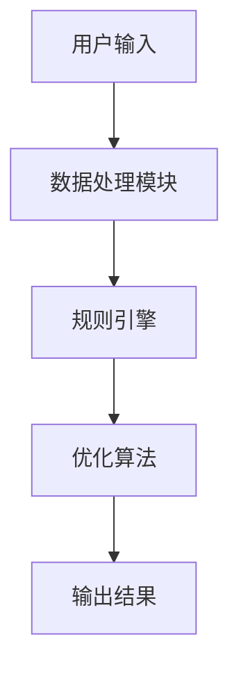
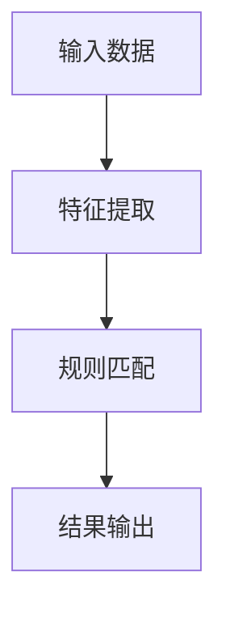
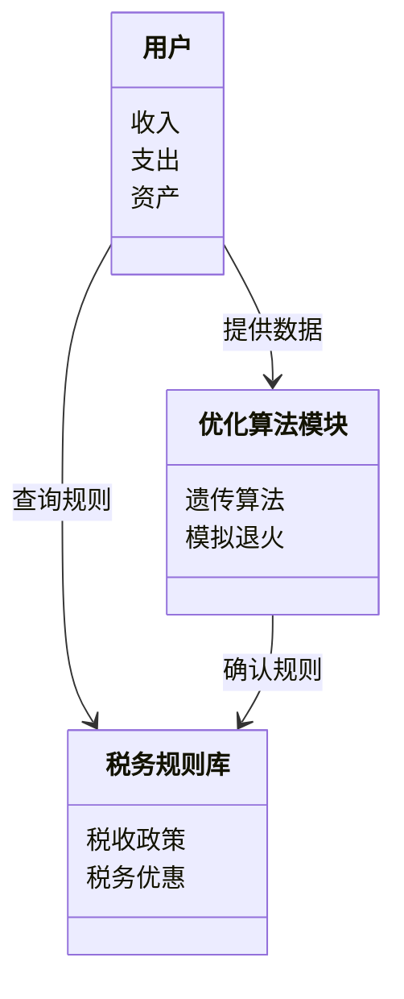
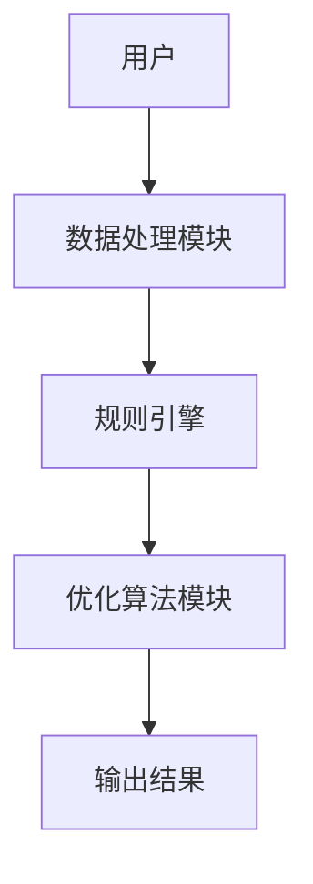
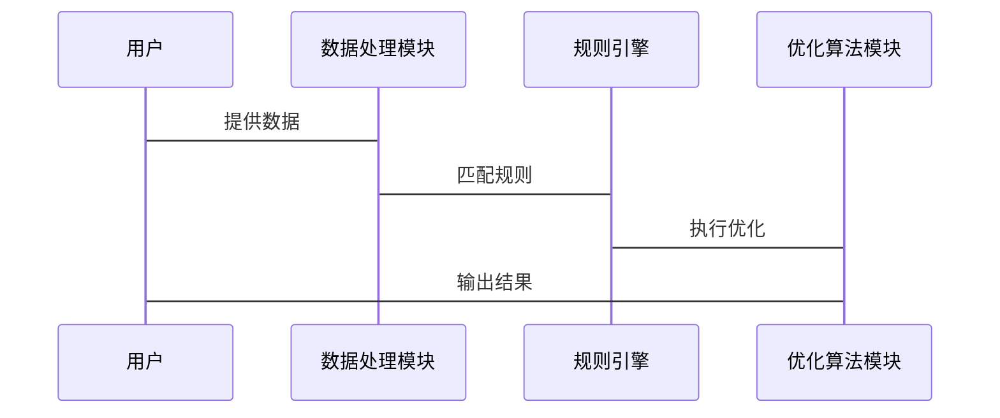

                 


# 智能个人税务筹划模拟器

> 关键词：智能税务模拟器、个人税务筹划、人工智能算法、规则引擎、系统架构设计

> 摘要：智能个人税务筹划模拟器是一种结合人工智能技术的工具，用于帮助个人优化税务规划。本文从背景介绍、核心概念、算法原理、系统架构设计、项目实战等方面进行详细分析，探讨如何通过智能化手段提升个人税务筹划的效率与准确性。

---

# 第一部分: 智能个人税务筹划模拟器的背景与概念

# 第1章: 智能个人税务筹划模拟器的背景介绍

## 1.1 个人税务筹划的背景与需求
### 1.1.1 个人税务筹划的定义与重要性
个人税务筹划是指通过合法手段，合理安排个人收入、支出和资产配置，以达到最小化税务负担的目的。随着个人收入来源的多样化和税收政策的复杂化，个人税务筹划的需求日益增加。

### 1.1.2 当前税务筹划的主要挑战
- 税收政策频繁变化，难以及时更新。
- 税务规则复杂，个人难以自行掌握。
- 数据量大，手动计算效率低下。

### 1.1.3 智能技术在税务筹划中的应用潜力
人工智能技术（如机器学习、自然语言处理）可以快速分析大量数据，提取关键信息，为税务筹划提供智能化支持。

## 1.2 智能个人税务筹划模拟器的定义与特点
### 1.2.1 智能个人税务筹划模拟器的定义
智能个人税务筹划模拟器是一种基于人工智能技术的工具，通过数据处理、规则匹配和优化算法，为用户提供个性化的税务筹划建议。

### 1.2.2 智能模拟器的核心特点
- **智能化**：利用AI算法自动分析数据，提供优化建议。
- **个性化**：根据用户的具体情况，定制化税务筹划方案。
- **实时性**：能够快速响应税收政策的变化，提供最新建议。

### 1.2.3 与传统税务筹划工具的区别
| 特性         | 传统税务工具       | 智能税务模拟器 |
|--------------|--------------------|----------------|
| 数据处理能力 | 简单规则匹配       | 复杂规则匹配 + 数据挖掘 |
| 优化能力     | 无优化功能         | 基于算法的优化建议 |
| 交互方式     | 手动输入 + 输出    | 自动化分析 + 用户交互 |

## 1.3 智能个人税务筹划模拟器的应用场景
### 1.3.1 个人所得税优化
- 收入分配优化（如年终奖与工资的分配）。
- 免税额度的合理利用。

### 1.3.2 财产规划与税务影响
- 房产、车辆等资产的税务影响分析。
- 遗产税规划。

### 1.3.3 投资与税务筹划的结合
- 证券、基金等投资的税务影响分析。
- 税后投资产品的优化建议。

## 1.4 本章小结
本章介绍了智能个人税务筹划模拟器的背景、定义、特点及其应用场景，为后续章节的分析奠定了基础。

---

# 第2章: 智能个人税务筹划模拟器的核心概念与联系

## 2.1 智能税务模拟器的核心概念
### 2.1.1 数据处理与分析
- 数据清洗：去除无效数据，处理缺失值。
- 特征提取：从数据中提取与税务筹划相关的特征（如收入来源、支出类别）。

### 2.1.2 税务规则引擎
- 规则匹配：基于税收政策，匹配适用的税务规则。
- 规则更新：根据政策变化动态更新规则库。

### 2.1.3 优化算法
- 算法目标：在满足税务规则的前提下，最小化税务负担。
- 算法选择：基于具体问题选择合适的优化算法（如遗传算法、模拟退火）。

## 2.2 核心概念的联系与对比
### 2.2.1 数据流与实体关系图


### 2.2.2 核心概念对比表
| 概念       | 输入         | 输出         | 功能描述                     |
|------------|--------------|--------------|------------------------------|
| 数据处理模块 | 用户数据     | 处理后数据   | 清洗数据，提取特征           |
| 规则引擎   | 处理后数据   | 匹配结果     | 匹配税务规则，生成建议       |
| 优化算法   | 匹配结果     | 最优方案     | 优化税务负担，输出建议       |

## 2.3 算法原理与流程
### 2.3.1 数据预处理流程
1. 数据清洗：去除无效数据，处理缺失值。
2. 特征提取：提取与税务筹划相关的特征。

### 2.3.2 税务规则匹配流程
1. 数据输入：用户输入税务相关信息。
2. 规则匹配：基于税收政策，匹配适用的税务规则。
3. 匹配结果输出：生成初步的税务规划建议。

### 2.3.3 优化算法执行流程
1. 算法初始化：设置初始参数。
2. 算法迭代：不断优化，寻找最优解。
3. 结果输出：输出最优税务规划方案。

## 2.4 本章小结
本章详细介绍了智能个人税务筹划模拟器的核心概念，包括数据处理、规则引擎和优化算法，并通过流程图和对比表展示了各部分的联系。

---

# 第3章: 智能个人税务筹划模拟器的算法原理

## 3.1 数据预处理与特征提取
### 3.1.1 数据清洗
- 示例：处理缺失值、去除异常值。
  ```python
  import pandas as pd
  df = pd.DataFrame({'收入': [10000, 20000, None, 30000], '支出': [5000, 7000, 6000, 8000]})
  df.dropna()  # 去除缺失值
  ```

### 3.1.2 特征工程
- 示例：提取收入来源、支出类别等特征。
  ```python
  features = ['收入', '支出']
  target = '税后净收入'
  ```

## 3.2 税务规则匹配算法
### 3.2.1 基于规则的匹配算法
- 示例：匹配收入是否超过个税起征点。
  ```python
  def is_taxable(income):
      return income > 5000
  ```

### 3.2.2 算法流程图


## 3.3 优化算法实现
### 3.3.1 常用优化算法对比
| 算法名称     | 优点                   | 缺点                     |
|--------------|------------------------|--------------------------|
| 遗传算法     | 全局搜索能力强         | 参数设置复杂             |
| 模拟退火     | 能够找到全局最优解     | 收敛速度较慢             |
| 蚁群算法     | 适合多目标优化         | 参数调整复杂             |

### 3.3.2 遗传算法实现
- 示例代码：
  ```python
  import random

  def fitness(individual):
      # 计算个体的适应度
      return sum(individual)

  def evolve(population, fitness_fn):
      # 简单遗传算法实现
      next_population = []
      for _ in range(len(population)):
          # 随机选择两个个体进行交叉
          parent1 = random.choice(population)
          parent2 = random.choice(population)
          child = crossover(parent1, parent2)
          next_population.append(child)
      return next_population

  def crossover(parent1, parent2):
      # 单点交叉
      point = random.randint(0, len(parent1))
      return parent1[:point] + parent2[point:]
  ```

### 3.3.3 算法原理的数学模型
- 遗传算法的基本流程可以用以下公式表示：
  $$ \text{适应度} = \sum_{i=1}^{n} \text{个体特征} $$
  $$ \text{选择} \sim \text{概率} \propto \text{适应度} $$
  $$ \text{交叉} \sim \text{单点交叉} $$

## 3.4 本章小结
本章详细介绍了智能个人税务筹划模拟器的算法原理，包括数据预处理、规则匹配算法和优化算法的实现，并通过示例代码和流程图展示了算法的具体操作。

---

# 第4章: 智能个人税务筹划模拟器的系统分析与架构设计

## 4.1 系统问题场景介绍
- 用户输入税务相关信息，系统输出优化后的税务规划方案。

## 4.2 系统功能设计
### 4.2.1 领域模型设计


### 4.2.2 系统架构设计


### 4.2.3 系统接口设计
- 输入接口：用户输入税务相关信息。
- 输出接口：系统输出优化后的税务规划方案。

### 4.2.4 系统交互流程图


## 4.3 本章小结
本章通过系统分析与架构设计，明确了智能个人税务筹划模拟器的各个模块及其交互关系，为后续的项目实现奠定了基础。

---

# 第5章: 智能个人税务筹划模拟器的项目实战

## 5.1 环境安装与配置
- 安装Python、机器学习库（如scikit-learn、tensorflow）和数据处理库（如pandas、numpy）。

## 5.2 核心代码实现
### 5.2.1 数据处理模块
```python
import pandas as pd

def preprocess(data):
    # 数据清洗
    data = data.dropna()
    # 特征提取
    features = ['收入', '支出']
    return data[features]
```

### 5.2.2 规则引擎实现
```python
def match_rules(data, rules):
    # 税务规则匹配
    matched = []
    for rule in rules:
        if rule['condition'](data):
            matched.append(rule['action'])
    return matched
```

### 5.2.3 优化算法实现
```python
def optimize(solution_space):
    # 使用遗传算法进行优化
    population = initialize(solution_space)
    for _ in range(100):
        population = evolve(population)
    return select_best(population)
```

## 5.3 代码应用解读与分析
- 数据处理模块：清洗数据，提取特征。
- 规则引擎：匹配适用的税务规则，生成初步建议。
- 优化算法：基于规则匹配结果，优化税务负担。

## 5.4 实际案例分析
### 5.4.1 案例背景
- 用户年收入：20万元。
- 家庭情况：已婚，有一个孩子。

### 5.4.2 案例分析与优化
- 收入分配优化：年终奖与工资的分配比例。
- 免税额度利用：子女教育支出的抵扣。

## 5.5 项目小结
本章通过实际案例分析，展示了智能个人税务筹划模拟器的实现过程和应用效果。

---

# 第6章: 智能个人税务筹划模拟器的最佳实践与注意事项

## 6.1 最佳实践 tips
- 数据隐私保护：确保用户数据的安全性。
- 税收政策更新：及时更新规则库，确保模拟器的准确性。

## 6.2 小结
智能个人税务筹划模拟器通过结合人工智能技术，为个人提供高效、个性化的税务筹划方案。

## 6.3 注意事项
- 税收政策的地域性：不同地区的税收政策可能差异较大。
- 数据的准确性：输入数据的准确性直接影响结果。

## 6.4 拓展阅读
- 推荐阅读《人工智能在金融领域的应用》。
- 参考文献：[1] 《机器学习实战》，[2] 《税务筹划实务操作手册》。

---

# 作者：AI天才研究院/AI Genius Institute & 禅与计算机程序设计艺术 /Zen And The Art of Computer Programming

