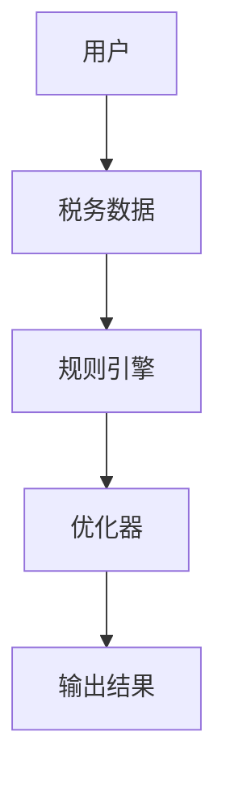
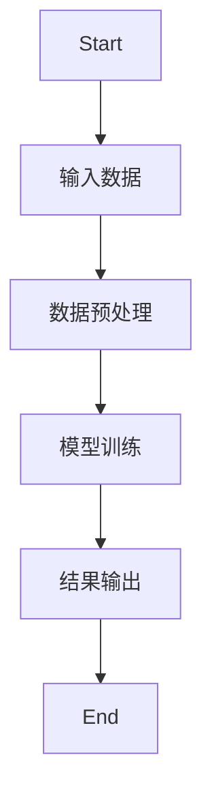
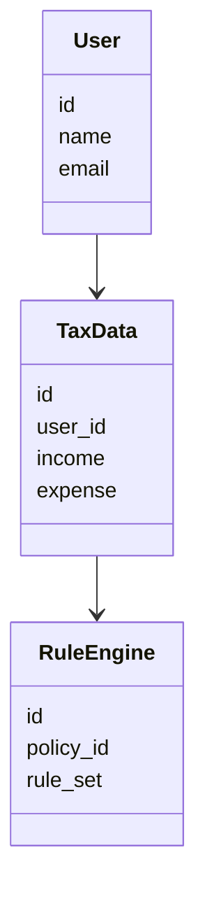
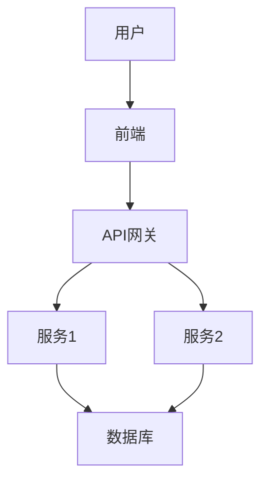
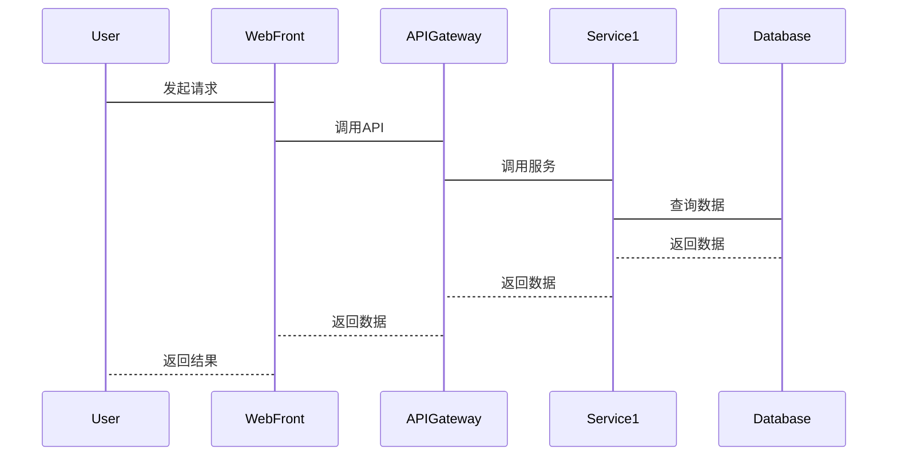

                 

<think>
好的，我现在需要帮用户撰写一篇关于《智能个人税务筹划模拟系统》的技术博客文章。用户希望文章结构清晰，内容详实，包含从背景介绍到系统架构设计，再到项目实战的各个方面。我得先理清楚整个思考过程，确保每个部分都涵盖到位。

首先，文章的开头需要有关键词和摘要。关键词可能包括智能税务筹划、机器学习、自然语言处理、系统架构设计等。摘要部分需要简明扼要地概括文章的核心内容，即介绍智能税务系统的背景、核心概念、算法、架构以及实际应用。

接下来是目录结构，用户已经给出了详细的大纲，我需要按照这个大纲逐步展开每一部分。首先，第一部分是概述，包括背景介绍和核心概念。第二部分是算法原理，需要详细讲解机器学习和自然语言处理的应用，以及具体的算法流程和代码实现。第三部分是系统架构设计，涉及问题场景、系统功能、架构设计等。第四部分是项目实战，包括环境安装、代码实现、案例分析等。最后是最佳实践和总结。

在撰写过程中，我需要确保每一章都包含足够的细节，比如背景介绍要涵盖传统税务筹划的痛点、智能化的需求以及系统的目标。核心概念部分需要定义清楚，使用ER图展示实体关系。算法部分要详细讲解原理，并用mermaid流程图和Python代码来支持说明。系统架构设计部分需要展示类图、架构图和接口设计，确保系统结构清晰。项目实战部分要提供具体的代码实现和案例分析，让读者能够理解和应用。

同时，数学公式需要用latex表示，独立段落使用$$，内部使用$。代码部分要用语法高亮显示，确保可读性。最后，文章末尾要加上作者信息，注明来自AI天才研究院。

我需要确保文章逻辑连贯，每一部分之间有良好的衔接，内容详实，技术深度足够，同时保持语言的专业性和可读性。这样，读者才能全面理解智能个人税务筹划模拟系统的构建过程和实际应用。
</think>

# 智能个人税务筹划模拟系统

## 关键词：智能税务筹划、机器学习、自然语言处理、系统架构设计、Python实现

## 摘要：本文介绍了一种基于人工智能技术的智能个人税务筹划模拟系统。通过分析传统税务筹划的痛点，提出了一种结合机器学习和自然语言处理的智能化解决方案。系统通过数据采集、规则匹配、优化方案生成等步骤，帮助个人用户实现税务合规与节税目标。本文详细阐述了系统的架构设计、算法原理、核心代码实现以及实际应用场景。

---

## 第一部分: 智能个人税务筹划模拟系统概述

### 第1章: 智能个人税务筹划模拟系统背景介绍

#### 1.1 问题背景与目标
##### 1.1.1 传统税务筹划的痛点
传统税务筹划过程中，个人用户需要手动收集和分析大量的税务数据，包括收入、支出、资产配置等信息。由于涉及的法律法规复杂且更新频繁，个人用户往往难以准确理解和应用相关政策。此外，传统方法依赖人工经验，效率低且容易出错。

##### 1.1.2 智能化税务筹划的需求
随着人工智能技术的快速发展，智能化税务筹划成为可能。通过机器学习和自然语言处理技术，系统可以自动分析税务数据、匹配最优税收政策，并生成个性化的优化方案。这不仅提高了效率，还能确保税务合规性。

##### 1.1.3 个人税务筹划的核心目标
个人税务筹划的核心目标是实现税务合规与节税最大化。通过智能系统，用户可以实时了解最新的税收政策，合理配置资产，降低税务负担。

#### 1.2 问题描述与解决思路
##### 1.2.1 税务筹划的复杂性分析
税务筹划涉及多个领域，包括税法、会计、金融等。不同地区的税收政策差异大，且政策更新频繁，这使得个人用户难以独立完成复杂的税务优化。

##### 1.2.2 智能系统在税务筹划中的作用
智能系统可以通过自动化数据处理、规则匹配和优化算法，帮助用户快速找到最优的税务解决方案。系统还可以实时监控税务数据变化，提供动态优化建议。

##### 1.2.3 系统解决的主要问题
系统主要解决以下问题：
- 数据采集与处理的效率低下
- 税收政策复杂难以匹配
- 优化方案缺乏个性化和动态性

#### 1.3 系统的边界与外延
##### 1.3.1 系统功能边界
系统的核心功能包括数据采集、规则匹配、优化方案生成和结果展示。系统不涉及具体的税务申报和提交功能，但可以为用户提供申报建议。

##### 1.3.2 系统的适用范围
系统适用于个人用户，包括自由职业者、高收入人群和需要优化资产配置的用户。系统不适用于企业税务筹划。

##### 1.3.3 系统与其他系统的接口关系
系统需要与税务机关的数据接口、第三方数据源（如银行、支付宝等）进行对接。系统还可以与税务申报系统集成，提供自动化支持。

#### 1.4 核心概念与组成要素
##### 1.4.1 核心概念的定义
- **税务数据**：包括收入、支出、资产、负债等财务数据。
- **税收政策**：包括税率、优惠政策、抵扣项等。
- **优化方案**：基于数据分析生成的税务优化建议。

##### 1.4.2 组成要素的对比分析
| 组成要素 | 特性 | 优势 | 劣势 |
|----------|------|------|------|
| 数据采集 | 实时性 | 高效 | 成本高 |
| 规则匹配 | 准确性 | 精确 | 需要频繁更新 |
| 优化方案 | 个性化 | 高效 | 需要大量计算 |

##### 1.4.3 系统架构的核心要素
- 数据采集模块
- 规则匹配引擎
- 优化算法模块
- 用户界面模块

---

### 第2章: 智能个人税务筹划模拟系统的核心概念与联系

#### 2.1 核心概念原理
##### 2.1.1 税务数据的采集与处理
系统通过API接口从银行、支付宝等第三方平台获取用户的财务数据，并进行清洗和预处理。

##### 2.1.2 税务规则的自动化分析
通过自然语言处理技术，系统可以自动解析最新的税收政策文档，并将其转换为可执行的规则。

##### 2.1.3 优化方案的生成与评估
系统基于用户数据和税收政策，利用机器学习算法生成多种优化方案，并根据用户需求进行排序和推荐。

#### 2.2 核心概念属性特征对比
| 核心概念 | 数据采集 | 税收政策 | 优化方案 |
|----------|----------|----------|----------|
| 特性      | 实时性    | 准确性    | 个性化   |
| 优势      | 高效     | 精确     | 高效     |
| 劣势      | 成本高    | 需要更新  | 计算复杂 |

#### 2.3 ER实体关系图


---

## 第二部分: 智能个人税务筹划模拟系统的算法原理

### 第3章: 智能个人税务筹划模拟系统的算法原理

#### 3.1 算法原理概述
##### 3.1.1 机器学习在税务分析中的应用
机器学习可以用于税务数据的分类、聚类和预测。例如，利用回归算法预测用户的税后收入。

##### 3.1.2 自然语言处理在税务规则匹配中的作用
自然语言处理技术可以用于自动解析税收政策文档，并生成规则匹配模板。

##### 3.1.3 算法的整体流程
1. 数据预处理
2. 模型训练
3. 规则匹配
4. 方案生成

#### 3.2 算法流程图


#### 3.3 算法实现代码
##### 3.3.1 数据预处理
```python
import pandas as pd

def preprocess_data(data):
    # 假设data是数据框
    data = data.dropna()
    data = pd.get_dummies(data, columns=['region'])
    return data
```

##### 3.3.2 模型训练
```python
from sklearn.linear_model import LinearRegression

def train_model(data, target):
    model = LinearRegression()
    model.fit(data, target)
    return model
```

##### 3.3.3 应用示例
```python
# 示例数据
data = pd.DataFrame({
    'income': [50000, 60000, 70000],
    'region': ['east', 'west', 'east']
})

target = pd.Series([30000, 40000, 45000])

# 数据预处理
processed_data = preprocess_data(data)

# 模型训练
model = train_model(processed_data, target)
```

---

## 第三部分: 智能个人税务筹划模拟系统的系统架构设计

### 第4章: 智能个人税务筹划模拟系统的系统架构设计

#### 4.1 问题场景介绍
系统需要处理海量税务数据，并实时更新税收政策。因此，系统的架构设计需要考虑扩展性和高性能。

#### 4.2 项目介绍
本系统是一个基于B/S架构的智能税务筹划工具，前端采用React框架，后端采用Flask框架。

#### 4.3 系统功能设计
##### 4.3.1 领域模型


##### 4.3.2 系统架构设计


##### 4.3.3 系统接口设计
- 用户接口：RESTful API
- 数据库接口：ORM框架
- 第三方接口：API调用

##### 4.3.4 系统交互


---

## 第四部分: 智能个人税务筹划模拟系统的项目实战

### 第5章: 智能个人税务筹划模拟系统的项目实战

#### 5.1 环境安装
- Python 3.8+
- Jupyter Notebook
- pip安装相关依赖

#### 5.2 系统核心实现源代码
##### 5.2.1 数据采集模块
```python
import requests
import json

def fetch_tax_data(api_key):
    headers = {'Authorization': f'Bearer {api_key}'}
    response = requests.get('https://tax-data-api.com/data', headers=headers)
    return json.loads(response.text)
```

##### 5.2.2 规则匹配模块
```python
from sklearn import tree

def match_policy(data, policy):
    # 简单的规则匹配
    if data['income'] > policy['threshold']:
        return True
    else:
        return False
```

##### 5.2.3 优化方案生成模块
```python
def generate_plan(data, policies):
    plan = []
    for policy in policies:
        if match_policy(data, policy):
            plan.append(policy)
    return plan
```

#### 5.3 实际案例分析
假设用户年收入为10万元，地区为东部地区，家庭有两人需要赡养父母。系统会匹配到以下政策：
1. 子女赡养父母的专项附加扣除
2. 东部地区的个税优惠政策

优化方案包括：
- 合理分配收入，降低税率
- 充分利用专项附加扣除

---

## 第五部分: 智能个人税务筹划模拟系统的最佳实践

### 第6章: 智能个人税务筹划模拟系统的最佳实践

#### 6.1 小结
智能个人税务筹划模拟系统通过结合机器学习和自然语言处理技术，显著提高了税务筹划的效率和准确性。系统的核心优势在于实时数据处理和动态优化能力。

#### 6.2 注意事项
- 数据隐私保护
- 税收政策更新及时性
- 系统性能优化

#### 6.3 拓展阅读
- 《机器学习实战》
- 《自然语言处理入门》
- 《系统架构设计》

---

## 作者：AI天才研究院 & 禅与计算机程序设计艺术

