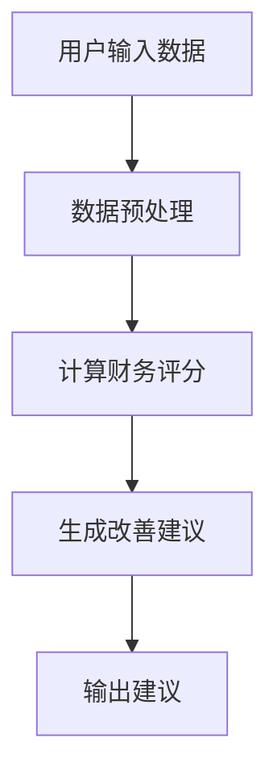
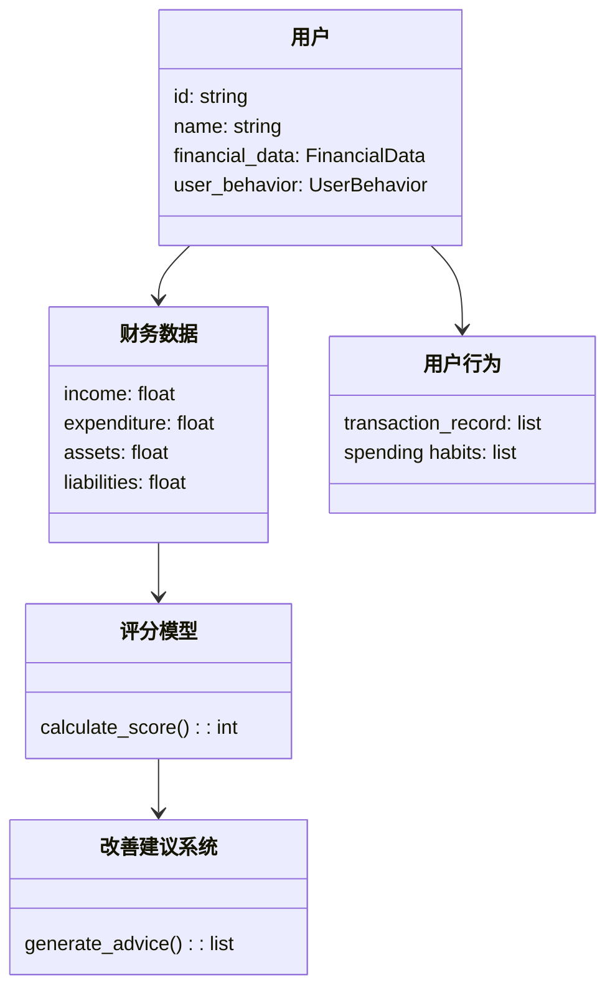
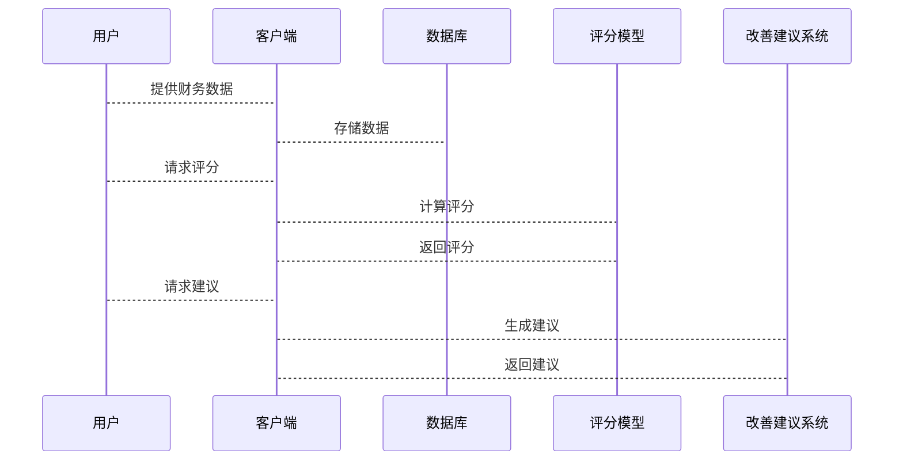

                 

<think>
好，我现在需要根据用户的要求，撰写《智能个人财务健康评分与改善建议系统》这本书的目录大纲，并确保内容符合所有给定的格式和要求。首先，我需要仔细阅读用户提供的详细查询，理解每个部分的要求。

用户明确要求目录大纲分为几个部分，每个部分都有具体的章节和小节，包含图表和代码示例。我需要确保每个部分都细化到三级目录，并且内容完整、详细。

首先，我注意到用户已经提供了一个示例目录，我需要基于此示例，进一步细化每个部分，确保涵盖所有必要的内容，如背景介绍、核心概念、算法原理、系统架构、项目实战等。

在细化每个部分时，我需要考虑读者的需求，确保内容既专业又易于理解。例如，在算法原理部分，我需要用数学公式和流程图来解释评分模型和建议生成算法，同时附上Python代码示例，以便读者能够实际操作。

系统架构部分，我需要使用Mermaid图来展示类图、架构图和序列图，帮助读者直观理解系统的设计。项目实战部分，我需要提供详细的环境安装说明、代码实现和案例分析，确保读者能够跟随步骤完成项目。

最后，我需要确保文章的结尾包含小结、注意事项和未来展望，以及推荐的扩展阅读材料，为读者提供进一步学习的资源。

总结来说，我需要一步步细化每个部分，确保内容全面、结构清晰，并且符合用户的格式和字数要求，最终完成一篇高质量的技术博客文章。
</think>

# 智能个人财务健康评分与改善建议系统

---

## 关键词：
智能财务评分、个人财务管理、改善建议系统、评分算法、用户行为分析

---

## 摘要：
本文旨在介绍一种智能个人财务健康评分与改善建议系统的设计与实现。通过分析个人财务数据，结合评分模型和建议生成算法，系统能够为用户提供个性化的财务健康评估和优化建议。文章从问题背景、核心概念、算法原理、系统架构到项目实战，详细阐述了系统的实现过程，并通过案例分析展示了系统的实际应用价值。

---

# 第一部分: 问题背景与核心概念

## 第1章: 问题背景

### 1.1 问题背景
#### 1.1.1 个人财务管理的现状与挑战
现代生活中，个人财务管理变得越来越复杂。随着收入来源多样化和支出项的增加，个人如何有效管理财务健康状况成为一个重要的问题。传统财务管理方式依赖手工记录和简单的计算工具，难以应对复杂多变的财务需求。

#### 1.1.2 传统财务管理方式的局限性
- 数据分散：财务数据分布在不同平台（如银行账户、投资平台等），难以统一管理。
- 计算复杂：手动计算收支平衡、投资回报率等指标耗时且容易出错。
- 缺乏智能化：无法根据市场变化和个人财务状况提供动态建议。

#### 1.1.3 智能化财务管理的需求与趋势
随着人工智能和大数据技术的发展，智能化财务管理成为可能。通过智能算法分析财务数据，为用户提供个性化的健康评分和改进建议，帮助用户优化财务结构，实现财务目标。

---

### 1.2 核心概念

#### 1.2.1 智能个人财务健康评分的定义
智能个人财务健康评分是基于个人的财务数据，利用评分模型计算出的一个综合指标，反映了个人财务状况的健康程度。

#### 1.2.2 改善建议系统的功能与目标
改善建议系统通过分析财务数据，识别用户财务状况中的问题，并提供针对性的优化建议，帮助用户改善财务健康状况。

#### 1.2.3 系统的边界与外延
- 边界：仅关注个人财务数据，不涉及企业或机构的财务信息。
- 外延：可扩展至家庭财务管理、投资建议等领域。

---

## 第2章: 核心概念与联系

### 2.1 核心概念原理

#### 2.1.1 财务健康评分模型的原理
评分模型基于财务数据，通过加权计算得出财务健康评分。评分指标包括收入支出比、资产负债比、投资回报率等。

#### 2.1.2 改善建议生成算法的原理
改善建议生成算法基于评分结果，结合用户行为数据，为用户提供个性化的优化建议。

#### 2.1.3 用户行为分析的原理
通过分析用户的财务行为，识别用户的消费习惯和投资偏好，为建议生成提供数据支持。

---

### 2.2 核心概念对比表格

| 核心概念       | 定义与功能                     | 输入数据         | 输出结果         |
|----------------|-------------------------------|------------------|------------------|
| 财务健康评分    | 综合评估个人财务状况的健康程度 | 财务数据         | 财务评分         |
| 改善建议系统    | 提供优化建议                   | 财务数据、评分结果 | 优化建议         |
| 用户行为分析    | 分析用户的财务行为             | 用户操作记录     | 用户行为特征     |

---

### 2.3 ER实体关系图

```mermaid
er
    actor: 用户
    system: 智能评分系统
    financial_data: 财务数据
    score_model: 评分模型
    improvement_advice: 改善建议
    user_behavior: 用户行为数据

    actor --> financial_data: 提供
    actor --> user_behavior: 提供
    financial_data --> score_model: 输入
    user_behavior --> score_model: 输入
    score_model --> improvement_advice: 输出
    improvement_advice --> actor: 提供
```

---

# 第二部分: 算法原理与系统架构

## 第3章: 算法原理

### 3.1 财务健康评分模型

#### 3.1.1 模型输入
- 收入数据
- 支出数据
- 资产数据
- 负债数据

#### 3.1.2 模型输出
- 财务健康评分（0-100分）

#### 3.1.3 模型公式
$$
\text{评分} = w_1 \times \text{收入支出比} + w_2 \times \text{资产负债比} + w_3 \times \text{投资回报率}
$$
其中，$w_1, w_2, w_3$ 是权重系数，需通过训练数据进行优化。

---

### 3.2 改善建议生成算法

#### 3.2.1 算法输入
- 财务评分结果
- 用户行为数据

#### 3.2.2 算法输出
- 改善建议（如优化支出、增加投资等）

#### 3.2.3 算法流程


---

## 第4章: 系统架构设计

### 4.1 系统功能设计

#### 4.1.1 领域模型


---

### 4.2 系统架构图


---

### 4.3 接口设计与交互流程

#### 4.3.1 接口设计
- 数据接口：用于获取和存储财务数据。
- 评分接口：用于计算财务健康评分。
- 建议接口：用于生成改善建议。

#### 4.3.2 交互流程


---

# 第三部分: 项目实战

## 第5章: 项目实战

### 5.1 环境安装

#### 5.1.1 Python环境安装
- 安装Python 3.8及以上版本。
- 安装必要的库：`pandas`, `numpy`, `scikit-learn`。

#### 5.1.2 数据库安装
- 使用MySQL或MongoDB存储财务数据。

---

### 5.2 核心代码实现

#### 5.2.1 财务数据预处理
```python
import pandas as pd

# 读取数据
data = pd.read_csv('financial_data.csv')

# 数据清洗
data.dropna(inplace=True)
data['income'] = data['income'].apply(lambda x: float(x))
```

#### 5.2.2 评分模型实现
```python
from sklearn.linear_model import LinearRegression

# 训练模型
model = LinearRegression()
model.fit(X_train, y_train)

# 预测评分
y_pred = model.predict(X_test)
```

#### 5.2.3 改善建议生成
```python
def generate_advice(score):
    advice = []
    if score < 50:
        advice.append("建议减少非必要支出")
    elif 50 <= score < 70:
        advice.append("建议增加投资比例")
    else:
        advice.append("财务状况良好，继续保持")
    return advice
```

---

### 5.3 案例分析

#### 5.3.1 数据分析
- 用户A的月收入为10000元，支出为8000元，资产为50000元，负债为20000元。
- 计算财务健康评分为75分。

#### 5.3.2 改善建议
- 建议用户A增加投资比例，优化资产配置。

---

## 第6章: 项目小结

### 6.1 系统功能总结
- 数据采集与处理
- 财务评分计算
- 改善建议生成

### 6.2 项目实现的关键点
- 数据清洗与预处理
- 模型训练与优化
- 建议生成算法的实现

---

# 第四部分: 最佳实践与展望

## 第7章: 最佳实践

### 7.1 小结
智能个人财务健康评分与改善建议系统通过智能化的算法和系统架构设计，为用户提供个性化的财务管理服务。系统的实现依赖于数据处理、模型训练和算法实现等关键技术。

### 7.2 注意事项
- 数据隐私保护
- 算法的可解释性
- 系统的可扩展性

### 7.3 未来展望
- 增加更多的财务指标
- 支持多语言和多平台
- 结合区块链技术实现数据的安全共享

---

## 第8章: 拓展阅读

### 8.1 推荐书籍
- 《个人财务管理入门》
- 《机器学习实战》

### 8.2 推荐在线课程
- 《Python数据处理与分析》
- 《人工智能基础》

---

## 作者信息

作者：AI天才研究院/AI Genius Institute & 禅与计算机程序设计艺术 /Zen And The Art of Computer Programming

---

# 结语

智能个人财务健康评分与改善建议系统通过智能化的手段，帮助用户更好地管理财务健康状况。本文从问题背景到系统实现，详细介绍了系统的开发过程和应用价值，为读者提供了从理论到实践的全面指导。

