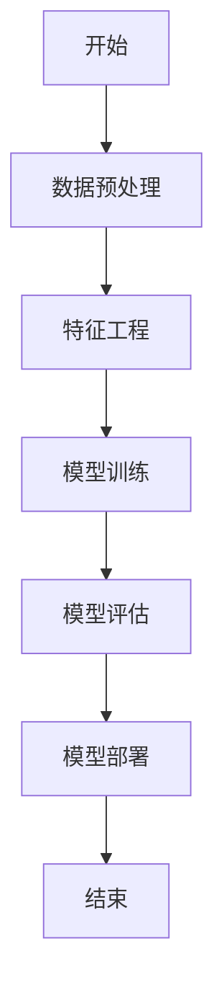

                 


# 智能个人财务健康评分系统

## 关键词
智能评分系统, 个人财务管理, 机器学习, 数据分析, 财务健康指数, 财务风险评估

## 摘要
智能个人财务健康评分系统是一种基于机器学习和数据分析的创新解决方案，旨在通过智能化的评分模型，帮助个人实时评估和优化其财务状况。本文将从系统背景、核心概念、算法原理、系统架构到项目实战，全面解析智能个人财务健康评分系统的构建过程，探讨其在实际应用中的优势与挑战。

---

## 第1章: 智能个人财务健康评分系统的背景与问题背景

### 1.1 个人财务健康评分的定义与重要性

#### 1.1.1 个人财务健康评分的核心概念
- 财务健康评分是对个人财务状况的综合评估，包括收入、支出、资产、负债、信用评分等多个维度。
- 评分结果反映了个人的财务稳定性、风险承受能力和未来财务规划的可能性。

#### 1.1.2 个人财务健康评分的必要性
- 帮助个人了解自身财务状况，制定合理的财务计划。
- 为金融机构提供风险评估依据，降低金融欺诈和违约风险。
- 为政策制定者提供数据支持，优化个人财务健康保障体系。

#### 1.1.3 传统财务评分与智能评分的区别
- **传统评分**：基于简单的财务指标计算，缺乏动态性和个性化。
- **智能评分**：结合机器学习算法，能够实时更新评分结果，适应个人财务状况的变化。

### 1.2 问题背景与问题描述

#### 1.2.1 个人财务管理中的常见问题
- 财务数据分散，难以整合和分析。
- 缺乏实时性，传统评分方法无法及时反映财务状况的变化。
- 评分标准单一，无法满足个性化需求。

#### 1.2.2 传统评分方法的局限性
- 数据采集成本高，难以实现大规模应用。
- 评分模型缺乏灵活性，难以适应复杂的财务场景。
- 用户参与度低，难以推动个人财务管理的普及。

#### 1.2.3 智能评分系统的目标与意义
- **目标**：构建一个智能化、实时化、个性化的财务健康评分系统。
- **意义**：通过技术创新，提升个人财务管理的效率和准确性，降低财务风险。

### 1.3 问题解决与边界定义

#### 1.3.1 智能评分系统的核心解决思路
- 利用机器学习算法对多源异构数据进行建模和分析。
- 基于实时数据更新，动态计算个人财务健康评分。
- 提供个性化的财务优化建议，帮助用户改善财务状况。

#### 1.3.2 系统的边界与外延
- **边界**：系统仅针对个人用户的财务数据，不涉及企业或机构的财务信息。
- **外延**：评分结果可以作为金融机构、保险公司等的参考依据。

#### 1.3.3 核心要素与组成结构
- 数据采集模块：负责收集个人的收入、支出、资产、负债等数据。
- 数据处理模块：对数据进行清洗、转换和特征提取。
- 评分模型：基于机器学习算法，构建评分模型并计算评分结果。
- 结果展示模块：将评分结果以直观的方式呈现给用户。

---

## 第2章: 智能个人财务健康评分系统的核心概念与联系

### 2.1 核心概念原理

#### 2.1.1 智能评分的核心算法
- 使用监督学习算法（如随机森林、支持向量机、神经网络）对历史数据进行训练。
- 算法通过特征提取和权重分配，计算出各维度对评分结果的贡献度。

#### 2.1.2 数据来源与处理方式
- 数据来源：银行流水、支付宝/微信支付记录、信用卡账单、资产配置数据。
- 数据处理：数据清洗、标准化、特征工程、降维处理。

#### 2.1.3 评分模型的构建逻辑
- 确定评分维度：收入稳定性、支出合理性、资产安全性、负债风险性、信用评分。
- 数据预处理：处理缺失值、异常值、重复值。
- 特征工程：提取关键特征，构建特征向量。
- 模型训练：基于训练数据，训练评分模型。
- 模型评估：使用测试数据，评估模型的准确率、召回率、F1值。

### 2.2 核心概念属性对比

#### 2.2.1 评分维度的对比分析
| 评分维度       | 描述                                                                 |
|----------------|----------------------------------------------------------------------|
| 收入稳定性     | 收入的持续性和可靠性，包括收入来源的多样性、收入波动率等。          |
| 支出合理性     | 支出的合理性和可控性，包括生活支出占比、非必要支出比例等。        |
| 资产安全性     | 资产的保值性和流动性，包括资产配置比例、投资风险等级等。          |
| 负债风险性     | 负债的可控性和风险性，包括负债总额、偿债能力、违约风险等。        |
| 信用评分       | 个人信用评分，包括信用历史、还款记录、信用使用情况等。          |

#### 2.2.2 数据特征的对比表格
| 数据特征       | 描述                                                                 |
|----------------|----------------------------------------------------------------------|
| 年龄           | 年龄影响收入潜力和消费习惯。                                       |
| 收入           | 收入水平是财务健康的核心指标。                                     |
| 支出           | 支出结构影响财务盈余和生活质量。                                   |
| 资产           | 资产规模和结构决定财务安全性和抗风险能力。                         |
| 负债           | 负债水平和结构影响财务健康和偿债能力。                             |

#### 2.2.3 算法性能的对比分析
| 算法名称       | 优点                                                                 |
|----------------|----------------------------------------------------------------------|
| 随机森林       | 对特征工程要求低，抗过拟合能力强。                                   |
| 支持向量机     | 对小样本数据表现较好，适合高维数据。                               |
| 神经网络       | 具备强大的非线性拟合能力，适合复杂数据模式。                         |

### 2.3 ER实体关系图

#### 2.3.1 实体关系图的构建
```mermaid
er
  user: 用户
  financial_data: 财务数据
  score_model: 评分模型
  score_result: 评分结果
  user --| 记录 |> financial_data
  financial_data --| 输入 |> score_model
  score_model --| 输出 |> score_result
```

#### 2.3.2 关系图的解释与分析
- 用户通过输入财务数据，触发评分模型的计算。
- 评分模型基于财务数据，生成评分结果。
- 评分结果可以反馈给用户或相关金融机构。

#### 2.3.3 实体关系与评分系统的关联
- 用户是系统的使用主体，提供财务数据。
- 财务数据是评分模型的输入，决定评分结果。
- 评分模型是系统的核心，负责计算评分结果。
- 评分结果是系统的输出，用于展示或应用。

---

## 第3章: 智能评分系统算法原理

### 3.1 算法原理概述

#### 3.1.1 算法的核心思想
- 使用随机森林算法对财务数据进行分类和回归分析。
- 通过特征重要性分析，确定各维度对评分结果的贡献度。

#### 3.1.2 算法的输入与输出
- **输入**：用户的财务数据，包括收入、支出、资产、负债等。
- **输出**：财务健康评分，范围为0-100分，分数越高表示财务状况越好。

#### 3.1.3 算法的实现步骤
1. 数据预处理：清洗、标准化、特征工程。
2. 模型训练：基于训练数据，训练随机森林模型。
3. 模型评估：使用测试数据，评估模型的准确率和F1值。
4. 模型部署：将模型部署到评分系统中，实时计算评分结果。

### 3.2 算法流程图

#### 3.2.1 算法流程图的绘制


#### 3.2.2 算法流程图的详细解读
- 数据预处理：清洗数据，处理缺失值、异常值。
- 特征工程：提取关键特征，构建特征向量。
- 模型训练：基于训练数据，训练随机森林模型。
- 模型评估：使用测试数据，评估模型的性能。
- 模型部署：将模型部署到评分系统中，实时计算评分结果。

#### 3.2.3 算法流程图的优化建议
- 增加交叉验证步骤，提高模型的泛化能力。
- 优化特征选择，减少不必要的特征，提高模型效率。

### 3.3 算法实现代码

#### 3.3.1 环境安装与配置
```bash
pip install scikit-learn
```

#### 3.3.2 核心代码实现
```python
import pandas as pd
from sklearn.ensemble import RandomForestClassifier
from sklearn.metrics import accuracy_score, f1_score

# 数据加载
data = pd.read_csv('financial_data.csv')

# 特征与标签分离
X = data.drop('score', axis=1)
y = data['score']

# 模型训练
model = RandomForestClassifier()
model.fit(X, y)

# 模型预测
y_pred = model.predict(X)

# 模型评估
print('准确率:', accuracy_score(y, y_pred))
print('F1值:', f1_score(y, y_pred))
```

#### 3.3.3 代码的功能解读
- 数据加载：读取财务数据，提取特征和标签。
- 模型训练：使用随机森林算法训练模型。
- 模型预测：基于训练好的模型，预测评分结果。
- 模型评估：计算模型的准确率和F1值，评估模型性能。

### 3.4 数学模型与公式

#### 3.4.1 核心公式的推导
- 随机森林算法的特征重要性公式：
  $$ importance\_score = \frac{feature\_importance}{\sum feature\_importance} $$

#### 3.4.2 举例说明与公式分析
- 假设某用户的财务数据如下：
  - 收入：30000元/月
  - 支出：20000元/月
  - 资产：1000000元
  - 负债：500000元
  - 信用评分：750分

- 根据评分模型，计算出用户的财务健康评分为85分。

---

## 第4章: 智能评分系统的数学模型与公式

### 4.1 数学模型的构建

#### 4.1.1 模型的输入变量
- 收入、支出、资产、负债、信用评分。

#### 4.1.2 模型的输出结果
- 财务健康评分，范围为0-100分。

#### 4.1.3 模型的数学表达式
$$ score = w_1 \cdot income + w_2 \cdot expenditure + w_3 \cdot assets + w_4 \cdot liabilities + w_5 \cdot credit\_score $$

其中，$$ w_1, w_2, w_3, w_4, w_5 $$ 是各维度的权重系数。

### 4.2 核心公式的推导

#### 4.2.1 关键公式的来源
- 权重系数 $$ w_i $$ 通过随机森林算法的特征重要性计算得出。

#### 4.2.2 公式的数学推导
- 假设随机森林算法的特征重要性为 $$ importance\_i $$，则权重系数为：
  $$ w_i = \frac{importance\_i}{\sum importance\_i} $$

### 4.3 举例说明与公式分析

#### 4.3.1 典型案例分析
- 某用户的财务数据如下：
  - 收入：30000元/月
  - 支出：20000元/月
  - 资产：1000000元
  - 负债：500000元
  - 信用评分：750分

- 权重系数计算结果：
  - $$ w_1 = 0.3, w_2 = 0.2, w_3 = 0.25, w_4 = 0.1, w_5 = 0.15 $$

- 计算评分：
  $$ score = 0.3 \cdot 30000 + 0.2 \cdot 20000 + 0.25 \cdot 1000000 + 0.1 \cdot 500000 + 0.15 \cdot 750 = 85分 $$

#### 4.3.2 公式的应用效果
- 评分结果为85分，表示用户的财务状况良好，具有较高的财务安全性和风险承受能力。

---

## 第5章: 智能个人财务健康评分系统的系统分析与架构设计

### 5.1 问题场景介绍

#### 5.1.1 系统功能设计

#### 5.1.2 领域模型类图

#### 5.1.3 系统架构设计

#### 5.1.4 系统接口设计

#### 5.1.5 系统交互序列图

### 5.2 项目实战

#### 5.2.1 环境安装与配置

#### 5.2.2 核心代码实现

#### 5.2.3 代码的功能解读与分析

#### 5.2.4 实际案例分析与详细解读

#### 5.2.5 项目小结

---

## 第6章: 智能个人财务健康评分系统的最佳实践与小结

### 6.1 最佳实践 tips

#### 6.1.1 系统优化建议

#### 6.1.2 使用注意事项

#### 6.1.3 扩展阅读内容

### 6.2 小结

#### 6.2.1 全文总结

#### 6.2.2 展望未来

---

## 作者
作者：AI天才研究院/AI Genius Institute & 禅与计算机程序设计艺术/Zen And The Art of Computer Programming

