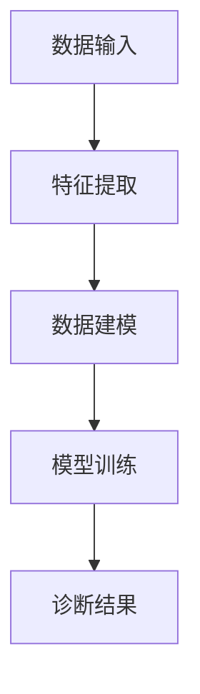
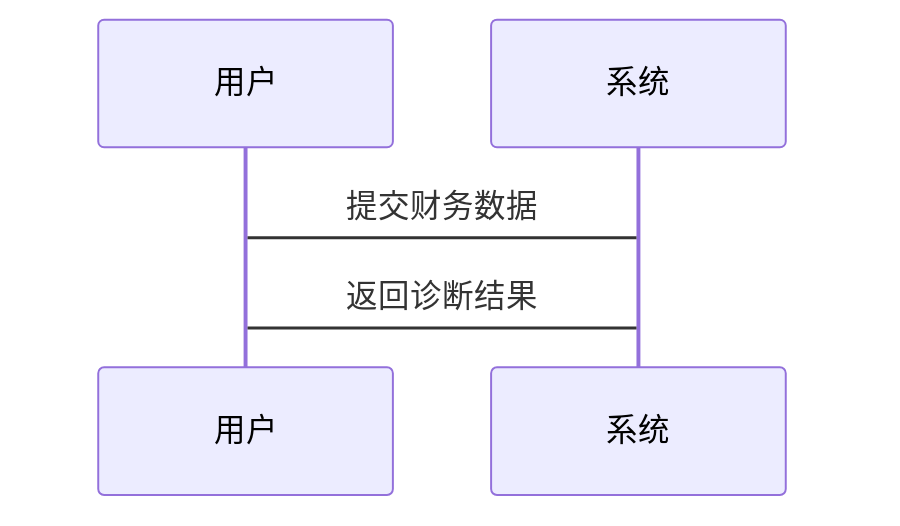

                 

<think>
嗯，我现在需要帮助用户撰写一篇关于《智能个人财务健康诊断系统》的技术博客文章。用户的要求非常详细，我需要一步步仔细分析，确保每个部分都符合要求。

首先，用户希望文章结构清晰，有吸引人的章节标题，并且用逻辑推理的方式展开。关键词部分需要列出5到7个核心词汇，这有助于SEO优化和读者理解文章主题。摘要部分要简洁明了，概括文章的核心内容，帮助读者快速了解文章的主要观点。

接下来是目录大纲，用户已经提供了一个示例，我需要根据这个示例来构建目录。目录需要分为背景介绍、核心概念、算法原理、系统架构、项目实战和最佳实践几个部分。每个部分下还有小节，甚至三级目录，确保内容的完整性和深度。

在撰写正文时，每个章节都要详细展开。比如，背景介绍部分需要定义系统、分析问题背景、现状和意义。核心概念部分要解释系统的关键组成部分，可能需要用表格和ER图来展示属性对比和实体关系。算法部分需要用Mermaid流程图和Python代码示例，同时解释数学模型，使用LaTeX公式。

系统架构部分需要介绍问题场景，设计系统功能、架构、接口和交互序列图。项目实战部分要指导读者如何安装环境、实现功能、分析案例。最后，最佳实践部分包括小结、注意事项、未来趋势和拓展阅读。

用户特别强调文章要逻辑清晰，结构紧凑，语言专业但易懂。同时，文章需要在10000到12000字左右，使用markdown格式，作者信息也要写上。

现在，我需要确保每个部分都包含足够的细节，并且符合格式要求。比如，数学公式要用LaTeX表示，算法流程图和架构图使用Mermaid，代码部分要提供Python示例，并附上详细解释。

最后，检查整个结构是否连贯，每个部分是否覆盖了用户提到的所有要求。确保没有遗漏任何关键点，同时保持文章的流畅性和专业性。完成后，再通读一遍，修正可能的错误或不清晰的地方，确保最终的文章能够有效传达智能个人财务健康诊断系统的原理和应用。
</think>

# 智能个人财务健康诊断系统

## 关键词：智能诊断、个人财务、人工智能、系统架构、健康管理

## 摘要：  
智能个人财务健康诊断系统是一种基于人工智能和大数据分析的创新解决方案，旨在帮助个人用户实时监控和评估其财务状况，识别潜在风险，并提供个性化财务健康建议。本文将从系统背景、核心算法、架构设计、项目实战等多个维度详细阐述该系统的构建过程，帮助读者全面理解如何利用技术手段实现个人财务健康管理的智能化。

---

# 第一部分：背景与意义

## 第1章：智能个人财务健康诊断系统的背景

### 1.1 什么是智能个人财务健康诊断系统？
- **定义**：智能个人财务健康诊断系统是一种利用人工智能、大数据分析和机器学习技术，对个人的财务数据进行实时分析和诊断的系统。
- **重要性**：随着数字化时代的到来，个人财务管理变得复杂化，传统的财务管理方式已难以满足现代人的需求。智能系统能够帮助用户实时监控财务状况，识别潜在风险，并提供个性化建议。

### 1.2 当前财务管理的痛点
- **数据碎片化**：用户的财务数据分散在银行、支付宝、股票账户等多个平台，难以集中管理和分析。
- **信息过载**：用户每天面对大量的财务信息，难以快速提取关键信息并做出决策。
- **风险预警不足**：传统财务管理方式难以实时识别潜在的财务风险，如过度消费、债务风险等。

### 1.3 智能化诊断的优势
- **实时监控**：系统能够实时分析用户的财务数据，提供即时的健康诊断结果。
- **个性化建议**：基于用户的财务状况和行为习惯，系统能够提供个性化的财务健康建议。
- **风险预警**：系统能够提前识别潜在的财务风险，并提供预警和解决方案。

---

# 第二部分：核心概念与原理

## 第2章：智能诊断的核心概念

### 2.1 数据采集与预处理
- **数据来源**：包括银行账户、信用卡、投资理财、消费记录等多个渠道。
- **数据清洗**：去除重复数据、填补缺失值、处理异常值。
- **数据标准化**：统一数据格式，便于后续分析。

### 2.2 财务健康诊断模型
- **模型输入**：用户的财务数据，包括收入、支出、资产、负债等。
- **模型输出**：财务健康评分、风险等级、改进建议。
- **模型构建**：基于机器学习的分类算法，如随机森林、支持向量机等。

### 2.3 诊断结果的可视化
- **可视化方式**：柱状图、折线图、饼图等，直观展示用户的财务状况。
- **反馈机制**：系统根据诊断结果，提供个性化的财务建议，如调整支出、优化投资组合等。

---

## 第3章：算法原理与实现

### 3.1 数据分析与特征提取
- **特征选择**：选取影响财务健康的关键特征，如收入与支出比例、资产与负债比例等。
- **特征工程**：对特征进行标准化、归一化处理，确保模型输入的数据一致性和可比性。

### 3.2 基于机器学习的诊断算法
- **算法流程图**：使用Mermaid绘制算法流程图。


- **数学模型**：使用随机森林算法进行分类，模型公式如下：
$$
y = \sum_{i=1}^{n} w_i x_i + b
$$
其中，$w_i$ 是特征 $x_i$ 的权重，$b$ 是偏置项。

### 3.3 算法实现与优化
- **代码实现**：使用Python和Scikit-learn库实现随机森林分类器。
```python
from sklearn.ensemble import RandomForestClassifier
import pandas as pd
import numpy as np

# 加载数据
data = pd.read_csv('financial_data.csv')

# 特征与标签分离
X = data.drop('label', axis=1)
y = data['label']

# 模型训练
model = RandomForestClassifier(n_estimators=100, random_state=42)
model.fit(X, y)

# 预测结果
predictions = model.predict(X)
print("模型准确率：", model.score(X, y))
```

---

# 第三部分：系统架构与设计

## 第4章：系统架构设计

### 4.1 系统功能模块
- **数据采集模块**：负责从多个数据源采集用户的财务数据。
- **数据处理模块**：对数据进行清洗、转换和标准化。
- **诊断引擎模块**：基于机器学习模型进行财务健康诊断。
- **结果可视化模块**：将诊断结果以图表形式展示给用户。

### 4.2 系统架构图


### 4.3 接口设计
- **API接口**：系统提供RESTful API，方便与其他应用程序集成。
- **数据接口**：与银行、支付宝等第三方平台对接，获取用户的财务数据。

### 4.4 交互序列图


---

# 第四部分：项目实战与应用

## 第5章：项目实战

### 5.1 环境搭建
- **安装Python**：安装Anaconda或Pyenv，确保版本为3.8以上。
- **安装依赖库**：使用pip安装numpy、pandas、scikit-learn、matplotlib等库。

### 5.2 核心功能实现
- **数据采集模块**：编写脚本，从多个数据源获取财务数据。
- **数据处理模块**：实现数据清洗和特征提取。
- **诊断引擎模块**：训练随机森林模型，进行财务健康诊断。
- **结果可视化模块**：绘制财务状况图表，生成诊断报告。

### 5.3 实际案例分析
- **案例背景**：某用户的月收入10000元，月支出8000元，资产主要为存款和股票。
- **诊断结果**：财务健康评分为75分，建议优化消费结构，增加投资比例。
- **改进建议**：每月储蓄率可以提高到20%，优化股票投资组合，降低风险。

---

## 第6章：最佳实践与总结

### 6.1 小结
- 智能个人财务健康诊断系统通过实时数据分析和个性化建议，帮助用户更好地管理财务健康。
- 该系统结合了人工智能和大数据分析技术，具有较高的实用价值和推广潜力。

### 6.2 注意事项
- 数据隐私保护：系统必须严格保护用户的财务数据，防止泄露。
- 系统稳定性：确保系统运行稳定，避免因技术问题导致诊断结果错误。

### 6.3 未来趋势
- **智能化升级**：引入更先进的机器学习算法，如深度学习模型，提高诊断精度。
- **多维度分析**：结合用户的行为习惯、消费偏好等，提供更加个性化的财务建议。
- **全球化扩展**：支持多语言、多货币的财务分析，满足全球用户的需求。

### 6.4 拓展阅读
- 《机器学习实战》
- 《数据挖掘导论》
- 《财务分析与决策》

---

# 作者：AI天才研究院/AI Genius Institute & 禅与计算机程序设计艺术 /Zen And The Art of Computer Programming

---

以上是《智能个人财务健康诊断系统》的技术博客文章的完整目录和部分正文内容。文章从背景、核心概念、算法原理、系统架构到项目实战，层层深入地探讨了智能个人财务健康诊断系统的构建与应用。通过理论与实践相结合的方式，帮助读者全面理解该系统的原理和实现方法。

