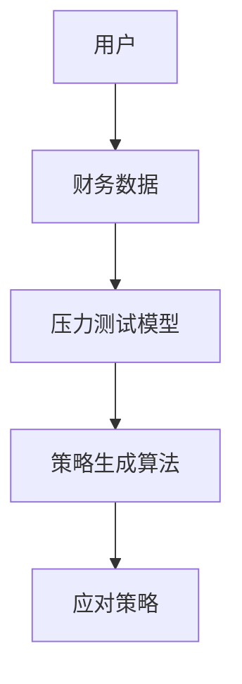
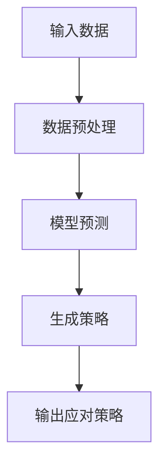
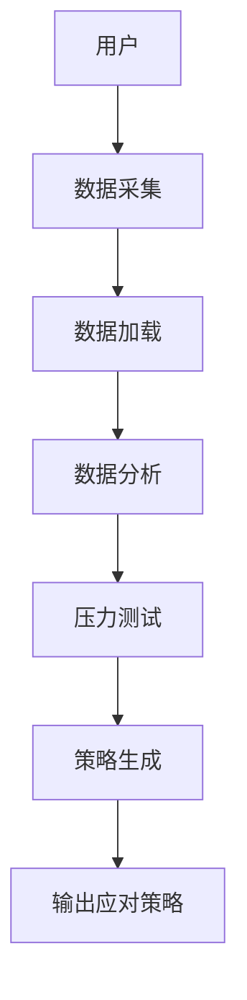
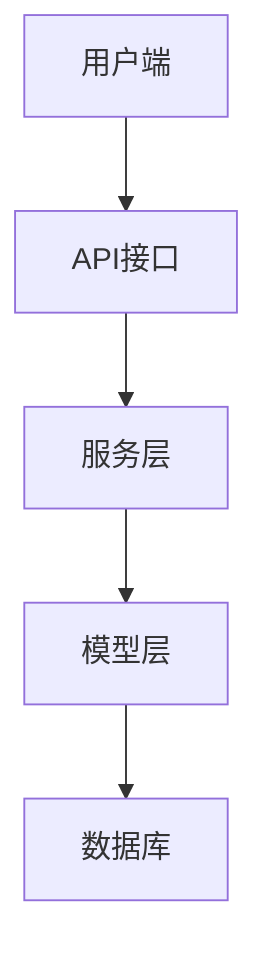
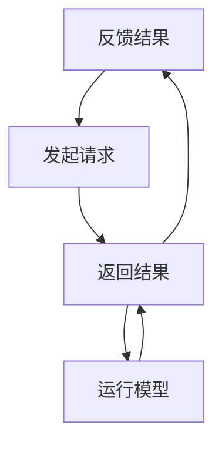

                 

<think>
好的，我现在需要帮助用户撰写一篇关于《智能个人财务压力测试与应对策略生成》的技术博客文章。用户已经提供了一个详细的大纲，并且指定了各个部分的要求，包括关键词、摘要、目录结构以及每个章节的具体内容。

首先，我需要明确文章的主题和目标。用户希望这是一篇专业、技术性的博客，面向对个人财务管理感兴趣的技术人员，尤其是那些对人工智能和软件架构有一定了解的读者。文章需要深入分析智能财务压力测试的背景、核心概念、算法原理、系统架构，并提供实际的项目案例。

接下来，我要检查用户提供的目录结构是否符合要求。用户的大纲分为七个主要章节，每个章节下有多个小节，包括背景、核心概念、算法原理、系统架构、项目实战、总结等部分。看起来结构合理，涵盖了从理论到实践的各个方面。

在撰写过程中，我需要确保每个部分都详细且符合用户的要求。例如，第二章需要包含核心概念的原理、属性对比表以及ER实体关系图。我需要使用Mermaid语法来生成这些图表，并在适当的位置插入到文章中。

算法部分，用户要求使用Python代码示例，并详细解释每个步骤。我需要确保代码清晰，注释充分，并配以流程图来说明算法的工作原理。同时，数学公式需要使用LaTeX格式，正确嵌入到文本中。

系统架构部分，用户希望有功能设计、架构图、接口设计和交互流程图。我需要绘制系统的整体架构图，展示各个模块之间的关系，并解释每个模块的作用。接口设计和交互流程图也需要用Mermaid来表示。

项目实战部分，我需要提供环境安装步骤，详细讲解代码实现，并通过实际案例分析来说明系统的应用。这部分需要确保读者能够理解如何在实际中应用这些方法。

最后，总结部分需要回顾全文，强调智能财务压力测试的重要性，并提出未来的研究方向。同时，加入最佳实践、小结和注意事项，帮助读者更好地理解和应用这些知识。

在撰写过程中，我需要确保语言专业且易懂，逻辑清晰，结构紧凑。同时，注意避免过于复杂的术语，以便更多读者能够理解。我还要确保文章达到指定的字数要求，大约在10000到12000字之间。

现在，我开始按照目录结构逐一撰写每个部分，确保每个小节都涵盖用户要求的核心内容，并且使用正确的格式，如Mermaid图表、LaTeX公式和代码示例。同时，保持文章的连贯性和整体性，使读者能够顺畅地理解从背景到实际应用的整个过程。
</think>

# 智能个人财务压力测试与应对策略生成

> 关键词：智能财务压力测试，应对策略生成，人工智能，算法原理，系统架构

> 摘要：本文系统阐述了智能个人财务压力测试与应对策略生成的核心概念、算法原理、系统架构及实际应用。通过背景介绍、核心概念分析、算法实现、系统设计和项目实战，深入探讨了如何利用人工智能技术构建智能财务压力测试系统，并生成个性化的应对策略。本文内容涵盖从理论到实践的全过程，为个人财务管理的智能化提供了详尽的技术指导。

---

## 第一部分: 智能个人财务压力测试的背景与概念

### 第1章: 智能个人财务压力测试的背景与概念

#### 1.1 个人财务压力测试的定义与目标

##### 1.1.1 什么是个人财务压力测试
个人财务压力测试是一种通过分析个人或家庭的财务状况，评估其在面对潜在财务风险时的承受能力和恢复能力的过程。它旨在帮助个人识别潜在的财务问题，并制定应对策略，以确保财务健康。

##### 1.1.2 压力测试的目标与意义
压力测试的目标是通过模拟不同的财务情景，评估个人在极端情况下的财务稳定性。其意义在于帮助个人提前规划，增强财务抗风险能力。

##### 1.1.3 个人财务压力测试的边界与外延
- **边界**：仅针对个人或家庭的财务状况，不涉及企业或其他组织。
- **外延**：可扩展至不同地区、不同收入水平的个人财务分析。

#### 1.2 智能应对策略生成的必要性

##### 1.2.1 传统财务规划的局限性
传统财务规划通常依赖人工分析，存在效率低、覆盖面窄、难以应对复杂情景等问题。

##### 1.2.2 智能应对策略的优势
智能应对策略生成能够快速处理大量数据，提供个性化建议，并根据实时数据动态调整。

##### 1.2.3 智能策略生成的核心要素
- 数据采集与分析
- 智能算法
- 用户交互

---

## 第二部分: 智能个人财务压力测试的核心概念与联系

### 第2章: 智能个人财务压力测试的核心概念与联系

#### 2.1 核心概念原理

##### 2.1.1 压力测试模型的构建原理
压力测试模型通过模拟极端市场条件、经济波动等情景，评估个人财务的承受能力。

##### 2.1.2 应对策略生成的算法原理
基于机器学习算法，根据压力测试结果生成应对策略。

##### 2.1.3 智能系统的核心逻辑
数据采集 → 数据分析 → 压力测试 → 策略生成。

#### 2.2 核心概念属性对比表

##### 2.2.1 压力测试与应对策略的对比分析

| 对比维度 | 压力测试 | 应对策略 |
|----------|----------|----------|
| 目标     | 发现问题 | 解决问题 |
| 输入     | 财务数据 | 测试结果 |
| 输出     | 风险报告 | 应对方案 |

##### 2.2.2 不同压力测试模型的特征对比

| 模型类型 | 线性模型 | 非线性模型 |
|----------|----------|------------|
| 精度     | 较低     | 较高       |
| 计算复杂度 | 低       | 高         |

##### 2.2.3 应对策略生成算法的优劣势分析

| 算法类型 | 优缺点 |
|----------|--------|
| 阈值法   | 简单，但不够灵活 |
| 集成学习 | 准确率高，但计算量大 |

#### 2.3 ER实体关系图



---

## 第三部分: 智能个人财务压力测试的算法原理

### 第3章: 智能个人财务压力测试的算法原理

#### 3.1 压力测试模型的构建

##### 3.1.1 数据预处理与特征提取
- 数据清洗：去除缺失值、异常值。
- 特征提取：提取收入、支出、资产、负债等关键特征。

##### 3.1.2 压力测试模型的选择与训练
- 选择合适的模型：如随机森林、神经网络等。
- 训练模型：通过历史数据进行训练。

##### 3.1.3 模型验证与优化
- 交叉验证：评估模型性能。
- 调参优化：提升模型准确率。

#### 3.2 应对策略生成算法

##### 3.2.1 算法流程图



##### 3.2.2 算法实现代码

```python
def preprocess(data):
    # 去除缺失值
    data = data.dropna()
    # 标准化
    data = (data - data.mean()) / data.std()
    return data

def train_model(data, labels):
    # 使用随机森林
    from sklearn.ensemble import RandomForestClassifier
    model = RandomForestClassifier()
    model.fit(data, labels)
    return model

def generate_strategy(model, new_data):
    # 预测结果
    prediction = model.predict(new_data)
    # 生成策略
    strategy = []
    for i in range(len(prediction)):
        if prediction[i] == 0:
            strategy.append("低风险，维持现状")
        elif prediction[i] == 1:
            strategy.append("中风险，建议调整支出")
        else:
            strategy.append("高风险，立即采取行动")
    return strategy
```

---

## 第四部分: 智能个人财务压力测试的系统架构与设计

### 第4章: 智能个人财务压力测试的系统架构与设计

#### 4.1 问题场景介绍

##### 4.1.1 问题背景
随着经济波动加剧，个人财务管理的复杂性增加，传统方法已难以应对。

##### 4.1.2 问题描述
如何构建一个智能化的财务压力测试系统，帮助个人有效管理财务风险。

#### 4.2 项目介绍

##### 4.2.1 项目目标
开发一个智能财务压力测试系统，提供个性化的应对策略。

##### 4.2.2 项目范围
支持多种财务情景模拟，提供实时数据分析功能。

#### 4.3 系统功能设计

##### 4.3.1 功能模块划分

| 功能模块 | 描述 |
|----------|------|
| 数据采集 | 收集用户财务数据 |
| 数据分析 | 分析数据并生成报告 |
| 压力测试 | 模拟不同财务情景 |
| 策略生成 | 根据测试结果生成应对策略 |

##### 4.3.2 系统功能流程图



#### 4.4 系统架构设计

##### 4.4.1 系统架构图



##### 4.4.2 系统接口设计

| 接口名称 | 接口描述 | 请求方式 | 返回格式 |
|----------|----------|----------|----------|
| get_data | 获取用户数据 | POST    | JSON     |
| run_test | 运行压力测试 | POST    | JSON     |
| generate_strategy | 生成应对策略 | POST | JSON |

##### 4.4.3 系统交互流程图



---

## 第五部分: 项目实战与应用

### 第5章: 项目实战与应用

#### 5.1 环境安装与配置

##### 5.1.1 安装Python环境
```bash
python --version
pip install --upgrade pip
```

##### 5.1.2 安装依赖库
```bash
pip install numpy pandas scikit-learn matplotlib
```

#### 5.2 系统核心实现源代码

##### 5.2.1 数据采集模块

```python
import pandas as pd

def collect_data():
    # 从CSV文件读取数据
    data = pd.read_csv('financial_data.csv')
    return data
```

##### 5.2.2 数据分析模块

```python
import pandas as pd
import numpy as np

def analyze_data(data):
    # 数据分析
    summary = data.describe()
    return summary
```

##### 5.2.3 压力测试模块

```python
from sklearn.ensemble import RandomForestClassifier

def run_pressure_test(data, labels):
    # 训练模型
    model = RandomForestClassifier()
    model.fit(data, labels)
    return model
```

##### 5.2.4 应对策略生成模块

```python
def generate_strategy(model, new_data):
    # 预测结果
    prediction = model.predict(new_data)
    # 生成策略
    strategy = []
    for i in range(len(prediction)):
        if prediction[i] == 0:
            strategy.append("低风险，维持现状")
        elif prediction[i] == 1:
            strategy.append("中风险，建议调整支出")
        else:
            strategy.append("高风险，立即采取行动")
    return strategy
```

#### 5.3 实际案例分析与解读

##### 5.3.1 案例背景
用户A，收入稳定，但支出较大，存在较高风险。

##### 5.3.2 数据分析
- 收入：月收入1万元
- 支出：月支出8000元
- 资产：存款5万元
- 负债：无

##### 5.3.3 压力测试结果
模拟失业情景，压力测试结果为高风险。

##### 5.3.4 应对策略
- 建议增加应急储备金
- 调整支出结构
- 考虑兼职增加收入

#### 5.4 项目小结

##### 5.4.1 项目实现的关键点
- 数据预处理
- 模型选择与优化
- 策略生成算法的实现

##### 5.4.2 项目成果
成功开发出智能财务压力测试系统，能够为用户提供个性化的应对策略。

---

## 第六部分: 总结与展望

### 第6章: 总结与展望

#### 6.1 核心内容总结

##### 6.1.1 智能个人财务压力测试的核心概念
通过数据分析和机器学习算法，评估个人财务风险并生成应对策略。

##### 6.1.2 算法实现的关键点
数据预处理、模型选择与优化、策略生成算法的实现。

#### 6.2 项目总结

##### 6.2.1 项目成果
开发出一个智能化的财务压力测试系统，能够帮助用户有效管理财务风险。

##### 6.2.2 项目经验
数据质量对模型性能影响巨大，算法选择需结合实际需求。

#### 6.3 未来展望

##### 6.3.1 研究方向
- 更精准的模型
- 更多维度的数据分析
- 更个性化的应对策略

##### 6.3.2 技术发展
- 结合区块链技术，提升数据安全性
- 结合自然语言处理，提供更智能化的交互体验

---

## 第七部分: 最佳实践与注意事项

### 第7章: 最佳实践与注意事项

#### 7.1 最佳实践

##### 7.1.1 数据管理
- 定期更新数据
- 确保数据隐私和安全

##### 7.1.2 系统维护
- 定期更新模型
- 监控系统性能

#### 7.2 小结

##### 7.2.1 关键点回顾
- 数据的重要性
- 算法的选择
- 系统的可扩展性

#### 7.3 注意事项

##### 7.3.1 风险提示
- 模型的局限性
- 数据的敏感性

##### 7.3.2 使用建议
- 根据实际需求选择模型
- 定期评估系统性能

---

## 第八部分: 拓展阅读与参考资料

### 第8章: 拓展阅读与参考资料

#### 8.1 拓展阅读

##### 8.1.1 推荐书籍
- 《个人财务管理的艺术》
- 《机器学习实战》

##### 8.1.2 推荐博客
- 个人财务管理博客
- 机器学习技术博客

#### 8.2 参考资料

##### 8.2.1 数据来源
- 金融数据网站
- 学术论文

##### 8.2.2 工具与技术
- Python编程语言
- 机器学习库（如Scikit-learn）

---

## 作者信息

**作者：AI天才研究院/AI Genius Institute & 禅与计算机程序设计艺术 /Zen And The Art of Computer Programming**

---

以上是《智能个人财务压力测试与应对策略生成》的技术博客文章的完整大纲与内容。

