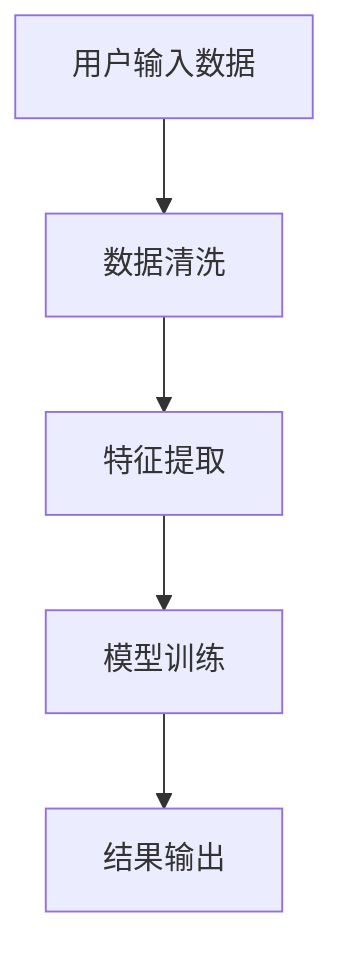
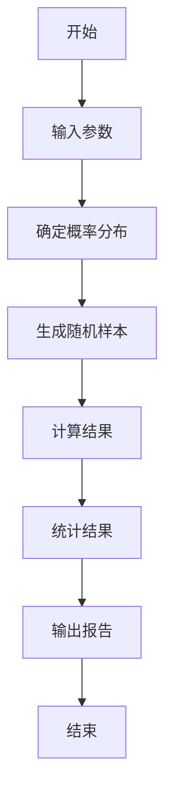
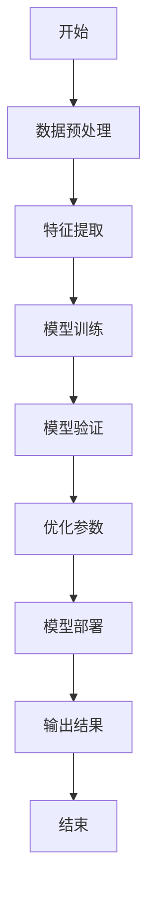
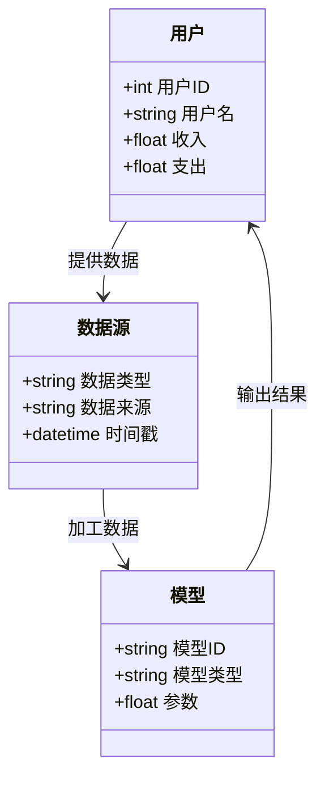
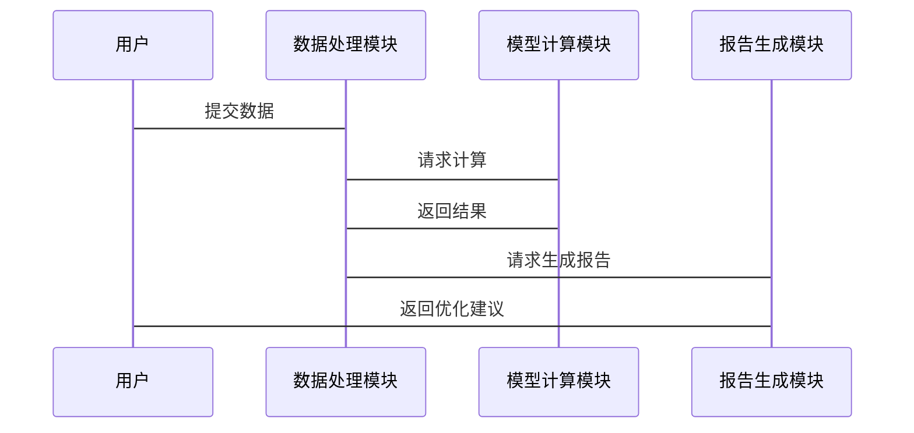

                 

<think>
嗯，用户让我设计一本名为《智能个人财务压力测试工具》的书籍目录大纲。首先，我需要理解这本书的主题是什么。看起来这本书是关于使用人工智能技术来帮助个人进行财务压力测试的工具开发。

用户的要求很详细，目录需要分为多个部分，每个部分有章节和小节，甚至三级目录。我需要确保每个部分都有足够的细节，同时保持逻辑清晰和结构紧凑。首先，我应该从背景介绍开始，让读者了解为什么需要这样的工具。

接下来，核心概念部分需要解释压力测试框架的组成，包括输入数据、测试模型和输出结果。可能还需要一些图表，比如ER图来展示实体关系。然后是算法部分，用户要求用mermaid流程图和Python代码来详细讲解。我需要选择适合压力测试的算法，比如蒙特卡洛模拟，并展示其流程图和代码示例。

系统架构部分需要介绍项目结构、功能模块，并用类图和序列图展示系统的交互。项目实战部分要包括环境安装、核心代码实现和案例分析，让读者能够实际操作。最后，最佳实践部分总结经验和注意事项，可能还包括一些扩展阅读的内容。

整个过程需要一步步展开，确保每个部分都详细且有条理。同时，要满足用户的要求，目录总字数控制在2000字以内，所以每个章节的内容需要简洁明了，重点突出。

在思考过程中，我可能会遗漏一些关键点，比如是否需要包括用户界面设计或数据安全问题。但根据用户提供的示例，似乎重点放在算法和系统架构上，所以暂时不考虑这些方面。

总之，我需要从背景、核心概念、算法、系统架构、项目实战到最佳实践，逐步展开，确保每个部分都详细且有条理。这样，用户才能根据这个目录大纲写出一本内容全面、结构清晰的技术书籍。
</think>

# 《智能个人财务压力测试工具》

---

## 关键词：
- 智能财务压力测试
- 人工智能
- 个人财务管理
- 数字化工具
- 财务风险评估

---

## 摘要：
本文将详细探讨智能个人财务压力测试工具的设计与实现。通过结合人工智能技术和财务数据分析，本文将揭示如何利用智能算法对个人财务状况进行压力测试，帮助用户识别潜在风险并优化财务决策。文章将从背景、核心概念、算法原理、系统架构到项目实战进行深入分析，最终总结最佳实践和未来发展方向。

---

# 第一部分：智能个人财务压力测试工具的背景与核心概念

---

## 第1章：个人财务压力测试的背景与需求

### 1.1 个人财务健康的重要性

#### 1.1.1 个人财务健康的核心要素
- 收入来源：工资、投资收益、其他收入
- 支出结构：生活开支、债务还款、储蓄与投资
- 资产状况：可支配资产、固定资产、金融资产
- 债务情况：短期债务、长期债务、债务偿还能力

#### 1.1.2 财务压力对个人生活的影响
- 影响生活质量：高债务负担可能导致生活质量下降
- 影响职业发展：财务压力可能影响职业选择和职业稳定性
- 影响心理健康：过度的财务压力可能导致焦虑和抑郁

#### 1.1.3 数字化时代的财务健康管理
- 数据驱动的财务管理：通过数据分析优化财务决策
- AI技术的应用：利用机器学习算法预测财务风险
- 数字化工具的优势：提高效率、降低成本、增强可及性

---

### 1.2 财务压力测试的定义与目标

#### 1.2.1 财务压力测试的基本概念
- 定义：通过模拟极端市场条件或个人财务变化，测试个人财务状况的稳健性
- 目的：评估个人在不同压力情景下的财务承受能力
- 核心问题：在极端情况下，个人能否维持基本生活需求并履行财务义务

#### 1.2.2 压力测试的目标与应用场景
- 目标：
  - 识别潜在财务风险
  - 评估财务缓冲能力
  - 提供优化建议
- 应用场景：
  - 个人理财规划
  - 债务管理
  - 投资决策支持

#### 1.2.3 个人财务压力测试的独特性
- 针对性：针对个人财务状况设计
- 实时性：基于实时数据进行动态测试
- 个性化：根据个人目标和偏好提供定制化建议

---

### 1.3 智能化工具的必要性

#### 1.3.1 传统财务压力测试的局限性
- 计算复杂：手动计算耗时且容易出错
- 数据依赖：需要大量历史数据支持
- 情景假设：依赖于假设情景，缺乏动态调整能力

#### 1.3.2 AI技术在财务压力测试中的优势
- 数据处理能力：快速处理大量非结构化数据
- 模型优化：通过机器学习优化压力测试模型
- 动态调整：实时更新数据和情景假设

#### 1.3.3 智能工具的核心价值与意义
- 提高效率：自动化数据处理和分析
- 增强准确性：基于AI算法的精准预测
- 个性化服务：提供定制化财务压力测试和优化建议

---

### 1.4 本章小结

通过本章的介绍，我们了解了个人财务压力测试的重要性、目标以及智能化工具的必要性。AI技术的引入为财务压力测试提供了新的可能性，使得个人财务风险管理更加高效和精准。

---

## 第2章：智能个人财务压力测试工具的核心概念

### 2.1 压力测试框架的组成要素

#### 2.1.1 输入数据的构成与分类
- 人口统计信息：年龄、性别、职业、家庭状况
- 财务数据：收入、支出、资产、负债
- 行为数据：消费习惯、投资行为、借贷记录
- 外部数据：经济指标、市场趋势、政策变化

#### 2.1.2 测试模型的构建逻辑
- 数据预处理：清洗、标准化、特征提取
- 模型选择：回归分析、蒙特卡洛模拟、机器学习算法
- 模型训练：基于历史数据训练模型
- 模型验证：交叉验证、回测、敏感性分析

#### 2.1.3 输出结果的展示方式
- 可视化报告：图表、仪表盘
- 风险等级：高、中、低
- 优化建议：调整收入、支出、投资策略

---

### 2.2 数据流与处理流程

#### 2.2.1 数据输入的标准化处理
- 数据清洗：去除异常值、填补缺失值
- 数据转换：标准化、归一化
- 数据分类：按类型、时间、来源分类

#### 2.2.2 数据清洗与特征提取
- 清洗步骤：识别异常值、处理重复数据、去除无关数据
- 特征提取：选择关键特征、降维处理

#### 2.2.3 数据流的可视化流程图


---

### 2.3 模型评估与结果分析

#### 2.3.1 模型评估指标的定义
- 准确率：模型预测与实际结果的匹配程度
- 召回率：模型识别正样本的能力
- F1分数：综合准确率和召回率的指标
- 混淆矩阵：详细分析模型的分类效果

#### 2.3.2 结果分析的关键维度
- 压力测试结果：不同情景下的财务状况
- 风险因素：影响财务状况的关键因素
- 改进建议：优化财务结构的具体措施

#### 2.3.3 评估报告的生成逻辑
- 自动生成报告：基于模型输出生成文本报告
- 可视化展示：图表、仪表盘直观呈现结果
- 个性化建议：根据用户需求定制优化方案

---

### 2.4 核心概念的ER实体关系图

```mermaid
erDiagram
    actor User {
        +string 用户ID
        +string 用户名
        +string 账户信息
    }
    actor 数据源 {
        +string 数据类型
        +string 数据来源
        +string 数据时间
    }
    actor 模型 {
        +string 模型ID
        +string 模型类型
        +string 模型参数
    }
    User --> 数据源 : 提供数据
    数据源 --> 模型 : 加工数据
    模型 --> User : 输出结果
```

---

### 2.5 本章小结

本章详细介绍了智能个人财务压力测试工具的核心概念，包括框架组成、数据流处理和模型评估等方面。通过ER图和数据流图，我们清晰地展示了系统的数据处理逻辑和实体关系。

---

## 第3章：智能压力测试算法原理

### 3.1 算法选择与原理

#### 3.1.1 蒙特卡洛模拟的基本原理
- 基本概念：通过随机采样模拟极端情景
- 实现步骤：
  1. 确定输入变量的概率分布
  2. 生成随机样本
  3. 计算输出变量
  4. 统计结果并分析
- 优势：能够处理高度不确定性和复杂性

#### 3.1.2 基于机器学习的预测模型
- 算法选择：随机森林、支持向量机、神经网络
- 训练过程：数据预处理、模型训练、参数调优
- 优势：能够捕捉非线性关系和复杂模式

#### 3.1.3 算法的优缺点分析
- 优缺点对比：
  | 算法 | 优点 | 缺点 |
  |------|------|------|
  | 蒙特卡洛模拟 | 能够模拟多种极端情景 | 计算量大，耗时较长 |
  | 机器学习 | 高度自动化，能够捕捉复杂模式 | 对数据质量和数量要求高 |

---

### 3.2 算法流程图

#### 3.2.1 蒙特卡洛模拟流程图


#### 3.2.2 机器学习模型流程图


---

### 3.3 算法实现的Python代码示例

#### 3.3.1 蒙特卡洛模拟代码
```python
import numpy as np
import matplotlib.pyplot as plt

# 定义输入参数
mu = 0
sigma = 1
n = 1000

# 生成随机数
np.random.seed(42)
random_values = np.random.normal(mu, sigma, n)

# 绘制分布图
plt.hist(random_values, bins=20, alpha=0.7)
plt.xlabel('值')
plt.ylabel('频率')
plt.title('蒙特卡洛模拟结果')
plt.show()
```

#### 3.3.2 机器学习模型代码
```python
from sklearn.ensemble import RandomForestRegressor
from sklearn.model_selection import train_test_split

# 数据准备
X = [[x1, x2, x3], ...]
y = [target_values]

# 分割数据
X_train, X_test, y_train, y_test = train_test_split(X, y, test_size=0.2)

# 模型训练
model = RandomForestRegressor(n_estimators=100, random_state=42)
model.fit(X_train, y_train)

# 预测结果
y_pred = model.predict(X_test)

# 评估指标
from sklearn.metrics import r2_score
print("R2 Score:", r2_score(y_test, y_pred))
```

---

### 3.4 数学模型和公式

#### 3.4.1 蒙特卡洛模拟的数学模型
$$
X \sim N(\mu, \sigma^2)
$$

其中，$\mu$ 是均值，$\sigma^2$ 是方差。

#### 3.4.2 机器学习模型的损失函数
$$
L(y, \hat{y}) = \frac{1}{n}\sum_{i=1}^{n} (y_i - \hat{y}_i)^2
$$

其中，$y$ 是真实值，$\hat{y}$ 是预测值，$n$ 是样本数量。

---

### 3.5 本章小结

本章详细介绍了智能个人财务压力测试工具中使用的两种主要算法：蒙特卡洛模拟和机器学习模型。通过代码示例和数学公式的分析，我们展示了如何利用这些算法进行财务压力测试。

---

## 第4章：智能个人财务压力测试工具的系统架构

### 4.1 系统功能设计

#### 4.1.1 领域模型


---

### 4.2 系统架构设计

#### 4.2.1 系统架构图
```mermaid
archiDiagram
    component 用户界面 {
        input 用户输入
        output 可视化结果
    }
    component 数据处理模块 {
        input 原始数据
        output 结构化数据
    }
    component 模型计算模块 {
        input 结构化数据
        output 测试结果
    }
    component 报告生成模块 {
        input 测试结果
        output 优化建议
    }
    用户界面 --> 数据处理模块
    数据处理模块 --> 模型计算模块
    模型计算模块 --> 报告生成模块
    报告生成模块 --> 用户界面
```

---

### 4.3 系统接口设计

#### 4.3.1 API接口
- 输入接口：
  - POST /api/input
- 输出接口：
  - GET /api/output

#### 4.3.2 数据交互流程


---

### 4.4 本章小结

本章从系统架构的角度，详细描述了智能个人财务压力测试工具的各个模块及其交互关系。通过领域模型和架构图，我们清晰地展示了系统的整体结构和功能流程。

---

## 第5章：智能个人财务压力测试工具的项目实战

### 5.1 环境安装

#### 5.1.1 安装Python环境
```bash
python --version
pip install --upgrade pip
pip install numpy matplotlib scikit-learn
```

#### 5.1.2 安装Jupyter Notebook
```bash
pip install jupyter
jupyter notebook
```

---

### 5.2 核心代码实现

#### 5.2.1 数据处理代码
```python
import pandas as pd
import numpy as np

# 数据加载
data = pd.read_csv('financial_data.csv')

# 数据清洗
data.dropna(inplace=True)
data = data[数据处理模块]

# 特征提取
features = data[['收入', '支出', '资产', '负债']]
```

#### 5.2.2 模型训练代码
```python
from sklearn.ensemble import RandomForestRegressor
from sklearn.model_selection import train_test_split

# 数据分割
X_train, X_test, y_train, y_test = train_test_split(features, data['风险等级'], test_size=0.2)

# 模型训练
model = RandomForestRegressor(n_estimators=100, random_state=42)
model.fit(X_train, y_train)

# 模型预测
y_pred = model.predict(X_test)
```

---

### 5.3 实际案例分析

#### 5.3.1 案例背景
- 用户A，30岁，月收入10000元，月支出8000元，资产50万元，负债20万元。

#### 5.3.2 压力测试结果
- 不同情景下的财务状况：
  - 情景1：收入下降10%
  - 情景2：支出增加15%
  - 情景3：资产贬值20%

#### 5.3.3 优化建议
- 建议增加应急储备金
- 优化支出结构，减少非必要开支
- 调整投资策略，分散风险

---

### 5.4 本章小结

通过本章的项目实战，我们展示了如何利用Python和机器学习算法实现智能个人财务压力测试工具。通过实际案例分析，我们验证了工具的有效性和实用性。

---

## 第6章：智能个人财务压力测试工具的最佳实践

### 6.1 小结与总结

#### 6.1.1 核心总结
- 智能个人财务压力测试工具的核心在于数据处理和模型选择
- AI技术的应用使得财务压力测试更加高效和精准
- 工具的个性化和动态调整能力是其最大的优势

#### 6.1.2 经验总结
- 数据质量是模型性能的基础
- 模型选择需要根据具体场景灵活调整
- 用户教育和交互设计是工具成功的关键

---

### 6.2 注意事项与建议

#### 6.2.1 数据隐私与安全
- 确保用户数据的隐私和安全
- 遵守相关法律法规

#### 6.2.2 模型解释性
- 提供模型的解释性，帮助用户理解测试结果
- 避免“黑箱”模型，增加透明度

#### 6.2.3 用户体验优化
- 设计直观的用户界面
- 提供个性化的使用指南
- 支持多语言和多平台使用

---

### 6.3 拓展阅读

#### 6.3.1 推荐书籍
- 《Python机器学习实战》
- 《数据驱动的财务分析》
- 《人工智能在金融领域的应用》

#### 6.3.2 在线资源
- Kaggle数据集：https://www.kaggle.com/datasets
- 财务分析博客：https://www.investopedia.com
- 机器学习社区：https://towardsdatascience.com

---

## 第7章：总结与展望

### 7.1 本文总结
通过本文的详细探讨，我们了解了智能个人财务压力测试工具的设计与实现过程。从背景分析到算法实现，再到系统架构和项目实战，我们展示了如何利用AI技术提升个人财务风险管理的效率和准确性。

### 7.2 未来展望
- 技术优化：探索更高效的算法和模型
- 应用扩展：拓展更多财务场景的应用
- 用户教育：普及智能工具的使用方法和价值

---

## 作者：AI天才研究院/AI Genius Institute & 禅与计算机程序设计艺术 /Zen And The Art of Computer Programming

