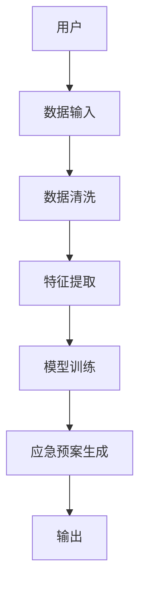
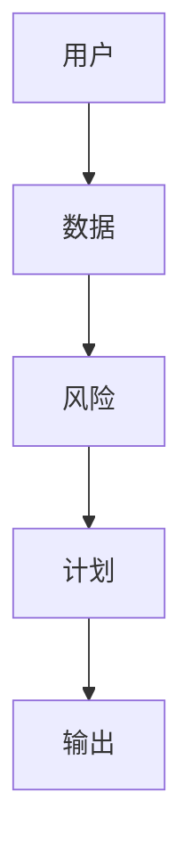
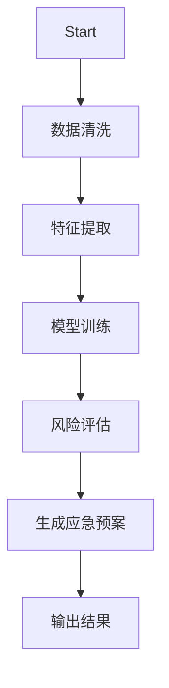
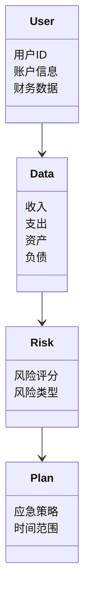
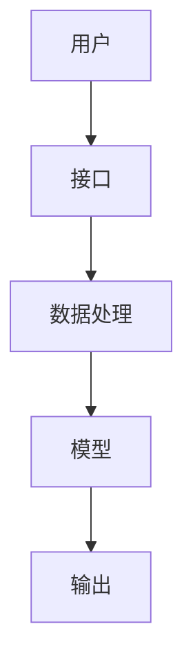
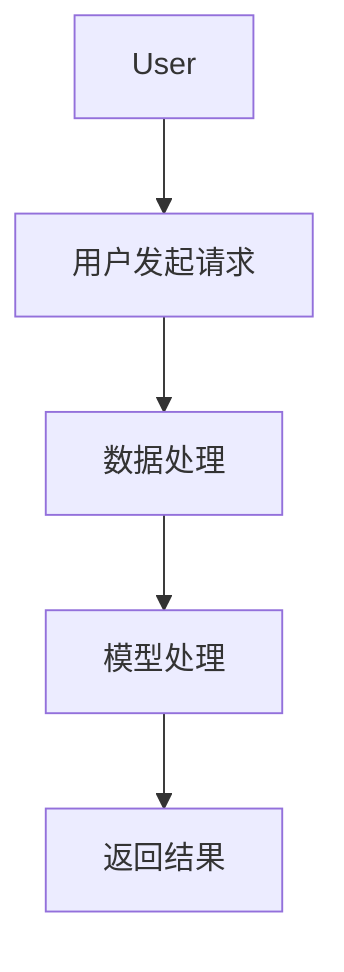

                 


# 智能个人财务应急预案生成器

> 关键词：智能财务、应急预案、风险管理、人工智能、算法设计

> 摘要：本文介绍了一种基于人工智能的智能个人财务应急预案生成器，通过分析个人财务数据，利用机器学习算法生成个性化的财务应急预案。文章从问题背景、核心概念、算法原理、系统架构到项目实战，详细阐述了该系统的实现过程和设计方案。

---

# 第1章 智能个人财务应急预案生成器的背景介绍

## 1.1 问题背景与必要性

### 1.1.1 个人财务风险管理的重要性
在现代社会，个人财务风险管理是保障生活质量的重要环节。经济波动、突发事件（如失业、疾病、意外事故等）可能导致财务状况急剧恶化，传统的财务应急预案往往依赖于人工制定，存在效率低、覆盖面窄、个性化不足等问题。

### 1.1.2 传统财务应急预案的局限性
传统的财务应急预案主要依赖于人工分析，存在以下问题：
- 数据收集和处理效率低，难以实时更新和调整。
- 应急预案缺乏个性化，难以满足不同用户的财务状况和风险偏好。
- 无法实时跟踪和评估预案的执行效果。

### 1.1.3 智能化解决方案的必要性
随着人工智能技术的发展，利用机器学习算法分析个人财务数据，生成智能化的应急预案，可以有效解决传统方法的局限性。智能财务应急预案生成器能够实时分析财务数据，动态调整应急策略，为用户提供高效、个性化的风险管理工具。

---

## 1.2 问题描述与目标

### 1.2.1 财务风险的主要来源
财务风险主要来源于以下方面：
- 收入不稳定或中断（如失业、疾病等）。
- 突发性支出（如医疗费用、意外损失等）。
- 债务风险（如信用卡欠款、贷款逾期等）。
- 投资风险（如股市波动、理财产品亏损等）。

### 1.2.2 应急预案的核心目标
智能个人财务应急预案生成器的目标是：
- 根据用户的财务状况、收入来源、支出结构、资产配置等因素，生成个性化的财务应急预案。
- 提供短期和中长期的财务风险管理策略，确保用户在突发情况下能够维持基本生活质量。
- 动态调整应急预案，适应用户的财务状况和外部环境的变化。

### 1.2.3 智能生成器的预期功能
智能生成器的核心功能包括：
- 数据采集与预处理。
- 风险评估与分析。
- 应急预案生成与优化。
- 应急预案的可视化展示与交互。

---

## 1.3 问题解决思路

### 1.3.1 数据驱动的解决方案
通过收集和分析用户的财务数据（收入、支出、资产、负债等），利用大数据技术提取关键特征，建立用户画像，为应急预案的制定提供数据支持。

### 1.3.2 人工智能在财务风险管理中的应用
利用机器学习算法（如随机森林、支持向量机、神经网络等）对财务数据进行建模，预测潜在风险，并生成最优的应急预案。

### 1.3.3 应急预案生成的智能化路径
智能化路径包括：
1. 数据采集与清洗。
2. 风险评估与优先级排序。
3. 应急预案生成与优化。
4. 可视化展示与用户交互。

---

## 1.4 边界与外延

### 1.4.1 系统功能的边界
智能生成器的功能范围包括：
- 数据采集与处理。
- 风险评估与分析。
- 应急预案生成与优化。
- 可视化展示与交互。

不包括的功能：
- 投资建议和资产配置优化。
- 长期财务规划（如退休计划）。

### 1.4.2 与外部系统的交互
- 数据来源：银行账户、信用卡、投资账户等。
- 第三方服务：信用评分、市场数据接口。
- 用户交互：图形界面、语音交互。

### 1.4.3 功能的扩展性与可维护性
系统设计应具备良好的扩展性，支持未来功能的增加和优化。例如：
- 支持多语言用户界面。
- 集成更多的数据源和第三方服务。
- 引入更复杂的机器学习模型。

---

## 1.5 核心要素组成

### 1.5.1 数据输入与处理
- 收入数据：工资、兼职收入、投资收益等。
- 支出数据：日常生活支出、债务还款、定期投资等。
- 资产数据：存款、股票、房地产等。
- 其他数据：信用评分、社保信息等。

### 1.5.2 风险评估模型
- 短期风险评估：未来3-6个月的收入和支出预测。
- 中长期风险评估：未来1-3年的财务状况预测。

### 1.5.3 应急预案生成策略
- 短期策略：应急储备金、减少非必要支出。
- 中长期策略：资产重新配置、增加收入来源。

---

# 第2章 核心概念与联系

## 2.1 核心概念原理

### 2.1.1 数据流与处理流程
数据从用户端输入，经过清洗、特征提取和建模，生成应急预案。



### 2.1.2 风险评估算法
利用随机森林算法对财务风险进行评估。

### 2.1.3 应急预案生成逻辑
基于风险评估结果，生成最优的应急策略。

---

## 2.2 核心概念属性对比

| 属性       | 数据输入特征 | 风险评估指标 | 应急预案策略 |
|------------|--------------|--------------|--------------|
| 输入类型   | 结构化数据    | 数值型数据    | 文本+数值    |
| 处理方式   | 清洗+特征提取 | 预测+评分     | 生成+优化    |
| 输出结果   | 风险评分      | 应急计划      |

---

## 2.3 ER实体关系图



---

# 第3章 算法原理讲解

## 3.1 算法流程图



---

## 3.2 Python代码示例

```python
import pandas as pd
from sklearn.ensemble import RandomForestClassifier

# 数据清洗
def data_cleaning(df):
    df.dropna(inplace=True)
    df = df[~df.isin([float('inf'), -float('inf')]).any(axis=1)]
    return df

# 特征提取
def feature_extraction(df, target):
    features = df.drop(columns=[target])
    labels = df[target]
    return features, labels

# 模型训练
def model_training(features, labels):
    model = RandomForestClassifier(n_estimators=100)
    model.fit(features, labels)
    return model

# 风险评估
def risk_assessment(model, features):
    risk_scores = model.predict_proba(features)[:, 1]
    return risk_scores

# 应急预案生成
def generate_emergency_plan(risk_scores, features):
    plan = []
    for score, feature in zip(risk_scores, features):
        if score > 0.5:
            plan.append("建议增加应急储备金")
        else:
            plan.append("维持现状")
    return plan
```

---

## 3.3 数学模型与公式

### 3.3.1 风险评估模型
随机森林模型的数学公式：
$$
\text{Risk Score} = \sum_{i=1}^{n} w_i x_i
$$
其中，$w_i$ 是特征 $x_i$ 的权重。

### 3.3.2 应急储备金计算
$$
\text{Emergency Fund} = \max(3 \times \text{月支出}, \text{风险储备金})
$$

---

# 第4章 系统分析与架构设计

## 4.1 项目介绍

### 4.1.1 项目背景
智能个人财务应急预案生成器旨在为用户提供个性化的财务风险管理工具，帮助用户在突发情况下保持财务稳定。

---

## 4.2 系统功能设计

### 4.2.1 领域模型


---

## 4.3 系统架构设计

### 4.3.1 系统架构


---

## 4.4 接口设计

### 4.4.1 API接口
```json
{
    "input": {
        "income": [10000, 8000],
        "expenses": [5000, 4000],
        "assets": [20000, 15000],
        "debts": [5000, 3000]
    },
    "output": {
        "risk_score": 0.7,
        "emergency_plan": "建议增加应急储备金"
    }
}
```

---

## 4.5 交互流程图



---

# 第5章 项目实战

## 5.1 环境搭建

### 5.1.1 安装依赖
```bash
pip install pandas sklearn matplotlib
```

---

## 5.2 核心代码实现

```python
import pandas as pd
from sklearn.ensemble import RandomForestClassifier
import matplotlib.pyplot as plt

# 数据加载
df = pd.read_csv('financial_data.csv')

# 数据清洗
df = data_cleaning(df)

# 特征提取
features, labels = feature_extraction(df, 'risk')

# 模型训练
model = model_training(features, labels)

# 风险评估
risk_scores = risk_assessment(model, features)

# 应急预案生成
plans = generate_emergency_plan(risk_scores, features)

# 可视化
plt.bar(range(len(plans)), [1 if p == "建议增加应急储备金" else 0 for p in plans])
plt.title('风险评估结果')
plt.show()
```

---

## 5.3 案例分析

### 5.3.1 数据分析
分析用户的财务数据，提取关键特征。

### 5.3.2 应急预案生成
根据模型预测结果，生成个性化的财务应急预案。

### 5.3.3 结果展示
可视化展示风险评分和应急策略。

---

## 5.4 项目总结

### 5.4.1 核心代码实现
- 数据处理模块。
- 风险评估模型。
- 应急预案生成器。

### 5.4.2 案例分析与结果展示
通过实际案例，验证系统的有效性和实用性。

---

# 第6章 最佳实践与总结

## 6.1 最佳实践

### 6.1.1 数据质量控制
确保数据的完整性和准确性。

### 6.1.2 模型优化
定期更新模型，引入新的数据和算法。

### 6.1.3 用户教育
向用户解释系统的功能和使用方法。

---

## 6.2 小结

智能个人财务应急预案生成器通过人工智能技术，为用户提供高效、个性化的财务风险管理工具。本文从问题背景、核心概念、算法原理、系统架构到项目实战，详细阐述了该系统的实现过程和设计方案。

---

## 6.3 注意事项

- 数据隐私保护。
- 系统的可扩展性和可维护性。
- 用户界面的易用性。

---

## 6.4 拓展阅读

- 《机器学习实战》。
- 《风险管理与金融创新》。

---

# 作者

作者：AI天才研究院/AI Genius Institute & 禅与计算机程序设计艺术 /Zen And The Art of Computer Programming

---

以上是一个详细的思考过程和文章框架，具体内容可以根据实际需求进一步扩展和详细阐述。

