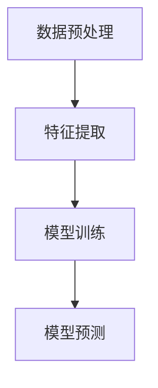

                 


# 第一部分: 智能个人财务状况诊断与建议系统

> 关键词：智能财务诊断，人工智能，大数据分析，个性化建议，系统架构设计

> 摘要：本文章详细介绍了智能个人财务状况诊断与建议系统的设计与实现。通过结合人工智能和大数据分析技术，系统能够准确诊断个人财务状况，并提供个性化的财务建议。文章从背景介绍、核心概念、算法原理、系统架构设计、项目实战等多个方面进行了详细分析，展示了系统的实现过程和实际应用价值。

---

# 智能个人财务状况诊断与建议系统

## 第1章: 智能个人财务状况诊断与建议系统背景介绍

### 1.1 问题背景
#### 1.1.1 个人财务管理的重要性
在当今社会，个人财务管理越来越重要。随着经济的发展和生活水平的提高，个人的财务状况变得复杂多样，涉及收入、支出、资产和负债等多个方面。良好的财务管理有助于提高生活质量、实现财务目标，并在面对经济波动时保持稳定。

#### 1.1.2 传统财务管理的局限性
传统的财务管理方式依赖于个人手动记录和分析财务数据，这种方式效率低、容易出错，并且难以及时发现问题。此外，个人往往缺乏专业的财务知识，难以制定有效的财务计划。

#### 1.1.3 智能化财务管理的需求
随着人工智能和大数据技术的快速发展，智能化财务管理成为可能。通过智能系统，个人可以更高效、准确地诊断财务状况，并获得个性化的财务建议。

### 1.2 问题描述
#### 1.2.1 财务数据的多样性与复杂性
个人财务数据包括收入、支出、资产和负债等多种类型，数据来源多样，且具有动态变化的特点。如何有效整合和分析这些数据是一个挑战。

#### 1.2.2 财务状况诊断的准确性要求
财务诊断需要准确识别潜在问题，如超支、负债过高或资产配置不合理等。错误的诊断可能导致错误的财务决策，影响个人的经济状况。

#### 1.2.3 个性化财务建议的必要性
每个人的财务状况和目标不同，因此需要个性化的财务建议。传统的通用建议往往无法满足个体需求。

### 1.3 问题解决
#### 1.3.1 智能化诊断的核心思路
通过收集和分析个人的财务数据，利用机器学习算法进行诊断，并根据诊断结果提供个性化建议。

#### 1.3.2 数据驱动的解决方案
利用大数据技术，整合多源财务数据，构建数据驱动的诊断模型。

#### 1.3.3 人工智能技术的应用
人工智能技术，特别是机器学习和自然语言处理，可以提高财务诊断的准确性和效率。

### 1.4 系统边界与外延
#### 1.4.1 系统功能边界
系统主要提供财务诊断和建议功能，不涉及具体的财务操作或投资决策。

#### 1.4.2 外部数据接口
系统需要与银行、支付宝等第三方数据源接口对接，获取用户的财务数据。

#### 1.4.3 用户群体的界定
系统适用于个人用户，不包括企业或机构用户。

### 1.5 核心概念结构与要素
#### 1.5.1 系统核心功能模块
- 数据采集与处理模块
- 财务诊断模块
- 个性化建议生成模块

#### 1.5.2 数据流与信息交互
- 用户输入数据
- 系统处理数据并生成诊断结果
- 用户获取诊断结果和建议

#### 1.5.3 系统性能指标
- 处理速度：快速响应用户请求
- 准确率：诊断结果的准确性
- 用户满意度：用户对建议的满意度

---

## 第2章: 智能个人财务诊断系统的核心概念与联系

### 2.1 核心概念原理
#### 2.1.1 数据采集与处理
系统通过API接口从第三方数据源获取用户的财务数据，包括银行账户、支付宝、微信支付等。

#### 2.1.2 财务状况诊断模型
基于机器学习的分类模型，对用户的财务状况进行诊断，识别潜在问题。

#### 2.1.3 个性化建议生成机制
根据诊断结果，结合用户的目标和风险偏好，生成个性化的财务建议。

### 2.2 核心概念对比分析
| 比较维度 | 数据来源 | 诊断方法 | 建议机制 |
|----------|----------|----------|----------|
| 数据类型 | 结构化数据（收入、支出等） | 分类模型（决策树、随机森林） | 规则引擎 |
| 数据量   | 中小规模 | 中等规模 | 高效处理 |

### 2.3 ER实体关系图
```mermaid
erDiagram
    user {
        id : INT
        name : VARCHAR
        email : VARCHAR
        phone : VARCHAR
    }
    financial_data {
        id : INT
        user_id : INT
        income : DECIMAL
        expense : DECIMAL
        asset : DECIMAL
        liability : DECIMAL
    }
    diagnosis_result {
        id : INT
        user_id : INT
        status : VARCHAR
        suggestion : TEXT
        score : DECIMAL
    }
    user --> financial_data : 提供
    user --> diagnosis_result : 获取
    financial_data --> diagnosis_result : 用于
```

---

## 第3章: 智能个人财务诊断系统的算法原理

### 3.1 算法原理概述
系统采用基于机器学习的分类算法，对用户的财务数据进行分析和诊断。

#### 3.1.1 数据预处理
- 数据清洗：处理缺失值、异常值。
- 数据标准化：统一数据格式和单位。

#### 3.1.2 特征提取
- 从财务数据中提取关键特征，如收入支出比、资产与负债比等。

#### 3.1.3 模型训练
- 使用决策树或随机森林等算法进行训练，构建分类模型。

### 3.2 算法实现步骤


### 3.3 算法数学模型
分类模型的损失函数：
$$ L = -\frac{1}{N} \sum_{i=1}^{N} y_i \log(p_i) + (1 - y_i) \log(1 - p_i) $$
其中，$y_i$ 是真实标签，$p_i$ 是模型预测概率。

---

## 第4章: 智能个人财务诊断系统的系统架构设计

### 4.1 系统功能设计
- 数据采集与处理
- 财务诊断
- 个性化建议生成

### 4.2 系统架构设计


### 4.3 系统接口设计
- 数据接口：通过API获取用户数据。
- 诊断接口：返回诊断结果和建议。

---

## 第5章: 项目实战

### 5.1 环境安装
- Python 3.8+
- 安装必要的库：pandas、numpy、scikit-learn、flask。

### 5.2 系统核心实现
```python
import pandas as pd
from sklearn.ensemble import RandomForestClassifier

# 数据加载
data = pd.read_csv('financial_data.csv')

# 特征提取
X = data[['income', 'expense', 'asset', 'liability']]
y = data['status']

# 模型训练
model = RandomForestClassifier()
model.fit(X, y)

# 预测
new_user = [[5000, 3000, 20000, 10000]]
prediction = model.predict(new_user)
print(prediction)
```

### 5.3 实际案例分析
以一个收入5000元、支出3000元、资产20000元、负债10000元的用户为例，系统诊断其财务状况为健康，并提供优化建议。

---

## 第6章: 最佳实践与总结

### 6.1 项目小结
通过本项目，我们实现了智能个人财务诊断与建议系统，利用机器学习技术提高了诊断的准确性和效率。

### 6.2 注意事项
- 数据隐私保护
- 模型的可解释性
- 系统的可扩展性

### 6.3 拓展阅读
- 《机器学习实战》
- 《数据驱动的决策》

---

作者：AI天才研究院/AI Genius Institute & 禅与计算机程序设计艺术/Zen And The Art of Computer Programming

