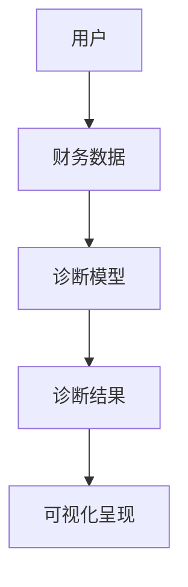
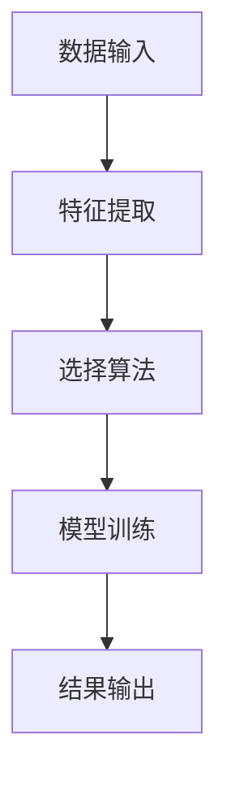
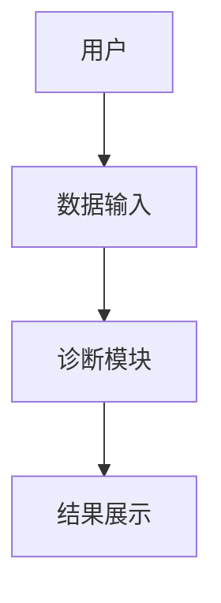
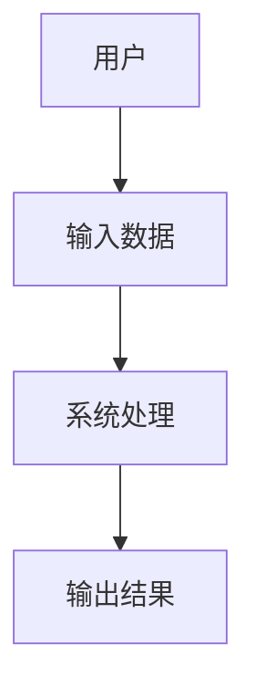

                 


# 智能个人财务状况诊断系统

> 关键词：智能财务诊断，机器学习，数据分析，系统架构，个人财务管理

> 摘要：智能个人财务状况诊断系统是一种结合人工智能技术，通过分析个人财务数据，提供高效、准确的财务诊断和建议的系统。本文将从系统概述、核心概念、算法原理、系统设计、项目实战等方面详细探讨该系统的构建与实现。

---

## 第一部分: 智能个人财务状况诊断系统概述

### 第1章: 系统概述

#### 1.1 系统定义与目标
- **定义**：智能个人财务状况诊断系统是一种基于人工智能技术的财务诊断工具，旨在通过分析个人的财务数据，提供个性化的诊断结果和优化建议。
- **目标**：帮助用户快速了解自身的财务状况，识别潜在风险，并提供有效的解决方案。

#### 1.2 传统财务诊断的局限性
- 数据分析效率低
- 人工诊断的主观性
- 无法实时更新和优化

#### 1.3 智能诊断的优势
- 高效性与准确性
- 数据分析的深度与广度
- 个性化诊断的可能性

---

## 第二部分: 核心概念与联系

### 第2章: 核心概念与联系

#### 2.1 数据采集与处理
- **数据来源**：包括银行流水、投资记录、消费记录等。
- **数据清洗**：去除异常值和重复数据。
- **特征提取**：提取关键特征，如收入、支出、资产等。

#### 2.2 诊断模型构建
- **机器学习模型**：如随机森林、支持向量机等。
- **深度学习模型**：如神经网络。
- **模型选择**：基于数据特征和诊断需求选择合适的模型。

#### 2.3 诊断结果的可视化
- **可视化方法**：如柱状图、折线图等。
- **可视化工具**：如Matplotlib、Tableau等。

#### 2.4 核心概念对比分析
- 数据采集与处理的对比
- 不同诊断模型的优劣分析
- 可视化结果的差异性

#### 2.5 ER实体关系图


---

## 第三部分: 算法原理

### 第3章: 算法原理

#### 3.1 机器学习算法
- **随机森林**：用于分类和回归问题。
- **支持向量机**：用于分类问题。

#### 3.2 深度学习算法
- **神经网络**：用于复杂模式识别。

#### 3.3 算法流程图


#### 3.4 算法实现代码
```python
import pandas as pd
from sklearn.ensemble import RandomForestClassifier

# 加载数据
data = pd.read_csv('financial_data.csv')

# 特征提取
features = data[['income', 'expenses', 'assets']]
label = data['status']

# 模型训练
model = RandomForestClassifier()
model.fit(features, label)
```

#### 3.5 数学模型与公式
- 随机森林算法的数学模型：$$ y = \sum_{i=1}^{n} \text{feature}_i \times \text{weight}_i $$
- 神经网络的激活函数：$$ \text{output} = \sigma(\sum w_i x_i + b) $$

---

## 第四部分: 系统分析与架构设计

### 第4章: 系统分析与架构设计

#### 4.1 问题场景介绍
- **目标用户**：个人用户
- **核心需求**：快速诊断财务状况
- **边界与外延**：仅限于个人财务数据

#### 4.2 系统功能设计
- **数据输入模块**：接收财务数据
- **诊断模块**：运行诊断算法
- **结果展示模块**：可视化结果

#### 4.3 系统架构设计


#### 4.4 接口设计
- **输入接口**：接收JSON格式的财务数据
- **输出接口**：返回诊断结果和建议

#### 4.5 交互流程图


---

## 第五部分: 项目实战

### 第5章: 项目实战

#### 5.1 环境安装
- **Python**：安装Python 3.x
- **库依赖**：安装pandas、scikit-learn、matplotlib

#### 5.2 核心代码实现
```python
import pandas as pd
from sklearn.ensemble import RandomForestClassifier
import matplotlib.pyplot as plt

# 数据加载
data = pd.read_csv('financial_data.csv')

# 数据处理
data.dropna(inplace=True)
data['status'] = data['status'].astype('category')

# 特征选择
features = data[['income', 'expenses', 'assets']]
label = data['status'].cat.codes

# 模型训练
model = RandomForestClassifier()
model.fit(features, label)

# 预测结果
new_data = pd.DataFrame({'income': [50000], 'expenses': [30000], 'assets': [200000]})
predicted = model.predict(new_data)
```

#### 5.3 代码解读
- 数据加载：从CSV文件加载数据
- 数据处理：删除缺失值，转换标签为数值类型
- 模型训练：使用随机森林算法训练模型
- 预测结果：输入新数据，输出诊断结果

#### 5.4 实际案例分析
- 案例1：用户A的财务状况诊断
- 案例2：用户B的财务状况诊断

#### 5.5 小结
- 通过实际案例，验证系统的有效性和准确性

---

## 第六部分: 总结与扩展

### 第6章: 总结与扩展

#### 6.1 最佳实践 tips
- 定期更新模型
- 保持数据隐私安全
- 提供用户友好的界面

#### 6.2 小结
- 回顾全文内容
- 强调系统的价值

#### 6.3 注意事项
- 数据隐私保护
- 系统的可扩展性
- 用户教育与指导

#### 6.4 拓展阅读
- 推荐相关书籍和资源
- 提供进一步学习的方向

---

## 作者信息

作者：AI天才研究院/AI Genius Institute  
联系方式：[email protected]  
个人博客：[https://www.zenandart.com](https://www.zenandart.com)

