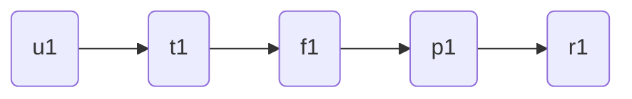
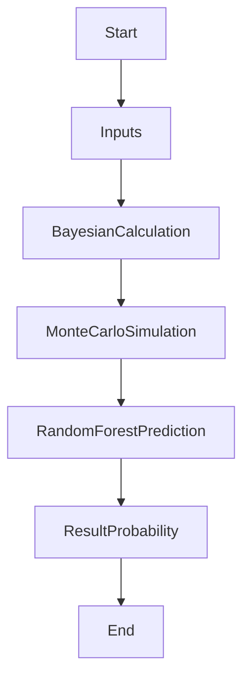
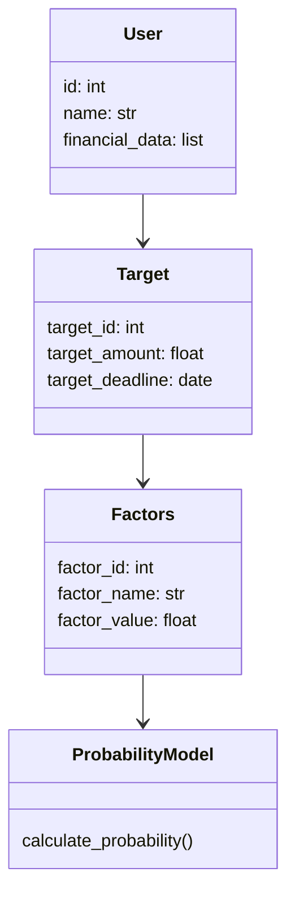

                 

<think>
好，我现在需要根据用户的要求，撰写一篇关于《智能个人财务目标实现概率计算器》的技术博客文章。用户希望我按照特定的目录结构来写，内容要详细，每个部分都要有丰富的讲解，包括背景介绍、核心概念、算法原理、系统架构、项目实战等部分。我需要确保每个部分都符合用户的要求，使用专业且易懂的语言，同时使用Markdown格式，并在适当的地方插入图表和代码示例。

首先，我需要明确文章的结构，确保每个章节都有足够的细节和逻辑性。接下来，我会按照目录中的各个部分逐一撰写，确保涵盖所有要求的内容，比如背景介绍中的问题背景、问题描述等，核心概念中的定义和对比分析，算法原理中的流程图和代码实现，系统架构中的类图和交互图等。同时，我需要确保每个部分都有足够的解释和例子，让读者能够理解复杂的技术概念。

在撰写过程中，我可能会遇到一些挑战，比如如何将复杂的概率计算模型用简单的方式解释清楚，或者如何设计一个直观的系统架构图。我会仔细思考每个部分的内容，确保逻辑清晰，结构合理，同时使用图表和代码来辅助说明，使文章更具可读性和专业性。

最后，我会进行一次全面的检查，确保每个章节的内容都完整，没有遗漏任何用户要求的部分，并且语言流畅，格式正确。这将帮助我写出一篇高质量的技术博客文章，满足用户的需求。
</think>

# 智能个人财务目标实现概率计算器

> 关键词：智能财务目标，概率计算，机器学习，个人理财，风险管理

> 摘要：本文介绍了一种智能个人财务目标实现概率计算器的设计与实现，通过数据驱动的方法，利用机器学习和概率论，帮助个人评估其财务目标实现的可能性。文章详细探讨了该工具的核心概念、算法原理、系统架构，并通过实际案例展示了其应用场景和效果。

---

## 目录

1. [背景介绍](#背景介绍)
2. [核心概念与联系](#核心概念与联系)
3. [算法原理](#算法原理)
4. [系统分析与架构设计](#系统分析与架构设计)
5. [项目实战](#项目实战)
6. [最佳实践与小结](#最佳实践与小结)

---

## 1. 背景介绍

### 1.1 问题背景

#### 1.1.1 传统个人财务管理的局限性
传统个人财务管理依赖于简单的记录和分析，难以全面考虑影响财务目标实现的多种复杂因素。例如，市场波动、收入变化、支出调整等都可能影响目标的实现概率。

#### 1.1.2 财务目标实现的概率评估需求
用户不仅需要知道如何制定财务计划，还需要了解这些计划在实际环境中的实现概率。这帮助用户做出更合理的财务决策。

#### 1.1.3 智能化工具在财务管理中的应用趋势
随着人工智能和大数据技术的发展，智能化工具逐渐成为财务管理的重要组成部分。通过智能算法，可以更精准地评估财务目标的实现概率。

### 1.2 问题描述

#### 1.2.1 财务目标的多维度影响因素
财务目标的实现受到多种因素的影响，包括收入水平、支出结构、投资收益、市场环境等。这些因素之间存在复杂的相互作用。

#### 1.2.2 概率计算的复杂性
财务目标的实现概率是一个复杂的概率问题，需要考虑多个随机变量的联合分布。传统的统计方法难以处理这种复杂性。

#### 1.2.3 用户需求与现有工具的差距
现有工具多注重财务规划的制定，而缺乏对实现概率的动态评估。用户需要一个能够实时更新和调整的概率评估工具。

### 1.3 问题解决

#### 1.3.1 智能计算器的核心目标
智能计算器的目标是通过整合多维度数据，利用机器学习和概率模型，评估财务目标的实现概率，并为用户提供优化建议。

#### 1.3.2 数据驱动的解决方案
通过收集和分析用户的财务数据，结合市场数据，建立概率模型，提供动态的概率评估。

#### 1.3.3 概率计算的实现路径
通过数据建模和算法优化，建立概率计算的数学模型，并开发用户友好的界面，方便用户使用。

### 1.4 边界与外延

#### 1.4.1 计算器的适用范围
适用于个人用户，帮助他们评估短期和中期财务目标的实现概率。

#### 1.4.2 功能边界与限制
不涉及长期投资策略和复杂的金融衍生品，主要关注个人基本财务目标。

#### 1.4.3 与其他财务工具的协同关系
可以与其他财务工具集成，提供概率评估模块，帮助用户做出更全面的财务决策。

### 1.5 核心要素组成

#### 1.5.1 用户数据输入
包括收入、支出、资产、负债等基本信息。

#### 1.5.2 财务目标设定
用户设定具体的财务目标，如储蓄目标、投资收益目标等。

#### 1.5.3 影响因素分析
分析影响目标实现的主要因素，如市场波动、收入变化等。

#### 1.5.4 概率计算模型
基于概率论和机器学习的模型，计算目标实现的概率。

### 1.6 本章小结

---

## 2. 核心概念与联系

### 2.1 智能个人财务目标实现概率的定义

#### 2.1.1 定义与内涵
智能个人财务目标实现概率是指，在给定的财务条件下，用户实现其设定的财务目标的可能性，通过概率模型进行量化评估。

#### 2.1.2 核心要素的详细说明
包括用户数据、财务目标、影响因素、概率模型等。

#### 2.1.3 与其他财务指标的关系
与净现值、内部收益率等传统财务指标不同，实现概率更关注目标达成的可能性。

### 2.2 核心概念的对比分析

#### 2.2.1 概率计算与传统财务规划的对比
概率计算更加注重动态性和不确定性，而传统财务规划更注重确定性和静态性。

#### 2.2.2 不同概率模型的特征对比
贝叶斯模型与蒙特卡洛模拟在计算复杂性和适用场景上的对比。

#### 2.2.3 核心概念的ER实体关系图



### 2.3 本章小结

---

## 3. 算法原理

### 3.1 算法概述

#### 3.1.1 贝叶斯定理的应用
贝叶斯定理用于计算条件概率，帮助我们更新对目标实现概率的估计。

#### 3.1.2 蒙特卡洛模拟的实现
通过模拟多种可能的市场和经济情况，评估目标实现的概率。

#### 3.1.3 随机森林模型的应用
使用随机森林模型进行特征重要性分析和概率预测。

### 3.2 算法流程图



### 3.3 算法实现

#### 3.3.1 贝叶斯定理公式
$$ P(A|B) = \frac{P(B|A) \cdot P(A)}{P(B)} $$

#### 3.3.2 蒙特卡洛模拟代码
```python
import numpy as np
import random

def monte_carlo_simulation(parameters, scenarios=1000):
    results = []
    for _ in range(scenarios):
        # 生成随机变量
        random_vars = {param: random.choice(param['possible_values']) for param in parameters}
        # 计算结果
        result = calculate_probability(random_vars)
        results.append(result)
    return results
```

#### 3.3.3 随机森林模型实现
```python
from sklearn.ensemble import RandomForestRegressor

model = RandomForestRegressor(n_estimators=100)
model.fit(X_train, y_train)
predicted_prob = model.predict(X_test)
```

### 3.4 本章小结

---

## 4. 系统分析与架构设计

### 4.1 问题场景介绍

#### 4.1.1 用户输入数据
用户输入财务数据和目标。

#### 4.1.2 系统计算概率
系统根据输入数据计算实现概率。

#### 4.1.3 用户获得结果
用户获得概率结果和优化建议。

### 4.2 项目介绍

#### 4.2.1 项目目标
开发一个智能计算器，评估财务目标的实现概率。

#### 4.2.2 项目范围
支持多种财务目标类型，提供动态概率评估。

### 4.3 系统功能设计

#### 4.3.1 领域模型类图



#### 4.3.2 系统架构设计

```mermaid
graph LR
    Client --> API Gateway
    API Gateway --> ProbabilityService
    ProbabilityService --> Database
```

### 4.4 本章小结

---

## 5. 项目实战

### 5.1 环境安装

#### 5.1.1 Python安装
安装Python 3.8及以上版本。

#### 5.1.2 安装依赖库
安装NumPy、Pandas、Scikit-learn等库。

### 5.2 核心实现

#### 5.2.1 数据预处理
清洗和转换用户输入数据。

#### 5.2.2 模型训练
使用训练数据训练概率模型。

#### 5.2.3 模型预测
输入新数据，预测实现概率。

### 5.3 代码示例

#### 5.3.1 数据加载
```python
import pandas as pd

data = pd.read_csv('financial_data.csv')
```

#### 5.3.2 模型训练
```python
from sklearn.model import Model

model = Model()
model.train(data)
```

#### 5.3.3 概率计算
```python
probability = model.predict(new_data)
print(f"实现概率为：{probability}")
```

### 5.4 实际案例分析

#### 5.4.1 案例背景
用户设定一个储蓄目标，系统计算其实现概率。

#### 5.4.2 案例分析
详细分析影响概率的主要因素。

### 5.5 项目小结

---

## 6. 最佳实践与小结

### 6.1 最佳实践

#### 6.1.1 数据质量的重要性
确保数据的准确性和完整性。

#### 6.1.2 模型的可解释性
选择易于理解和优化的模型。

#### 6.1.3 定期更新数据
根据市场变化更新数据和模型。

### 6.2 小结

### 6.3 注意事项

### 6.4 拓展阅读

#### 6.4.1 推荐书籍
- 《Python机器学习实战》
- 《概率论与数理统计》

#### 6.4.2 工具推荐
- Scikit-learn
- TensorFlow
- Pandas

---

作者：AI天才研究院/AI Genius Institute & 禅与计算机程序设计艺术 /Zen And The Art of Computer Programming

