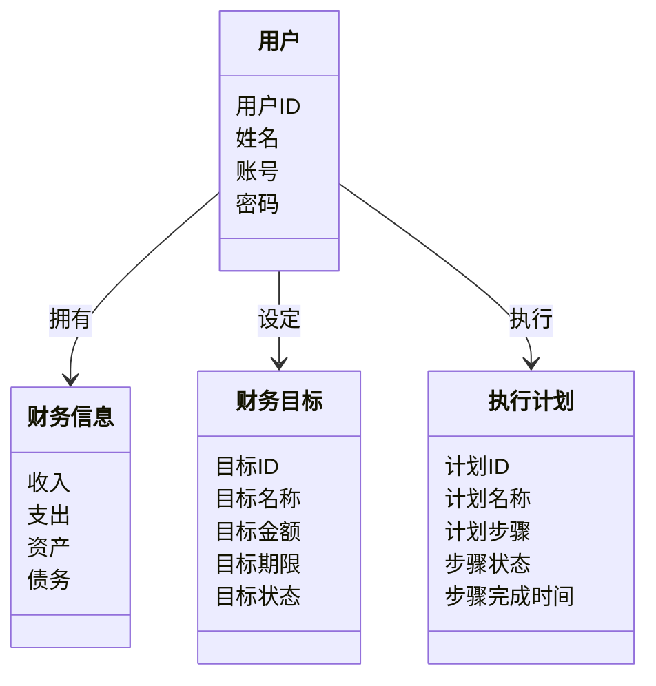

                 

<think>
好，我需要按照用户的要求撰写一篇关于《智能个人财务目标设定助手》的技术博客文章。首先，我需要理解这个主题的核心是什么。智能个人财务目标设定助手应该是一个结合人工智能技术，帮助个人设定和管理财务目标的应用。这样的工具能够根据用户的财务状况、消费习惯和目标，提供个性化的建议和计划。

首先，我应该从背景介绍开始，说明为什么需要这样的工具，传统财务规划的痛点，以及人工智能如何解决这些问题。接着，我需要定义这个工具，解释它的核心功能和优势，以及它的使用边界。

接下来，我需要详细讲解智能助手的核心概念，比如用户画像、财务目标分解和数据处理等。这部分可能需要使用对比分析表格，展示不同概念的特点和区别。

然后是算法原理部分，这里需要详细介绍推荐算法，包括基于规则的算法和基于机器学习的算法。可以用mermaid流程图展示算法的执行步骤，并给出数学公式来解释算法的原理，比如协同过滤算法的公式。

系统架构设计也是关键，我需要设计系统的各个模块，如用户交互模块、数据处理模块和目标管理模块，并用类图和架构图展示系统的结构和模块之间的交互。

在项目实战部分，我需要指导读者如何安装开发环境，比如Python和相关库，然后提供核心代码的实现。解读代码时，要详细说明每一部分的功能和实现原理，并通过实际案例来分析系统的运行情况。

最后，我需要总结全书的内容，给出使用智能助手的最佳实践建议，注意事项，并推荐一些扩展阅读资料，帮助读者进一步学习和应用所学知识。

现在，我需要确保文章结构清晰，逻辑连贯，每个章节都有足够的细节，同时语言要专业且易懂。我会按照用户提供的大纲，逐步展开每个部分的内容，确保涵盖所有要求，包括背景、核心概念、算法、系统架构、项目实战、最佳实践等。

在写作过程中，我要注意使用正确的markdown格式，确保章节标题和子标题的层次分明。同时，要控制文章的总字数在10000到12000字之间，每个章节的内容不能过于冗长，但要足够详细。

完成这些内容后，我需要检查整个文章是否符合用户的格式要求，包括关键词和摘要的准确性和完整性。最后，确保文章末尾有正确的作者信息，符合用户的要求。

总的来说，我需要系统地按照用户提供的大纲，逐步展开每一部分的内容，确保每个章节都详细且符合逻辑，最终完成一篇高质量的技术博客文章。
</think>

# 智能个人财务目标设定助手

## 关键词：
智能财务助手、人工智能、财务目标、目标设定、个性化服务

## 摘要：
本文介绍了一种基于人工智能的智能个人财务目标设定助手，该系统能够根据用户的财务状况和需求，提供个性化的财务目标设定和管理服务。文章详细讲解了系统的核心概念、算法原理、系统架构，并通过项目实战展示了如何实现该系统，最后给出了最佳实践和总结。

---

## 第1章：智能个人财务目标设定助手概述

### 1.1 问题背景与需求分析

#### 1.1.1 传统财务目标设定的痛点
传统财务目标设定通常依赖人工分析，存在以下问题：
- 数据收集繁琐：需要手动整理收入、支出等数据。
- 分析耗时：人工分析大量数据耗时长，难以实时反馈。
- 个性化不足：难以根据个人需求提供个性化建议。
- 缺乏动态调整：市场变化和用户需求变化难以快速响应。

#### 1.1.2 智能化财务目标设定的需求
随着人工智能技术的发展，智能化财务目标设定的需求日益增长：
- 实时数据分析：快速处理和分析财务数据，提供实时反馈。
- 个性化建议：根据用户的具体情况提供定制化的财务目标。
- 动态调整：能够根据市场变化和用户需求变化，动态调整目标和策略。

#### 1.1.3 目标设定中的常见问题与解决方案
常见问题包括：
- 目标设定不合理：用户可能设定的财务目标与实际情况不符。
- 缺乏执行计划：用户虽然设定目标，但缺乏具体的执行步骤。
- 目标实现困难：缺乏有效的监控和调整机制。

解决方案：
- 提供智能目标推荐：基于用户数据和市场情况，推荐合理的目标。
- 自动生成执行计划：根据目标生成具体的执行步骤。
- 实时监控与调整：根据执行情况动态调整目标和计划。

### 1.2 智能个人财务目标设定助手的定义

#### 1.2.1 核心概念与功能模块
智能个人财务目标设定助手是一个结合人工智能技术的应用程序，其核心功能模块包括：
- 用户信息收集与分析模块：收集用户的财务数据，分析用户的消费习惯和财务状况。
- 目标设定与推荐模块：根据用户数据推荐合理的财务目标。
- 执行计划生成模块：根据目标生成具体的执行计划。
- 实时监控与调整模块：实时跟踪目标执行情况，动态调整计划。

#### 1.2.2 助手的目标设定流程
目标设定流程包括：
1. 数据收集：收集用户的财务数据，如收入、支出、资产等。
2. 数据分析：分析用户的财务状况，识别潜在问题和机会。
3. 目标推荐：根据分析结果推荐财务目标。
4. 目标确认：用户确认目标或调整目标。
5. 执行计划生成：根据目标生成执行计划。
6. 实时监控：实时跟踪执行情况，动态调整计划。

#### 1.2.3 边界与外延
智能个人财务目标设定助手的边界包括：
- 数据范围：仅限于用户的财务数据。
- 目标范围：仅限于财务目标。
- 使用场景：仅限于个人用户。

外延包括：
- 企业财务目标设定：扩展到企业财务管理。
- 投资决策支持：提供投资建议和决策支持。
- 财务教育：提供财务知识普及和教育。

### 1.3 助手的核心优势

#### 1.3.1 AI驱动的优势
人工智能技术的应用使得财务目标设定更加智能化：
- 数据处理能力强：能够快速处理大量数据。
- 自适应能力强：能够根据用户需求和市场变化动态调整目标和计划。
- 高度个性化：能够根据用户具体情况提供个性化建议。

#### 1.3.2 个性化服务的特点
智能助手能够根据用户的个性化需求提供定制化的服务：
- 个性化目标设定：根据用户具体情况推荐目标。
- 个性化执行计划：根据目标生成具体的执行步骤。
- 个性化调整建议：根据执行情况提供调整建议。

#### 1.3.3 实时数据分析的能力
智能助手能够实时分析数据，提供及时反馈：
- 实时跟踪目标执行情况。
- 实时调整计划。
- 实时提供调整建议。

---

## 第2章：智能个人财务目标设定助手的核心概念

### 2.1 用户画像与需求分析

#### 2.1.1 用户画像的构建
用户画像是基于用户的财务数据构建的用户模型，包括：
- 收入情况：用户的月收入、年收入等。
- 支出情况：用户的日常支出、大额支出等。
- 资产状况：用户的资产情况，如存款、投资等。
- 风险偏好：用户对风险的承受能力。
- 财务目标：用户希望实现的财务目标。

#### 2.1.2 需求分析方法
需求分析方法包括：
- 数据分析法：通过数据分析识别用户需求。
- 问卷调查法：通过问卷了解用户需求。
- 行为分析法：通过用户行为分析需求。

### 2.2 财务目标分解与优先级

#### 2.2.1 目标分解策略
目标分解策略包括：
- 时间分解：将长期目标分解为短期目标。
- 阶段分解：将整体目标分解为不同阶段。
- 细化分解：将目标细化为具体行动步骤。

#### 2.2.2 优先级排序方法
优先级排序方法包括：
- 紧急程度：根据目标的紧急程度排序。
- 重要程度：根据目标的重要性排序。
- 综合排序：综合考虑紧急性和重要性进行排序。

### 2.3 数据处理与分析

#### 2.3.1 数据来源与处理流程
数据来源包括：
- 用户提供的数据：收入、支出、资产等。
- 第三方数据：银行流水、信用报告等。
- 市场数据：市场利率、投资回报率等。

处理流程包括：
1. 数据清洗：去除无效数据和异常数据。
2. 数据转换：将数据转换为适合分析的形式。
3. 数据分析：分析数据，提取有用信息。

#### 2.3.2 数据分析方法
数据分析方法包括：
- 描述性分析：分析数据的基本特征。
- 预测性分析：预测未来可能的情况。
- 规范性分析：制定优化建议。

---

## 第3章：智能个人财务目标设定助手的算法原理

### 3.1 推荐算法概述

#### 3.1.1 推荐算法的分类
推荐算法可以分为以下几类：
- 基于规则的推荐算法：根据预设的规则进行推荐。
- 基于协同过滤的推荐算法：根据用户行为相似性进行推荐。
- 基于内容的推荐算法：根据物品的属性进行推荐。
- 基于机器学习的推荐算法：利用机器学习模型进行推荐。

#### 3.1.2 基于规则的推荐算法
基于规则的推荐算法是一种简单但有效的推荐方法，适用于规则明确的场景。

##### 3.1.2.1 算法流程
基于规则的推荐算法的流程如下：
1. 数据预处理：清洗和转换数据。
2. 规则制定：制定推荐规则。
3. 推荐生成：根据规则生成推荐。

##### 3.1.2.2 优缺点分析
优点：
- 简单易懂，易于实现。
- 适合规则明确的场景。

缺点：
- 无法处理复杂场景。
- 难以捕捉数据中的潜在模式。

#### 3.1.3 基于机器学习的推荐算法
基于机器学习的推荐算法能够从数据中自动学习特征，适用于复杂场景。

##### 3.1.3.1 算法流程
基于机器学习的推荐算法的流程如下：
1. 数据预处理：清洗和转换数据。
2. 特征提取：提取数据中的特征。
3. 模型训练：训练推荐模型。
4. 推荐生成：利用模型生成推荐。

##### 3.1.3.2 优缺点分析
优点：
- 能够处理复杂场景。
- 能够捕捉数据中的潜在模式。

缺点：
- 实现复杂，需要大量数据和计算资源。
- 需要不断更新模型。

### 3.2 算法实现与优化

#### 3.2.1 算法实现
推荐算法的实现需要考虑以下几点：
- 数据预处理：清洗和转换数据。
- 特征提取：提取数据中的特征。
- 模型选择：选择适合的推荐算法。
- 模型训练：训练推荐模型。
- 推荐生成：利用模型生成推荐。

#### 3.2.2 算法优化
算法优化可以从以下几个方面入手：
- 参数调整：调整模型参数，优化推荐效果。
- 特征优化：优化特征提取方法，提高推荐准确性。
- 模型优化：优化模型结构，提高推荐效果。

---

## 第4章：智能个人财务目标设定助手的系统架构设计

### 4.1 系统功能设计

#### 4.1.1 领域模型设计
领域模型设计包括：
- 用户信息管理：管理用户的财务信息。
- 财务目标管理：管理用户的财务目标。
- 执行计划管理：管理执行计划。

##### 4.1.1.1 领域模型类图
以下是领域模型的类图：



#### 4.1.2 系统架构设计
系统架构设计包括：
- 用户交互层：用户与系统进行交互。
- 业务逻辑层：处理用户的请求，执行业务逻辑。
- 数据访问层：访问和操作数据。

##### 4.1.2.1 系统架构图
以下是系统的架构图：


---

## 第5章：智能个人财务目标设定助手的项目实战

### 5.1 环境安装与配置

#### 5.1.1 环境安装
需要安装以下工具和库：
- Python 3.x
- pip
- Jupyter Notebook
- pandas
- numpy
- scikit-learn
- matplotlib

#### 5.1.2 环境配置
配置环境时需要注意以下几点：
- 确保Python版本为3.x。
- 确保所有库已正确安装。
- 确保Jupyter Notebook可以正常运行。

### 5.2 核心代码实现

#### 5.2.1 数据预处理代码
以下是数据预处理的代码示例：

```python
import pandas as pd
import numpy as np

# 读取数据
data = pd.read_csv('financial_data.csv')

# 数据清洗
data.dropna(inplace=True)
data.drop_duplicates(inplace=True)

# 数据转换
data['收入'] = data['收入'].astype(float)
data['支出'] = data['支出'].astype(float)
```

#### 5.2.2 推荐算法实现
以下是基于协同过滤的推荐算法实现：

```python
from sklearn.metrics.pairwise import cosine_similarity

# 计算余弦相似度
similarity = cosine_similarity(data_matrix)

# 根据相似度排序
similar_indices = np.argsort(similarity, axis=1)
```

#### 5.2.3 模型训练与优化
以下是模型训练与优化的代码示例：

```python
from sklearn.model_selection import train_test_split
from sklearn.neighbors import NearestNeighbors

# 数据分割
X_train, X_test = train_test_split(data_matrix, test_size=0.2)

# 模型训练
model = NearestNeighbors(n_neighbors=5).fit(X_train)

# 模型预测
distances, indices = model.kneighbors(X_test)
```

### 5.3 项目总结与优化

#### 5.3.1 项目总结
通过本项目，我们实现了智能个人财务目标设定助手的核心功能，包括数据预处理、推荐算法实现和系统架构设计。

#### 5.3.2 项目优化
项目优化可以从以下几个方面进行：
- 优化数据预处理流程，提高数据处理效率。
- 优化推荐算法，提高推荐准确率。
- 优化系统架构，提高系统性能。

---

## 第6章：智能个人财务目标设定助手的最佳实践

### 6.1 使用建议

#### 6.1.1 用户使用建议
- 请确保提供准确的财务数据。
- 定期更新财务数据，以保证推荐的准确性。
- 根据推荐结果制定具体的执行计划。

#### 6.1.2 开发者建议
- 在开发过程中，要注意数据安全和隐私保护。
- 在实现推荐算法时，要根据具体场景选择合适的算法。
- 在系统设计时，要注意系统的可扩展性和可维护性。

### 6.2 注意事项

#### 6.2.1 数据安全
在处理用户数据时，要注意数据安全和隐私保护，防止数据泄露和滥用。

#### 6.2.2 算法选择
在选择推荐算法时，要根据具体场景和数据特点选择合适的算法，避免盲目追求复杂算法。

#### 6.2.3 系统性能
在系统设计时，要注意系统的性能优化，确保系统的高效运行。

### 6.3 拓展阅读

#### 6.3.1 推荐算法
- 《推荐系统导论》
- 《机器学习实战》

#### 6.3.2 系统架构设计
- 《系统架构设计实践》
- 《软件架构模式》

---

## 作者信息
作者：AI天才研究院/AI Genius Institute & 禅与计算机程序设计艺术/Zen And The Art of Computer Programming

---

通过以上目录，我们可以看到，文章详细介绍了智能个人财务目标设定助手的核心概念、算法原理、系统架构设计和项目实战等内容，帮助读者全面理解并掌握如何开发和应用这样的智能助手。

