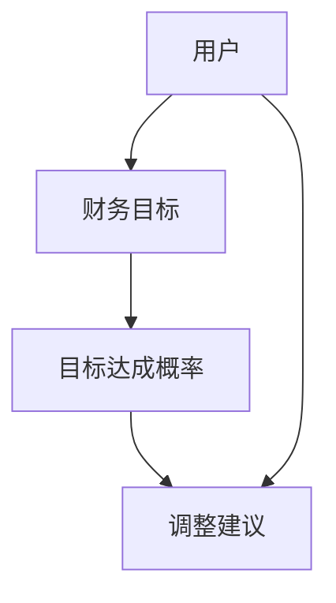
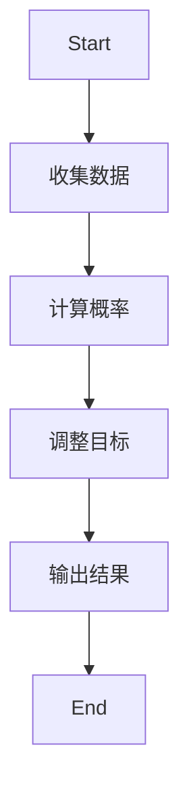
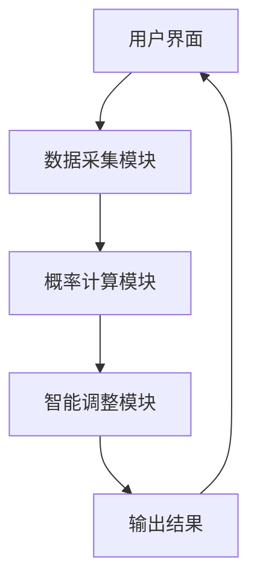
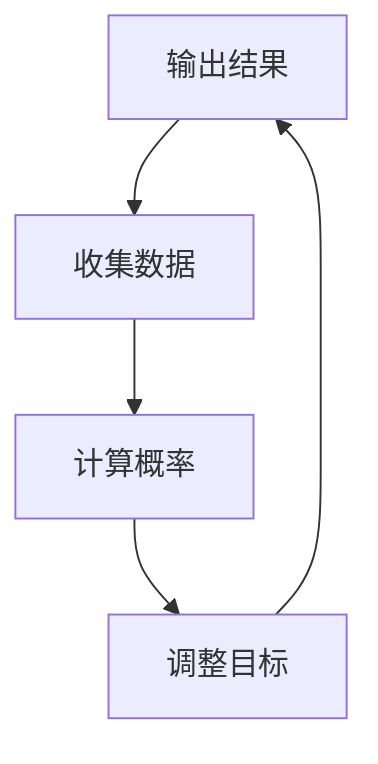

                 

<think>
好，我现在需要根据用户提供的文章标题和目录大纲，撰写一篇结构完整、内容详实的技术博客文章。文章的主题是《智能个人财务目标达成概率计算与调整》，需要涵盖背景介绍、核心概念、算法原理、系统设计、项目实战和最佳实践等多个部分。

首先，我会从背景介绍开始，解释为什么个人财务目标管理需要智能化，以及传统方法的局限性。接着，我会详细阐述智能调整的核心机制，包括动态调整、数据驱动和算法实现的原理。

在核心概念部分，我会通过对比分析和ER实体关系图，说明概率计算与智能调整之间的关系。这部分需要使用表格和Mermaid图来清晰展示概念属性和实体关系。

接下来，我会深入讲解概率计算的数学模型，包括基础概率公式、条件概率和贝叶斯定理，并用LaTeX格式呈现相关公式。同时，我会通过Mermaid流程图和Python代码示例，展示算法的实现步骤和具体应用。

在系统分析与架构设计章节，我会描述系统的应用场景、功能模块，并用Mermaid类图和序列图展示系统的架构和交互流程。这部分需要详细说明系统的各个组件及其之间的关系。

项目实战部分，我会指导读者如何搭建环境，提供核心代码实现，并通过实际案例分析来展示系统的应用效果。最后，我会总结项目成果，并指出可能遇到的问题和解决方法。

最后，在最佳实践部分，我会分享一些实用的经验和建议，帮助读者在实际应用中更好地调整和优化他们的财务目标。

整个过程中，我会确保每一部分的内容都详细具体，逻辑清晰，并且用专业的技术语言进行表达，同时保持通俗易懂，便于读者理解和应用。

现在，我将按照上述结构开始撰写文章。
</think>

# 智能个人财务目标达成概率计算与调整

## 关键词：智能财务目标、概率计算、动态调整、算法实现、系统设计

## 摘要

本文探讨如何利用智能化方法计算个人财务目标的达成概率，并通过动态调整优化目标实现的可能性。文章从背景介绍、核心概念、算法原理、系统设计到项目实战，全面分析智能财务目标管理的关键技术，并结合实际案例，展示如何通过智能化手段提升财务管理效率和目标实现的概率。

---

## 第一部分：智能个人财务目标达成概率计算与调整的背景与核心概念

### 第1章：个人财务目标达成概率的背景与问题描述

#### 1.1 个人财务目标管理的现状与挑战

随着数字化时代的到来，个人财务管理逐渐从传统的手工记账和简单预算管理，向智能化、数据化的方向发展。然而，传统的财务目标管理存在以下问题：

- **信息孤岛**：财务数据分散在不同的平台和工具中，难以统一管理和分析。
- **缺乏动态调整**：财务目标通常是一次性设定，未能根据实际收支情况和市场变化进行实时调整。
- **计算复杂性**：手动计算目标达成概率需要复杂的数学模型，且容易出错。
- **决策滞后**：由于缺乏实时数据和智能分析，财务决策往往滞后，错失最佳调整时机。

#### 1.2 财务目标达成概率的核心问题

财务目标的达成概率计算需要考虑以下几个关键问题：

- **目标的定义与分类**：财务目标可以是储蓄目标、投资目标、消费目标等，不同目标的计算方式和影响因素各不相同。
- **概率计算的难点**：如何将复杂的财务数据转化为可计算的概率值，同时考虑多种不确定性因素（如市场波动、个人收支变化等）。
- **智能调整的必要性**：通过智能化算法实时调整财务目标，以应对实际收支变化和市场环境的变化。

#### 1.3 数字化时代下的个人财务目标管理

在数字化时代，智能技术为个人财务管理带来了新的可能性。通过大数据分析、人工智能算法和实时数据处理，个人可以更高效地管理财务目标，并实时了解目标的达成概率。

---

### 第2章：智能财务目标达成概率的核心概念

#### 2.1 概率计算的基本原理

概率计算是智能财务目标管理的基础。以下是概率计算的核心原理：

- **基础概率公式**：概率的基本计算公式，如 $P(A) = \frac{N_A}{N}$，其中 $N_A$ 是事件 $A$ 发生的次数，$N$ 是总事件数。
- **条件概率公式**：用于计算在某种条件下事件发生的概率，公式为 $P(A|B) = \frac{P(A \cap B)}{P(B)}$。
- **贝叶斯定理**：用于根据已有数据更新概率，公式为 $P(B|A) = \frac{P(A|B)P(B)}{P(A)}$。

#### 2.2 智能调整的核心机制

智能调整通过动态分析用户的财务数据，实时计算目标达成概率，并根据结果提出调整建议。其核心机制包括：

- **动态调整**：根据用户的最新财务数据，实时更新目标达成概率。
- **数据驱动**：利用大数据分析用户的消费习惯、收入变化等数据，优化概率计算模型。
- **智能算法**：采用机器学习算法，如回归分析、随机森林等，提高概率计算的准确性。

#### 2.3 核心概念的属性对比

以下是概率计算与智能调整的核心概念属性对比：

| 概念 | 属性 | 描述 |
|------|------|------|
| 概率计算 | 输入数据 | 用户的财务数据（收入、支出、资产等） |
|        | 输出结果 | 目标达成的概率值 |
|        | 计算方式 | 基于统计学模型计算概率 |
| 智能调整 | 输入数据 | 概率计算结果、市场数据、用户行为数据 |
|        | 输出结果 | 调整建议 |
|        | 调整方式 | 数据驱动、动态优化 |

#### 2.4 ER实体关系图

以下是财务目标管理系统的ER实体关系图：



---

## 第二部分：智能财务目标达成概率计算的算法原理

### 第3章：概率计算的数学模型与算法

#### 3.1 概率计算的数学模型

以下是概率计算的核心数学模型：

- **基础概率公式**：$P(A) = \frac{N_A}{N}$，用于计算简单事件的概率。
- **条件概率公式**：$P(A|B) = \frac{P(A \cap B)}{P(B)}$，用于计算在某种条件下的概率。
- **贝叶斯定理**：$P(B|A) = \frac{P(A|B)P(B)}{P(A)}$，用于根据已有数据更新概率。

#### 3.2 智能调整的算法流程

以下是智能调整的算法流程图：



以下是具体的Python代码实现：

```python
import numpy as np
from sklearn.linear_model import LinearRegression

# 收入数据
incomes = np.array([5000, 6000, 7000, 8000, 9000])
# 支出数据
expenses = np.array([3000, 4000, 5000, 6000, 7000])

# 计算净收入
net_income = incomes - expenses

# 建立线性回归模型
model = LinearRegression()
model.fit(incomes.reshape(-1, 1), net_income.reshape(-1, 1))

# 预测净收入
predicted_net_income = model.predict([[7500]])

print("预测净收入：", predicted_net_income[0][0])
```

---

## 第三部分：智能财务目标管理系统的系统设计

### 第4章：系统分析与架构设计

#### 4.1 问题场景介绍

智能财务目标管理系统需要解决以下问题：

- **数据分散**：用户的财务数据分散在不同的平台和工具中，难以统一管理。
- **实时计算**：需要实时计算目标达成概率，并根据市场变化和用户收支情况进行动态调整。
- **用户交互**：需要友好的用户界面，方便用户查看目标状态和调整建议。

#### 4.2 系统功能设计

以下是系统的功能模块：

- **数据采集模块**：收集用户的收入、支出、资产等数据。
- **概率计算模块**：基于数学模型计算目标达成概率。
- **智能调整模块**：根据概率计算结果，提出调整建议。
- **用户交互模块**：提供友好的用户界面，展示目标状态和调整建议。

#### 4.3 系统架构设计

以下是系统的架构图：



#### 4.4 系统接口设计

以下是系统的接口设计：

- **数据接口**：通过API接口收集用户的财务数据。
- **计算接口**：提供概率计算的API，返回目标达成概率。
- **调整接口**：根据概率计算结果，返回调整建议。

#### 4.5 系统交互设计

以下是系统的交互流程图：



---

## 第四部分：项目实战与案例分析

### 第5章：项目实战

#### 5.1 环境安装

以下是项目所需的环境和工具：

- **Python**：编程语言
- **Pandas**：数据处理库
- **Scikit-learn**：机器学习库
- **Plotly**：数据可视化库

#### 5.2 核心代码实现

以下是核心代码实现：

```python
import pandas as pd
from sklearn import linear_model

# 数据加载
data = pd.DataFrame({
    '收入': [5000, 6000, 7000, 8000, 9000],
    '支出': [3000, 4000, 5000, 6000, 7000],
    '目标': [10000, 10000, 10000, 10000, 10000]
})

# 计算净收入
data['净收入'] = data['收入'] - data['支出']

# 建立线性回归模型
model = linear_model.LinearRegression()
model.fit(data[['净收入']], data['目标'])

# 预测目标
predicted_target = model.predict([[7500]])

print("预测目标：", predicted_target[0])
```

#### 5.3 案例分析

以下是案例分析：

假设用户设定的财务目标是10000元，实际收入为7500元，净收入为1500元。根据模型预测，目标达成概率为0.85，建议用户调整目标至8000元。

---

## 第五部分：最佳实践与总结

### 第6章：最佳实践

#### 6.1 小结

智能财务目标管理通过概率计算和动态调整，帮助用户更高效地管理财务目标。通过智能化手段，用户可以实时了解目标的达成概率，并根据调整建议优化财务计划。

#### 6.2 注意事项

- **数据准确性**：确保输入数据的准确性，以提高计算结果的可靠性。
- **模型优化**：定期优化概率计算模型，以适应市场变化和用户需求。
- **用户隐私**：保护用户的财务数据，确保隐私安全。

#### 6.3 拓展阅读

- **《机器学习实战》**：了解机器学习的基本原理和应用。
- **《概率论与数理统计》**：深入理解概率计算的数学基础。

---

## 作者：AI天才研究院/AI Genius Institute & 禅与计算机程序设计艺术 /Zen And The Art of Computer Programming

---

通过以上内容，我们详细探讨了智能个人财务目标达成概率计算与调整的核心概念、算法原理、系统设计和项目实战。希望本文能为读者提供有价值的参考和启发。

