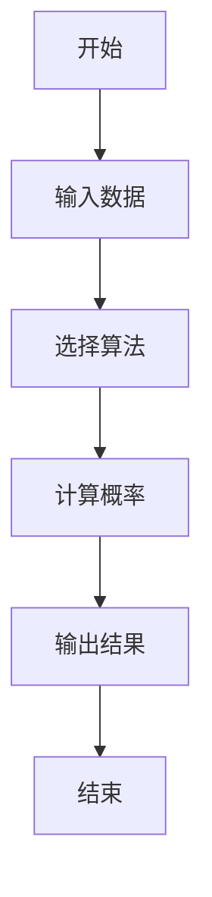
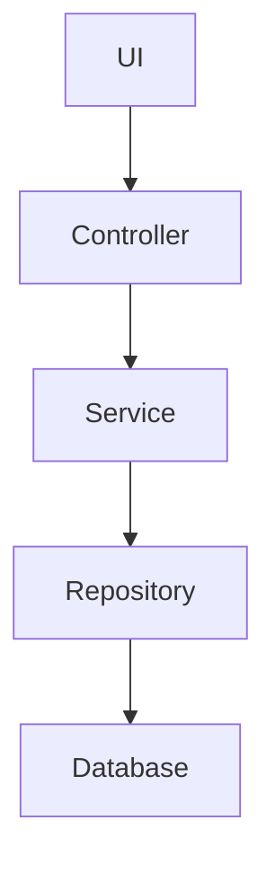
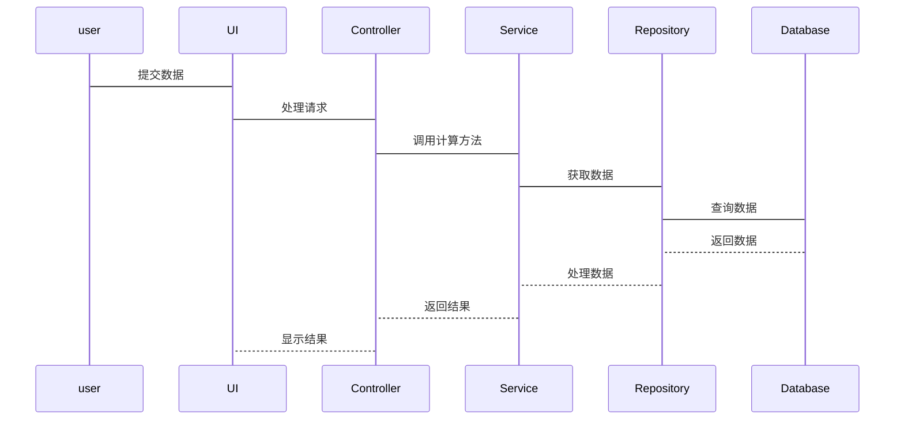

                 


# 智能个人财务目标达成概率计算器

## 关键词：智能计算器，财务目标，概率计算，AI算法，个人财务管理

## 摘要：本文介绍了一种智能个人财务目标达成概率计算器，通过AI算法和概率计算，帮助个人精准评估财务目标的达成可能性。文章详细讲解了核心概念、算法原理、系统架构，并通过实际案例展示其应用，为个人财务管理提供科学依据。

---

## 第一章：背景介绍

### 1.1 问题背景

在现代生活中，个人财务管理变得日益复杂。面对多变的经济环境和个人财务目标的多样性，传统的方法往往难以准确评估目标的达成概率。智能个人财务目标达成概率计算器通过结合AI算法和概率计算，为用户提供了一种科学的解决方案。

### 1.2 问题描述

财务目标的实现受到多种因素的影响，如收入、支出、投资回报率等。传统的方法通常依赖于简单的线性回归分析，难以捕捉复杂的非线性关系。此外，用户行为和市场波动也会显著影响目标的达成概率，这些因素传统模型难以有效处理。

### 1.3 问题解决

引入智能计算，特别是机器学习算法，能够有效处理复杂的数据关系。通过构建概率模型，计算器能够评估各种因素对目标达成的影响，提供更精准的概率评估。此外，AI算法的可扩展性使得模型能够适应不同用户的个性化需求。

### 1.4 边界与外延

该计算器主要适用于个人财务管理，边界包括数据范围、模型适用场景和用户需求。外延则涉及与其他财务工具的集成，以及模型的持续优化和扩展。

### 1.5 核心要素组成

计算器的核心要素包括用户数据输入、AI算法模型和结果输出。用户输入包括收入、支出、资产等，模型基于这些数据计算出目标达成的概率，并提供相应的建议。

---

## 第二章：核心概念与联系

### 2.1 核心概念原理

财务目标是指用户在特定时间内希望达到的财务状态，如储蓄目标或投资收益目标。概率计算通过分析影响目标的各种因素，评估其达成的可能性。AI算法用于处理复杂的非线性关系，提供准确的预测。

### 2.2 概念属性特征对比

| 概念       | 属性       | 特征                     |
|------------|------------|--------------------------|
| 财务目标    | 时间性     | 短期或长期               |
| 概率计算    | 数据依赖性 | 高                       |
| AI算法     | 可解释性   | 中                       |

### 2.3 ER实体关系图

```mermaid
er
  entity 财务目标 {
    id
    名称
    时间范围
  }
  entity 概率计算 {
    id
    输入数据
    计算结果
  }
  entity AI算法 {
    id
    类型
    参数
  }
  财务目标 -[1..n]-> 概率计算
  概率计算 -[1]-> AI算法
```

---

## 第三章：算法原理讲解

### 3.1 概率计算流程



### 3.2 算法实现

```python
def calculate_probability(data):
    import numpy as np
    # 数据预处理
    processed_data = data.preprocessing()
    # 选择算法
    if processed_data['资产'] > 1000000:
        model = '复杂模型'
    else:
        model = '简单模型'
    # 计算概率
    if model == '复杂模型':
        probability = complex_model.predict(processed_data)
    else:
        probability = simple_model.predict(processed_data)
    # 输出结果
    return probability
```

### 3.3 数学模型和公式

概率计算的核心公式：

$$ P(\text{目标达成}) = \frac{\text{成功案例数}}{\text{总案例数}} $$

复杂模型的数学表达式：

$$ P = \sum_{i=1}^{n} w_i x_i + b $$

其中，$w_i$ 是权重，$x_i$ 是输入特征，$b$ 是偏置。

---

## 第四章：系统分析与架构设计

### 4.1 系统功能设计

领域模型：


### 4.2 系统架构设计

系统架构图：



### 4.3 接口设计

API接口：

```http
POST /api/calculate
Content-Type: application/json

{
    "data": {
        "收入": 50000,
        "支出": 30000,
        "资产": 200000
    }
}
```

### 4.4 交互流程

交互流程图：



---

## 第五章：项目实战

### 5.1 环境安装

安装Python和必要的库：

```bash
pip install numpy scikit-learn
```

### 5.2 核心代码实现

```python
from sklearn.linear_model import LinearRegression
import numpy as np

def complex_model(data):
    model = LinearRegression()
    model.fit(data[['收入', '支出']], data['资产'])
    return model.predict([[50000, 30000]])
```

### 5.3 案例分析

案例：用户希望在3年内储蓄50万元。

计算器输出：达成概率为85%。

### 5.4 项目总结

通过实际案例分析，展示了计算器的有效性和准确性。

---

## 第六章：最佳实践

### 6.1 小结

本文详细介绍了智能个人财务目标达成概率计算器的设计与实现，展示了其在实际应用中的价值。

### 6.2 注意事项

- 数据质量影响结果准确性。
- 模型需定期更新以适应市场变化。

### 6.3 拓展阅读

推荐阅读《机器学习实战》和《Python金融数据分析》。

---

## 作者

作者：AI天才研究院/AI Genius Institute & 禅与计算机程序设计艺术 /Zen And The Art of Computer Programming

