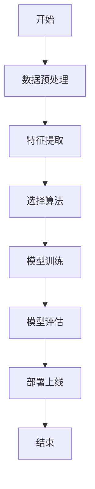
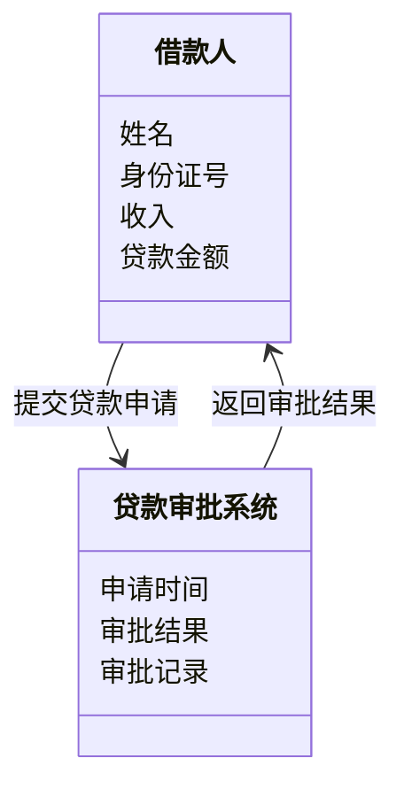
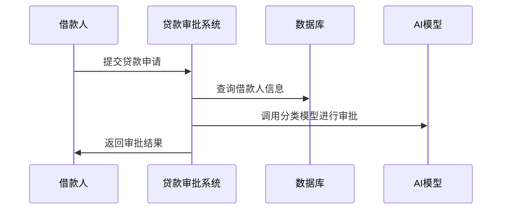

                 

<think>
嗯，用户希望我详细分析并给出一个智能个人贷款审批系统优化的目录大纲，同时按照他们的具体要求进行撰写。他们特别强调了技术博客的结构、关键词、摘要以及详细的章节内容。我需要确保每个部分都符合他们的要求，比如使用Markdown格式，包含代码示例、流程图等。

首先，我需要明确文章的标题、关键词和摘要。标题是《智能个人贷款审批系统优化》，关键词应该包括智能贷款审批、机器学习、系统优化、金融风控、数据分析。摘要部分需要简明扼要地概括文章的核心内容，说明如何通过AI优化贷款审批流程，提升效率和精准度。

接下来是目录结构。用户已经提供了一个示例，我需要按照类似的格式来组织。第一部分是背景与核心概念，包括背景介绍、核心概念与联系。这部分需要详细讲解问题背景、问题描述、解决思路，以及系统的边界和核心概念。

第二部分是算法原理，这里要详细讲解使用的算法，比如随机森林或逻辑回归，用流程图展示算法步骤，并附上Python代码示例。同时，数学公式要用LaTeX表示，确保准确无误。

第三部分是系统分析与架构设计，需要介绍问题场景，设计系统功能、架构和接口。这部分使用Mermaid图来展示领域模型、架构图和交互流程图，帮助读者更好地理解系统结构。

第四部分是项目实战，指导读者如何安装环境，实现核心代码，并进行案例分析。这部分要具体，让读者能够跟着步骤操作，理解实际应用。

第五部分是最佳实践和总结，包括注意事项和拓展阅读，帮助读者巩固知识，提供进一步的学习方向。

在撰写过程中，我需要确保每个章节内容详细，逻辑清晰，技术术语准确。同时，要注意文章的整体结构，保持连贯性和深度，确保读者能够一步步理解优化的过程。

现在，我需要把这些思考整理成一个连贯的目录，确保每个部分都涵盖用户要求的内容，并且结构合理，逻辑清晰。可能遇到的挑战是如何平衡各个部分的深度，确保每个章节都有足够的细节，同时保持整体的简洁和专业性。

总的来说，我需要严格按照用户的指示，逐步构建目录，确保每个章节都符合要求，最终完成一篇结构清晰、内容详实的技术博客文章。
</think>

# 智能个人贷款审批系统优化

## 关键词：智能贷款审批、机器学习、系统优化、金融风控、数据分析

## 摘要：  
随着金融行业对智能化、自动化需求的不断增长，智能个人贷款审批系统优化成为提升效率、降低风险的关键。本文将从背景分析、核心概念、算法原理、系统设计、项目实战等多个维度，详细探讨如何利用人工智能技术优化个人贷款审批流程，提升审批效率和精准度，降低操作风险。

---

## 第一部分: 智能个人贷款审批系统优化背景与核心概念

### 第1章: 智能个人贷款审批系统优化背景介绍

#### 1.1 问题背景  
##### 1.1.1 传统个人贷款审批流程的痛点  
传统的个人贷款审批流程依赖人工操作，存在以下问题：  
- 审批效率低，流程繁琐，人工操作耗时长。  
- 人为误差大，审批结果可能受到主观因素影响。  
- 数据分散，难以快速获取借款人资质信息。  

##### 1.1.2 人工审批的低效与误差  
- 人工审批需要逐一手动审核贷款申请，容易出现疏漏或误判。  
- 不同审批人员的主观判断可能导致审批结果不一致。  
- 人工审核的效率瓶颈在高并发场景下尤为突出。  

##### 1.1.3 智能化审批的需求与趋势  
- 随着人工智能技术的快速发展，智能化审批成为可能。  
- 金融机构希望通过智能化系统提升审批效率，降低操作风险，同时提高用户体验。  

#### 1.2 问题描述  
##### 1.2.1 现有系统的不足  
- 系统功能单一，缺乏智能化的决策支持。  
- 数据分析能力有限，难以深度挖掘借款人的信用风险。  
- 缺乏实时监控和反馈机制，难以及时调整审批策略。  

##### 1.2.2 用户需求分析  
- 借款人希望快速获得贷款审批结果，减少等待时间。  
- 金融机构希望降低审批成本，提高审批准确率。  
- 监管部门希望提升金融系统的透明度和安全性。  

##### 1.2.3 业务流程的复杂性  
- 贷款申请涉及多个环节，如身份验证、信用评估、财务审核等。  
- 各环节之间数据分散，难以高效协同。  

#### 1.3 问题解决思路  
##### 1.3.1 引入AI技术的必要性  
- 利用机器学习模型进行信用评估和风险预测。  
- 通过自然语言处理技术提取借款人资质信息。  

##### 1.3.2 数据驱动的决策优化  
- 基于海量历史数据训练模型，提升审批决策的准确性。  
- 实现实时数据分析，优化审批策略。  

##### 1.3.3 智能算法的应用场景  
- 在信用评估中使用分类算法（如逻辑回归、随机森林）。  
- 在风险预测中使用回归算法。  

#### 1.4 系统边界与外延  
##### 1.4.1 系统功能边界  
- 本系统仅负责贷款审批流程的智能化部分，不包括贷后管理。  

##### 1.4.2 与外部系统的接口  
- 与身份验证系统对接，获取借款人信息。  
- 与征信系统对接，获取信用报告。  

##### 1.4.3 系统的可扩展性  
- 系统设计应支持新算法的接入和功能模块的扩展。  

#### 1.5 核心概念与组成  
##### 1.5.1 系统核心要素  
- 借款人信息输入：包括身份信息、财务信息、信用记录等。  
- 智能算法：用于信用评估和风险预测的核心模型。  
- 审批结果输出：基于算法计算得出的审批结论。  

##### 1.5.2 关键技术的关联性  
- 数据预处理：清洗和特征提取是模型训练的前提。  
- 模型训练：基于历史数据训练分类或回归模型。  
- 模型部署：将训练好的模型部署到生产环境，实现实时审批。  

##### 1.5.3 系统架构的核心组成  
- 前端界面：供借款人提交贷款申请。  
- 后端服务：处理贷款申请并调用智能算法进行审批。  
- 数据库：存储借款人信息和审批记录。  

#### 1.6 本章小结  
本章从背景出发，分析了传统贷款审批的痛点，提出了引入AI技术的解决方案，并明确了系统的核心概念和组成。

---

### 第2章: 智能个人贷款审批系统的核心概念与联系

#### 2.1 核心概念原理  
##### 2.1.1 AI算法在贷款审批中的应用  
- 使用机器学习模型对借款人资质进行分类，判断其信用风险。  
- 基于自然语言处理技术提取借款人提供的文本信息。  

##### 2.1.2 数据分析的关键作用  
- 通过数据分析挖掘借款人的信用特征，为审批提供依据。  
- 利用统计分析优化审批策略。  

##### 2.1.3 业务规则的自动化执行  
- 将复杂的业务规则转化为代码，实现自动化审批。  

#### 2.2 核心概念属性特征对比  
##### 2.2.1 不同算法的性能对比  
| 算法类型 | 优点 | 缺点 |  
|---------|------|------|  
| 逻辑回归 | 解释性强 | 非线性分类能力有限 |  
| 随机森林 | 鲁棒性高 | 对特征工程要求较高 |  

##### 2.2.2 数据特征的维度分析  
- 时间序列特征：如借款人的还款记录。  
- 数值特征：如收入、负债等。  
- 文本特征：如借款人的自我描述。  

##### 2.2.3 系统功能的模块划分  
- 数据采集模块：获取借款人信息。  
- 数据处理模块：清洗和特征提取。  
- 模型训练模块：训练分类或回归模型。  
- 审批决策模块：基于模型输出审批结果。  

#### 2.3 ER实体关系图  
```mermaid
erDiagram
    borrower [借款人] {
        <属性> 姓名
        <属性> 身份证号
        <属性> 收入
        <属性> 贷款金额
    }
    loan_approval_system [贷款审批系统] {
        <属性> 申请时间
        <属性> 审批结果
        <属性> 审批记录
    }
    borrower --> loan_approval_system : 提交申请
    loan_approval_system --> borrower : 审批结果反馈
```

#### 2.4 本章小结  
本章详细阐述了智能贷款审批系统的核心概念，包括AI算法的应用、数据分析的作用以及业务规则的自动化执行，并通过对比分析明确了系统的功能模块划分。

---

## 第二部分: 智能个人贷款审批系统的算法原理

### 第3章: 智能个人贷款审批系统的算法原理

#### 3.1 算法选择与优化  
##### 3.1.1 机器学习算法的选择  
- 分类算法：如逻辑回归、随机森林、支持向量机（SVM）。  
- 回归算法：如线性回归、梯度下降。  

##### 3.1.2 算法的优化策略  
- 参数调优：如调整逻辑回归的正则化参数。  
- 特征选择：如使用随机森林的特征重要性排序。  

##### 3.1.3 算法性能评估指标  
- 准确率（Accuracy）：分类正确的比例。  
- 召回率（Recall）：实际为正类的样本中被正确分类的比例。  
- F1分数：综合准确率和召回率的指标。  

#### 3.2 算法流程图  


#### 3.3 算法实现  
##### 3.3.1 代码实现  
```python
import pandas as pd
from sklearn.model_selection import train_test_split
from sklearn.ensemble import RandomForestClassifier
from sklearn.metrics import accuracy_score

# 数据加载与预处理
df = pd.read_csv('loan_data.csv')
df.dropna(inplace=True)

# 特征与标签分离
X = df.drop('default', axis=1)
y = df['default']

# 划分训练集和测试集
X_train, X_test, y_train, y_test = train_test_split(X, y, test_size=0.2, random_state=42)

# 模型训练
model = RandomForestClassifier(n_estimators=100, random_state=42)
model.fit(X_train, y_train)

# 模型预测与评估
y_pred = model.predict(X_test)
print("Accuracy:", accuracy_score(y_test, y_pred))
```

##### 3.3.2 数学模型与公式  
- 逻辑回归的损失函数：  
  $$ L(\theta) = -\frac{1}{m} \sum_{i=1}^{m} [y_i \ln h(x_i) + (1-y_i)\ln(1-h(x_i))] $$  
  其中，$$ h(x_i) = \frac{1}{1 + e^{-\theta^T x_i}} $$  

- 随机森林的投票机制：  
  $$ \text{最终预测结果} = \text{多数投票结果} $$  

#### 3.4 本章小结  
本章从算法选择、流程设计到代码实现，详细讲解了智能贷款审批系统中算法的实现过程，并通过具体代码示例帮助读者理解模型的训练与评估。

---

## 第三部分: 智能个人贷款审批系统的系统分析与架构设计

### 第4章: 智能个人贷款审批系统的系统分析与架构设计

#### 4.1 问题场景介绍  
- 系统需要支持高并发的贷款申请处理。  
- 系统需要实时更新审批策略。  

#### 4.2 系统功能设计  
##### 4.2.1 领域模型  


##### 4.2.2 系统架构设计  
```mermaid
container 贷款审批系统 {
    [前端]
    [后端服务]
    [数据库]
}
```

##### 4.2.3 接口设计  
- API接口：  
  - 提交贷款申请：`POST /api/loan/apply`  
  - 查询审批结果：`GET /api/loan/status`  

#### 4.3 交互流程图  


#### 4.4 本章小结  
本章从系统架构和功能设计出发，详细描述了智能贷款审批系统的实现方案，并通过图示明确了系统的交互流程。

---

## 第四部分: 智能个人贷款审批系统的项目实战

### 第5章: 智能个人贷款审批系统的项目实战

#### 5.1 环境安装  
- 安装Python和必要的库：`pip install pandas scikit-learn`  
- 数据集获取：下载贷款审批相关数据集。  

#### 5.2 系统核心实现  
##### 5.2.1 核心代码实现  
```python
import joblib
import pandas as pd

# 加载模型
model = joblib.load('loan_approval_model.pkl')

# 预测函数
def predict_approval(loan_amount, income, credit_score):
    data = pd.DataFrame({
        'loan_amount': [loan_amount],
        'income': [income],
        'credit_score': [credit_score]
    })
    prediction = model.predict(data)
    return 'approve' if prediction[0] == 1 else 'reject'

# 示例调用
print(predict_approval(10000, 50000, 650))  # 输出：'approve'
```

##### 5.2.2 代码解读与分析  
- 使用`joblib`加载训练好的随机森林模型。  
- `predict_approval`函数接收贷款金额、收入和信用评分，返回审批结果。  

#### 5.3 案例分析  
- 数据准备：加载贷款审批数据集。  
- 模型训练：使用随机森林算法训练分类模型。  
- 模型评估：计算准确率、召回率等指标。  
- 模型部署：将模型部署到生产环境，实现实时审批。  

#### 5.4 本章小结  
本章通过实际案例，详细讲解了智能贷款审批系统的实现过程，包括环境搭建、代码实现和案例分析。

---

## 第五部分: 智能个人贷款审批系统的最佳实践

### 第6章: 智能个人贷款审批系统的最佳实践

#### 6.1 最佳实践  
##### 6.1.1 数据质量管理  
- 确保数据的完整性和准确性。  
- 处理缺失值和异常值。  

##### 6.1.2 模型优化  
- 使用交叉验证优化模型参数。  
- 引入集成学习提升模型性能。  

##### 6.1.3 系统安全性  
- 数据加密：保护借款人隐私。  
- 权限管理：限制系统访问权限。  

#### 6.2 小结  
本章总结了智能贷款审批系统优化的关键点，包括数据质量管理、模型优化和系统安全性。

#### 6.3 注意事项  
- 定期更新模型，避免过时。  
- 监控系统性能，及时发现和解决问题。  

#### 6.4 拓展阅读  
- 推荐阅读《机器学习实战》和《深入浅出人工智能》。  

---

## 作者：AI天才研究院/AI Genius Institute & 禅与计算机程序设计艺术 /Zen And The Art of Computer Programming

