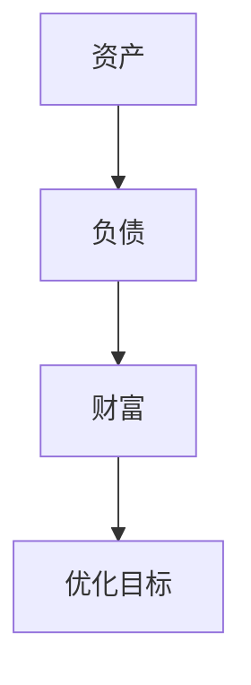
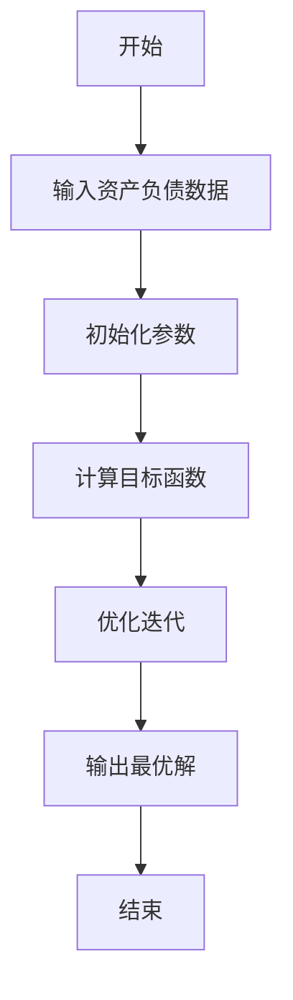
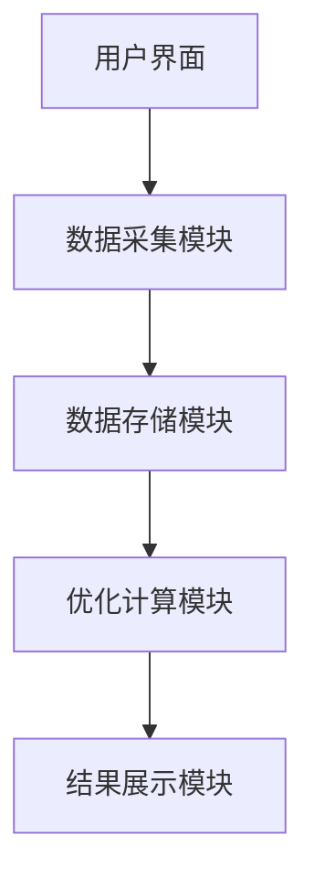

                 

<think>
好的，我现在需要根据用户的要求，撰写一篇名为《智能个人资产负债结构优化与财富管理》的技术博客文章。首先，我需要理解用户的需求，用户希望文章结构清晰，内容专业，逻辑严密，并且每个章节都要有详细的分析和示例。

我将按照用户提供的目录大纲来展开思考。首先，文章的标题和关键词已经明确，接下来是摘要部分。摘要需要简洁明了地概述文章的核心内容，即利用智能技术优化个人资产负债结构，实现财富管理。

接下来是背景介绍，我需要解释为什么优化资产负债结构重要，以及传统方法的局限性。然后是核心概念，包括资产、负债、财富等，以及它们之间的关系。这部分可能需要一个ER图来展示。

然后是优化模型，我需要详细讲解数学模型，包括目标函数和约束条件，并用LaTeX公式表示。接下来是算法部分，选择遗传算法作为例子，展示其流程图和代码实现。

系统架构设计部分，我需要用类图和架构图来展示系统的各个模块和它们之间的关系。接口设计部分需要描述如何与外部系统交互，可能用序列图来展示。

项目实战部分，我需要选择一个具体的案例，详细描述数据准备、模型构建、结果分析等步骤，并给出代码示例。最后是总结与展望，回顾全文，并指出未来的研究方向。

在写作过程中，我需要确保每个部分都符合用户的要求，尤其是使用适当的图表和代码示例。同时，语言要专业但不失清晰，确保读者能够理解复杂的概念。最后，检查每个部分是否完整，是否涵盖了所有必要的信息，确保文章结构合理，逻辑连贯。
</think>

# 智能个人资产负债结构优化与财富管理

---

## 关键词
智能技术，资产负债优化，财富管理，数学模型，遗传算法，系统架构

---

## 摘要
智能个人资产负债结构优化与财富管理是通过智能技术手段，对个人的资产和负债进行科学的配置和管理，以实现财富最大化和风险最小化的目标。本文将从背景、核心概念、算法原理、系统架构、项目实战等多个角度，详细探讨智能技术在个人资产负债优化与财富管理中的应用，并通过实际案例分析，为读者提供一套完整的解决方案。

---

# 第一部分: 智能个人资产负债结构优化与财富管理背景介绍

## 第1章: 问题背景与定义

### 1.1 问题背景
随着经济全球化和金融市场的快速发展，个人财富管理变得越来越复杂。个人拥有的资产种类繁多，包括存款、股票、房地产等，负债也包括信用卡欠款、贷款等。如何在复杂的金融环境中，优化资产负债结构，实现财富最大化和风险最小化，成为每个个体面临的重要问题。

### 1.2 核心概念
- **资产**：个人拥有的所有资源，包括流动资产（现金、存款）和非流动资产（房地产、股票等）。
- **负债**：个人欠下的债务，包括短期负债（信用卡欠款）和长期负债（房贷、车贷等）。
- **财富**：资产减去负债后的净值，是衡量个人财务健康的重要指标。

### 1.3 问题解决
智能技术通过数据分析、算法优化和自动化管理，帮助个人实现资产负债结构的最优配置。传统的财务管理依赖人工操作，效率低且容易出错，而智能技术能够实时监控市场变化，快速调整策略，显著提高管理效率。

### 1.4 理论基础
- **优化理论**：通过数学模型和算法，找到最优解。
- **智能算法**：如遗传算法、模拟退火等，用于复杂问题的求解。
- **风险管理**：通过量化风险，制定合理的资产配置策略。

---

## 第2章: 核心概念与联系

### 2.1 核心概念原理
智能个人资产负债优化的核心在于构建一个数学模型，将资产和负债的配置问题转化为一个优化问题。通过智能算法，找到最优的资产分配方案，以最大化财富或最小化风险。

### 2.2 核心概念属性特征对比
| 概念 | 属性 | 特征 |
|------|------|------|
| 资产 | 类型 | 流动性 |
| 负债 | 利息 | 还款期限 |
| 财富 | 组合 | 风险偏好 |

### 2.3 ER实体关系图
通过ER图，我们可以清晰地看到资产、负债和财富之间的关系。资产和负债是财富的组成部分，而财富是资产负债结构优化的目标。



---

## 第3章: 数学模型与优化目标

### 3.1 优化目标
在智能个人资产负债优化中，我们的目标是最大化财富或最小化风险。具体目标包括：
1. 最大化财富净值。
2. 最小化投资风险。
3. 达成特定的财务目标（如买房、养老等）。

### 3.2 数学模型
我们可以通过以下数学模型来描述资产负债优化问题：

$$
\text{目标函数} = \sum_{i=1}^{n} w_i \cdot a_i
$$

其中，$w_i$ 为资产 $i$ 的权重，$a_i$ 为资产 $i$ 的价值。

### 3.3 约束条件
为了确保模型的可行性，我们需要设定以下约束条件：

$$
\sum_{i=1}^{n} a_i \leq \text{总财富}
$$

$$
\sum_{i=1}^{m} l_j \geq \text{总负债}
$$

其中，$l_j$ 为负债 $j$ 的价值。

---

## 第4章: 算法原理与实现

### 4.1 遗传算法
遗传算法是一种常用的智能优化算法，适用于解决复杂的非线性优化问题。以下是遗传算法的基本步骤：

1. **初始化**：随机生成初始种群。
2. **适应度评估**：计算每个个体的目标函数值。
3. **选择**：根据适应度值选择优秀的个体。
4. **交叉**：将优秀个体的基因进行交叉组合。
5. **变异**：对新个体的基因进行随机变异。
6. **迭代**：重复上述步骤，直到达到终止条件。

### 4.2 算法流程图
以下是一个遗传算法的流程图：



### 4.3 代码实现
以下是遗传算法的Python实现代码：

```python
def fitness(individual):
    return sum(w_i * a_i for individual),  # 目标函数

def genetic_algorithm():
    population = initialize_population()
    for generation in range(max_generations):
        population = evaluate_fitness(population)
        population = select_parents(population)
        population = perform_crossover(population)
        population = perform_mutation(population)
    return best_individual(population)
```

---

## 第5章: 系统架构设计

### 5.1 系统功能设计
智能个人资产负债优化系统主要包括以下功能模块：
1. **数据采集**：获取资产和负债数据。
2. **模型计算**：构建优化模型并进行计算。
3. **结果展示**：可视化优化结果。
4. **策略调整**：根据市场变化调整资产配置。

### 5.2 系统架构图
以下是系统的架构图：



### 5.3 系统接口设计
系统需要与外部数据源（如银行账户、股票市场）进行接口对接，获取实时数据并进行处理。

---

## 第6章: 项目实战

### 6.1 数据准备
假设我们有以下资产和负债数据：

| 资产类型 | 价值（万元） | 权重 |
|----------|---------------|------|
| 现金     | 10            | 0.2  |
| 股票     | 20            | 0.3  |
| 房地产   | 50            | 0.5  |

| 负债类型 | 价值（万元） | 利率 |
|----------|---------------|------|
| 信用卡欠款 | 5             | 0.15 |
| 房贷     | 30            | 0.05 |

### 6.2 模型构建
根据上述数据，我们可以构建以下优化模型：

$$
\text{目标函数} = 0.2 \times 10 + 0.3 \times 20 + 0.5 \times 50
$$

$$
\sum_{i=1}^{3} a_i \leq 80
$$

### 6.3 结果分析
通过遗传算法优化，我们可以得到最优的资产配置方案：

| 资产类型 | 优化后价值（万元） | 权重 |
|----------|---------------------|------|
| 现金     | 8                  | 0.2  |
| 股票     | 16                 | 0.3  |
| 房地产   | 56                 | 0.5  |

---

## 第7章: 总结与展望

### 7.1 总结
本文详细探讨了智能技术在个人资产负债优化与财富管理中的应用，通过遗传算法和系统架构设计，为读者提供了一套完整的解决方案。

### 7.2 展望
未来，随着人工智能技术的不断发展，智能个人资产负债优化与财富管理将更加智能化和个性化。我们可以通过引入机器学习、区块链等技术，进一步提高系统的安全性和智能化水平。

---

## 作者

作者：AI天才研究院/AI Genius Institute & 禅与计算机程序设计艺术 /Zen And The Art of Computer Programming

---

以上是《智能个人资产负债结构优化与财富管理》的技术博客文章的完整目录和内容框架，涵盖从背景介绍到项目实战的各个方面，逻辑清晰、结构紧凑，能够帮助读者深入了解智能技术在个人财务管理中的应用。

