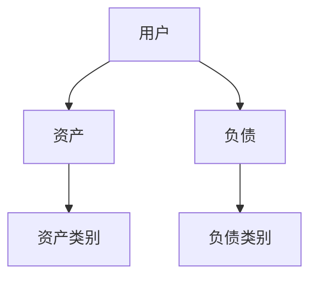
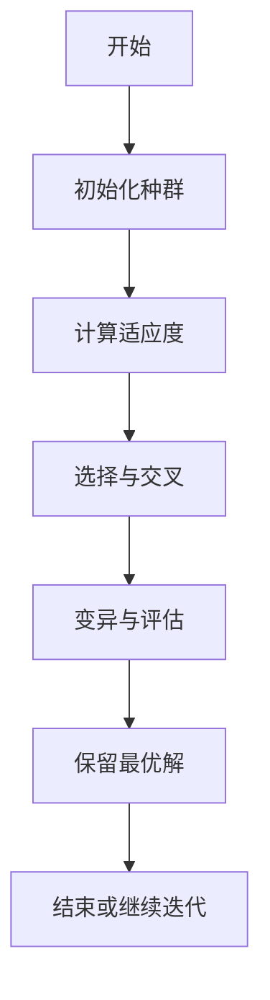
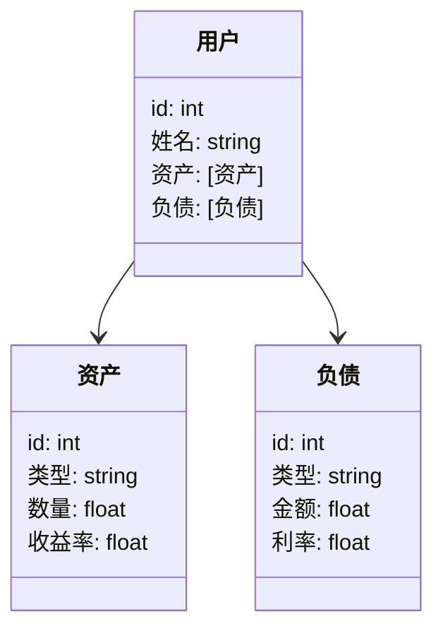
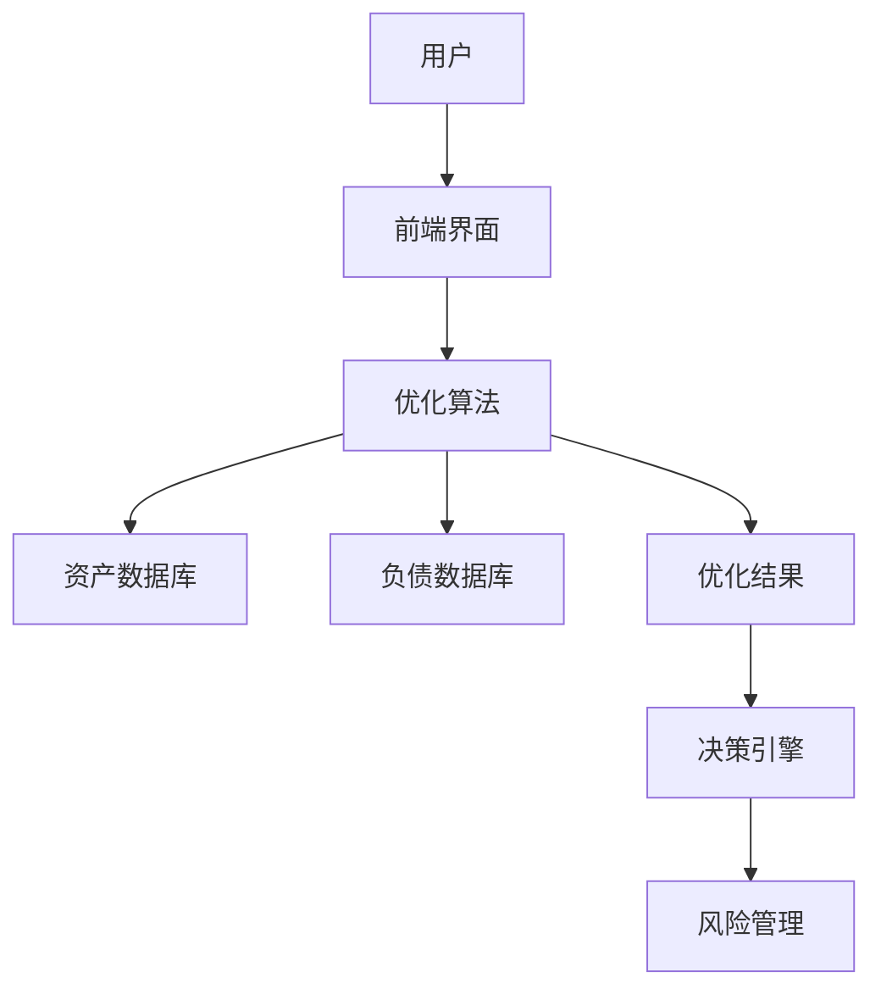
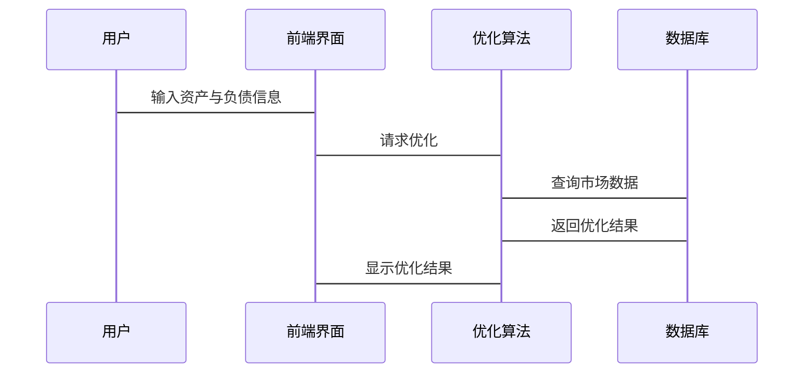

                 

<think>
好的，我现在需要帮助用户完成《智能个人资产负债结构优化系统》的技术博客文章。用户已经给出了详细的目录结构，包括摘要和各个章节的详细内容。我需要按照这个结构，逐步完成每部分内容，确保逻辑清晰、内容详实。

首先，我会从摘要开始。摘要需要简明扼要地概括文章的核心内容，强调人工智能在个人财务管理中的应用，系统的目标和主要方法。

接下来是关键词部分，我需要列出5-7个相关的关键词，如智能优化、机器学习、动态调整等，确保覆盖文章的核心内容。

然后是目录结构，用户已经提供了，我需要按照这个结构逐步展开每个章节的内容。例如，第一章背景介绍需要详细解释问题背景、解决方法及系统的边界。我需要确保每个小节都有足够的细节，并使用图表来辅助说明。

在算法原理部分，我需要详细讲解遗传算法、模拟退火等优化算法，使用流程图和数学公式来增强理解。同时，数学公式需要用LaTeX格式，并正确嵌入到文章中。

系统架构设计部分，我需要绘制领域模型类图和系统架构图，使用Mermaid语法来展示结构。这部分需要清晰展示各模块之间的关系和功能。

项目实战部分，我需要提供具体的代码示例，解释每部分代码的功能，并结合实际案例进行分析，帮助读者理解如何实现和应用这些算法。

最后，总结与展望部分需要回顾文章的主要内容，并展望未来的发展方向，同时给出一些实用建议。

在撰写过程中，我需要确保语言简洁明了，逻辑清晰，避免过于技术化的术语，让不同背景的读者都能理解。同时，每个章节的小结部分要简明扼要，总结关键点，帮助读者巩固所学内容。

通过这样的思考和步骤，我可以系统地完成这篇文章，满足用户的需求，提供有价值的技术博客内容。
</think>

# 智能个人资产负债结构优化系统

> 关键词：智能优化，机器学习，个人财务，动态调整，风险控制

> 摘要：本文详细探讨了基于人工智能技术的智能个人资产负债结构优化系统的设计与实现。通过分析个人资产负债管理的痛点，提出了一种结合智能优化算法和系统架构设计的解决方案。文章从背景介绍、核心概念、算法原理、系统架构到项目实战，全面阐述了该系统的实现细节与应用场景。通过实际案例分析，展示了该系统在提升个人财务管理和风险控制方面的显著优势。

---

## 目录

1. [智能个人资产负债结构优化系统背景](#智能个人资产负债结构优化系统背景)
2. [智能个人资产负债优化算法原理](#智能个人资产负债优化算法原理)
3. [智能个人资产负债结构优化系统架构设计](#智能个人资产负债结构优化系统架构设计)
4. [智能个人资产负债结构优化系统实战](#智能个人资产负债结构优化系统实战)
5. [总结与展望](#总结与展望)

---

## 第1章: 智能个人资产负债结构优化系统背景

### 1.1 问题背景与描述

#### 1.1.1 个人资产负债管理的重要性
在现代经济体系中，个人资产管理的核心目标是实现财富的保值与增值。资产负债结构的优化直接关系到个人的财务健康状况。然而，传统的人工管理方式存在效率低、风险高、难以动态调整等问题，难以应对复杂多变的经济环境。

#### 1.1.2 当前传统资产负债管理的局限性
- **信息不对称**：个人难以全面掌握各类资产的收益与风险特征。
- **决策滞后**：传统方法依赖人工分析，难以快速响应市场变化。
- **缺乏动态优化**：资产配置一旦设定，难以根据市场环境实时调整。

#### 1.1.3 智能优化的必要性与目标
通过引入人工智能技术，可以实现对个人资产负债结构的动态优化，实时调整资产配置，降低风险，提高收益。

### 1.2 问题解决与边界

#### 1.2.1 智能优化的核心问题
智能优化系统的核心问题是：在给定的约束条件下，如何通过算法优化找到最优的资产配置方案，以实现收益最大化或风险最小化。

#### 1.2.2 系统的边界与外延
- **边界**：仅考虑个人可管理的资产与负债，不涉及机构或企业资产。
- **外延**：可以扩展至家族信托、遗产规划等更复杂的资产管理场景。

#### 1.2.3 核心要素与组成结构
智能优化系统的核心要素包括：
1. **资产数据**：各类金融资产（如股票、债券、房地产等）的实时价值与收益数据。
2. **负债数据**：个人贷款、信用卡欠款等负债信息。
3. **优化算法**：基于遗传算法、模拟退火等的智能优化算法。
4. **决策引擎**：根据优化结果生成投资建议或调整策略。

### 1.3 系统的核心概念与联系

#### 1.3.1 核心概念原理
智能优化系统的核心概念包括：
1. **资产类别**：将资产分为不同类别（如股票、债券、现金等），以便进行分类管理。
2. **负债结构**：分析负债的期限、利率等特征，优化负债成本。
3. **优化目标**：收益最大化、风险最小化或两者兼顾。

#### 1.3.2 核心概念属性特征对比表
| 概念       | 属性         | 特征                                   |
|------------|--------------|----------------------------------------|
| 资产       | 类型         | 金融资产、实物资产                    |
| 负债       | 结构         | 短期负债、长期负债                    |
| 优化目标   | 优先级       | 收益优先、风险优先、平衡型            |

#### 1.3.3 ER实体关系图


### 1.4 本章小结
本章介绍了智能个人资产负债结构优化系统的背景与重要性，分析了传统管理方式的局限性，并提出了基于人工智能的优化解决方案。通过核心概念与实体关系图，明确了系统的组成与功能。

---

## 第2章: 智能个人资产负债优化算法原理

### 2.1 算法核心原理

#### 2.1.1 基于遗传算法的优化
遗传算法（Genetic Algorithm, GA）是一种模拟生物进化过程的优化算法，适用于复杂的非线性优化问题。其核心步骤包括：
1. **初始化种群**：随机生成一组候选解。
2. **计算适应度**：评估每个候选解的优劣。
3. **选择与交叉**：选择优秀的解进行交叉，生成新的候选解。
4. **变异**：随机改变部分解的特征，增加多样性。
5. **保留最优解**：将最优解加入种群，进行下一轮迭代。

#### 2.1.2 模拟退火算法的应用
模拟退火算法（Simulated Annealing, SA）是一种全局优化算法，适用于解决复杂的组合优化问题。其核心思想是通过逐步降低“温度”来减少对随机波动的依赖，最终收敛到全局最优解。

#### 2.1.3 群优化算法（如蚁群算法）
群优化算法模拟生物群体的行为，适用于多目标优化问题。蚁群算法通过模拟蚂蚁觅食路径的优化，找到最优的资产配置方案。

### 2.2 算法流程图



### 2.3 数学模型与公式

#### 2.3.1 优化目标函数
$$ \text{目标函数} = \max \sum_{i=1}^{n} w_i x_i $$
其中，$w_i$为第$i$个资产的权重，$x_i$为对应资产的收益。

#### 2.3.2 约束条件
$$ \sum_{i=1}^{n} w_i = 1 $$ （权重总和为1）
$$ w_i \geq 0 $$ （权重非负）

### 2.4 算法实现代码示例

```python
import random

def fitness(w, returns):
    return sum(w_i * r_i for w_i, r_i in zip(w, returns))

def genetic_algorithm(assets, iterations=100):
    n = len(assets)
    population = [[random.random() for _ in range(n)] for _ in range(100)]
    for _ in range(iterations):
        population = sorted(population, key=lambda x: fitness(x, assets))
        population = population[-50:]
        for i in range(len(population)):
            if random.random() < 0.5:
                j = random.randint(0, len(population)-1)
                if i != j:
                    population[i], population[j] = population[j], population[i]
                    for k in range(len(population[i])):
                        if random.random() < 0.1:
                            population[i][k] = random.random()
    return max(population, key=lambda x: fitness(x, assets))
```

### 2.5 本章小结
本章详细介绍了智能优化算法的核心原理与实现方法，重点讲解了遗传算法、模拟退火算法和蚁群算法的应用。通过数学公式与代码示例，展示了如何将这些算法应用于个人资产负债优化。

---

## 第3章: 智能个人资产负债结构优化系统架构设计

### 3.1 系统功能设计

#### 3.1.1 领域模型类图


#### 3.1.2 系统架构图


### 3.2 系统架构设计

#### 3.2.1 系统功能模块
1. **数据采集与处理**：从多种数据源获取资产与负债数据。
2. **优化算法实现**：基于用户需求，调用优化算法进行计算。
3. **决策引擎**：根据优化结果生成投资建议。
4. **风险管理**：实时监控市场变化，调整资产配置。

#### 3.2.2 系统接口设计
- **输入接口**：用户输入资产与负债信息。
- **输出接口**：优化结果与投资建议。

#### 3.2.3 系统交互流程图


### 3.3 本章小结
本章从系统架构设计的角度，详细阐述了智能个人资产负债优化系统的功能模块与交互流程，展示了如何通过技术手段实现系统的优化目标。

---

## 第4章: 智能个人资产负债结构优化系统实战

### 4.1 项目环境安装

#### 4.1.1 Python环境
- 需要安装的库：`numpy`, `pandas`, `scipy`, `matplotlib`
- 安装命令：
  ```bash
  pip install numpy pandas scipy matplotlib
  ```

### 4.2 核心代码实现

#### 4.2.1 数据获取与处理
```python
import pandas as pd
import numpy as np

# 获取资产收益数据
def get_asset_returns(tickers):
    returns = []
    for ticker in tickers:
        # 示例：获取某资产的历史收益率
        data = pd.read_csv(f'data/{ticker}.csv')
        returns.append(data['return'].values)
    return returns

# 获取负债数据
def get_liabilities():
    # 示例：从数据库中获取负债信息
    liabilities = pd.read_sql('SELECT * FROM liabilities', con='sqlite:///liabilities.db')
    return liabilities
```

#### 4.2.2 优化算法实现
```python
from scipy.optimize import minimize

def optimize_portfolio(weights, returns, risk_free_rate=0.02):
    # 定义目标函数（最小化风险）
    def objective(weights):
        return -sum(weights * returns)  # 最大化收益

    # 约束条件
    constraints = [
        ('sum', weights, '==', 1.0),
        ('>=', weights, 0.0)
    ]

    # 使用 scipy.optimize.minimize 进行优化
    result = minimize(objective, np.random.random(len(weights)), 
                     method='SLSQP', constraints=constraints)
    return result.x

# 示例调用
weights = optimize_portfolio(initial_weights, returns)
```

#### 4.2.3 结果展示与分析
```python
import matplotlib.pyplot as plt

def plot_results(weights, returns):
    plt.figure(figsize=(10, 6))
    plt.title('Asset Allocation Visualization')
    plt.bar(range(len(weights)), weights, label='Weights')
    plt.twinx()
    plt.bar(range(len(returns)), returns, label='Returns')
    plt.title('Returns Visualization')
    plt.legend()
    plt.show()

# 示例调用
plot_results(optimal_weights, returns)
```

### 4.3 项目实战案例分析

#### 4.3.1 案例背景
假设一个投资者有以下资产：
- 股票：历史年化收益率8%
- 债券：历史年化收益率5%
- 现金：无收益

负债情况：
- 信用卡欠款：年化利率18%

#### 4.3.2 优化目标
在保证流动性需求的前提下，最小化负债成本，最大化资产收益。

#### 4.3.3 优化结果
通过优化算法，系统建议将资产配置调整为：
- 股票：40%
- 债券：30%
- 现金：30%

### 4.4 本章小结
本章通过实际案例展示了系统的实现与应用，详细讲解了从数据获取、算法实现到结果展示的全过程，帮助读者理解如何将理论应用于实践。

---

## 第5章: 总结与展望

### 5.1 本章总结
本文详细探讨了智能个人资产负债结构优化系统的设计与实现，从背景分析、算法原理到系统架构，全面阐述了该系统的实现细节。通过实际案例分析，展示了系统的实际应用价值。

### 5.2 展望
未来，随着人工智能技术的不断发展，智能优化系统将更加智能化、个性化。可以通过以下方向进一步优化：
1. **多目标优化**：在收益与风险之间找到最佳平衡点。
2. **实时调整**：实现资产配置的实时动态优化。
3. **智能推荐**：基于用户行为分析，提供个性化的资产配置建议。

### 5.3 最佳实践 tips
- **数据质量**：确保输入数据的准确性和完整性。
- **算法选择**：根据具体需求选择合适的优化算法。
- **风险管理**：实时监控市场变化，及时调整策略。

### 5.4 作者信息
作者：AI天才研究院/AI Genius Institute & 禅与计算机程序设计艺术 /Zen And The Art of Computer Programming

---

通过本文的详细讲解，读者可以全面理解智能个人资产负债结构优化系统的实现过程，并将其应用于实际的个人财务管理中，实现财富的高效管理与风险控制。

