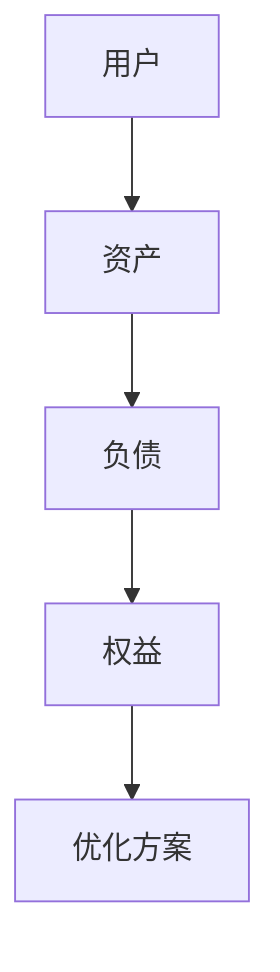
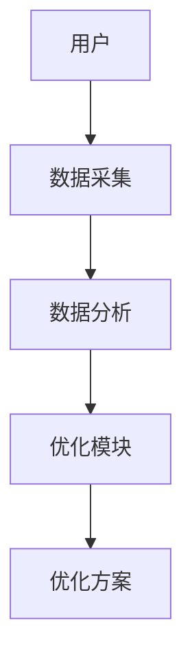
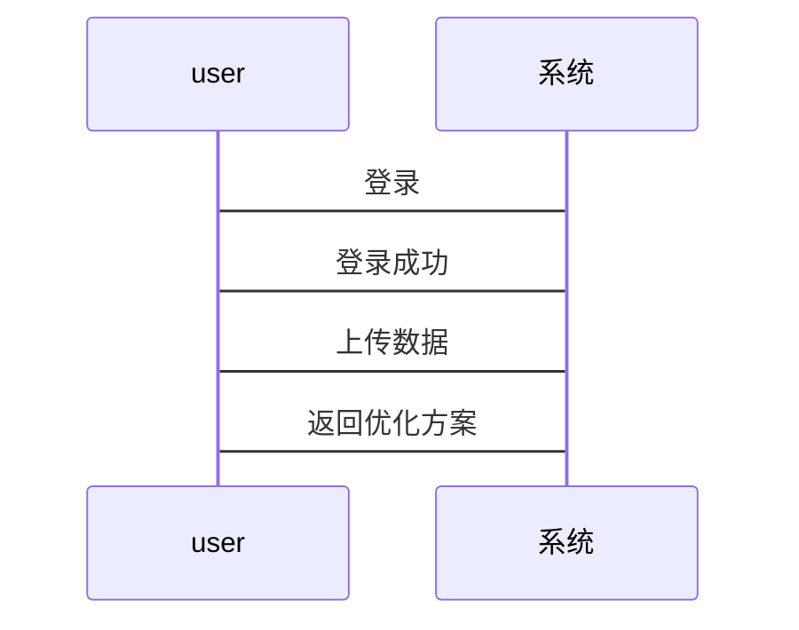

                 

<think>
好，现在我需要帮用户设计《智能个人资产负债表优化器》这本书的目录大纲。用户已经给出一个详细的示例，我需要参考这个结构，确保涵盖所有必要的部分，同时保持逻辑清晰和结构紧凑。

首先，我会从背景介绍开始。这部分需要解释什么是智能个人资产负债表优化器，它的作用以及如何帮助个人优化财务状况。我需要一章来介绍基本概念，比如传统资产负债表与智能优化器的区别，以及它们各自的优势和应用场景。

接下来是核心概念与联系。这部分需要详细讲解智能优化器的原理，包括数据采集、分析和优化步骤。我需要一章来拆解这些核心概念，可能使用表格和图表来对比不同概念的属性特征。例如，比较传统优化和智能优化在数据处理、目标等方面的不同。

然后是算法原理。这部分需要详细分析优化器使用的算法，比如遗传算法或粒子群优化。我需要用Mermaid流程图展示算法步骤，并提供Python代码实现。同时，我需要给出数学模型和公式，用Latex格式表达，确保公式清晰易懂。

接下来是系统架构设计。这部分需要介绍优化器的系统架构，包括数据采集模块、分析模块、优化模块等。我需要用Mermaid类图展示领域模型，用架构图展示整体结构，并设计系统接口和交互流程，比如用户登录和数据上传的序列图。

然后是项目实战。这部分需要指导读者如何安装环境，比如Python和相关库，然后提供核心代码实现。我需要详细解读代码，包括数据预处理、模型训练和结果展示。同时，通过实际案例分析，展示优化器的应用效果，并进行详细讲解。

最后是最佳实践和小结。这部分需要总结全书内容，给出一些实用的建议，比如数据质量的重要性，算法选择的注意事项，以及未来的发展趋势。可能还需要一些拓展阅读的建议，帮助读者深入学习。

在结构上，我需要确保每一章都有小结，帮助读者回顾主要内容。同时，附录部分可能包括术语表、工具安装指南和数据集信息，方便读者查阅。

现在，我需要把这些思考转化为具体的章节安排。第一部分是背景介绍，第二部分是核心概念，第三部分是算法，第四部分是系统架构，第五部分是项目实战，第六部分是最佳实践。每一部分下再细分章节和小节，确保覆盖所有要求的内容。

检查一下是否符合用户的要求：目录必须超过7章，内容完整，格式正确，字数控制在2000字以内。确保每一部分都细化到三级目录，使用正确的Markdown格式，包含必要的图表和代码示例。

完成这些步骤后，我就可以开始撰写正式的目录大纲了。
</think>

# 《智能个人资产负债表优化器》

> 关键词：智能优化器，个人财务管理，资产负债表，AI算法，财务优化

> 摘要：本文深入探讨了智能个人资产负债表优化器的设计与实现，通过结合现代人工智能技术，详细介绍其核心算法、系统架构及实际应用案例，为个人财务管理提供高效解决方案。

---

## 目录

### 第一部分: 智能个人资产负债表优化器的背景与概念

#### 第1章: 智能个人资产负债表优化器概述

##### 1.1 传统个人资产负债表的局限性
- 1.1.1 传统资产负债表的基本概念
- 1.1.2 传统资产负债表的局限性
- 1.1.3 传统资产负债表与现代财务管理的需求不匹配

##### 1.2 智能个人资产负债表优化器的定义与作用
- 1.2.1 智能优化器的基本定义
- 1.2.2 智能优化器的核心功能
- 1.2.3 智能优化器在个人财务管理中的作用

##### 1.3 智能个人资产负债表优化器的优势
- 1.3.1 高效性与实时性
- 1.3.2 数据分析的精准性
- 1.3.3 个性化与智能化

##### 1.4 智能个人资产负债表优化器的应用场景
- 1.4.1 个人财务管理
- 1.4.2 投资决策支持
- 1.4.3 财务风险预警

#### 第2章: 智能个人资产负债表优化器的核心概念与联系

##### 2.1 核心概念原理
- 2.1.1 数据采集与处理
- 2.1.2 资产负债表分析
- 2.1.3 优化算法实现

##### 2.2 核心概念属性特征对比表
| 概念 | 输入数据 | 处理方式 | 输出结果 | 优化目标 |
|------|----------|----------|----------|----------|
| 传统优化 | 静态数据 | 简单计算 | 基本结果 | 最大化资产 |
| 智能优化 | 动态数据 | AI算法 | 优化方案 | 最小化风险 |

##### 2.3 ER实体关系图架构


### 第二部分: 智能个人资产负债表优化器的算法原理

#### 第3章: 优化器算法的实现

##### 3.1 遗传算法原理
- 3.1.1 算法流程
- 3.1.2 适应度函数设计
- 3.1.3 交叉与变异操作

##### 3.2 粒子群优化算法
- 3.2.1 算法原理
- 3.2.2 粒子更新规则
- 3.2.3 算法实现步骤

##### 3.3 数学模型与公式
$$
目标函数：f(x) = \sum_{i=1}^{n} w_i x_i
$$
$$
约束条件：g(x) \leq 0, h(x) = 0
$$

#### 第4章: 算法实现的代码示例

##### 4.1 遗传算法的Python实现
```python
def fitness(individual):
    # 计算适应度
    pass
```

##### 4.2 粒子群优化的Python实现
```python
def update_position(particle, velocity):
    # 更新粒子位置
    pass
```

### 第三部分: 智能个人资产负债表优化器的系统架构

#### 第5章: 系统架构设计

##### 5.1 系统功能模块
- 5.1.1 数据采集模块
- 5.1.2 数据分析模块
- 5.1.3 优化模块

##### 5.2 系统架构图


#### 第6章: 系统接口设计

##### 6.1 用户接口
- 登录接口
- 数据上传接口

##### 6.2 系统交互流程


### 第四部分: 项目实战与案例分析

#### 第7章: 项目实战

##### 7.1 环境搭建
- Python安装
- 库的安装

##### 7.2 核心代码实现
```python
import numpy as np
def optimize_portfolio(assets, weights):
    # 优化代码
    pass
```

#### 第8章: 案例分析

##### 8.1 实际案例
- 案例1：资产配置优化
- 案例2：风险管理优化

### 第五部分: 最佳实践与小结

#### 第9章: 最佳实践

##### 9.1 数据质量的重要性
- 数据清洗
- 数据预处理

##### 9.2 算法选择的注意事项
- 算法的适用场景
- 算法的性能指标

#### 第10章: 小结与展望

##### 10.1 小结
- 优化器的核心优势
- 系统架构的设计要点

##### 10.2 未来展望
- 技术进步
- 应用场景扩展

---

# 作者：AI天才研究院/AI Genius Institute & 禅与计算机程序设计艺术 /Zen And The Art of Computer Programming

