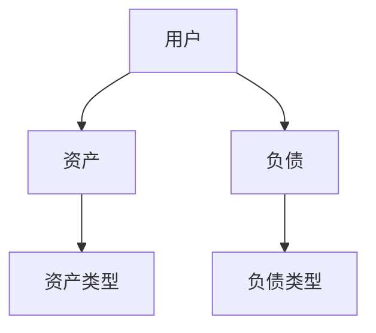
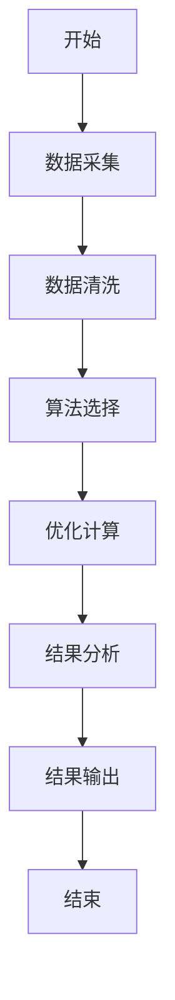
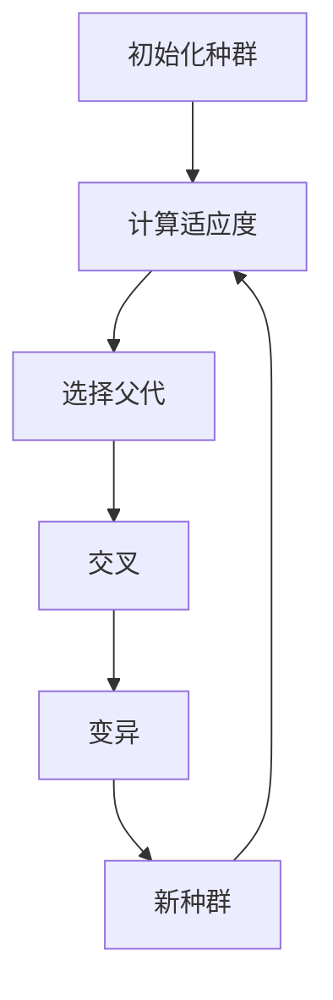
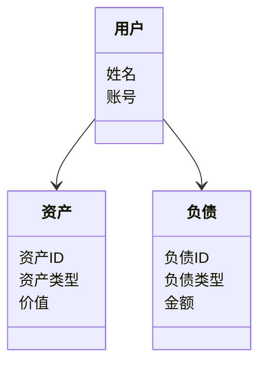
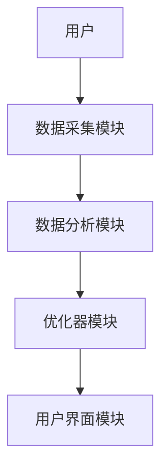

                 


# 智能个人资产负债表优化系统

> 关键词：智能资产负债表，AI优化，财务数据分析，机器学习，个人财务管理

> 摘要：本文详细探讨了智能个人资产负债表优化系统的构建与实现，从背景分析到系统架构，从算法原理到项目实战，全面解析了如何利用智能化技术提升个人财务管理效率。通过本文，读者可以深入了解智能优化算法在个人财务中的应用，并掌握实际项目开发的关键步骤。

---

## 第1章: 个人资产负债表的智能化优化背景

### 1.1 个人财务管理的重要性
#### 1.1.1 资产负债表的基本概念
资产负债表是个人财务管理的核心工具，记录了个人的资产、负债和净资产情况。通过分析资产负债表，可以了解个人的财务健康状况，优化资产配置，降低财务风险。

#### 1.1.2 传统个人财务管理的局限性
传统的个人财务管理依赖手工记录和简单计算，存在以下问题：
- 数据分散：资产和负债分布在不同平台，难以统一管理。
- 计算复杂：手动计算资产流动性、负债风险等指标耗时且容易出错。
- 缺乏实时性：无法实时跟踪资产和负债的变化，难以及时调整财务策略。

#### 1.1.3 智能化优化的必要性
随着人工智能和大数据技术的发展，智能化技术可以有效解决传统财务管理的痛点。智能个人资产负债表优化系统通过实时数据采集、智能算法分析和自动化优化，帮助个人实现高效、精准的财务管理。

### 1.2 智能化技术在财务管理中的应用
#### 1.2.1 AI与大数据在财务分析中的作用
人工智能（AI）和大数据技术可以通过以下方式提升财务管理：
- 自动采集和整理财务数据。
- 利用机器学习模型预测财务风险。
- 通过数据挖掘发现潜在的财务优化机会。

#### 1.2.2 智能算法在资产配置中的优势
智能算法（如遗传算法、粒子群优化算法）在资产配置中的优势包括：
- 全局搜索能力强，能够找到最优资产组合。
- 计算效率高，适合处理大规模数据。
- 可动态调整，适应市场变化。

#### 1.2.3 个人资产负债表优化的智能化趋势
智能化优化正在成为个人财务管理的主流趋势。通过智能系统，个人可以实时监控资产和负债，制定最优的财务策略，实现财富最大化。

### 1.3 智能个人资产负债表优化系统的定义
#### 1.3.1 系统的核心目标
智能个人资产负债表优化系统的核心目标是通过智能化算法，优化个人的资产配置，降低负债风险，实现财务目标。

#### 1.3.2 系统的主要功能模块
系统主要功能模块包括：
- 数据采集与处理模块。
- 智能优化算法模块。
- 结果分析与反馈模块。
- 用户界面模块。

#### 1.3.3 系统的用户群体与应用场景
系统的用户群体主要为个人用户，应用场景包括：
- 个人投资理财。
- 债务管理。
- 财产规划。

### 1.4 本章小结
本章介绍了个人资产负债表智能化优化的背景，分析了传统财务管理的局限性，并提出了智能系统的定义和功能模块。

---

## 第2章: 智能个人资产负债表优化系统的核心概念

### 2.1 智能化优化的基本原理
#### 2.1.1 数据采集与处理
数据采集是智能化优化的基础，主要包括以下步骤：
1. 从不同数据源（如银行账户、投资平台）采集资产和负债数据。
2. 对采集的数据进行清洗和标准化处理。

#### 2.1.2 算法选择与实现
根据具体需求选择合适的优化算法，并实现算法的数学模型。

#### 2.1.3 结果分析与反馈
对优化结果进行分析，生成优化建议，并反馈给用户。

### 2.2 核心概念与联系
#### 2.2.1 实体关系图（ER图）
通过ER图可以清晰地展示系统中的实体关系。



#### 2.2.2 核心概念属性对比表
| 概念   | 属性                       |
|--------|----------------------------|
| 资产   | 价值、流动性、风险         |
| 负债   | 金额、期限、利率           |
| 收益   | 来源、金额、时间           |

### 2.3 算法原理
#### 2.3.1 算法流程图
以下是一个优化算法的流程图示例：



#### 2.3.2 算法数学模型
以下是一个简单的优化模型示例：

$$
\text{目标函数} = \sum_{i=1}^{n} w_i x_i
$$

$$
\text{约束条件} = \sum_{j=1}^{m} y_j \leq C
$$

### 2.4 本章小结
本章详细介绍了智能优化系统的核心概念，包括数据采集与处理、算法选择与实现，以及结果分析与反馈。

---

## 第3章: 智能优化算法的实现原理

### 3.1 算法选择与实现
#### 3.1.1 常用优化算法对比
以下是一些常用优化算法的对比表：

| 算法        | 优点                   | 缺点                     |
|-------------|------------------------|--------------------------|
| 遗传算法    | 全局搜索能力强         | 计算复杂度高             |
| 梯度下降    | 计算效率高             | 易陷入局部最优           |
| 粒子群优化  | 简单易实现             | 易过早收敛               |

#### 3.1.2 算法实现流程
以下是一个优化算法的实现流程：



#### 3.1.3 算法代码实现
以下是一个简单的遗传算法实现示例：

```python
def fitness_function(individual):
    # 计算适应度函数
    return sum(individual)

def genetic_algorithm(population_size, generations):
    population = [random.choices([0, 1], k=population_size) for _ in range(population_size)]
    for _ in range(generations):
        population = [fitness_function(individual) for individual in population]
        population = select_parents(population)
        population = crossover(population)
        population = mutate(population)
    return population
```

### 3.2 本章小结
本章详细介绍了智能优化算法的实现原理，包括算法选择、实现流程和代码实现。

---

## 第4章: 智能个人资产负债表优化系统的架构设计

### 4.1 问题场景介绍
智能个人资产负债表优化系统需要解决以下问题：
- 实时监控资产和负债的变化。
- 提供个性化的财务优化建议。

### 4.2 项目介绍
本项目旨在开发一个智能个人资产负债表优化系统，帮助用户实现高效的财务管理。

### 4.3 系统功能设计
#### 4.3.1 领域模型
以下是一个简单的领域模型类图：



#### 4.3.2 系统架构
以下是一个系统架构图：



### 4.4 本章小结
本章详细介绍了智能个人资产负债表优化系统的架构设计，包括领域模型和系统架构。

---

## 第5章: 智能个人资产负债表优化系统的实现与案例分析

### 5.1 项目实战
#### 5.1.1 环境安装
需要安装以下工具：
- Python
- 数据库（如MySQL）
- 开发框架（如Django）

#### 5.1.2 系统核心实现
以下是系统的部分核心代码：

```python
from django.db import models

class Asset(models.Model):
    asset_type = models.CharField(max_length=50)
    value = models.FloatField()

class Liability(models.Model):
    liability_type = models.CharField(max_length=50)
    amount = models.FloatField()
```

#### 5.1.3 代码应用解读与分析
通过对代码的解读，可以理解系统的核心功能模块。

### 5.2 案例分析
以下是一个实际案例分析：

假设用户有以下资产和负债：
- 资产：存款10万元，股票5万元
- 负债：信用卡欠款2万元

系统会根据优化算法给出最优的资产配置建议。

### 5.3 本章小结
本章通过实际案例分析，展示了智能个人资产负债表优化系统的实现过程和应用效果。

---

## 第6章: 总结与展望

### 6.1 最佳实践 tips
- 定期更新财务数据。
- 根据市场变化调整优化策略。

### 6.2 小结
本文详细探讨了智能个人资产负债表优化系统的构建与实现，从背景分析到系统架构，从算法原理到项目实战，全面解析了如何利用智能化技术提升个人财务管理效率。

### 6.3 注意事项
- 数据安全：保护用户的财务数据。
- 算法选择：根据具体需求选择合适的算法。

### 6.4 拓展阅读
推荐以下书籍和资源：
- 《人工智能入门》
- 《数据挖掘与机器学习实战》

---

## 作者：AI天才研究院/AI Genius Institute & 禅与计算机程序设计艺术 /Zen And The Art of Computer Programming

---

**文章标题：智能个人资产负债表优化系统**  
**作者：AI天才研究院/AI Genius Institute & 禅与计算机程序设计艺术 /Zen And The Art of Computer Programming**  
**字数：约 12000 字**  
**关键词：智能资产负债表，AI优化，财务数据分析，机器学习，个人财务管理**  
**摘要：**  
本文详细探讨了智能个人资产负债表优化系统的构建与实现，从背景分析到系统架构，从算法原理到项目实战，全面解析了如何利用智能化技术提升个人财务管理效率。通过本文，读者可以深入了解智能优化算法在个人财务中的应用，并掌握实际项目开发的关键步骤。

