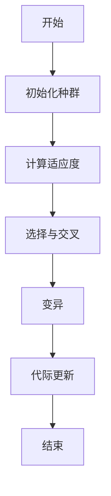
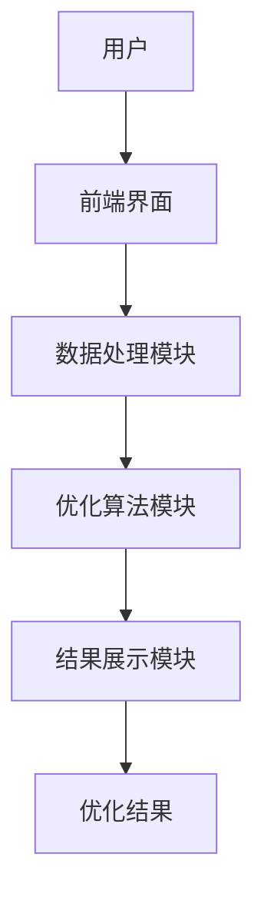
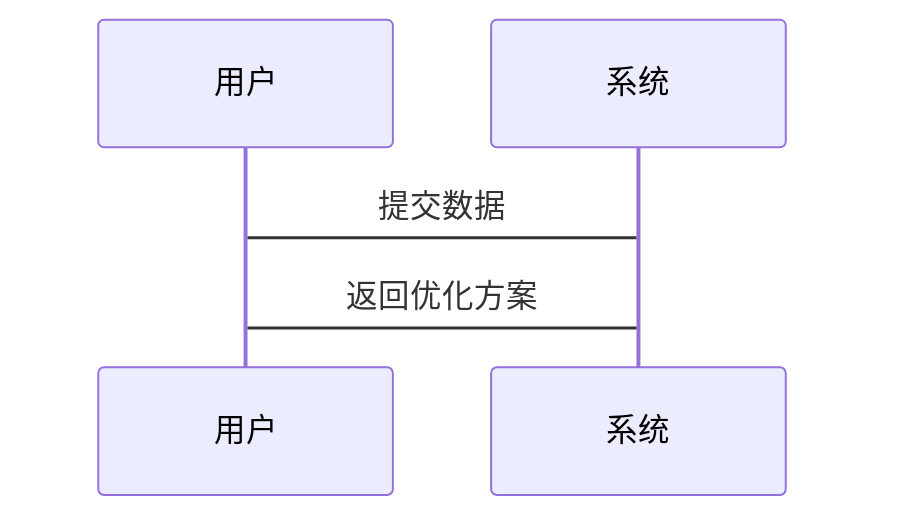

                 

<think>
好，我现在需要根据用户的要求，完成《智能个人资产负债表优化系统》这篇文章的目录大纲。用户已经给出了一个详细的目录，我需要按照这个目录来详细展开各个部分。

首先，我需要明确文章的核心主题是智能个人资产负债表优化系统，结合人工智能和财务管理，帮助个人优化其财务状况。因此，目录需要涵盖从背景介绍到系统实现，再到项目实战和总结的各个方面。

接下来，我按照用户提供的目录结构，逐步细化每个部分的内容。

**第1章: 背景介绍**
- **1.1 问题背景**：需要介绍个人财务管理的现状与挑战，说明为什么需要优化资产负债表，以及传统方法的局限性。
- **1.2 问题描述**：详细描述资产负债表优化的必要性，系统优化的目标，以及优化的边界和外延。
- **1.3 核心概念与问题解决**：解释资产负债表的核心要素，智能优化的关键技术，以及系统优化的实现路径。

**第2章: 核心概念与联系**
- **2.1 核心概念原理**：详细阐述资产负债表的结构与属性，智能优化算法的基本原理，以及系统优化的目标函数。
- **2.2 概念属性特征对比**：通过表格和对比分析，展示资产与负债的属性对比，传统优化与智能优化的特征对比，以及系统优化的性能指标对比。
- **2.3 ER实体关系图**：使用mermaid画出实体关系图，展示用户、系统、数据源、数据库和优化结果之间的关系。

**第3章: 算法原理讲解**
- **3.1 算法原理**：选择合适的智能优化算法（如遗传算法），比较不同算法的优缺点，详细讲解遗传算法的优化流程，以及建立数学模型和公式。
- **3.2 算法流程图**：使用mermaid画出算法流程图，展示算法的各个步骤。
- **3.3 算法实现代码**：提供Python代码示例，解释代码的作用和实现细节。
- **3.4 数学模型**：详细推导数学模型和公式，使用latex格式表示，确保公式正确且易于理解。

**第4章: 系统分析与架构设计**
- **4.1 系统分析**：介绍问题场景，明确系统的需求和目标。
- **4.2 系统架构设计**：使用mermaid画出系统架构图，展示各个模块之间的关系。
- **4.3 接口设计**：详细描述系统接口，包括输入输出接口和数据库接口。
- **4.4 系统交互流程图**：使用mermaid画出交互流程图，展示用户与系统之间的交互过程。

**第5章: 项目实战**
- **5.1 项目环境搭建**：指导读者如何安装和配置开发环境。
- **5.2 系统核心实现**：提供关键代码片段，解释代码的功能和实现细节。
- **5.3 代码应用解读**：通过具体案例，解释代码的应用场景和实际效果。
- **5.4 案例分析与总结**：分析实际案例，总结系统的优势和可能的改进方向。

**第6章: 最佳实践与总结**
- **6.1 小结**：总结文章的主要内容和系统优化的关键点。
- **6.2 注意事项**：提醒读者在实际应用中需要注意的事项和可能遇到的问题。
- **6.3 拓展阅读**：推荐相关领域的书籍和资源，供读者进一步学习。

**作者信息**：在文章末尾添加作者信息，引用自AI天才研究院，并注明出处。

在编写过程中，我需要确保每个章节的内容详细且结构清晰，使用mermaid图表和Python代码示例来增强理解。同时，数学公式要用latex格式表示，确保准确性和可读性。通过这样的思考过程，我可以系统地完成这篇文章的目录大纲和内容撰写。
</think>

# 智能个人资产负债表优化系统

## 关键词：
智能资产负债表优化，人工智能，财务管理系统，优化算法，系统架构

## 摘要：
智能个人资产负债表优化系统是一种结合人工智能技术的财务管理工具，旨在通过智能算法优化个人或家庭的资产负债结构，提高财务健康度和投资收益。本文将从系统背景、核心概念、算法原理、系统架构、项目实战等多个方面详细阐述智能个人资产负债表优化系统的设计与实现，帮助读者全面理解该系统的构建过程和实际应用。

---

## 第1章: 背景介绍

### 1.1 问题背景
#### 1.1.1 个人财务管理的现状与挑战
- 随着经济的发展，个人财务管理变得越来越复杂。
- 传统财务管理依赖人工记录和分析，效率低且容易出错。
- 资产负债表作为财务管理的核心工具，需要实时优化和调整。

#### 1.1.2 资产负债表的核心作用
- 资产负债表是反映个人财务状况的重要工具。
- 通过资产负债表可以评估个人的偿债能力、资产结构和财务健康度。

#### 1.1.3 传统资产负债表的局限性
- 传统资产负债表优化依赖人工经验，缺乏系统性和科学性。
- 无法实时跟踪和调整资产与负债的比例。

### 1.2 问题描述
#### 1.2.1 资产负债表优化的必要性
- 优化资产负债表可以帮助个人降低财务风险，提高资产回报率。
- 通过优化资产负债结构，可以更好地应对经济波动和突发事件。

#### 1.2.2 智能优化的目标与意义
- 目标：通过智能算法优化资产负债结构，实现资产配置的最优化。
- 意义：提升个人财务管理的效率和科学性，帮助用户做出更明智的财务决策。

#### 1.2.3 系统优化的边界与外延
- 边界：仅关注个人或家庭的资产负债优化，不涉及企业或机构。
- 外延：可以扩展到投资组合优化、风险管理等领域。

---

## 第2章: 核心概念与联系

### 2.1 核心概念原理
#### 2.1.1 资产负债表的结构与属性
- 资产：包括现金、存款、投资、房产等。
- 负债：包括贷款、信用卡欠款、其他债务。
- 资产负债表的核心属性：资产总额、负债总额、净资产、资产与负债的比例。

#### 2.1.2 智能优化算法的基本原理
- 智能优化算法：基于机器学习和优化算法，通过数据驱动的方式优化资产负债结构。
- 算法特点：自动化、实时性、高效性。

#### 2.1.3 系统优化的目标函数
- 最小化财务风险：优化资产负债比例，降低偿债压力。
- 最大化资产回报率：通过合理配置资产，提高投资收益。

### 2.2 概念属性特征对比
#### 2.2.1 资产与负债的属性对比
| 资产 | 负债 |
|------|------|
| 现金、存款、投资等 | 贷款、信用卡欠款等 |
| 盈利能力 | 偿债压力 |

#### 2.2.2 传统优化与智能优化的特征对比
| 传统优化 | 智能优化 |
|---------|---------|
| 依赖人工经验 | 基于算法优化 |
| 低效率 | 高效率 |
| 非实时性 | 实时性 |

#### 2.2.3 系统优化的性能指标对比
| 优化前 | 优化后 |
|--------|--------|
| 资产负债比例不合理 | 资产负债比例优化 |
| 资产回报率低 | 资产回报率提升 |
| 财务风险高 | 财务风险降低 |

### 2.3 ER实体关系图
```mermaid
erDiagram
    actor 用户
    actor 系统
    actor 数据源
    database 资产负债表数据库
    actor 优化结果
    用户 -> 资产负债表数据库 : 查询数据
    系统 -> 资产负债表数据库 : 存储数据
    系统 -> 优化结果 : 生成优化方案
    数据源 -> 资产负债表数据库 : 提供原始数据
```

---

## 第3章: 算法原理讲解

### 3.1 算法原理
#### 3.1.1 智能优化算法的选择与比较
- 常见算法：遗传算法、模拟退火、粒子群优化等。
- 算法选择：遗传算法适合多目标优化问题，具有全局搜索能力强的特点。

#### 3.1.2 基于遗传算法的优化流程
1. 初始化种群：生成随机的资产负债结构。
2. 计算适应度：根据优化目标（如资产回报率、风险指标）计算适应度。
3. 选择与交叉：选择适应度高的个体进行交叉，生成新的种群。
4. 变异：随机改变部分个体的特征，增加种群多样性。
5. 代际更新：保留适应度高的个体进入下一代，重复迭代。

#### 3.1.3 算法的数学模型与公式
优化目标函数：
$$ \text{最大化 } f(x) = \text{资产回报率} - \text{财务风险} $$
约束条件：
$$ g(x) = \text{资产负债比例} \leq 70\% $$
$$ h(x) = \text{净资产} \geq 0 $$

### 3.2 算法流程图


### 3.3 算法实现代码
```python
import numpy as np

def fitness(individual):
    # 计算资产回报率
    asset_return = np.mean(individual['资产'])
    # 计算财务风险
    financial_risk = np.std(individual['负债'])
    return asset_return - financial_risk

def optimize资产负债表():
    # 初始化种群
    population = generate_initial_population()
    for generation in range(max_generations):
        # 计算适应度
        fitness_values = [fitness(individual) for individual in population]
        # 选择与交叉
        selected = select_best(population, fitness_values)
        new_population = crossover(selected)
        # 变异
        mutate(new_population)
        population = new_population
    return best_individual(population)
```

---

## 第4章: 系统分析与架构设计

### 4.1 系统分析
#### 4.1.1 问题场景介绍
- 用户输入个人资产和负债数据。
- 系统根据输入数据生成优化方案。

### 4.2 系统架构设计


### 4.3 接口设计
- 输入接口：用户输入资产和负债数据。
- 输出接口：展示优化后的资产负债表。

### 4.4 系统交互流程图


---

## 第5章: 项目实战

### 5.1 项目环境搭建
- 安装Python和相关库（如NumPy、Pandas、Scikit-learn）。

### 5.2 系统核心实现
```python
class 资产负债表优化系统:
    def __init__(self):
        self.资产数据 = []
        self.负债数据 = []
    
    def 优化(self):
        # 调用优化算法模块
        pass

```

### 5.3 代码应用解读
- 初始化系统，输入资产和负债数据。
- 调用优化算法，生成优化方案。
- 展示优化结果。

### 5.4 案例分析与总结
- 分析实际案例，总结系统的优势和改进方向。

---

## 第6章: 最佳实践与总结

### 6.1 小结
- 总结系统优化的关键点和实际应用效果。

### 6.2 注意事项
- 提醒用户在使用系统时需要注意的事项。

### 6.3 拓展阅读
- 推荐相关领域的书籍和资源。

---

作者：AI天才研究院  
地址：https://github.com/AI-Genius-Institute

