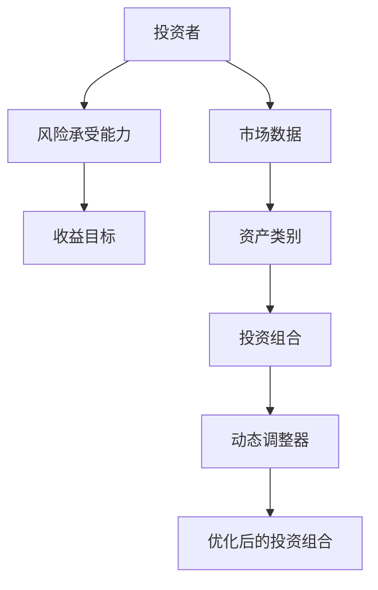
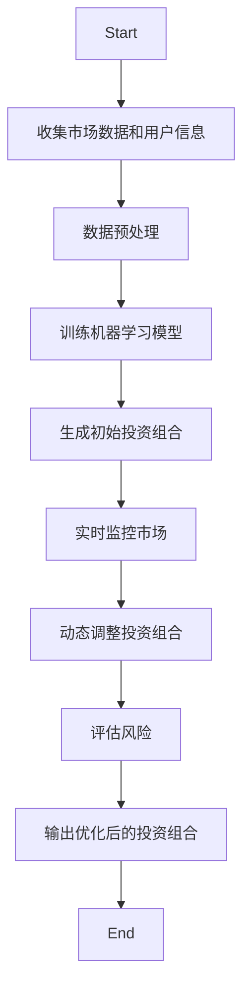
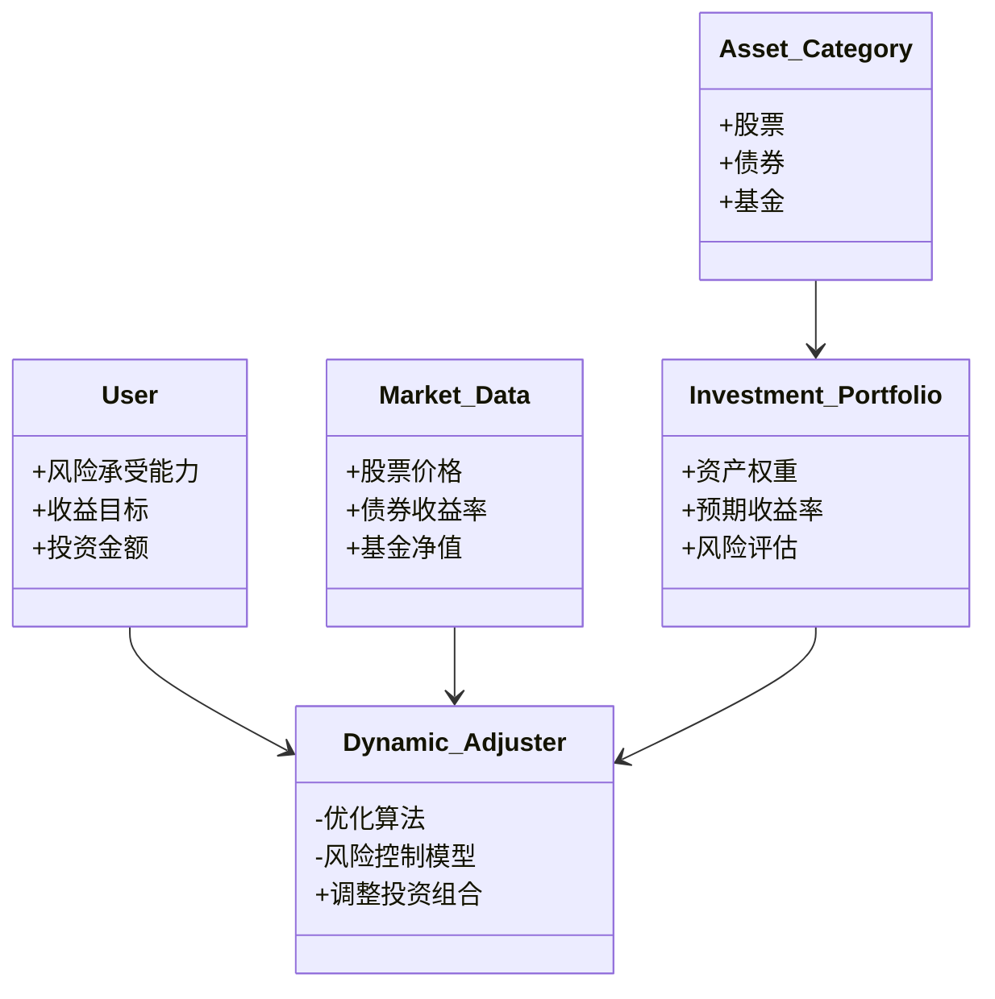

                 


# 智能个人资产配置动态调整器

> **关键词**: 智能资产配置, 动态调整, 人工智能, 投资策略, 风险控制

> **摘要**: 本文介绍了一种基于人工智能的智能个人资产配置动态调整器，通过分析市场变化和投资者需求，动态优化资产配置方案，以实现风险可控下的收益最大化。文章从背景介绍、核心概念、算法原理、系统架构到项目实战和最佳实践，全面阐述了该系统的构建过程和应用场景。

---

## 第一部分: 背景介绍

### 第1章: 问题背景与技术基础

#### 1.1 问题背景

在当前金融市场上，个人投资者面临着复杂多变的市场环境和多样化的投资需求。传统的资产配置方法往往基于固定的投资策略，难以适应市场的快速变化。例如，当市场出现剧烈波动时，投资者可能需要快速调整其资产分配以规避风险或抓住新的投资机会。然而，手动调整资产配置不仅效率低下，还可能因为投资者的主观判断失误而导致更大的损失。

此外，随着人工智能和大数据技术的快速发展，越来越多的金融机构开始采用智能算法来优化投资决策。这些技术能够实时分析市场数据，动态调整投资策略，从而为投资者提供更加精准和个性化的服务。

---

#### 1.2 技术基础

人工智能（AI）和大数据分析在金融领域的应用日益广泛。通过机器学习算法，系统可以自动识别市场趋势、预测价格波动，并根据投资者的风险承受能力推荐最优的资产配置方案。例如，使用强化学习算法，系统可以在模拟交易环境中不断优化投资策略，从而在实际操作中实现更高的收益。

此外，动态规划（Dynamic Programming）等优化算法也为资产配置的动态调整提供了理论基础。这些算法能够帮助系统在有限的资源约束下，找到最优的投资组合。

---

#### 1.3 需求分析

智能个人资产配置动态调整器的核心需求包括：

1. **个性化投资需求**：每个投资者的风险承受能力、收益目标和投资期限各不相同，系统需要能够根据这些差异提供个性化的资产配置建议。
2. **实时市场响应**：系统需要能够实时跟踪市场数据，快速响应市场变化，及时调整资产配置方案。
3. **风险控制**：在市场波动加剧的情况下，系统需要能够动态调整投资组合，以降低潜在风险。

---

#### 1.4 边界条件与外延

系统的设计需要明确其边界条件，例如：

- **适用范围**：适用于个人投资者，不包括机构投资者或对冲基金。
- **市场数据来源**：依赖于实时的股票、基金、债券等市场数据。
- **用户输入**：需要投资者提供风险承受能力和收益目标等基本信息。

此外，系统的外延功能可能包括：

- **税收优化**：在资产配置中考虑税收因素，以进一步降低投资成本。
- **多资产类别支持**：支持股票、债券、房地产等多种资产类别。

---

## 第二部分: 核心概念与联系

### 第2章: 智能个人资产配置的核心概念

#### 2.1 核心概念的定义与特点

智能个人资产配置动态调整器的核心概念是基于人工智能算法，动态优化投资者的资产配置方案。与传统资产配置方法相比，其主要特点包括：

1. **动态性**：系统能够实时跟踪市场变化，动态调整资产配置方案。
2. **智能化**：通过机器学习算法，系统能够自动识别市场趋势并优化投资策略。
3. **个性化**：系统能够根据投资者的个性化需求提供定制化的资产配置建议。

---

#### 2.2 核心概念的原理与机制

智能资产配置的实现原理可以概括为以下几个步骤：

1. **数据收集**：系统收集市场数据（如股票价格、债券收益率等）和投资者信息（如风险承受能力、收益目标等）。
2. **模型构建**：基于机器学习算法，构建资产配置模型，预测市场走势并生成初始资产配置方案。
3. **动态调整**：根据市场实时数据，系统不断优化资产配置方案，以适应市场变化。
4. **风险控制**：通过风险评估模型，系统确保资产配置方案在可接受的风险范围内。

---

#### 2.3 实体关系图架构

以下是系统的核心实体关系图：



---

## 第三部分: 算法原理

### 第3章: 优化算法的实现原理

#### 3.1 算法流程

以下是优化算法的流程图：



---

#### 3.2 数学模型与公式

以下是优化算法的数学模型：

$$ \text{目标函数} = \max \sum_{i=1}^{n} w_i r_i $$

$$ \text{约束条件} = \sum_{i=1}^{n} w_i = 1 $$

其中，\( w_i \) 表示第 \( i \) 个资产的权重，\( r_i \) 表示第 \( i \) 个资产的预期收益率。

---

## 第四部分: 系统架构与实现

### 第4章: 系统架构设计

#### 4.1 系统功能设计

以下是系统功能设计的类图：



---

### 第5章: 项目实战

#### 5.1 环境安装

以下是项目所需的环境和工具：

- **编程语言**：Python 3.8+
- **机器学习库**：scikit-learn, TensorFlow
- **数据处理库**：Pandas, NumPy
- **可视化工具**：Matplotlib, Seaborn
- **开发环境**：Jupyter Notebook, VS Code

---

#### 5.2 核心代码实现

以下是优化算法的核心代码：

```python
import numpy as np
import pandas as pd
from sklearn.model_selection import train_test_split
from sklearn.linear_model import LinearRegression

# 数据预处理
data = pd.read_csv('market_data.csv')
X = data[['stock_price', 'bond_yield', 'fund_net_value']]
y = data['return']

# 划分训练集和测试集
X_train, X_test, y_train, y_test = train_test_split(X, y, test_size=0.2, random_state=42)

# 训练机器学习模型
model = LinearRegression()
model.fit(X_train, y_train)

# 生成初始投资组合
initial_portfolio = np.array([0.3, 0.4, 0.3])  # 股票、债券、基金的权重

# 动态调整投资组合
def dynamic_adjust(weights, market_data):
    # 实现动态调整逻辑
    return new_weights

# 示例使用
market_data = np.array([100, 5, 2])
adjusted_portfolio = dynamic_adjust(initial_portfolio, market_data)
print(adjusted_portfolio)
```

---

## 第五部分: 最佳实践与总结

### 第6章: 最佳实践

#### 6.1 小结

智能个人资产配置动态调整器通过结合人工智能和大数据分析技术，能够实时优化资产配置方案，帮助投资者在复杂多变的市场环境中实现风险可控下的收益最大化。

---

#### 6.2 注意事项

- **数据质量**：确保市场数据的准确性和完整性。
- **模型优化**：定期更新和优化机器学习模型，以适应市场变化。
- **用户教育**：投资者需要了解系统的工作原理和使用方法，以充分发挥系统的潜力。

---

#### 6.3 拓展阅读

- 《机器学习在金融中的应用》
- 《资产配置的理论与实践》
- 《强化学习与投资组合优化》

---

## 作者

**作者：AI天才研究院/AI Genius Institute & 禅与计算机程序设计艺术/Zen And The Art of Computer Programming**

---

**附录：代码示例**

```python
import numpy as np
import pandas as pd
from sklearn.model_selection import train_test_split
from sklearn.linear_model import LinearRegression

# 数据预处理
data = pd.read_csv('market_data.csv')
X = data[['stock_price', 'bond_yield', 'fund_net_value']]
y = data['return']

# 划分训练集和测试集
X_train, X_test, y_train, y_test = train_test_split(X, y, test_size=0.2, random_state=42)

# 训练机器学习模型
model = LinearRegression()
model.fit(X_train, y_train)

# 生成初始投资组合
initial_portfolio = np.array([0.3, 0.4, 0.3])  # 股票、债券、基金的权重

# 动态调整投资组合
def dynamic_adjust(weights, market_data):
    # 实现动态调整逻辑
    return new_weights

# 示例使用
market_data = np.array([100, 5, 2])
adjusted_portfolio = dynamic_adjust(initial_portfolio, market_data)
print(adjusted_portfolio)
```

---

**结语**

智能个人资产配置动态调整器的开发和应用，标志着金融投资领域迈向智能化和个性化的时代。通过人工智能技术的应用，投资者能够更加科学地管理其资产，实现长期稳健的投资收益。未来，随着技术的不断进步，智能资产配置系统将变得更加智能和高效，为投资者提供更加优质的服务。

---

