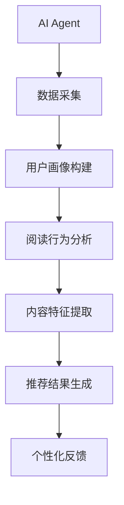
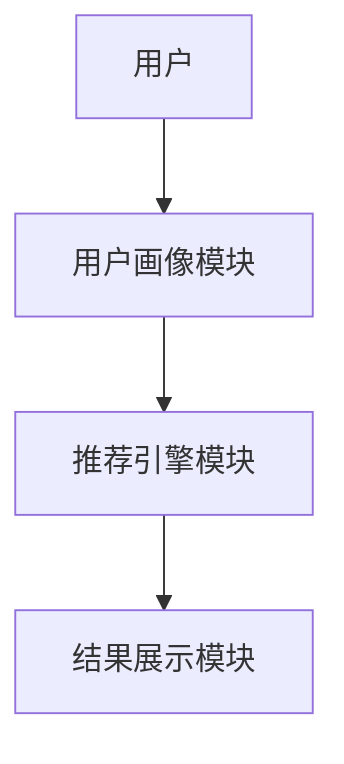

                 


# 智能书架：AI Agent的个性化阅读推荐系统

> 关键词：AI Agent，个性化阅读推荐，协同过滤，基于内容推荐，混合推荐算法

> 摘要：本文详细探讨了智能书架这一基于AI Agent的个性化阅读推荐系统。通过分析当前阅读推荐系统的局限性，介绍了AI Agent在推荐过程中的核心作用，详细阐述了协同过滤、基于内容的推荐以及混合推荐算法的实现原理，并通过实际案例展示了系统的设计与实现过程。

---

## 第1章: 智能书架与AI Agent的背景介绍

### 1.1 个性化阅读推荐系统的背景与问题背景

个性化阅读推荐系统的目标是根据用户的阅读历史、偏好和行为，为其推荐相关的内容。然而，传统推荐系统存在以下问题：

1. **数据稀疏性**：用户数量多，但每人阅读的内容有限，导致推荐系统难以准确捕捉用户偏好。
2. **推荐结果的准确性**：传统基于协同过滤的推荐系统容易受到用户行为稀疏性的影响，推荐结果不够精准。
3. **实时性不足**：传统推荐系统通常需要大量历史数据才能生成推荐结果，难以实时响应用户需求。

AI Agent的引入，通过其强大的数据处理和机器学习能力，能够显著提升推荐系统的实时性和准确性。

---

### 1.2 AI Agent在智能书架中的应用前景

AI Agent是一种能够感知环境、执行任务并优化决策的智能体。在智能书架中，AI Agent主要负责以下任务：

1. **数据采集与处理**：实时收集用户的阅读行为数据，包括阅读时间、内容偏好等。
2. **推荐算法优化**：通过机器学习算法不断优化推荐模型，提升推荐的准确性和多样性。
3. **个性化反馈机制**：根据用户的实时反馈调整推荐策略，确保推荐结果符合用户的实际需求。

AI Agent的核心优势在于其能够实时学习和调整推荐策略，从而显著提升推荐系统的个性化能力。

---

## 第2章: 个性化阅读推荐系统的概念与核心要素

### 2.1 核心概念的定义与属性

1. **用户画像**：基于用户的阅读历史、偏好和行为构建的用户信息模型。用户画像是推荐系统的重要输入，决定了推荐内容的方向。
2. **阅读行为分析**：对用户的阅读行为进行建模，分析其阅读习惯、偏好和潜在需求。
3. **内容特征提取**：从书籍或文章中提取关键特征，包括主题、关键词、情感倾向等，用于推荐算法的特征匹配。

---

### 2.2 核心概念之间的关系

下表展示了用户画像、阅读行为和内容特征之间的关系：

| 概念 | 属性 | 关系 |
|------|------|------|
| 用户画像 | 年龄、兴趣、阅读习惯 | 决定阅读行为的方向 |
| 阅读行为 | 阅读时间、内容偏好 | 反映用户对内容的偏好 |
| 内容特征 | 主题、关键词、情感倾向 | 用于匹配用户的兴趣 |

---

### 2.3 AI Agent与智能书架的关系

AI Agent在智能书架中的作用可以用以下流程图表示：



---

## 第3章: AI Agent的推荐算法原理

### 3.1 协同过滤算法

协同过滤是一种基于用户相似性或物品相似性的推荐算法。其核心思想是：如果两个用户在历史行为上相似，则他们对新内容的偏好也会相似。

#### 3.1.1 基于用户的协同过滤

1. **数据预处理**：对用户的行为数据进行归一化处理。
2. **相似性计算**：使用余弦相似度或欧式距离计算用户相似度。
3. **推荐结果生成**：基于相似用户的偏好生成推荐列表。

#### 3.1.2 基于物品的协同过滤

1. **数据预处理**：对物品的特征进行标准化处理。
2. **相似性计算**：计算物品之间的相似度。
3. **推荐结果生成**：基于物品相似度生成推荐列表。

---

### 3.2 基于内容的推荐算法

基于内容的推荐算法通过分析内容本身的特征，生成与用户兴趣相匹配的推荐结果。

#### 3.2.1 文本特征提取

1. **关键词提取**：使用TF-IDF算法提取文章中的关键词。
2. **主题建模**：使用LDA（隐含主题模型）提取文章的主题。

#### 3.2.2 内容相似度计算

1. **向量空间模型**：将文本特征转换为向量空间中的点。
2. **相似度计算**：使用余弦相似度计算文本相似度。

---

### 3.3 混合推荐算法

混合推荐算法结合了协同过滤和基于内容的推荐算法，通过将两者的优势结合起来，提升推荐系统的准确性和多样性。

#### 3.3.1 混合推荐的实现流程

1. **数据预处理**：对协同过滤和基于内容的推荐数据进行预处理。
2. **特征融合**：将用户画像、阅读行为和内容特征进行融合。
3. **推荐结果生成**：结合协同过滤和基于内容的推荐结果，生成最终的推荐列表。

---

## 第4章: 智能书架的系统架构设计

### 4.1 系统功能模块

智能书架的主要功能模块包括：

1. **用户画像模块**：构建用户的阅读偏好模型。
2. **推荐引擎模块**：负责生成推荐结果。
3. **结果展示模块**：将推荐结果呈现给用户。

---

### 4.2 系统架构图



---

## 第5章: 项目实战

### 5.1 环境安装

需要安装以下环境：

1. Python 3.x
2. Pandas、Numpy、Scikit-learn等Python库。

---

### 5.2 核心代码实现

以下是协同过滤算法的Python实现示例：

```python
import numpy as np
from sklearn.metrics.pairwise import cosine_similarity

# 示例用户-物品矩阵
users_items = np.array([[1, 0, 1, 1],
                         [0, 1, 1, 0],
                         [1, 1, 0, 1],
                         [0, 1, 1, 1]])

# 计算相似度矩阵
similarity_matrix = cosine_similarity(users_items)

# 推荐结果生成
def recommend(user_id, similarity_matrix, items):
    user_similarity = similarity_matrix[user_id]
    recommended_items = [i for i in range(len(user_similarity)) if user_similarity[i] > 0.5]
    return [items[i] for i in recommended_items]

# 示例物品列表
items = ['Book1', 'Book2', 'Book3', 'Book4']
user_id = 0
print(recommend(user_id, similarity_matrix, items))
```

---

### 5.3 案例分析

通过上述代码，我们可以看到协同过滤算法如何根据用户相似度生成推荐结果。例如，对于用户ID为0的用户，推荐结果可能包括与他相似度较高的用户的阅读偏好。

---

## 第6章: 最佳实践与总结

### 6.1 最佳实践

1. **数据预处理**：确保数据的完整性和准确性。
2. **模型调优**：通过交叉验证不断优化推荐模型。
3. **系统维护**：定期更新用户画像和内容特征，确保推荐系统的实时性。

---

### 6.2 总结

智能书架通过AI Agent的强大能力，显著提升了个性化阅读推荐的准确性和实时性。未来，随着机器学习和自然语言处理技术的不断进步，智能书架将为用户提供更加精准和个性化的阅读体验。

---

## 作者：AI天才研究院 & 禅与计算机程序设计艺术

---

这篇博客文章详细探讨了智能书架的实现原理和应用价值，通过理论与实践相结合的方式，帮助读者深入了解AI Agent在个性化阅读推荐中的重要作用。

