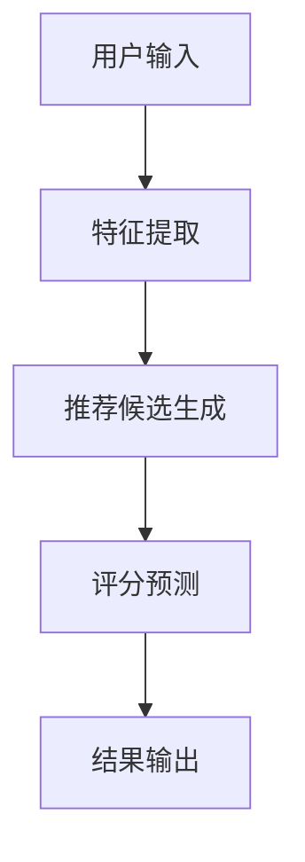
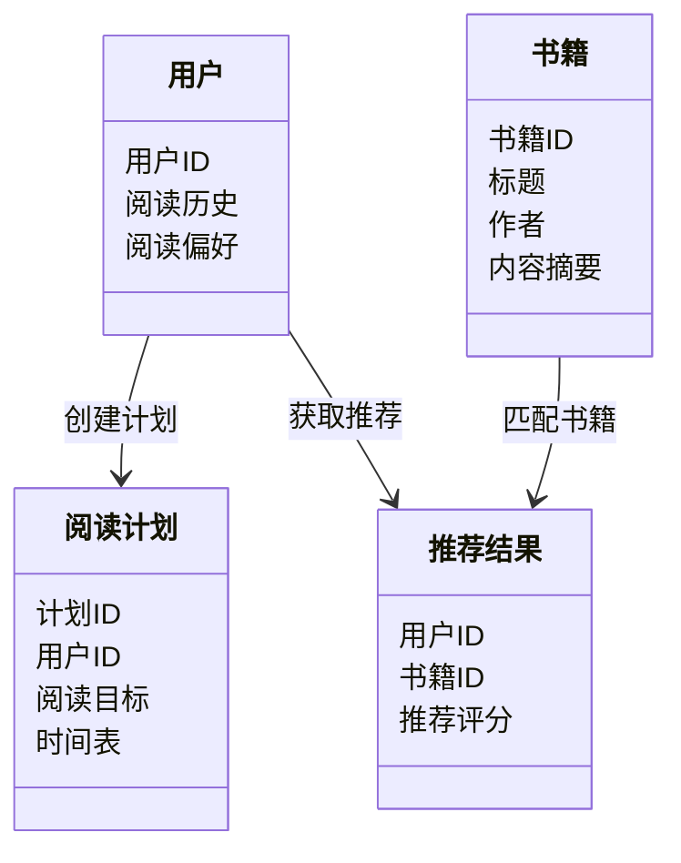
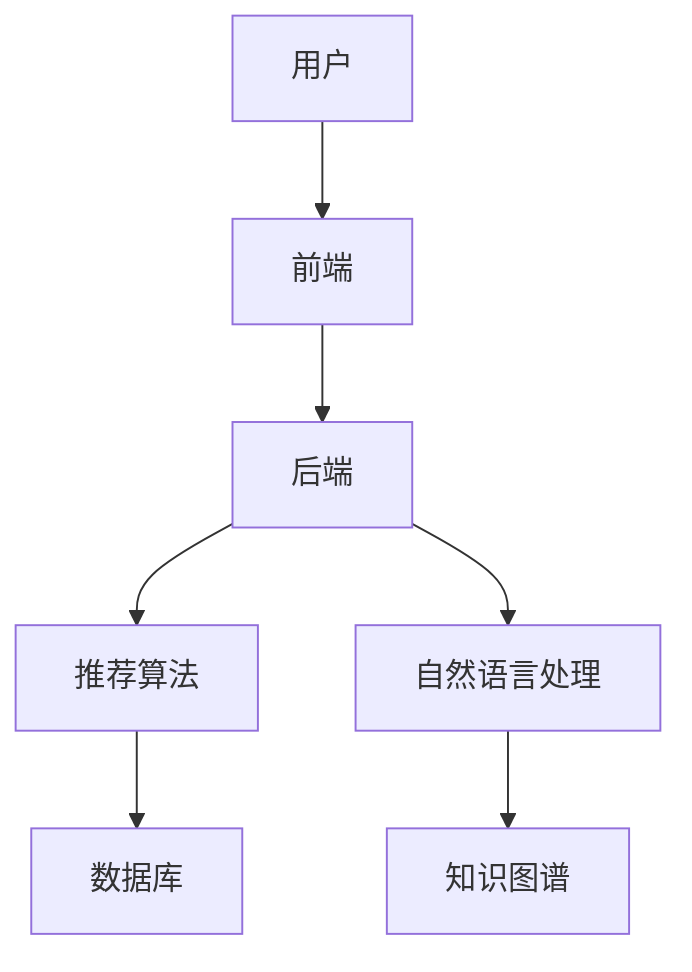
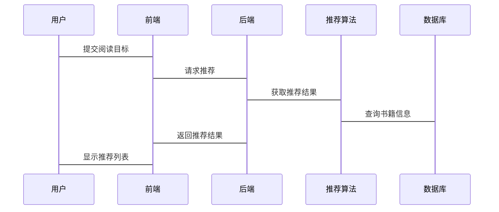

                 

<think>
好，我现在需要帮助用户撰写一篇关于《智能书架：AI Agent的阅读计划制定助手》的技术博客文章。用户已经给出了一个详细的大纲，我需要按照这个大纲逐步展开，确保内容逻辑清晰，技术细节到位。

首先，我会先阅读用户提供的大纲，了解文章的结构。文章分为七个部分，从背景介绍到项目实战，每个部分都有具体的章节和子章节。我需要确保每部分都有足够的细节，并且技术语言专业但易懂。

接下来，我会思考如何展开每一部分。例如，在“AI Agent的基本概念”部分，我需要解释什么是AI Agent，它的核心特点以及与传统软件代理的区别。这部分需要简单明了，适合技术背景不太深的读者理解。

然后，在“阅读计划制定的背景与挑战”部分，我需要分析传统阅读计划的局限性，并引出AI Agent的应用前景。这可能涉及到用户需求分析和现有解决方案的不足。

在“AI Agent的决策机制”部分，我需要详细介绍基于规则、学习和推理的决策方式，并结合阅读计划的制定逻辑，解释AI Agent如何帮助优化阅读计划。

算法部分是关键，我会选择合适的推荐算法，如协同过滤和深度学习模型，并用数学公式和mermaid图来展示。同时，提供Python代码实现，帮助读者理解。

系统架构部分，我需要绘制类图、架构图和序列图，展示系统的各个模块和交互流程。这部分需要清晰展示系统的各个部分如何协同工作。

项目实战部分，我会详细描述如何安装环境、编写代码，并通过实际案例分析来展示系统的实现和效果。

最后，我会总结最佳实践、注意事项，并提供扩展阅读的建议，帮助读者进一步深入学习。

在整个过程中，我会注意使用专业但易懂的语言，确保每个部分都有足够的细节，并且逻辑连贯。同时，我会检查每部分是否符合字数要求，确保整篇文章在10000到12000字之间。

现在，我会按照大纲一步步展开，确保每一部分都覆盖到位，技术细节清晰，例子具体，帮助读者全面理解智能书架的概念和实现。
</think>

# 智能书架：AI Agent的阅读计划制定助手

## 关键词：AI Agent，阅读计划，推荐算法，系统架构，项目实战

## 摘要：智能书架是一款结合人工智能代理技术的阅读计划制定工具，通过分析用户的阅读习惯和偏好，提供智能化的阅读建议和计划优化。本文将从AI Agent的基本概念、阅读计划的制定逻辑、推荐算法的实现原理、系统架构设计、项目实战等方面，详细探讨智能书架的技术实现和应用场景。

---

## 第一部分: 智能书架与AI Agent的背景介绍

### 第1章: AI Agent与阅读计划的背景

#### 1.1 AI Agent的基本概念

##### 1.1.1 AI Agent的定义
AI Agent（人工智能代理）是一种能够感知环境、自主决策并执行任务的智能实体。它通过传感器获取信息，利用推理能力分析数据，并通过执行器采取行动，以实现特定目标。

##### 1.1.2 AI Agent的核心特点
- **自主性**：能够在没有外部干预的情况下自主运行。
- **反应性**：能够实时感知环境并做出反应。
- **目标导向**：所有行为都以实现特定目标为导向。
- **学习能力**：通过经验或数据不断优化自身的决策能力。

##### 1.1.3 AI Agent与传统软件代理的区别
| 特性 | AI Agent | 传统软件代理 |
|------|-----------|---------------|
| 智能性 | 高 | 低 |
| 学习能力 | 强 | 无 |
| 决策能力 | 自主 | 依赖预设规则 |
| 适应性 | 高 | 低 |

#### 1.2 阅读计划制定的背景与挑战

##### 1.2.1 阅读目标的分解
阅读目标可以分为短期目标（如完成一本书的阅读）和长期目标（如掌握某一领域知识）。AI Agent需要将这些目标分解为具体的行动步骤。

##### 1.2.2 阅读优先级的确定
根据用户的兴趣、时间安排和阅读习惯，AI Agent需要动态调整阅读材料的优先级。

##### 1.2.3 阅读时间的规划
AI Agent需要考虑用户的日程安排、注意力水平和阅读速度，制定合理的阅读时间表。

##### 1.2.4 AI Agent在阅读计划中的应用前景
通过自然语言处理和推荐算法，AI Agent能够为用户提供个性化的阅读建议，提升阅读效率和体验。

#### 1.3 本章小结
本章介绍了AI Agent的基本概念及其在阅读计划制定中的应用，分析了传统阅读计划的局限性，并提出了AI Agent在其中的重要作用。

---

## 第二部分: AI Agent的阅读计划制定核心概念

### 第2章: AI Agent与阅读计划的核心概念

#### 2.1 AI Agent的决策机制

##### 2.1.1 基于规则的决策
基于规则的决策系统依赖预设的规则进行判断，适用于规则明确的场景。例如，如果用户在某个时间段内没有阅读，AI Agent可以根据规则推荐新的阅读材料。

##### 2.1.2 基于学习的决策
基于学习的决策系统通过机器学习算法从历史数据中学习决策模式，适用于复杂场景。例如，使用协同过滤算法推荐用户可能感兴趣的书籍。

##### 2.1.3 基于推理的决策
基于推理的决策系统通过逻辑推理得出结论，适用于需要推理的场景。例如，根据用户的阅读历史推断用户的兴趣领域。

#### 2.2 阅读计划的制定逻辑

##### 2.2.1 阅读目标的分解
将长期目标分解为多个短期目标，例如将“掌握人工智能领域知识”分解为“完成《机器学习实战》和《深度学习入门》的阅读”。

##### 2.2.2 阅读优先级的确定
根据用户的兴趣、时间安排和知识结构，动态调整阅读材料的优先级。例如，优先推荐与用户当前研究方向相关的书籍。

##### 2.2.3 阅读时间的规划
结合用户的日程安排、注意力水平和阅读速度，制定合理的阅读时间表。例如，在用户精力充沛的时间段安排复杂书籍的阅读。

#### 2.3 AI Agent与阅读计划的结合

##### 2.3.1 AI Agent在阅读目标识别中的作用
AI Agent通过分析用户的阅读历史、搜索记录和社交数据，识别用户的阅读目标。例如，用户最近搜索了“Python编程”，AI Agent可以推断用户可能对学习Python编程感兴趣。

##### 2.3.2 AI Agent在阅读计划优化中的应用
AI Agent通过不断优化阅读计划，提升用户的阅读效率。例如，根据用户的阅读进度自动调整计划，确保用户按时完成目标。

##### 2.3.3 AI Agent在阅读反馈中的处理
AI Agent通过收集用户的阅读反馈（如评分、评论）不断优化推荐算法。例如，用户对某本书的评分较低，AI Agent会减少推荐类似书籍。

#### 2.4 本章小结
本章详细介绍了AI Agent的决策机制及其在阅读计划制定中的应用，分析了AI Agent如何通过基于规则、学习和推理的决策方式优化用户的阅读体验。

---

## 第三部分: AI Agent阅读计划的算法原理

### 第3章: 基于推荐算法的阅读计划制定

#### 3.1 推荐算法的基本原理

##### 3.1.1 协同过滤推荐
协同过滤推荐基于用户行为相似性推荐物品。例如，如果用户A和用户B的阅读历史相似，AI Agent会推荐用户A可能感兴趣的书籍给用户B。

##### 3.1.2 基于内容的推荐
基于内容的推荐通过分析物品的特征推荐相似物品。例如，AI Agent会推荐与用户当前阅读书籍内容相似的其他书籍。

##### 3.1.3 深度学习推荐
深度学习推荐通过神经网络模型学习物品的特征表示，推荐与用户兴趣匹配的物品。例如，使用神经网络模型分析书籍的语义内容，推荐相关书籍。

#### 3.2 阅读计划推荐的数学模型

##### 3.2.1 基于矩阵分解的推荐模型
基于矩阵分解的推荐模型通过将用户-物品交互矩阵分解为两个低维矩阵，分别表示用户和物品的特征。例如，矩阵分解可以表示为：

$$
R = U \cdot V^T
$$

其中，\( R \) 是用户-物品交互矩阵，\( U \) 和 \( V \) 分别是用户和物品的特征矩阵。

##### 3.2.2 基于深度学习的推荐模型
基于深度学习的推荐模型使用神经网络模型学习用户和物品的特征表示。例如，使用深度神经网络模型分析用户的阅读历史，生成用户的兴趣向量。

##### 3.2.3 模型的评价指标
推荐模型的评价指标包括准确率、召回率、F1值和AUC值。例如，准确率表示推荐的书籍中有多少是用户真正感兴趣的。

#### 3.3 AI Agent的推荐算法实现

##### 3.3.1 算法流程图


##### 3.3.2 推荐算法的Python实现代码
```python
def recommend(user_id, items, model):
    # 获取候选物品
    candidates = model.get_candidates(user_id)
    # 计算推荐评分
    scores = {item: model.predict(user_id, item) for item in candidates}
    # 排序并返回结果
    sorted_recommendations = sorted(candidates, key=lambda x: scores[x], reverse=True)
    return sorted_recommendations[:10]
```

#### 3.4 本章小结
本章介绍了推荐算法的基本原理，详细讲解了基于矩阵分解和深度学习的推荐模型，并通过mermaid图和Python代码展示了推荐算法的实现过程。

---

## 第四部分: 智能书架的系统架构设计

### 第4章: 智能书架的系统架构

#### 4.1 系统功能设计

##### 4.1.1 领域模型设计
智能书架的领域模型包括用户、书籍、阅读计划和推荐结果四个核心实体。例如，用户实体包含用户ID、阅读历史和偏好；书籍实体包含书籍ID、标题、作者和内容摘要。



#### 4.2 系统架构设计

##### 4.2.1 系统架构图


##### 4.2.2 系统接口设计
系统接口设计包括用户输入接口、推荐算法接口和数据库接口。例如，用户通过前端界面输入阅读目标，后端调用推荐算法接口获取推荐结果，并存储到数据库中。

##### 4.2.3 系统交互流程


#### 4.3 本章小结
本章详细介绍了智能书架的系统架构设计，包括领域模型、系统架构图和交互流程图，展示了系统各个模块之间的关系和交互过程。

---

## 第五部分: 智能书架的项目实战

### 第5章: 项目实战

#### 5.1 环境安装

##### 5.1.1 安装Python
安装Python 3.8或更高版本，推荐使用Anaconda环境管理工具。

##### 5.1.2 安装依赖库
安装必要的Python库，例如numpy、pandas、scikit-learn和tensorflow。

#### 5.2 系统核心实现

##### 5.2.1 数据预处理
处理书籍数据和用户行为数据，提取特征并构建推荐模型。

##### 5.2.2 推荐算法实现
实现基于矩阵分解和深度学习的推荐算法，并进行模型训练和优化。

##### 5.2.3 系统集成与测试
将推荐算法集成到智能书架系统中，进行功能测试和性能优化。

#### 5.3 项目小结
通过实际案例分析，展示了智能书架的实现过程和效果，总结了项目中的经验和教训。

---

## 第六部分: 总结与展望

### 第6章: 总结与展望

#### 6.1 最佳实践 tips
- 定期更新书籍库，保持推荐结果的新鲜度。
- 根据用户反馈不断优化推荐算法，提升推荐准确率。

#### 6.2 小结
智能书架通过结合AI Agent和推荐算法，为用户提供个性化的阅读计划制定服务，显著提升了用户的阅读效率和体验。

#### 6.3 注意事项
- 注意保护用户隐私，确保数据安全。
- 定期维护系统，及时修复漏洞。

#### 6.4 拓展阅读
建议读者进一步学习机器学习和自然语言处理技术，探索更多AI在阅读计划中的应用场景。

---

## 作者：AI天才研究院/AI Genius Institute & 禅与计算机程序设计艺术/Zen And The Art of Computer Programming

---

以上是《智能书架：AI Agent的阅读计划制定助手》的技术博客文章的详细目录和内容框架。通过逐步分析和详细讲解，确保文章内容逻辑清晰、技术细节到位，帮助读者全面理解智能书架的概念和实现。

