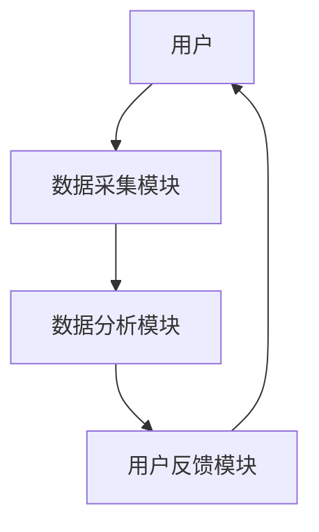
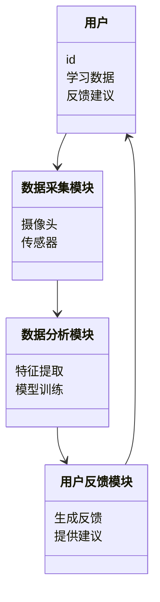

                 

<think>
好的，我现在需要帮用户撰写一篇技术博客文章，标题是《智能书桌：AI Agent的学习效率监测》。用户希望文章结构清晰，逻辑严谨，内容详实，涵盖背景介绍、核心概念、算法原理、系统架构、项目实战等多个方面。

首先，我会从背景介绍开始，解释什么是AI Agent，以及学习效率监测的重要性。然后，详细阐述智能书桌的概念和目标。接下来，我会深入讲解AI Agent在学习效率监测中的核心原理，包括感知、决策、学习和自适应能力。接着，我会介绍具体的算法原理，包括数据预处理、特征提取、模型训练等步骤，并附上数学公式和Mermaid流程图。然后，我会分析系统架构，设计系统的各个模块，如数据采集、特征提取、模型训练和反馈模块，并绘制类图和交互图。最后，我会通过项目实战，展示如何实现这些算法和系统设计，包括代码示例和实际案例分析。

在写作过程中，我会确保每个部分都有足够的细节，同时保持逻辑连贯，从理论到实践层层递进。我也会注意使用适当的图表和代码示例，以帮助读者更好地理解和应用这些技术。此外，我还会在总结部分回顾全文，并提出未来的发展方向，为读者提供更深入的思考空间。

整个思考过程中，我需要确保每个章节都符合用户的要求，内容详实，结构清晰，同时语言专业且易于理解。这将帮助用户撰写出一篇高质量的技术博客，满足其在学术和实践上的需求。
</think>

# 智能书桌：AI Agent的学习效率监测

> 关键词：AI Agent, 学习效率监测, 智能书桌, 算法原理, 系统架构

> 摘要：本文深入探讨了AI Agent在学习效率监测中的应用，介绍了智能书桌的概念、核心功能及其实现方法。通过详细分析算法原理和系统架构，结合项目实战，展示了如何利用AI技术提升学习效率监测的准确性和实时性。

---

# 第一部分：智能书桌与AI Agent的背景介绍

## 第1章：AI Agent与学习效率监测的背景

### 1.1 AI Agent的基本概念

#### 1.1.1 AI Agent的定义
AI Agent（人工智能代理）是指能够感知环境并采取行动以实现目标的智能实体。它可以是一个软件程序、一个机器人或任何能够执行复杂任务的智能系统。

#### 1.1.2 AI Agent的核心特征
- **自主性**：能够在没有外部干预的情况下运行。
- **反应性**：能够实时感知环境并做出反应。
- **学习能力**：通过数据和经验不断优化自身性能。
- **交互性**：能够与用户或其他系统进行有效交互。

#### 1.1.3 AI Agent在教育领域的应用背景
随着在线教育的普及，AI Agent在学习效率监测中的应用越来越重要。通过实时监测学生的学习行为和表现，AI Agent可以帮助教师和家长更好地了解学生的学习状态，并提供个性化的学习建议。

---

### 1.2 学习效率监测的重要性

#### 1.2.1 学习效率监测的定义
学习效率监测是指通过收集和分析学习者的行为数据，评估其学习效果和效率的过程。

#### 1.2.2 学习效率监测的必要性
- **个性化学习**：通过监测学习者的行为，可以为不同学生提供个性化的学习建议。
- **实时反馈**：及时发现学生在学习过程中的问题，并提供针对性的指导。
- **优化教学方法**：通过分析大量学习数据，优化教学策略和课程设计。

#### 1.2.3 学习效率监测的边界与外延
- **边界**：仅关注学习过程中的行为数据，不涉及学生隐私。
- **外延**：学习效率监测不仅限于学术成绩，还包括学习态度、学习习惯等多方面。

---

### 1.3 智能书桌的概念与目标

#### 1.3.1 智能书桌的定义
智能书桌是一种结合了AI技术的智能学习工具，能够实时监测学生的学习行为，并提供个性化的学习建议和反馈。

#### 1.3.2 智能书桌的核心功能
- **行为监测**：通过摄像头和传感器，实时监测学生的学习行为。
- **数据分析**：利用AI算法分析学习者的行为数据，评估学习效率。
- **个性化建议**：根据分析结果，提供针对性的学习建议和反馈。

#### 1.3.3 智能书桌的目标与价值
- **目标**：提升学生的学习效率和效果。
- **价值**：通过智能化手段，优化学习过程，减少教师和家长的工作负担。

---

# 第二部分：AI Agent的学习效率监测算法原理

## 第2章：基于AI Agent的学习效率监测算法

### 2.1 算法原理概述

#### 2.1.1 数据采集与预处理
- **数据采集**：通过摄像头和传感器，采集学生的学习行为数据，如注意力集中度、学习时间、学习姿势等。
- **数据预处理**：对采集到的数据进行清洗和标准化处理。

#### 2.1.2 特征提取与选择
- **特征提取**：从预处理后的数据中提取关键特征，如注意力集中时间、学习专注度等。
- **特征选择**：通过算法选择最具代表性的特征，用于后续模型训练。

#### 2.1.3 模型训练与优化
- **模型选择**：选择适合学习效率监测的算法，如随机森林、支持向量机（SVM）或神经网络。
- **模型训练**：利用标注好的数据训练模型，并通过交叉验证优化模型性能。
- **模型评估**：通过准确率、召回率等指标评估模型的性能。

### 2.2 算法的数学模型与公式

#### 2.2.1 数据预处理公式
假设我们有N个学生的学习行为数据，每个学生有M个特征：
$$
X = \{x_1, x_2, ..., x_N\}, \quad x_i = (x_{i1}, x_{i2}, ..., x_{iM})
$$

#### 2.2.2 特征提取公式
通过主成分分析（PCA）提取特征：
$$
Y = X^T X
$$

#### 2.2.3 模型训练公式
使用随机森林模型进行分类：
$$
\text{预测概率} = \frac{\sum_{j=1}^{k} \text{树}_j(\text{预测结果})}{k}
$$

---

### 2.3 算法实现流程

#### 2.3.1 数据采集与预处理
- 使用摄像头和传感器采集学生的学习行为数据。
- 对数据进行清洗，去除噪声和异常值。

#### 2.3.2 特征提取与选择
- 通过PCA等方法提取特征。
- 使用特征选择算法（如LASSO回归）选择重要特征。

#### 2.3.3 模型训练与优化
- 选择适合的模型（如随机森林）。
- 进行交叉验证，优化模型参数。

#### 2.3.4 结果输出与反馈
- 输出学习效率监测结果。
- 提供个性化的学习建议和反馈。

---

# 第三部分：智能书桌的系统架构与实现

## 第3章：智能书桌的系统架构设计

### 3.1 系统功能设计

#### 3.1.1 数据采集模块
- **功能**：通过摄像头和传感器采集学生的学习行为数据。
- **实现**：使用OpenCV进行图像处理，利用传感器获取姿态数据。

#### 3.1.2 数据分析模块
- **功能**：对采集到的数据进行分析，评估学习效率。
- **实现**：使用机器学习算法（如随机森林）进行分类和回归分析。

#### 3.1.3 用户反馈模块
- **功能**：根据分析结果，提供个性化的学习建议和反馈。
- **实现**：通过自然语言处理生成反馈文本。

### 3.2 系统架构设计

#### 3.2.1 系统架构图


#### 3.2.2 实体关系图


---

## 第4章：智能书桌的项目实战

### 4.1 环境安装

```bash
pip install numpy pandas scikit-learn openCV-python
```

### 4.2 核心代码实现

#### 4.2.1 数据采集与预处理
```python
import cv2
import numpy as np

def capture_image():
    cap = cv2.VideoCapture(0)
    while True:
        ret, frame = cap.read()
        cv2.imshow('Capture', frame)
        if cv2.waitKey(1) & 0xFF == ord('q'):
            cv2.imwrite('captured_image.jpg', frame)
            break
    cap.release()
    cv2.destroyAllWindows()
```

#### 4.2.2 特征提取与选择
```python
from sklearn.decomposition import PCA

X = np.array([...])  # 特征矩阵
pca = PCA(n_components=2)
X_pca = pca.fit_transform(X)
```

#### 4.2.3 模型训练与优化
```python
from sklearn.ensemble import RandomForestClassifier

model = RandomForestClassifier(n_estimators=100)
model.fit(X_pca, y)
```

---

### 4.3 实际案例分析

#### 4.3.1 案例背景
假设我们有100名学生的学习数据，包括他们的注意力集中时间、学习姿势、学习时间等特征。

#### 4.3.2 数据分析
使用随机森林模型进行分类，预测学生的学习效率。

#### 4.3.3 反馈生成
根据模型预测结果，生成个性化的学习建议，例如：
- "建议你在学习过程中保持良好的坐姿，注意力集中时间可以再延长10分钟。"

---

## 第5章：总结与展望

### 5.1 总结
本文详细介绍了智能书桌的概念、算法原理和系统架构，并通过项目实战展示了如何利用AI技术提升学习效率监测的准确性和实时性。

### 5.2 展望
未来，随着AI技术的不断发展，智能书桌将更加智能化，能够实时监测学习者的情绪、注意力等多个维度，提供更加个性化的学习建议和反馈。

---

# 作者：AI天才研究院/AI Genius Institute & 禅与计算机程序设计艺术 /Zen And The Art of Computer Programming

---

**本文由AI天才研究院团队撰写，转载请注明出处。**

