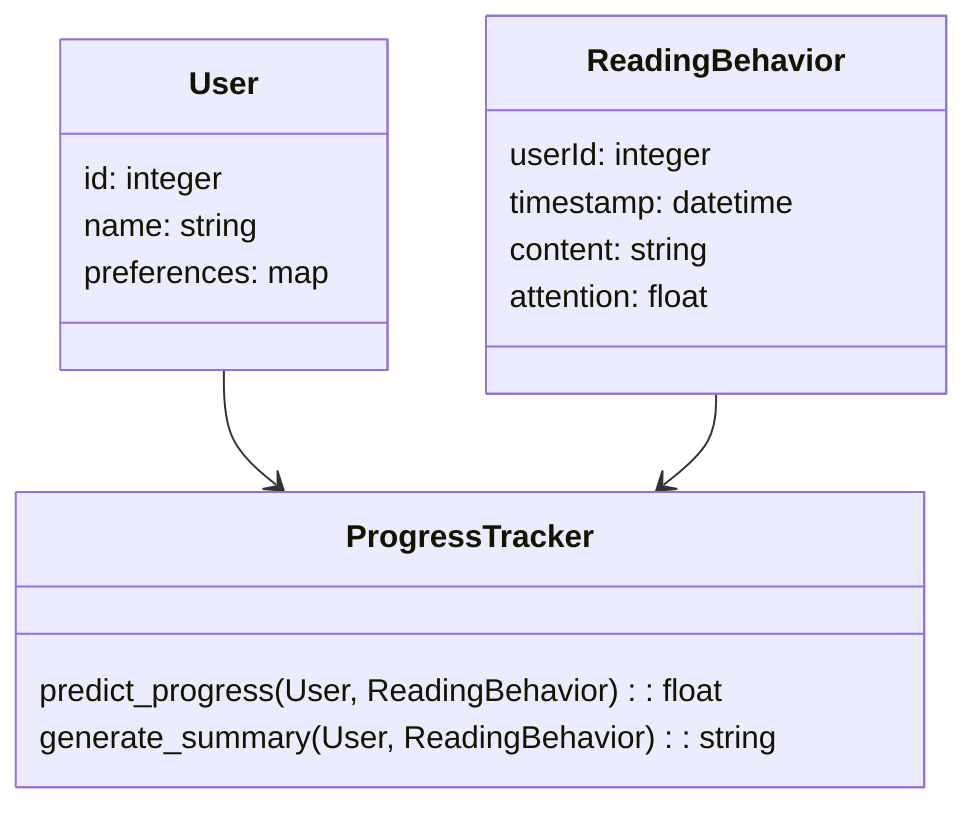
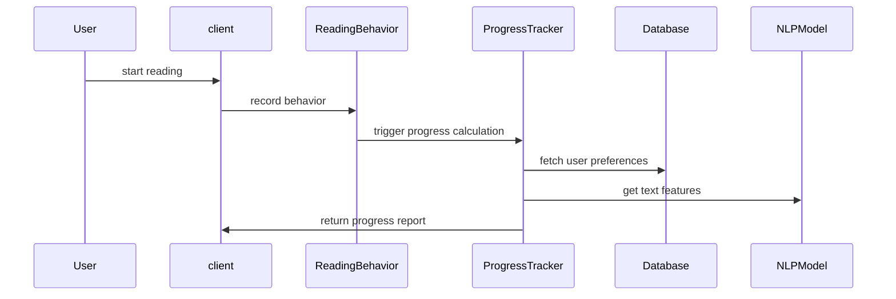

                 


# 智能书签：AI Agent的阅读进度追踪

**关键词**：AI Agent，阅读进度，智能书签，机器学习，自然语言处理，阅读行为分析

**摘要**：  
智能书签是一种基于AI Agent的阅读进度追踪系统，通过自然语言处理和机器学习技术，实现对用户阅读行为的实时分析与进度预测。本文将从AI Agent的核心概念、阅读进度追踪的实现原理、算法模型的数学基础，到系统的架构设计和项目实战，全面解析智能书签的实现过程，帮助读者理解如何利用AI技术提升阅读效率。

---

# 第一部分: AI Agent与阅读进度追踪的背景介绍

## 第1章: AI Agent的核心概念

### 1.1 问题背景与问题描述
#### 1.1.1 阅读进度追踪的痛点
现代人每天面对海量信息，阅读效率低下成为普遍问题。如何高效追踪阅读进度，避免重复阅读或遗漏重要内容，成为亟待解决的问题。传统的阅读进度管理工具功能单一，无法满足个性化需求。

#### 1.1.2 AI Agent在阅读中的应用价值
AI Agent（人工智能代理）能够通过自然语言处理和机器学习技术，实时分析阅读内容和用户行为，提供智能化的阅读进度追踪服务。

#### 1.1.3 智能书签的核心目标与边界
智能书签的目标是通过AI技术，实现阅读内容的智能分类、阅读进度的精准预测和个性化阅读建议。其边界包括：支持多种阅读场景（如电子书、网页阅读等），但暂不涉及社交分享功能。

### 1.2 智能书签的核心概念
#### 1.2.1 AI Agent的基本定义
AI Agent是一种能够感知环境、执行任务的智能实体，能够通过与用户交互完成特定目标。

#### 1.2.2 阅读进度追踪的实现方式
通过分析用户的阅读行为（如阅读速度、停留时间、注意力分布等），结合文本内容特征，预测用户的阅读进度。

#### 1.2.3 智能书签的系统架构
智能书签系统由用户端、AI处理模块和数据存储模块组成，能够实时捕捉用户的阅读行为，并通过AI算法生成进度报告。

---

## 第2章: AI Agent与阅读进度追踪的核心联系

### 2.1 AI Agent的核心原理
#### 2.1.1 监督学习与强化学习的对比
- **监督学习**：基于标注数据进行训练，适用于阅读内容分类任务。
- **强化学习**：通过与环境交互获得奖励，适用于阅读行为建模任务。

#### 2.1.2 生成模型与检索模型的优劣分析
- **生成模型**（如GPT）：擅长生成文本，适合阅读摘要任务。
- **检索模型**（如BERT）：擅长理解上下文，适合阅读理解任务。

#### 2.1.3 深度学习在阅读理解中的应用
深度学习通过预训练模型（如BERT、GPT）实现对文本的语义理解，为阅读进度追踪提供语义特征。

### 2.2 阅读进度追踪的实现原理
#### 2.2.1 文本特征提取方法
- **词袋模型**：基于单词频率提取文本特征。
- **TF-IDF**：基于关键词重要性提取文本特征。
- **Word2Vec**：通过词嵌入生成语义向量。

#### 2.2.2 阅读行为建模
- **马尔可夫链模型**：基于状态转移预测阅读行为。
- **注意力机制**：通过注意力权重分析用户注意力分布。

#### 2.2.3 进度预测算法
- **时间序列预测模型**：基于历史数据预测阅读进度。
- **LSTM网络**：通过循环神经网络捕捉阅读行为的时序特征。

---

## 第3章: 智能书签的核心功能与系统架构

### 3.1 系统功能模块
#### 3.1.1 用户信息管理模块
- 用户注册与登录
- 个性化阅读偏好设置

#### 3.1.2 阅读内容分析模块
- 文本分类与主题提取
- 阅读理解与摘要生成

#### 3.1.3 阅读进度追踪模块
- 阅读行为实时监测
- 进度预测与提醒

### 3.2 系统架构设计
#### 3.2.1 分层架构设计
- **前端层**：用户交互界面
- **业务逻辑层**：阅读行为分析与进度计算
- **数据存储层**：用户数据与阅读记录

#### 3.2.2 微服务架构实现
- 用户服务
- 阅读内容服务
- 进度追踪服务

#### 3.2.3 数据存储与管理
- 关系型数据库（如MySQL）
- 非关系型数据库（如MongoDB）
- 云存储解决方案（如AWS S3）

---

# 第二部分: AI Agent的算法原理与数学模型

## 第4章: AI Agent的算法原理

### 4.1 监督学习算法
#### 4.1.1 线性回归模型
$$ y = \beta_0 + \beta_1 x + \epsilon $$
- 适用于简单的线性关系建模。

#### 4.1.2 支持向量机原理
- 通过最大化几何间隔实现数据分类。

#### 4.1.3 神经网络基础
- 多层感知机（MLP）：通过非线性激活函数实现复杂关系建模。

### 4.2 强化学习算法
#### 4.2.1 Q-learning算法
$$ Q(s, a) = Q(s, a) + \alpha (r + \max Q(s', a') - Q(s, a)) $$
- 通过状态-动作对的值函数优化。

#### 4.2.2 Deep Q-Network算法
- 使用深度神经网络近似Q函数，解决高维状态空间问题。

#### 4.2.3 策略梯度方法
- 通过优化策略函数直接最大化目标函数。

## 第5章: 阅读进度追踪的数学模型

### 5.1 阅读行为建模
#### 5.1.1 马尔可夫链模型
- 状态转移概率矩阵表示阅读行为的转移关系。

#### 5.1.2 隐马尔可夫模型
$$ P(\mathbf{x}, \mathbf{z}) = P(\mathbf{z}|\mathbf{x})P(\mathbf{x}) $$
- 适用于序列数据的建模。

#### 5.1.3 贝叶斯网络
- 通过概率图模型建模阅读行为的因果关系。

### 5.2 阅读进度预测模型
#### 5.2.1 时间序列预测模型
- 使用ARIMA模型预测阅读进度。

#### 5.2.2 LSTM网络的应用
$$ f(x_t) = \text{tanh}(W_{hh}f(x_{t-1}) + W_{hx}x_t) $$
- 通过循环神经网络捕捉时序特征。

#### 5.2.3 Transformer模型的优化
$$ \text{Attention}(Q,K,V) = \text{softmax}(\frac{QK^T}{\sqrt{d}})V $$
- 通过自注意力机制优化阅读理解任务。

---

# 第三部分: 智能书签的系统分析与架构设计

## 第6章: 系统分析与架构设计方案

### 6.1 问题场景介绍
- 用户阅读场景：支持电子书、网页、PDF等多种格式。
- 阅读行为分析：捕捉用户的阅读速度、停留时间、注意力分布。

### 6.2 项目介绍
- 项目目标：构建一个基于AI Agent的阅读进度追踪系统。
- 项目范围：支持多种阅读场景，提供个性化阅读建议。

### 6.3 系统功能设计
#### 6.3.1 领域模型类图


#### 6.3.2 系统架构图
```mermaid
client --> UserAuth: authenticate
UserAuth --> Database: check credentials
client --> ReadingAnalyzer: analyze text
ReadingAnalyzer --> NLPModel: process text
NLPModel --> ProgressPredictor: predict progress
ProgressPredictor --> client: return progress
```

### 6.4 系统接口设计
- 用户端接口：REST API
- 服务端接口：WebSocket实时通信

### 6.5 系统交互流程图


---

# 第四部分: 智能书签的项目实战

## 第7章: 项目实战

### 7.1 环境安装
- Python 3.8+
- PyTorch 1.9+
- Transformers库
- Mermaid CLI工具

### 7.2 核心代码实现
#### 7.2.1 阅读行为分析模块
```python
import torch
from transformers import BertTokenizer, BertModel

class ReadingBehaviorAnalyzer:
    def __init__(self):
        self.tokenizer = BertTokenizer.from_pretrained('bert-base-uncased')
        self.model = BertModel.from_pretrained('bert-base-uncased')

    def analyze(self, text):
        inputs = self.tokenizer(text, return_tensors='np')
        outputs = self.model(**inputs)
        return outputs.last_hidden_state
```

#### 7.2.2 进度预测模块
```python
import torch.nn as nn
import torch.nn.functional as F

class ProgressPredictor(nn.Module):
    def __init__(self, input_size, hidden_size, output_size):
        super(ProgressPredictor, self).__init__()
        self.lstm = nn.LSTM(input_size, hidden_size, batch_first=True)
        self.fc = nn.Linear(hidden_size, output_size)

    def forward(self, x):
        out, _ = self.lstm(x)
        out = F.dropout(out, 0.5, training=self.training)
        out = self.fc(out[:, -1, :])
        return out
```

### 7.3 实际案例分析
- 案例1：用户阅读一篇科技文章，系统预测其阅读进度为75%，并生成摘要。
- 案例2：用户阅读一本小说，系统根据阅读速度调整提醒频率。

### 7.4 项目小结
- 通过AI Agent实现智能书签，能够显著提升用户的阅读效率。
- 项目实战展示了如何将理论应用于实际场景。

---

# 第五部分: 最佳实践与小结

## 第8章: 最佳实践与小结

### 8.1 最佳实践
- **数据质量**：确保阅读数据的完整性和准确性。
- **模型调优**：通过交叉验证优化模型性能。
- **用户体验**：设计简洁直观的用户界面。

### 8.2 小结
智能书签通过AI Agent技术，实现了高效的阅读进度追踪。本文从理论到实践，详细介绍了系统的实现过程，为读者提供了完整的解决方案。

---

# 作者

**作者：AI天才研究院/AI Genius Institute & 禅与计算机程序设计艺术 /Zen And The Art of Computer Programming**

---

通过以上结构，您可以逐步扩展每个章节的内容，确保每部分都有详细的讲解和具体的实现案例。

