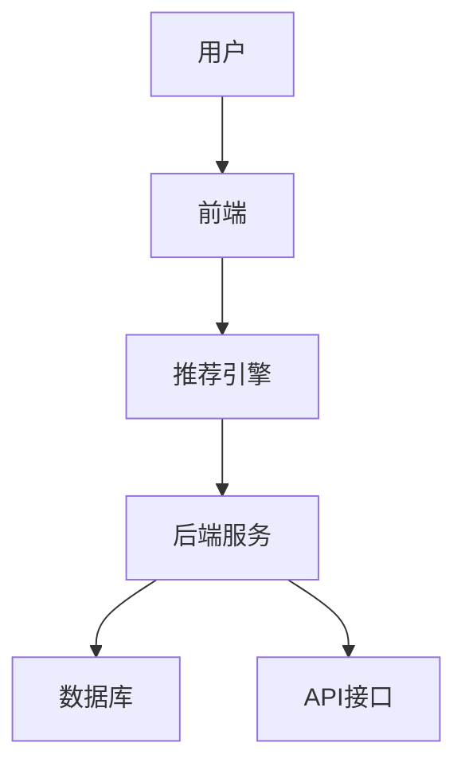
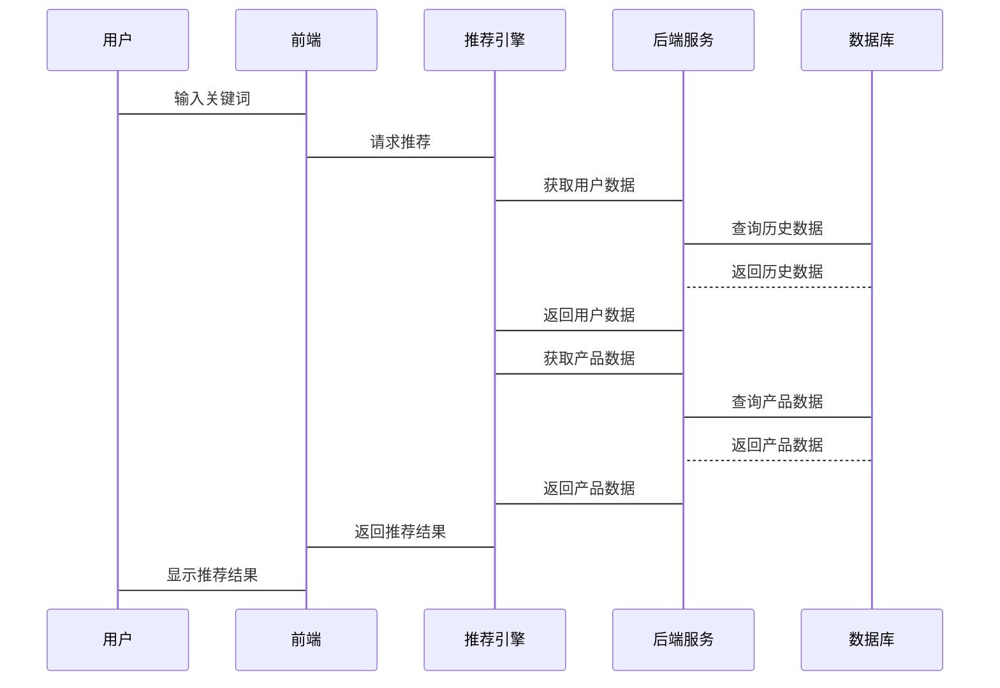

                 


# 智能产品推荐 AI Agent：LLM 驱动的电商助手

## 关键词：
智能推荐系统, 大语言模型, 电商助手, LLM, 推荐算法, 人工智能

## 摘要：
本文探讨了利用大语言模型（LLM）驱动智能产品推荐系统在电商中的应用。从背景介绍到算法原理，再到系统架构设计和项目实战，详细分析了LLM如何提升推荐系统的性能和用户体验。文章涵盖了推荐系统的分类、LLM的工作机制、协同过滤算法、系统架构设计、项目实战等内容，帮助读者全面理解LLM在电商推荐中的应用及其未来发展方向。

---

# 第一部分: 智能推荐系统概述

## 第1章: 智能推荐系统的发展与现状

### 1.1 智能推荐系统的概念与背景

#### 1.1.1 推荐系统的定义与分类
推荐系统是一种信息过滤技术，旨在通过分析用户行为和偏好，向用户推荐相关的产品或内容。推荐系统可以分为基于协同过滤、基于内容和基于深度学习的三类。

- **基于协同过滤的推荐**：通过分析用户之间的相似性，推荐用户可能感兴趣的产品。
- **基于内容的推荐**：通过分析产品的属性和描述，推荐与用户兴趣相符的产品。
- **基于深度学习的推荐**：利用神经网络模型，从大量数据中学习用户偏好，生成推荐结果。

#### 1.1.2 智能推荐系统的演变历程
推荐系统从最初的简单规则推荐发展到复杂的深度学习模型。近年来，随着大语言模型（LLM）的兴起，推荐系统在自然语言处理和生成方面取得了显著进展。

#### 1.1.3 当前推荐系统的应用领域
推荐系统广泛应用于电商、社交网络、视频平台等多个领域。在电商中，推荐系统帮助用户发现感兴趣的产品，提升购买转化率。

### 1.2 大语言模型（LLM）的崛起

#### 1.2.1 LLM的基本概念与技术原理
大语言模型是一种基于Transformer架构的深度学习模型，能够通过大量数据训练，生成与训练数据相似的文本。LLM的核心在于其强大的自然语言理解和生成能力。

#### 1.2.2 LLM在自然语言处理中的应用
LLM在机器翻译、文本生成、问答系统等领域表现出色。在推荐系统中，LLM能够帮助生成个性化的推荐描述，提升用户体验。

#### 1.2.3 LLM与推荐系统的结合
通过将LLM与推荐系统结合，可以利用模型的自然语言处理能力，生成更丰富、更个性化的推荐内容。

### 1.3 智能推荐在电商中的应用

#### 1.3.1 电商推荐系统的核心目标
电商推荐系统的核心目标是提高用户购买转化率和满意度。通过推荐相关产品，提升用户体验，增加销售额。

#### 1.3.2 LLM驱动的电商助手的优势
LLM驱动的电商助手能够根据用户的对话历史和偏好，实时生成推荐内容，提供更加个性化的购物体验。

#### 1.3.3 当前市场中的应用案例分析
目前，许多电商平台已经开始利用LLM进行推荐。例如，Amazon利用LLM优化产品描述，提升推荐效果。

---

## 第二部分: 智能推荐系统的核心概念与原理

## 第2章: 智能推荐系统的核心概念

### 2.1 推荐系统的分类与特点

#### 2.1.1 基于协同过滤的推荐
协同过滤是一种基于用户行为的推荐方法，通过分析用户之间的相似性，推荐用户可能感兴趣的产品。

- **基于用户的协同过滤**：通过分析用户的行为数据，找到与当前用户相似的用户，推荐他们喜欢的产品。
- **基于物品的协同过滤**：通过分析产品的相似性，推荐与当前用户购买或浏览的产品相似的其他产品。
- **混合协同过滤模型**：结合用户和物品的特征，综合考虑用户的偏好和产品的属性，生成推荐结果。

#### 2.1.2 基于内容的推荐
基于内容的推荐方法通过分析产品的属性和描述，推荐与用户兴趣相符的产品。

- **文本分析**：通过自然语言处理技术，提取产品的关键词和描述，分析用户偏好。
- **内容相似度计算**：基于产品描述的相似度，推荐相关产品。

#### 2.1.3 混合推荐模型
混合推荐模型结合了协同过滤和基于内容的推荐方法，能够同时考虑用户行为和产品属性，生成更准确的推荐结果。

### 2.2 LLM在推荐系统中的角色

#### 2.2.1 LLM作为推荐引擎的驱动者
LLM可以作为推荐引擎的核心，通过自然语言处理能力生成推荐内容。

- **文本理解和生成**：LLM能够理解用户的需求，并生成个性化的推荐描述。
- **动态推荐**：根据用户的实时行为，动态调整推荐内容。

#### 2.2.2 LLM的文本理解和生成能力
LLM的强大文本理解和生成能力使其在推荐系统中具有重要作用。通过分析用户的输入，生成相关的推荐内容。

#### 2.2.3 LLM在推荐中的创新应用
除了传统的推荐方法，LLM还可以用于生成推荐理由和产品描述，提升用户体验。

### 2.3 推荐系统与LLM的结合模型

#### 2.3.1 基于LLM的文本分析
通过LLM对用户评论和产品描述进行文本分析，提取关键词和情感倾向，生成推荐结果。

#### 2.3.2 LLM驱动的动态推荐
动态推荐是指根据用户的实时行为和反馈，动态调整推荐内容。LLM能够实时生成个性化推荐，提升用户体验。

#### 2.3.3 LLM与推荐系统的联合优化
通过将LLM与推荐系统联合优化，可以提升推荐的准确性和用户体验。

---

## 第三部分: 推荐系统的算法原理

## 第3章: 协同过滤算法

### 3.1 协同过滤的基本原理

#### 3.1.1 基于用户的协同过滤
基于用户的协同过滤方法通过分析用户之间的相似性，推荐用户可能感兴趣的产品。

- **用户相似度计算**：通过计算用户之间的相似度，找到与当前用户相似的用户，推荐他们喜欢的产品。
- **基于余弦相似度的计算**：余弦相似度是一种常用的相似度计算方法，公式为：
  $$ \text{similarity}(u_i, u_j) = \frac{\sum_{k} u_i(k) \times u_j(k)}{\sqrt{\sum_{k} u_i(k)^2} \times \sqrt{\sum_{k} u_j(k)^2}} $$
  
  其中，\( u_i(k) \) 表示用户 \( u_i \) 对物品 \( k \) 的评分。

#### 3.1.2 基于物品的协同过滤
基于物品的协同过滤方法通过分析物品之间的相似性，推荐与当前用户购买或浏览的产品相似的其他产品。

- **物品相似度计算**：通过计算物品之间的相似度，找到与当前物品相似的其他物品，推荐给用户。
- **基于协同过滤的物品推荐公式**：
  $$ r(i,j) = \frac{\sum_{k} s(i,k) \times r(k,j)}{\sum_{k} s(i,k)} $$
  
  其中，\( s(i,k) \) 表示物品 \( i \) 和 \( k \) 之间的相似度，\( r(k,j) \) 表示用户 \( j \) 对物品 \( k \) 的评分。

#### 3.1.3 混合协同过滤模型
混合协同过滤模型结合了基于用户和基于物品的协同过滤方法，能够综合考虑用户的偏好和物品的属性，生成更准确的推荐结果。

### 3.2 协同过滤的实现步骤

#### 3.2.1 数据预处理
协同过滤需要对数据进行预处理，包括数据清洗、归一化等。

- **数据清洗**：去除无效数据和异常值。
- **归一化处理**：对评分数据进行归一化处理，确保不同数据的可比性。

#### 3.2.2 相似度计算
根据选择的相似度计算方法，计算用户或物品之间的相似度。

- **余弦相似度计算**：通过向量的点积计算相似度。
- **皮尔逊相关系数计算**：通过协方差和方差计算相似度。

#### 3.2.3 推荐生成
根据相似度计算结果，生成推荐列表。

### 3.3 协同过滤的优缺点分析

#### 3.3.1 优点：捕捉用户偏好
协同过滤能够捕捉用户之间的相似性，推荐用户可能感兴趣的产品。

#### 3.3.2 缺点：冷启动问题
协同过滤在处理新用户或新产品时，存在冷启动问题，难以生成有效的推荐结果。

#### 3.3.3 改进方向
为了克服冷启动问题，可以结合基于内容的推荐方法，或者利用协同过滤与其他算法的结合，提升推荐效果。

---

## 第四部分: LLM的机制与优化

## 第4章: LLM的工作原理

### 4.1 LLM的内部结构

#### 4.1.1 Transformer模型的基本结构
Transformer模型由编码器和解码器两部分组成，通过自注意力机制和前馈网络实现自然语言处理任务。

- **编码器**：将输入序列编码为一个固定长度的向量。
- **解码器**：根据编码器输出的向量，生成目标序列。

#### 4.1.2 注意力机制的实现
注意力机制通过计算输入序列中每个位置的重要性，生成加权后的结果。

- **自注意力机制**：用于编码器中的多头注意力，计算输入序列中每个位置与其他位置的关系。
- **多头注意力机制**：通过多个并行的注意力头，提升模型的表达能力。

#### 4.1.3 激活函数的作用
激活函数用于引入非线性，增强模型的表达能力。

### 4.2 LLM的训练过程

#### 4.2.1 预训练阶段
预训练阶段通过大量通用数据训练模型，使其具备基本的自然语言处理能力。

- **预训练目标**：通常采用自监督学习，例如遮蔽词任务或预测下一个词任务。
- **遮蔽词任务**：随机遮蔽部分词，要求模型根据上下文预测被遮蔽的词。
- **预测下一个词任务**：要求模型预测序列的下一个词。

#### 4.2.2 微调阶段
微调阶段通过特定任务的数据进一步优化模型，使其适应具体的推荐任务。

- **数据增强**：通过数据增强技术，增加数据的多样性和代表性。
- **微调策略**：采用小批量训练和学习率调整，逐步优化模型参数。

#### 4.2.3 模型压缩与优化
为了在实际应用中高效使用LLM，可以采用模型压缩和优化技术，降低计算成本。

- **知识蒸馏**：将大模型的知识迁移到小模型，保持性能的同时减少计算量。
- **剪枝优化**：通过剪枝技术去除模型中冗余的参数，降低模型复杂度。

### 4.3 LLM的优化方法

#### 4.3.1 参数优化
通过调整模型参数，优化推荐效果。

- **Adam优化器**：一种常用的有效优化算法，结合动量和自适应学习率。
- **学习率调整**：采用学习率衰减策略，逐步降低学习率，防止模型过拟合。

#### 4.3.2 模型结构优化
通过调整模型结构，提升推荐效果。

- **多层感知机优化**：增加或减少网络层数，优化模型的表达能力。
- **注意力机制优化**：通过改进注意力机制，提升模型对推荐任务的适应性。

#### 4.3.3 训练数据优化
通过优化训练数据，提升模型的推荐效果。

- **数据均衡**：平衡训练数据中的类别分布，防止模型偏向某些特定类别。
- **数据多样性**：引入多样化的数据，提升模型的泛化能力。

---

## 第五部分: 系统架构设计

## 第5章: 系统架构设计

### 5.1 电商助手的整体架构

#### 5.1.1 系统功能模块
电商助手系统主要包括用户交互模块、推荐引擎模块、数据存储模块和接口管理模块。

- **用户交互模块**：负责与用户进行交互，获取用户需求和反馈。
- **推荐引擎模块**：基于用户的输入，生成推荐内容。
- **数据存储模块**：存储用户行为数据和推荐结果。
- **接口管理模块**：提供API接口，与其他系统进行交互。

#### 5.1.2 系统功能流程
用户通过前端界面输入需求，系统通过推荐引擎生成推荐结果，并返回给用户。

- **用户输入**：用户输入关键词或描述，系统开始推荐过程。
- **推荐引擎处理**：推荐引擎分析用户输入，结合用户行为数据和产品信息，生成推荐结果。
- **结果展示**：推荐结果通过前端展示给用户。

#### 5.1.3 系统架构图
以下是电商助手系统的架构图：



### 5.2 数据流设计

#### 5.2.1 数据采集与预处理
数据采集阶段，系统需要收集用户的行为数据，包括点击、浏览、购买等。

- **数据采集**：通过日志记录用户的行为数据。
- **数据预处理**：清洗数据，去除异常值，进行数据归一化处理。

#### 5.2.2 数据存储与管理
数据存储阶段，系统需要将预处理后的数据存储在数据库中，供推荐引擎使用。

- **数据库选择**：根据数据类型选择合适的数据库，如关系型数据库或NoSQL数据库。
- **数据索引优化**：通过建立索引，提升数据查询效率。

#### 5.2.3 数据更新与维护
数据更新阶段，系统需要定期更新数据库中的数据，确保推荐引擎能够获取最新的信息。

- **数据备份**：定期备份数据库，防止数据丢失。
- **数据同步**：确保数据库中的数据与实际业务数据一致。

### 5.3 系统接口设计

#### 5.3.1 接口定义
系统需要定义清晰的接口规范，便于与其他系统进行交互。

- **API接口**：提供RESTful API接口，支持GET、POST等请求方法。
- **接口文档**：编写详细的接口文档，明确接口的功能、参数和返回格式。

#### 5.3.2 接口实现
接口实现阶段，需要编写具体的接口代码，确保接口的稳定性和可靠性。

- **接口测试**：通过自动化测试工具，测试接口的正确性和性能。
- **错误处理**：在接口中加入错误处理机制，确保接口的健壮性。

### 5.4 系统交互设计

#### 5.4.1 用户界面设计
用户界面设计需要简洁直观，方便用户操作。

- **前端设计**：采用响应式设计，确保在不同设备上都能良好显示。
- **交互设计**：设计良好的交互流程，提升用户体验。

#### 5.4.2 系统交互流程
系统交互流程包括用户输入、系统处理和结果展示三个阶段。

- **用户输入**：用户在前端输入关键词或描述。
- **系统处理**：推荐引擎根据用户输入生成推荐结果。
- **结果展示**：推荐结果通过前端展示给用户。

#### 5.4.3 交互序列图
以下是系统交互的序列图：



---

## 第六部分: 项目实战

## 第6章: 项目实战

### 6.1 环境搭建

#### 6.1.1 安装Python环境
安装Python 3.8及以上版本，确保环境满足项目需求。

#### 6.1.2 安装必要的库
安装推荐系统和自然语言处理所需的库，如numpy、pandas、scikit-learn、transformers等。

#### 6.1.3 配置运行环境
配置运行环境，包括虚拟环境的创建和依赖管理。

### 6.2 系统核心实现

#### 6.2.1 推荐引擎实现
推荐引擎是系统的核心部分，负责根据用户输入生成推荐结果。

- **用户输入处理**：接收用户的输入，进行预处理和解析。
- **推荐算法实现**：根据选择的推荐算法，生成推荐结果。
- **结果处理**：对推荐结果进行排序和筛选，确保结果的合理性和相关性。

#### 6.2.2 LLM集成
将LLM集成到推荐引擎中，提升推荐的准确性和个性化。

- **LLM调用**：通过API调用LLM，获取生成的推荐描述。
- **结果整合**：将LLM生成的描述与推荐结果结合，生成最终的推荐列表。

#### 6.2.3 系统接口实现
实现系统的API接口，方便与其他系统进行交互。

- **API设计**：设计RESTful API接口，支持GET和POST请求。
- **接口实现**：编写接口代码，确保接口的稳定性和可靠性。

### 6.3 代码实现

#### 6.3.1 数据预处理代码
以下是数据预处理的Python代码：

```python
import pandas as pd
from sklearn.model_selection import train_test_split

# 加载数据
data = pd.read_csv('user_interactions.csv')

# 分割数据
train_data, test_data = train_test_split(data, test_size=0.2)

# 数据清洗
train_data.dropna()
```

#### 6.3.2 协同过滤实现代码
以下是协同过滤算法的Python代码：

```python
from sklearn.metrics.pairwise import cosine_similarity

# 计算用户相似度
user_features = train_data[['user_id', 'item_id', 'rating']]
user_features = user_features.pivot(index='user_id', columns='item_id', values='rating')
user_features = user_features.fillna(0)

# 计算余弦相似度
similarity_matrix = cosine_similarity(user_features.T)

# 根据相似度生成推荐
def get_recommendations(user_id, similarity_matrix, num_recommendations=5):
    user_index = user_id - 1
    similar_users = [i for i in range(len(similarity_matrix[user_index]))]
    similar_users.sort(key=lambda x: similarity_matrix[user_index][x], reverse=True)
    recommendations = []
    for user in similar_users[:num_recommendations]:
        recommendations.append(user + 1)
    return recommendations
```

#### 6.3.3 LLM集成代码
以下是集成LLM的Python代码：

```python
from transformers import AutoTokenizer, AutoModelForCausalLM

# 加载LLM模型和分词器
model_name = 'gpt2'
tokenizer = AutoTokenizer.from_pretrained(model_name)
model = AutoModelForCausalLM.from_pretrained(model_name)

# 生成推荐描述
def generate_recommendation_description(product_id):
    inputs = tokenizer.encode(f"推荐描述：产品ID：{product_id}", return_tensors='np')
    outputs = model.generate(inputs, max_length=50)
    description = tokenizer.decode(outputs[0], skip_special_tokens=True)
    return description
```

### 6.4 案例分析与代码解读

#### 6.4.1 案例分析
通过实际案例分析，展示如何利用LLM驱动的推荐系统进行产品推荐。

- **用户输入**：用户输入关键词“运动鞋”。
- **系统处理**：系统分析用户的输入，结合用户历史行为和产品数据，生成推荐结果。
- **推荐结果**：推荐几款适合不同用户的运动鞋，生成个性化的推荐描述。

#### 6.4.2 代码解读
解读代码的实现细节，说明如何将LLM与推荐系统结合。

- **数据预处理**：对用户行为数据进行清洗和归一化处理，确保数据质量。
- **推荐算法实现**：基于协同过滤算法生成推荐结果，再结合LLM生成推荐描述。
- **系统接口设计**：设计API接口，方便与其他系统进行交互和集成。

### 6.5 项目总结

#### 6.5.1 项目小结
通过本项目，我们成功实现了基于LLM的智能产品推荐系统，提升了推荐的准确性和用户体验。

#### 6.5.2 项目经验
在项目实施过程中，我们积累了宝贵的经验，包括数据处理、模型优化和系统设计等方面。

#### 6.5.3 项目展望
未来，我们将进一步优化推荐算法，提升系统的推荐效果和用户体验，探索更多基于LLM的应用场景。

---

## 第七部分: 总结与展望

## 第7章: 总结与展望

### 7.1 全文总结

本文详细探讨了利用大语言模型（LLM）驱动智能产品推荐系统在电商中的应用。从推荐系统的背景和核心概念，到协同过滤算法和LLM的机制，再到系统架构设计和项目实战，全面分析了LLM在推荐系统中的作用和优势。

### 7.2 当前挑战与未来发展方向

尽管LLM在推荐系统中表现出色，但仍面临一些挑战，例如计算成本高、模型更新频繁等。未来，可以通过模型压缩、优化算法和分布式计算等方法，进一步提升推荐系统的性能和效率。

### 7.3 最佳实践 Tips

- **数据质量**：确保数据的准确性和完整性，提升推荐系统的性能。
- **模型优化**：通过参数调整和模型压缩，降低计算成本。
- **用户体验**：关注用户体验，提供个性化的推荐服务，提升用户满意度。

### 7.4 总结

通过本文的探讨，我们可以看到，LLM在推荐系统中的应用前景广阔。随着技术的不断进步，相信未来会有更多创新的应用场景，为电商的发展注入新的活力。

---

## 作者信息

作者：AI天才研究院/AI Genius Institute & 禅与计算机程序设计艺术 /Zen And The Art of Computer Programming

---

以上是《智能产品推荐 AI Agent：LLM 驱动的电商助手》的技术博客文章的完整目录和内容框架，涵盖了从背景介绍到项目实战的各个方面，帮助读者全面理解LLM在电商推荐中的应用及其未来发展方向。

