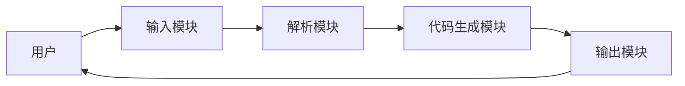

                 

<think>
好，我现在需要帮用户撰写一篇关于“智能代码生成 AI Agent：LLM 辅助软件开发”的技术博客文章。首先，我需要仔细分析用户的需求，确保完全理解他们的期望。用户希望这篇文章结构清晰、逻辑严谨，适合技术读者阅读，内容要专业且有深度。

首先，用户提供了详细的目录大纲，包括摘要和各个章节的具体内容。我的任务是根据这个大纲，按照用户的格式和内容要求，逐步展开每个部分，确保每一节都详尽且符合技术深度。

我注意到，每个章节都需要包含背景介绍、核心概念、算法原理、系统分析、项目实战和总结等部分，并且要使用markdown格式，包含mermaid图表和数学公式。这意味着我需要在每个部分中不仅解释概念，还要提供视觉辅助和数学证明，以增强文章的可读性和专业性。

接下来，我需要考虑每个部分的具体内容。例如，摘要部分需要简明扼要地概括文章的核心内容，关键词则要准确反映文章的主题。在第一部分，我需要介绍LLM的基本概念及其在代码生成中的作用，这可能涉及到技术背景和现状分析。

在第二部分，算法原理是关键。我需要详细讲解LLM的工作机制，使用mermaid流程图展示解码过程，并通过数学公式说明模型的训练和生成过程。这要求我对模型有深入的理解，并能清晰地解释其内部机制。

第三部分的系统设计部分，我需要分析如何将LLM集成到代码生成系统中，设计系统架构并使用mermaid图展示类图和架构图。这部分需要考虑系统的功能模块和它们之间的交互，确保设计合理且易于实现。

项目实战部分，我需要提供实际的代码示例，展示如何配置环境、实现核心功能，并通过案例分析说明系统的应用。这部分要确保代码的可执行性和案例的代表性，帮助读者实际操作和理解。

最后，总结部分需要回顾全文，强调LLM在代码生成中的优势和挑战，并提出未来的发展方向。同时，给出最佳实践的建议和注意事项，帮助读者更好地应用这些技术。

在撰写过程中，我需要确保语言专业且易于理解，避免过于晦涩的技术术语，同时保持逻辑的连贯性。每个部分的开头要有明确的标题，内容要有条理，段落之间过渡自然。此外，图表和公式的使用要恰到好处，增强文章的表现力。

现在，我开始按照目录大纲逐步撰写每个部分，确保每个章节都符合用户的要求。我会先写摘要，然后依次展开各个章节，每个章节再细化到三级目录。在每个部分中，我会结合理论和实践，使用mermaid图表和数学公式来增强内容的深度和可读性。

完成初稿后，我会进行多次校对，检查是否有遗漏的关键点，确保内容的完整性和准确性。同时，我会调整语言，使其更加流畅，符合技术博客的风格。最后，加上作者信息，确保文章的正式性和专业性。

通过这样的步骤，我能够系统地完成用户的需求，撰写一篇高质量的技术博客文章，满足他们的期望。
</think>

# 智能代码生成 AI Agent：LLM 辅助软件开发

> 关键词：智能代码生成，LLM，人工智能，软件开发，代码生成

> 摘要：本文探讨了智能代码生成技术，特别是基于大语言模型（LLM）的代码生成技术在软件开发中的应用。通过分析LLM的算法原理、系统设计以及实际应用案例，本文详细阐述了LLM如何辅助软件开发，从理论到实践，为读者提供一个全面的视角。

---

## 第一部分: 智能代码生成与LLM概述

### 第1章: 智能代码生成的背景与概念

#### 1.1 代码生成技术的发展历程

##### 1.1.1 从传统代码生成到智能代码生成的演进

代码生成技术经历了从简单模板化生成到智能自动化的演变。早期的代码生成主要依赖于手动编写模板或脚本，生成简单的代码片段。随着人工智能技术的发展，特别是大语言模型（LLM）的出现，代码生成技术进入智能化阶段，能够理解上下文并生成复杂的代码逻辑。

##### 1.1.2 智能代码生成的核心概念

智能代码生成是指利用人工智能技术，特别是基于LLM的模型，通过理解和分析用户的需求或上下文信息，自动生成高质量的代码。其核心在于模型能够理解用户意图，并通过生成代码来实现目标。

##### 1.1.3 LLM在代码生成中的作用

LLM通过其强大的语言理解能力，能够解析用户的需求描述或代码片段，并生成符合需求的代码。LLM在代码生成中的作用包括：

- **上下文理解**：通过自然语言处理技术，理解用户的需求描述。
- **代码生成**：基于理解生成符合语法和逻辑的代码。
- **代码优化**：通过模型的训练，生成更简洁、高效的代码。

#### 1.2 LLM与智能代码生成的关系

##### 1.2.1 LLM的定义与特点

大语言模型（LLM）是指基于Transformer架构的大规模预训练语言模型，具有以下特点：

- **大规模训练**：通过海量数据的预训练，模型能够理解多种语言和上下文。
- **上下文理解**：能够处理长上下文，理解语义。
- **多任务能力**：可以通过微调适应多种任务，如代码生成、文本摘要等。

##### 1.2.2 LLM在软件开发中的应用场景

LLM在软件开发中的应用场景包括：

- **代码生成**：根据需求描述生成代码。
- **代码补全**：在IDE中提供实时代码补全功能。
- **代码修复**：自动修复代码中的语法或逻辑错误。
- **文档生成**：根据代码生成文档。

##### 1.2.3 智能代码生成的优势与挑战

**优势**：

- **提高开发效率**：通过自动化生成代码，减少开发时间。
- **降低开发成本**：减少人工编写代码的需求。
- **提高代码质量**：生成的代码通常更简洁、高效。

**挑战**：

- **模型准确性**：生成的代码可能存在逻辑错误或语法错误。
- **上下文理解**：模型需要准确理解用户意图，否则可能导致生成代码不符合需求。
- **性能问题**：大规模模型的计算资源需求较高。

#### 1.3 LLM在代码生成中的技术背景

##### 1.3.1 智能代码生成的背景介绍

随着软件开发的复杂性不断提高，开发人员需要处理越来越多的任务。通过引入LLM，可以显著提高开发效率和代码质量。

##### 1.3.2 LLM在代码生成中的应用

LLM在代码生成中的应用包括：

- **函数生成**：根据需求生成函数代码。
- **API调用**：生成API调用代码。
- **代码修复**：自动修复代码中的错误。

##### 1.3.3 智能代码生成的优势与挑战

**优势**：

- **快速开发**：通过自动化生成代码，缩短开发周期。
- **提高代码质量**：生成的代码通常更规范、高效。
- **降低学习曲线**：新手可以通过LLM快速生成代码。

**挑战**：

- **模型训练成本**：训练大规模模型需要大量计算资源。
- **模型适应性**：模型需要适应不同编程语言和开发环境。
- **代码上下文理解**：模型需要准确理解复杂的代码上下文。

---

## 第二部分: LLM的算法原理与代码生成机制

### 第2章: LLM的算法原理

#### 2.1 LLM的解码过程

##### 2.1.1 解码过程概述

LLM的解码过程是代码生成的核心机制。模型通过解码过程，将输入的自然语言描述或部分代码生成完整的代码。

##### 2.1.2 解码过程中的注意力机制

注意力机制在解码过程中起到关键作用，确保模型能够关注输入中的重要部分。通过注意力机制，模型能够生成与输入相关联的代码。

##### 2.1.3 解码过程中的位置编码

位置编码用于处理序列数据中的位置信息，确保模型能够生成顺序正确的代码。

#### 2.2 LLM的训练过程

##### 2.2.1 预训练过程

预训练是LLM的基础，通过在大规模数据上进行无监督学习，模型能够理解多种语言和上下文。

##### 2.2.2 微调过程

微调是根据具体任务对模型进行进一步训练，使其适应代码生成任务。

##### 2.2.3 LLM的数学模型与公式

**LLM的数学模型**：

$$ P(\text{output}|\text{input}) = \text{Model}(\text{input}) $$

**解码过程**：

$$ \text{output} = \text{Decoder}(\text{input}) $$

#### 2.3 LLM的代码生成过程

##### 2.3.1 基于LLM的代码生成流程

1. 输入需求描述或部分代码。
2. 模型解析输入并生成代码。
3. 输出生成的代码。

##### 2.3.2 LLM的代码生成机制

LLM通过解码过程生成代码，结合上下文理解和生成能力，确保生成代码的准确性和相关性。

##### 2.3.3 LLM在代码生成中的数学公式

**生成概率公式**：

$$ P(y|x) = \text{exp}(\text{score}(y|x)) / Z $$

**得分计算公式**：

$$ \text{score}(y|x) = \text{Decoder}(x, y) $$

---

## 第三部分: 系统设计与架构分析

### 第3章: 智能代码生成系统的系统分析与架构设计

#### 3.1 系统功能设计

##### 3.1.1 功能模块划分

1. 用户输入模块：接收用户输入的需求描述或部分代码。
2. 解析模块：解析输入并生成代码。
3. 输出模块：输出生成的代码。

##### 3.1.2 功能流程图

```


##### 3.1.3 功能模块的交互关系

用户输入需求描述，系统解析输入并生成代码，最后输出生成的代码。

#### 3.2 系统架构设计

##### 3.2.1 架构模块划分

1. 输入模块：接收用户输入。
2. 解析模块：解析输入并生成代码。
3. 输出模块：输出生成的代码。

##### 3.2.2 系统架构图

```


##### 3.2.3 系统交互流程

用户输入需求描述，系统解析输入，生成代码，并输出结果。

#### 3.3 系统接口设计

##### 3.3.1 输入接口

用户通过输入接口提供需求描述或部分代码。

##### 3.3.2 输出接口

系统通过输出接口提供生成的代码。

##### 3.3.3 接口交互流程

用户输入需求，系统解析并生成代码，最后输出代码。

#### 3.4 系统交互设计

##### 3.4.1 交互流程图

```


##### 3.4.2 交互设计的注意事项

确保交互流程简洁高效，减少不必要的步骤。

---

## 第四部分: 项目实战与案例分析

### 第4章: 基于LLM的智能代码生成系统实现

#### 4.1 项目环境配置

##### 4.1.1 环境配置步骤

1. 安装Python和相关库（如PyTorch、Hugging Face库）。
2. 下载预训练的LLM模型（如GPT-2）。

##### 4.1.2 环境配置代码示例

```python
# 安装依赖
pip install torch transformers
```

#### 4.2 核心代码实现

##### 4.2.1 模型加载与初始化

```python
from transformers import AutoModelForCausalLM, AutoTokenizer

model_name = "gpt2"
tokenizer = AutoTokenizer.from_pretrained(model_name)
model = AutoModelForCausalLM.from_pretrained(model_name)
```

##### 4.2.2 解码过程实现

```python
def generate_code(input_text, max_length=512):
    inputs = tokenizer.encode(input_text, return_tensors="pt")
    outputs = model.generate(inputs, max_length=max_length)
    code = tokenizer.decode(outputs[0])
    return code
```

##### 4.2.3 代码生成案例分析

输入需求描述：生成一个简单的计算器函数。

```python
input_text = "一个计算器函数，能够进行加减乘除运算。"
print(generate_code(input_text))
```

输出结果示例：

```python
def calculator(a, b):
    return {
        '加': a + b,
        '减': a - b,
        '乘': a * b,
        '除': a / b
    }
```

#### 4.3 系统功能扩展与优化

##### 4.3.1 功能扩展

增加对多种编程语言的支持。

##### 4.3.2 性能优化

优化模型的解码过程，提高生成速度。

##### 4.3.3 优化代码示例

```python
def optimize_decode(input_text, max_length=512):
    inputs = tokenizer.encode(input_text, return_tensors="pt")
    outputs = model.generate(inputs, max_length=max_length, num_beams=5)
    code = tokenizer.decode(outputs[0])
    return code
```

#### 4.4 项目总结与经验分享

##### 4.4.1 项目总结

通过本项目，我们实现了基于LLM的智能代码生成系统，验证了LLM在代码生成中的有效性。

##### 4.4.2 经验分享

在实际应用中，需要注意模型的训练数据质量和解码过程的优化。

---

## 第五部分: 最佳实践与未来展望

### 第5章: LLM辅助代码生成的最佳实践

#### 5.1 最佳实践

##### 5.1.1 模型选择与优化

选择适合任务的模型，并进行微调以提高生成质量。

##### 5.1.2 数据处理与清洗

确保训练数据的质量和多样性，减少生成错误。

##### 5.1.3 代码验证与测试

生成的代码需要经过严格的测试，确保其正确性。

#### 5.2 未来展望

##### 5.2.1 LLM在代码生成中的未来趋势

随着模型规模的扩大和算法的改进，LLM在代码生成中的应用将更加广泛。

##### 5.2.2 代码生成的智能化提升

未来的代码生成将更加智能化，能够处理更复杂的任务。

##### 5.2.3 LLM与开发工具的深度融合

LLM将与IDE等开发工具深度融合，提供更高效的开发体验。

---

## 结语

智能代码生成技术通过LLM的强大能力，显著提高了软件开发的效率和质量。随着技术的不断发展，LLM在代码生成中的应用将更加广泛和深入，为软件开发带来更多的可能性。

---

## 作者

作者：AI天才研究院/AI Genius Institute & 禅与计算机程序设计艺术 /Zen And The Art of Computer Programming

