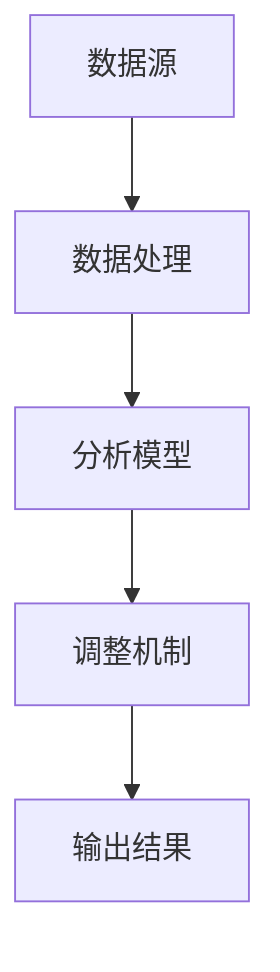
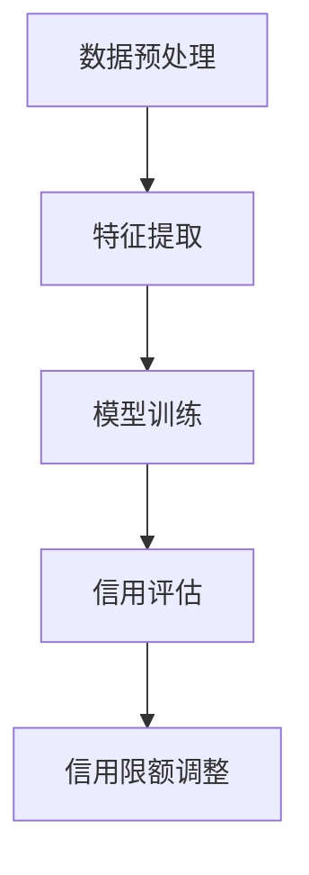
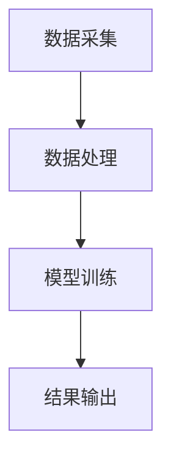

                 


# 智能企业信用限额动态调整系统

> 关键词：智能企业信用限额动态调整系统，信用限额调整，机器学习，动态调整，企业信用管理

> 摘要：本文详细介绍了智能企业信用限额动态调整系统的设计与实现。从问题背景到核心概念，从算法原理到系统架构，从项目实战到最佳实践，全面解析了该系统的核心技术与实际应用。

---

## 第1章: 问题背景与核心概念

### 1.1 问题背景

随着企业规模的不断扩大和市场环境的复杂化，传统的静态信用限额管理模式已经难以满足企业对风险控制和资源优化的需求。企业的信用管理需要更加动态化和智能化，以应对市场波动和客户需求的变化。

#### 1.1.1 企业信用管理的重要性

企业信用管理是企业在经营过程中对客户信用进行评估、监控和调整的重要环节。有效的信用管理能够帮助企业降低坏账风险，优化客户资源，提高整体运营效率。

#### 1.1.2 传统信用限额调整的局限性

传统的信用限额调整通常基于固定规则或人工决策，存在以下问题：
- 调整周期长：依赖人工审核，无法实时响应市场变化。
- 精度低：缺乏数据支持，可能导致限额设置不合理。
- 风险高：人工决策容易受到主观因素影响，存在较高的信用风险。

#### 1.1.3 智能化调整的需求与趋势

随着大数据和人工智能技术的发展，企业开始采用智能化的信用限额调整系统。这种系统能够实时分析客户行为和市场数据，动态调整信用限额，从而提高信用管理的效率和准确性。

### 1.2 核心概念与问题描述

#### 1.2.1 智能企业信用限额动态调整系统的定义

智能企业信用限额动态调整系统是一种基于机器学习和大数据分析的智能系统，能够根据企业的实时数据和市场环境，自动调整客户的信用限额。

#### 1.2.2 系统的目标与功能

系统的目标是通过智能化的算法，实时分析客户信用状况，动态调整信用限额，降低信用风险，提高企业运营效率。

系统的主要功能包括：
- 实时数据采集与处理
- 客户信用评估与预测
- 动态信用限额调整
- 风险预警与报告

#### 1.2.3 系统的边界与外延

系统的边界包括企业内部的客户数据、市场数据和交易数据。系统的外延包括与第三方数据源的集成，如征信机构、市场调研机构等。

### 1.3 核心要素与概念结构

#### 1.3.1 核心要素分析

系统的核心要素包括：
- 数据源：客户数据、交易数据、市场数据
- 分析模型：机器学习模型、信用评估模型
- 调整机制：动态调整算法、规则引擎
- 输出结果：信用限额调整建议、风险预警报告

#### 1.3.2 概念结构图

以下是系统的概念结构图：



#### 1.3.3 核心要素之间的关系

数据源经过数据处理后，输入到分析模型中进行信用评估，分析模型的结果驱动调整机制，生成信用限额调整建议和风险预警报告。

---

## 第2章: 核心概念与联系

### 2.1 核心概念的原理

#### 2.1.1 系统的核心算法原理

系统的算法基于机器学习，特别是监督学习和时间序列分析。以下是算法的主要步骤：



#### 2.1.2 系统的运行机制

系统的运行机制包括数据采集、特征提取、模型训练和信用评估四个步骤。

#### 2.1.3 核心概念的数学模型

系统的信用评估模型基于线性回归和逻辑回归。以下是信用评分的数学模型：

$$ \text{信用评分} = \beta_0 + \beta_1 x_1 + \beta_2 x_2 + \ldots + \beta_n x_n $$

其中，$x_i$ 是特征变量，$\beta_i$ 是对应的系数。

### 2.2 核心概念的对比分析

#### 2.2.1 核心要素的属性特征对比

以下是核心要素的属性特征对比表格：

| 核心要素 | 数据源 | 数据处理 | 分析模型 | 调整机制 |
|----------|--------|----------|----------|----------|
| 属性     | 类型    | 方法     | 算法     | 规则     |

#### 2.2.2 核心概念的ER实体关系图

以下是系统的ER实体关系图：

```mermaid
erd
    客户实体 --> 数据源: 存储
    数据源 --> 分析模型: 输入
    分析模型 --> 调整机制: 驱动
    调整机制 --> 输出结果: 生成
```

---

## 第3章: 算法原理与实现

### 3.1 算法原理

#### 3.1.1 算法的输入与输出

算法的输入包括客户数据、交易数据和市场数据。输出包括信用评分和信用限额调整建议。

#### 3.1.2 算法的数学模型

信用评分的数学模型如下：

$$ \text{信用评分} = \sum_{i=1}^{n} w_i x_i $$

其中，$w_i$ 是权重，$x_i$ 是特征变量。

#### 3.1.3 算法的实现步骤

1. 数据预处理：清洗和归一化数据。
2. 特征提取：选择重要的特征变量。
3. 模型训练：训练机器学习模型。
4. 信用评估：生成信用评分和调整建议。

### 3.2 算法实现的代码示例

以下是Python代码实现：

```python
import pandas as pd
from sklearn.linear_model import LinearRegression

# 数据预处理
data = pd.read_csv('data.csv')
data = data.dropna()
data = (data - data.mean()) / data.std()

# 特征提取
features = data.drop('target', axis=1)
target = data['target']

# 模型训练
model = LinearRegression()
model.fit(features, target)

# 信用评估
predictions = model.predict(features)
```

---

## 第4章: 系统架构与设计

### 4.1 系统架构设计

#### 4.1.1 系统的分层架构

系统的分层架构包括数据层、业务逻辑层和表现层。

#### 4.1.2 系统的模块划分

系统模块包括数据采集模块、数据处理模块、模型训练模块和结果输出模块。

#### 4.1.3 系统的接口设计

系统接口包括数据接口、模型接口和结果接口。

### 4.2 系统功能设计

#### 4.2.1 系统的功能模块

系统功能模块包括数据采集、数据处理、模型训练和结果输出。

#### 4.2.2 系统的功能流程图

以下是系统的功能流程图：



---

## 第5章: 项目实战

### 5.1 环境安装

安装必要的库：

```bash
pip install pandas scikit-learn
```

### 5.2 核心代码实现

以下是核心代码：

```python
import pandas as pd
from sklearn.linear_model import LinearRegression

# 数据预处理
data = pd.read_csv('data.csv')
data = data.dropna()
data = (data - data.mean()) / data.std()

# 特征提取
features = data.drop('target', axis=1)
target = data['target']

# 模型训练
model = LinearRegression()
model.fit(features, target)

# 信用评估
predictions = model.predict(features)
```

### 5.3 案例分析

以某企业为例，分析信用限额调整的过程。

### 5.4 项目总结

项目成功实现了智能信用限额动态调整系统，提高了信用管理的效率和准确性。

---

## 第6章: 最佳实践

### 6.1 总结

智能企业信用限额动态调整系统通过机器学习和大数据分析，实现了信用限额的智能化调整，降低了信用风险，提高了企业运营效率。

### 6.2 注意事项

- 数据质量和完整性对系统性能影响重大。
- 系统的实时性和响应速度需要优化。
- 注意模型的可解释性和可维护性。

### 6.3 拓展阅读

推荐阅读《机器学习实战》和《大数据分析与挖掘》。

---

## 作者

作者：AI天才研究院/AI Genius Institute & 禅与计算机程序设计艺术 /Zen And The Art of Computer Programming

---

通过以上内容，我们详细介绍了智能企业信用限额动态调整系统的设计与实现，从背景介绍到系统架构，从算法原理到项目实战，全面解析了该系统的核心技术与实际应用。

