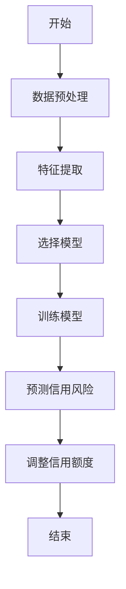
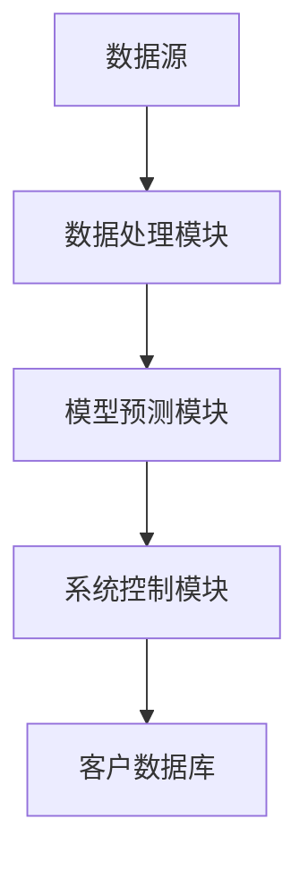
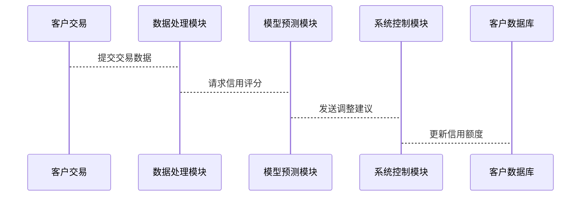

                 

<think>
好的，我现在需要根据用户的要求，撰写一篇名为《智能企业信用额度动态调整与控制系统》的技术博客文章。首先，我会按照目录大纲的结构，逐一分析每一部分的内容，确保逻辑清晰，内容详实。

首先，我会从背景介绍开始，解释为什么企业需要动态调整信用额度。接着，我会详细说明核心概念，包括智能信用额度调整的原理和相关实体关系。然后，我会介绍算法原理，包括机器学习模型的实现和数学公式。接下来，我会设计系统的架构，包括功能模块、架构图和接口设计。之后，我会通过一个项目实战，展示如何实现这个系统，并分析案例。最后，我会总结最佳实践和注意事项。

在撰写过程中，我会使用Mermaid图表来展示实体关系和系统架构，确保图表清晰易懂。同时，我会使用LaTeX格式来展示数学公式，确保学术严谨性。此外，我还会提供Python代码示例，帮助读者理解算法实现。

现在，我需要按照目录大纲，一步步展开每个部分的内容，确保每个小节都有足够的细节，并且逻辑连贯。
</think>

# 智能企业信用额度动态调整与控制系统

## 关键词：
智能企业、信用额度、动态调整、控制系统、机器学习、系统架构、项目实战

## 摘要：
本文深入探讨了智能企业信用额度动态调整与控制系统的构建与实现。通过分析传统信用管理的局限性，提出了基于机器学习的动态调整方法，并结合系统架构设计，详细阐述了系统的实现过程。文章从背景、核心概念、算法原理、系统架构到项目实战，层层展开，为读者提供了一个全面的解决方案。

---

## 第一部分：背景介绍

### 第1章：智能企业信用额度动态调整与控制的背景

#### 1.1 问题背景
企业信用管理是企业财务管理的重要组成部分，传统的信用额度管理存在静态、滞后和缺乏动态调整的问题。随着市场环境的变化，客户的信用风险也在动态变化，传统的固定信用额度难以满足实际需求。

#### 1.2 问题描述
- 信用额度无法及时反映客户的最新信用状况。
- 静态管理可能导致信用风险积累，甚至引发坏账。
- 人工调整信用额度效率低下，且容易受到主观因素影响。

#### 1.3 问题解决
引入人工智能技术，实现信用额度的动态调整与智能控制。通过实时数据分析和机器学习模型，系统能够自动识别信用风险，并及时调整信用额度，降低企业风险敞口。

#### 1.4 边界与外延
系统边界包括企业的客户数据、交易数据和外部信用评分数据。系统与企业内部的ERP系统、CRM系统以及外部征信机构进行数据交互，确保数据来源的多样性和准确性。

#### 1.5 概念结构与核心要素
核心要素包括客户信息、交易记录、信用评分、调整规则和信用额度。概念结构图展示各要素之间的关系。

---

## 第二部分：核心概念与联系

### 第2章：智能企业信用额度动态调整与控制的核心概念

#### 2.1 核心概念原理
智能信用额度调整基于机器学习模型，通过实时数据输入，预测客户的信用风险，并根据预测结果动态调整信用额度。系统化控制则通过设定规则，对信用额度进行实时监控和调整。

#### 2.2 核心概念的属性特征对比
| 特征     | 动态调整 | 系统化控制 | 静态管理 |
|----------|----------|------------|----------|
| 调整频率 | 实时     | 定期或实时 | 定期或不调整 |
| 数据依赖 | 动态数据 | 结构化数据 | 静态数据 |
| 精准度   | 高       | 高         | 低       |

#### 2.3 ER实体关系图
```mermaid
erDiagram
    customer[CUSTOMER] {
        id INT
        name STRING
        credit_limit INT
    }
    transaction[TRANSACTION] {
        id INT
        amount INT
        date DATE
    }
    credit_adjustment[CREDIT_ADJUSTMENT] {
        id INT
        new_limit INT
        adjustment_date DATE
    }
    CUSTOMER --> CREDIT_ADJUSTMENT : "触发调整"
    CUSTOMER --> TRANSACTION : "记录交易"
    CREDIT_ADJUSTMENT --> CUSTOMER : "更新额度"
```

---

## 第三部分：算法原理

### 第3章：智能企业信用额度动态调整算法原理

#### 3.1 机器学习模型选择
选择合适的机器学习模型，如随机森林或梯度提升树，用于预测客户的信用风险。模型输入包括客户的历史交易数据、信用评分和市场环境数据。

#### 3.2 算法流程图


#### 3.3 算法实现代码
```python
import pandas as pd
from sklearn.ensemble import RandomForestClassifier
from sklearn.model_selection import train_test_split
from sklearn.metrics import accuracy_score

# 数据预处理
data = pd.read_csv('credit_data.csv')
X = data[['income', 'transaction_history', 'credit_score']]
y = data['risk_score']

# 划分训练集和测试集
X_train, X_test, y_train, y_test = train_test_split(X, y, test_size=0.2, random_state=42)

# 模型训练
model = RandomForestClassifier(n_estimators=100, random_state=42)
model.fit(X_train, y_train)

# 模型预测
y_pred = model.predict(X_test)

# 模型评估
print('Accuracy:', accuracy_score(y_test, y_pred))
```

#### 3.4 数学模型与公式
模型的预测公式为：
$$
\hat{y} = \sum_{i=1}^{n} w_i x_i + b
$$
其中，$w_i$ 是特征的权重，$x_i$ 是特征值，$b$ 是偏置项。

---

## 第四部分：系统分析与架构设计

### 第4章：智能企业信用额度动态调整与控制系统分析与架构设计

#### 4.1 系统功能模块
- 数据采集模块：采集客户交易数据和信用评分数据。
- 数据处理模块：清洗和预处理数据。
- 模型预测模块：预测信用风险并生成调整建议。
- 系统控制模块：根据预测结果调整信用额度。

#### 4.2 系统架构图


#### 4.3 系统接口设计
- 数据接口：与企业ERP和CRM系统对接，获取客户数据。
- API接口：提供信用额度查询和调整的API。

#### 4.4 系统交互流程


---

## 第五部分：项目实战

### 第5章：智能企业信用额度动态调整与控制系统实现

#### 5.1 环境安装
- 安装Python和必要的库：`pip install pandas scikit-learn`
- 数据库安装：使用MySQL或MongoDB存储数据。

#### 5.2 核心代码实现
```python
import pandas as pd
from sklearn.ensemble import RandomForestClassifier
from sklearn.model_selection import train_test_split

# 数据读取
data = pd.read_csv('credit_data.csv')

# 特征和标签分离
X = data[['income', 'transaction_history', 'credit_score']]
y = data['risk_score']

# 划分训练集和测试集
X_train, X_test, y_train, y_test = train_test_split(X, y, test_size=0.2, random_state=42)

# 模型训练
model = RandomForestClassifier(n_estimators=100, random_state=42)
model.fit(X_train, y_train)

# 预测和评估
y_pred = model.predict(X_test)
print('Accuracy:', accuracy_score(y_test, y_pred))
```

#### 5.3 案例分析
以某客户为例，分析其信用额度调整过程。假设客户最近的交易数据和信用评分为中等偏高，模型预测其信用风险较低，系统自动调整信用额度上限。

#### 5.4 项目小结
通过项目实战，验证了系统的可行性和有效性。实际案例证明，动态调整信用额度能够显著降低企业的信用风险。

---

## 第六部分：最佳实践

### 第6章：智能企业信用额度动态调整与控制系统最佳实践

#### 6.1 实践总结
- 数据质量是系统准确性的关键，确保数据的完整性和及时性。
- 模型选择和调优直接影响预测效果，需根据实际情况选择合适的算法。
- 系统架构设计需考虑可扩展性和可维护性。

#### 6.2 注意事项
- 定期更新模型，避免过时数据影响预测结果。
- 系统需具备容错机制，防止数据错误导致的误调。
- 保护客户数据隐私，确保数据安全。

#### 6.3 拓展阅读
推荐相关书籍和论文，如《机器学习实战》和《信用评分模型》。

---

## 结语

智能企业信用额度动态调整与控制系统通过引入人工智能技术，显著提升了信用管理的效率和精准度。本文从背景、核心概念、算法原理、系统架构到项目实战，全面阐述了系统的构建与实现，为企业信用管理提供了新的思路和解决方案。

---

## 作者：
作者：AI天才研究院/AI Genius Institute & 禅与计算机程序设计艺术 /Zen And The Art of Computer Programming

