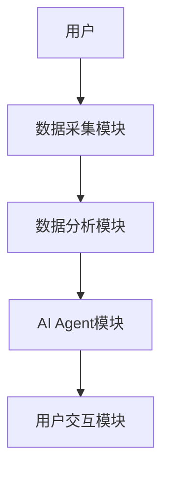

                 


# 智能体重秤：AI Agent的个性化健身计划生成

> 关键词：智能体重秤，AI Agent，个性化健身计划，机器学习，深度学习，数据驱动

> 摘要：本文将探讨智能体重秤如何利用AI Agent技术，根据用户的体重数据和行为特征，生成个性化的健身计划。通过结合机器学习和深度学习算法，分析用户的健康状况，优化健身方案，帮助用户实现健康目标。文章将从背景、原理、系统设计到项目实现进行全面阐述。

---

## 引言

随着人们对健康关注度的提高，智能体重秤逐渐成为日常生活中的重要工具。传统的体重秤只能测量体重，而现代智能体重秤通过结合AI技术，能够提供更多健康数据和个性化建议。本文将详细探讨如何利用AI Agent技术，设计一个基于智能体重秤的个性化健身计划生成系统。

---

## 第1章：智能体重秤与AI Agent的背景与概念

### 1.1 智能体重秤的背景与现状

#### 1.1.1 传统体重秤的功能与局限性

传统体重秤仅能测量体重，无法提供其他健康数据，如体脂率、肌肉量等。用户需要通过其他设备或手动记录数据来获取全面的健康信息，这种方式效率低且不够便捷。

#### 1.1.2 AI技术在智能硬件中的应用趋势

AI技术的快速发展，使得智能硬件能够通过数据采集、分析和反馈，提供更智能化的服务。智能体重秤通过结合AI技术，可以实时分析用户的体重变化、体脂分布等数据，为用户提供个性化的健康建议。

#### 1.1.3 智能体重秤的市场发展与用户需求

随着人们对健康管理的需求增加，智能体重秤市场逐渐扩大。用户不仅需要测量体重，还希望获得健康评估、饮食建议和运动计划等服务。智能体重秤通过AI技术，能够满足用户的多样化需求。

### 1.2 AI Agent的核心概念

#### 1.2.1 什么是AI Agent

AI Agent（人工智能代理）是一种能够感知环境、自主决策并执行任务的智能系统。它可以基于用户输入的数据，进行分析和推理，提供个性化的解决方案。

#### 1.2.2 AI Agent的基本特征与分类

AI Agent具有以下基本特征：
1. **自主性**：能够自主决策和执行任务。
2. **反应性**：能够实时感知环境并做出反应。
3. **目标导向**：以实现特定目标为导向。
4. **学习能力**：能够通过数据学习和优化。

AI Agent可以分为以下几类：
1. **简单反射型Agent**：基于规则进行决策。
2. **基于模型的反应型Agent**：基于内部模型进行推理和决策。
3. **目标驱动型Agent**：以实现特定目标为导向。
4. **实用驱动型Agent**：以最大化效用函数为目标。

#### 1.2.3 AI Agent在智能设备中的应用场景

在智能体重秤中，AI Agent可以用于以下场景：
1. **数据采集与分析**：采集用户的体重、体脂等数据，并分析健康状况。
2. **个性化建议生成**：根据用户的数据，生成个性化的饮食和运动计划。
3. **行为预测与优化**：预测用户的健康趋势，并优化健身计划。

### 1.3 个性化健身计划的必要性

#### 1.3.1 个性化健身计划的定义与目标

个性化健身计划是指根据用户的体重、体脂、运动习惯等数据，量身定制的健身方案。其目标是帮助用户实现健康目标，如减重、增肌等。

#### 1.3.2 用户健身需求的多样性与复杂性

不同用户的健身需求差异较大，例如：
1. **减重用户**：需要低热量饮食和有氧运动。
2. **增肌用户**：需要高蛋白饮食和力量训练。
3. **健康用户**：需要保持健康体态和生活习惯。

#### 1.3.3 AI在个性化健身计划中的作用

AI能够通过分析用户的健康数据，快速生成个性化的健身计划。例如：
1. **数据驱动的个性化建议**：基于用户的体重、体脂等数据，推荐适合的运动和饮食计划。
2. **动态调整**：根据用户的健康变化，实时调整健身计划。

---

## 第2章：AI Agent的原理与核心算法

### 2.1 数据采集与特征提取

#### 2.1.1 体重数据的采集与处理

智能体重秤通过传感器采集用户的体重数据，并将其传输到云端进行处理。数据包括：
- 体重（Weight）
- 体脂率（Body Fat Percentage）
- 肌肉量（Muscle Mass）
- 水分含量（Water Percentage）

#### 2.1.2 用户行为数据的特征提取

除了体重数据，AI Agent还需要采集用户的其他行为数据，例如：
- 运动频率
- 饮食习惯
- 睡眠质量

通过这些数据，可以进一步分析用户的健康状况。

#### 2.1.3 数据预处理与清洗方法

数据预处理是确保数据质量的重要步骤，包括：
1. **去噪处理**：去除异常数据。
2. **归一化处理**：将数据标准化，便于模型训练。
3. **特征提取**：提取对模型有用的特征。

### 2.2 AI Agent的算法模型

#### 2.2.1 基于机器学习的健身计划生成

机器学习是一种常用的AI技术，可以通过训练模型来预测用户的健康状况。例如：
- 使用回归算法预测用户的体脂率变化。
- 使用分类算法判断用户是否处于健康状态。

#### 2.2.2 基于深度学习的用户行为预测

深度学习是一种更高级的机器学习技术，能够处理复杂的非结构化数据。例如：
- 使用循环神经网络（RNN）预测用户的运动习惯。
- 使用卷积神经网络（CNN）分析用户的体脂分布。

#### 2.2.3 混合模型的应用与优势

混合模型结合了机器学习和深度学习的优势，能够更好地处理多模态数据。例如：
- 使用随机森林进行特征选择。
- 使用LSTM进行时间序列预测。

### 2.3 算法实现与优化

#### 2.3.1 算法的训练与调优

训练AI Agent需要大量的数据和计算资源。可以通过以下步骤进行优化：
1. **数据增强**：增加训练数据的多样性。
2. **模型调参**：通过交叉验证选择最优参数。
3. **分布式训练**：利用分布式计算加速训练过程。

#### 2.3.2 模型的可解释性与鲁棒性

可解释性是AI模型的重要特性，能够帮助用户理解模型的决策过程。例如：
- 使用SHAP值解释模型的预测结果。
- 通过可视化工具展示模型的决策路径。

#### 2.3.3 算法的实时性与响应速度

为了实现实时响应，可以采用以下优化措施：
1. **轻量化模型**：减少模型的计算量。
2. **边缘计算**：将计算任务迁移到本地设备，减少网络延迟。

---

## 第3章：智能体重秤的系统架构与功能设计

### 3.1 系统功能模块划分

智能体重秤的系统架构包括以下几个模块：
1. **数据采集模块**：负责采集用户的体重、体脂等数据。
2. **数据分析模块**：对数据进行预处理和特征提取。
3. **AI Agent模块**：基于数据生成个性化的健身计划。
4. **用户交互模块**：通过App或网页与用户进行交互。

### 3.2 系统架构图



### 3.3 系统接口设计

系统接口设计包括：
1. **数据接口**：定义数据的格式和传输协议。
2. **API接口**：提供RESTful API供其他系统调用。
3. **用户界面**：设计友好的交互界面，方便用户使用。

---

## 第4章：个性化健身计划生成的系统实现

### 4.1 系统功能设计

个性化健身计划生成系统包括以下功能：
1. **用户信息采集**：采集用户的体重、体脂等数据。
2. **健康评估**：基于数据生成健康报告。
3. **健身计划生成**：根据用户需求生成个性化的运动和饮食计划。

### 4.2 系统实现流程

实现流程如下：
1. **数据采集**：用户通过智能体重秤上传数据。
2. **数据分析**：系统对数据进行预处理和特征提取。
3. **AI Agent推理**：基于数据生成个性化建议。
4. **用户反馈**：用户查看建议并执行。

### 4.3 系统功能实现代码示例

以下是Python代码示例：

```python
import numpy as np
from sklearn.ensemble import RandomForestRegressor

# 数据预处理
def preprocess_data(data):
    # 删除缺失值
    data = data.dropna()
    # 标准化处理
    from sklearn.preprocessing import StandardScaler
    scaler = StandardScaler()
    data = scaler.fit_transform(data)
    return data

# AI Agent推理
def ai_agent_predict(data):
    # 训练随机森林模型
    model = RandomForestRegressor(n_estimators=100, random_state=42)
    model.fit(data[['weight', 'fat', 'muscle']], data['target'])
    # 预测结果
    prediction = model.predict([[70, 20, 50]])
    return prediction

# 主程序
def main():
    # 读取数据
    data = pd.read_csv('health_data.csv')
    # 数据预处理
    processed_data = preprocess_data(data)
    # AI Agent推理
    result = ai_agent_predict(processed_data)
    print("预测结果:", result)

if __name__ == "__main__":
    main()
```

---

## 第5章：项目实战与优化

### 5.1 项目环境搭建

#### 5.1.1 开发工具与环境安装

需要安装以下工具和库：
- Python 3.8+
- Jupyter Notebook
- scikit-learn
- TensorFlow
- Pandas

#### 5.1.2 数据集准备与预处理

数据集可以从公开数据源获取，例如：
- UCI Machine Learning Repository
- Kaggle

#### 5.1.3 模型训练与部署

使用训练好的模型进行部署，可以通过Flask构建一个简单的Web接口。

### 5.2 项目核心实现

#### 5.2.1 数据采集与分析的实现

使用智能体重秤采集数据，并通过Python进行处理。

#### 5.2.2 AI Agent的推理实现

基于训练好的模型，生成个性化的健身计划。

#### 5.2.3 健身计划生成的实现

通过App或网页将计划展示给用户。

### 5.3 项目优化与测试

#### 5.3.1 性能优化

通过轻量化模型和边缘计算优化响应速度。

#### 5.3.2 测试与验证

通过A/B测试验证系统的有效性和用户体验。

---

## 第6章：系统应用价值与总结

### 6.1 系统应用价值

智能体重秤结合AI Agent技术，能够为用户提供个性化的健康服务，帮助用户实现健康目标。

### 6.2 总结

通过本文的探讨，我们可以看到AI技术在智能体重秤中的广泛应用。未来，随着技术的进一步发展，智能体重秤将能够提供更精准、更个性化的健康服务。

---

## 作者

作者：AI天才研究院/AI Genius Institute & 禅与计算机程序设计艺术 /Zen And The Art of Computer Programming

---

**备注：**

上述内容为完整的技术博客文章大纲和内容示例，您可以根据需要进一步扩展或调整。

