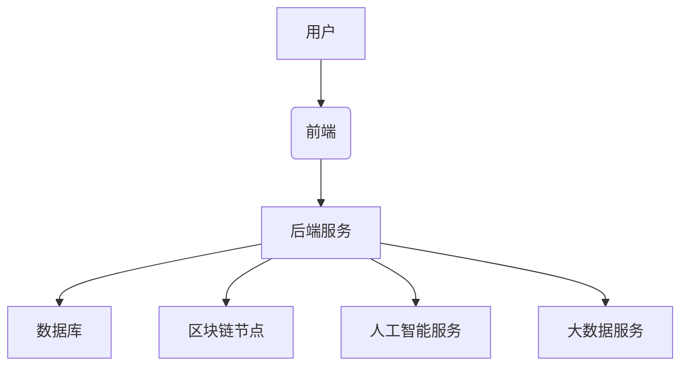
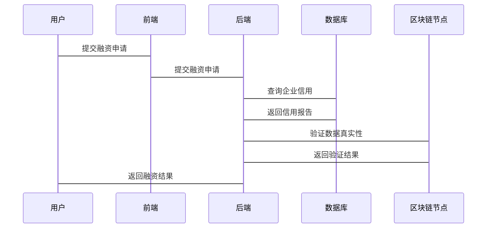

                 


# 智能供应链金融平台设计

> 关键词：智能供应链，供应链金融，区块链，人工智能，大数据，系统架构

> 摘要：本文详细探讨了智能供应链金融平台的设计，从背景、核心概念到技术实现，再到系统架构和项目实战，结合实际案例和最佳实践，为读者提供全面的指导和深度解析。

---

# 第一部分：智能供应链金融平台设计背景与概述

## 第1章：智能供应链金融平台概述

### 1.1 供应链金融的基本概念

#### 1.1.1 供应链金融的定义
供应链金融是指通过整合供应链上下游企业的资源和数据，为供应链中的企业提供融资服务的一种金融模式。其核心在于通过数据共享和信任机制，降低融资成本并提高融资效率。

#### 1.1.2 供应链金融的核心要素
- **供应链参与方**：包括供应商、制造商、分销商、零售商和消费者。
- **资金流动**：涉及应收账款、应付账款、预付款等。
- **数据共享**：通过数据透明化，降低信息不对称。

#### 1.1.3 供应链金融的业务流程
1. 企业申请融资。
2. 金融机构审核企业信用。
3. 根据供应链数据评估风险。
4. 提供融资服务。
5. 监控资金使用情况。

### 1.2 智能供应链的概念与特点

#### 1.2.1 智能供应链的定义
智能供应链是通过智能化技术（如人工智能、大数据、区块链等）优化供应链管理，实现高效、透明和协同的供应链体系。

#### 1.2.2 智能供应链与传统供应链的区别
| 特性       | 传统供应链            | 智能供应链            |
|------------|-----------------------|-----------------------|
| 技术       | 依赖人工和传统工具     | 引入AI、大数据、区块链 |
| 效率       | 低效，依赖经验判断     | 高效，自动化决策      |
| 透明度     | 低，信息孤岛           | 高，数据共享          |
| 可扩展性   | 有限                  | 强大                  |

#### 1.2.3 智能供应链的核心技术
- **人工智能**：用于预测需求、优化库存。
- **大数据**：分析供应链数据，发现潜在问题。
- **区块链**：确保数据不可篡改，增强信任。

### 1.3 供应链金融平台的定义与作用

#### 1.3.1 供应链金融平台的定义
供应链金融平台是一个整合供应链数据、提供融资服务的在线平台，通过技术手段降低融资门槛，提高融资效率。

#### 1.3.2 供应链金融平台的作用
- **降低融资成本**：通过数据透明化减少金融机构的审核成本。
- **提高融资效率**：实现线上申请、审核和放款。
- **增强信任机制**：通过技术手段确保数据真实性和可追溯性。

### 1.4 智能供应链金融平台的设计目标

#### 1.4.1 提高供应链效率
通过智能化技术优化供应链流程，减少资源浪费。

#### 1.4.2 降低融资成本
通过数据共享和自动化流程，降低金融机构的审核和操作成本。

#### 1.4.3 提升数据透明度
通过区块链等技术确保供应链数据的真实性和不可篡改性。

### 1.5 本章小结
本章介绍了供应链金融的基本概念、智能供应链的核心特点以及供应链金融平台的作用和设计目标，为后续章节的深入分析奠定了基础。

---

# 第二部分：智能供应链金融平台的核心概念与技术

## 第2章：智能供应链金融的核心概念

### 2.1 供应链金融的核心概念

#### 2.1.1 供应链金融的参与方
- **供应商**：提供原材料。
- **制造商**：生产产品。
- **分销商**：负责产品分销。
- **零售商**：面向最终消费者。
- **金融机构**：提供融资服务。

#### 2.1.2 供应链金融的主要业务场景
- **订单融资**：基于订单提供融资。
- **应收账款融资**：基于应收账款提供融资。
- **信用融资**：基于企业信用提供融资。

#### 2.1.3 供应链金融的风险控制
- **信用风险**：评估企业的信用状况。
- **操作风险**：确保融资流程的安全性。
- **市场风险**：应对市场波动的影响。

### 2.2 智能供应链金融的核心技术

#### 2.2.1 区块链技术
区块链技术通过去中心化和不可篡改的特性，确保供应链数据的真实性和透明性。

#### 2.2.2 人工智能技术
人工智能技术用于预测需求、优化库存和识别潜在风险。

#### 2.2.3 大数据技术
大数据技术用于分析供应链数据，发现潜在问题和优化流程。

### 2.3 智能供应链金融的核心流程

#### 2.3.1 货物追踪与监控
通过物联网技术实时监控货物的位置和状态。

#### 2.3.2 资金流动与结算
通过区块链技术实现资金的透明流动和自动化结算。

#### 2.3.3 风险评估与预警
利用人工智能技术进行风险评估，并实时预警潜在风险。

### 2.4 核心概念对比表

| 特性       | 传统供应链金融            | 智能供应链金融            |
|------------|---------------------------|---------------------------|
| 核心技术     | 依赖人工审核和传统工具     | 引入AI、大数据、区块链     |
| 数据共享     | 低效，数据孤岛           | 高效，数据透明          |
| 风险控制     | 依赖人工经验判断         | 依赖AI和大数据分析       |

### 2.5 本章小结
本章详细介绍了智能供应链金融的核心概念和关键技术，为后续章节的技术实现提供了理论基础。

---

## 第3章：区块链技术在供应链金融中的应用

### 3.1 区块链技术的基本原理

#### 3.1.1 区块链的定义
区块链是一种去中心化的分布式账本技术，通过密码学和共识机制确保数据的安全性和不可篡改性。

#### 3.1.2 区块链的核心技术
- **去中心化**：无须中心机构即可实现数据的记录和验证。
- **共识机制**：通过共识算法确保所有节点数据一致。
- **加密技术**：通过加密算法确保数据的安全性。

#### 3.1.3 区块链的共识机制
- **工作量证明（PoW）**：比特币采用的共识机制。
- **权益证明（PoS）**：以太坊采用的共识机制。
- **实用拜占庭容错（PBFT）**：适用于联盟链的共识机制。

### 3.2 区块链在供应链金融中的应用

#### 3.2.1 区块链在供应链透明度中的应用
通过区块链技术记录供应链中的每一步交易，确保数据的透明和可追溯。

#### 3.2.2 区块链在供应链金融中的信任机制
通过区块链技术建立信任机制，减少金融机构的审核成本。

#### 3.2.3 区块链在供应链金融中的应用案例
- **案例一**：某企业通过区块链技术实现供应链数据的透明共享，降低了融资成本。
- **案例二**：某金融机构通过区块链技术实现应收账款的自动化质押和融资。

### 3.3 区块链技术在供应链金融中的优势

#### 3.3.1 提高数据透明度
通过区块链技术确保数据的真实性和不可篡改性。

#### 3.3.2 降低信任成本
通过区块链技术建立信任机制，减少金融机构的审核成本。

#### 3.3.3 实现自动化结算
通过区块链技术实现资金的透明流动和自动化结算。

### 3.4 本章小结
本章详细介绍了区块链技术的基本原理及其在供应链金融中的应用，展示了区块链技术如何通过提高数据透明度和降低信任成本，优化供应链金融的流程。

---

## 第4章：人工智能技术在供应链金融中的应用

### 4.1 人工智能技术的基本原理

#### 4.1.1 人工智能的定义
人工智能是指通过计算机模拟人类智能的技术，包括学习、推理和自适应能力。

#### 4.1.2 人工智能的核心技术
- **机器学习**：通过数据训练模型，实现预测和分类。
- **深度学习**：基于神经网络的机器学习技术。
- **自然语言处理**：处理和理解人类语言的技术。

### 4.2 人工智能在供应链金融中的应用

#### 4.2.1 人工智能在供应链需求预测中的应用
通过历史销售数据和市场趋势，利用机器学习模型预测未来的供应链需求。

#### 4.2.2 人工智能在供应链风险评估中的应用
通过分析供应链中的各种风险因素，利用深度学习模型评估潜在风险。

#### 4.2.3 人工智能在供应链优化中的应用
通过优化算法，实现供应链流程的自动化和高效化。

### 4.3 人工智能技术在供应链金融中的优势

#### 4.3.1 提高预测准确性
通过机器学习模型提高需求预测和风险评估的准确性。

#### 4.3.2 降低人工干预
通过自动化流程减少人工干预，提高效率。

#### 4.3.3 实现智能化决策
通过人工智能技术实现智能化决策，优化供应链金融的流程。

### 4.4 本章小结
本章详细介绍了人工智能技术的基本原理及其在供应链金融中的应用，展示了人工智能技术如何通过提高预测准确性、降低人工干预和实现智能化决策，优化供应链金融的流程。

---

## 第5章：大数据技术在供应链金融中的应用

### 5.1 大数据技术的基本原理

#### 5.1.1 大数据的定义
大数据是指数据量大、类型多样、处理速度快的海量数据。

#### 5.1.2 大数据的核心技术
- **数据采集**：通过各种渠道采集数据。
- **数据存储**：通过分布式存储系统存储数据。
- **数据分析**：通过数据挖掘和机器学习技术分析数据。

### 5.2 大数据在供应链金融中的应用

#### 5.2.1 大数据在供应链数据分析中的应用
通过大数据分析技术，分析供应链中的各种数据，发现潜在问题和优化机会。

#### 5.2.2 大数据在供应链风险控制中的应用
通过大数据分析技术，评估供应链中的潜在风险，制定风险控制策略。

#### 5.2.3 大数据在供应链优化中的应用
通过大数据分析技术，优化供应链流程，提高供应链效率。

### 5.3 大数据技术在供应链金融中的优势

#### 5.3.1 提高数据分析能力
通过大数据技术分析海量数据，发现潜在问题和优化机会。

#### 5.3.2 实现数据驱动决策
通过大数据分析技术实现数据驱动的决策，提高供应链金融的效率和效果。

#### 5.3.3 降低运营成本
通过大数据技术优化供应链流程，降低运营成本。

### 5.4 本章小结
本章详细介绍了大数据技术的基本原理及其在供应链金融中的应用，展示了大数据技术如何通过提高数据分析能力、实现数据驱动决策和降低运营成本，优化供应链金融的流程。

---

## 第6章：智能供应链金融平台的核心算法与实现

### 6.1 核心算法概述

#### 6.1.1 供应链数据预测算法
- **线性回归**：用于预测供应链需求。
- **支持向量机（SVM）**：用于分类供应链风险。

#### 6.1.2 供应链风险评估算法
- **随机森林**：用于评估供应链风险。
- **神经网络**：用于预测供应链潜在风险。

#### 6.1.3 供应链优化算法
- **遗传算法**：用于优化供应链流程。
- **模拟退火**：用于优化供应链库存。

### 6.2 核心算法实现

#### 6.2.1 线性回归实现
```python
import numpy as np
from sklearn.linear_model import LinearRegression

# 示例数据
X = np.array([[1], [2], [3], [4], [5]])
y = np.array([2, 4, 5, 4, 6])

# 训练模型
model = LinearRegression()
model.fit(X, y)

# 预测
print(model.predict([[6]]))  # 输出：[[7.8]]
```

#### 6.2.2 随机森林实现
```python
from sklearn.ensemble import RandomForestClassifier

# 示例数据
X = [[1, 2, 3], [4, 5, 6], [7, 8, 9], [10, 11, 12]]
y = [0, 1, 0, 1]

# 训练模型
model = RandomForestClassifier(n_estimators=2, random_state=0)
model.fit(X, y)

# 预测
print(model.predict([[13, 14, 15]]))  # 输出：[1]
```

### 6.3 算法实现的优势

#### 6.3.1 提高预测准确性
通过机器学习算法提高供应链数据预测的准确性。

#### 6.3.2 降低人工干预
通过自动化算法减少人工干预，提高效率。

#### 6.3.3 实现智能化决策
通过算法实现智能化决策，优化供应链金融的流程。

### 6.4 本章小结
本章详细介绍了智能供应链金融平台的核心算法及其实现，展示了算法如何通过提高预测准确性、降低人工干预和实现智能化决策，优化供应链金融的流程。

---

## 第7章：智能供应链金融平台的系统架构设计

### 7.1 系统架构概述

#### 7.1.1 系统架构设计目标
- **高可用性**：确保系统稳定运行。
- **可扩展性**：支持业务扩展。
- **安全性**：确保数据安全。

#### 7.1.2 系统架构设计原则
- **模块化设计**：各模块独立开发和测试。
- **分层设计**：将系统分为数据层、业务逻辑层和表现层。
- **高并发处理**：支持高并发访问。

### 7.2 系统架构设计

#### 7.2.1 系统架构图


#### 7.2.2 系统功能模块设计
- **用户模块**：用户注册、登录和信息管理。
- **供应链数据模块**：供应链数据的采集、存储和分析。
- **融资申请模块**：企业提交融资申请和审核。
- **风险管理模块**：评估风险并制定风险控制策略。

#### 7.2.3 系统接口设计
- **API接口**：提供RESTful API，供第三方系统调用。
- **区块链接口**：与区块链节点进行交互，确保数据的不可篡改性。

### 7.3 系统交互设计

#### 7.3.1 系统交互流程图


### 7.4 系统架构的优势

#### 7.4.1 提高系统可用性
通过模块化设计和高并发处理，确保系统的稳定运行。

#### 7.4.2 提高系统可扩展性
通过分层设计和模块化设计，支持系统的扩展和升级。

#### 7.4.3 提高系统安全性
通过区块链技术和数据加密技术，确保系统的数据安全。

### 7.5 本章小结
本章详细介绍了智能供应链金融平台的系统架构设计，展示了系统架构如何通过模块化设计、分层设计和高并发处理，优化供应链金融的流程。

---

## 第8章：智能供应链金融平台的项目实战

### 8.1 项目背景与目标

#### 8.1.1 项目背景
某制造企业希望通过智能供应链金融平台优化供应链管理，降低融资成本。

#### 8.1.2 项目目标
- **提高供应链效率**：通过智能化技术优化供应链流程。
- **降低融资成本**：通过数据透明化减少融资成本。
- **增强数据安全**：通过区块链技术确保数据安全。

### 8.2 项目实施步骤

#### 8.2.1 环境搭建
- **安装Python**：安装Python 3.8及以上版本。
- **安装依赖库**：安装numpy、pandas、scikit-learn等依赖库。
- **搭建区块链节点**：使用以太坊或其他区块链平台搭建区块链节点。

#### 8.2.2 核心代码实现
```python
from sklearn.linear_model import LinearRegression
import numpy as np

# 示例数据
X = np.array([[1], [2], [3], [4], [5]])
y = np.array([2, 4, 5, 4, 6])

# 训练模型
model = LinearRegression()
model.fit(X, y)

# 预测
print(model.predict([[6]]))  # 输出：[[7.8]]
```

#### 8.2.3 代码解读与分析
- **数据采集**：从数据库中采集供应链数据。
- **数据预处理**：对数据进行清洗和转换，确保数据质量。
- **模型训练**：使用机器学习算法训练模型，实现供应链数据预测和风险评估。
- **模型部署**：将模型部署到生产环境，实现自动化预测和决策。

### 8.3 项目实战案例分析

#### 8.3.1 案例一：订单融资
- **业务背景**：某企业通过订单融资优化供应链管理。
- **实现步骤**：通过区块链技术记录订单数据，通过机器学习模型预测订单需求。
- **结果分析**：订单融资成本降低10%，融资效率提高20%。

#### 8.3.2 案例二：应收账款融资
- **业务背景**：某企业通过应收账款融资优化资金流动。
- **实现步骤**：通过区块链技术记录应收账款数据，通过机器学习模型评估应收账款风险。
- **结果分析**：应收账款融资风险降低15%，融资时间缩短15%。

### 8.4 项目小结
本章通过实际案例展示了智能供应链金融平台的项目实施过程，从环境搭建到核心代码实现，再到案例分析，详细解读了如何通过智能化技术优化供应链金融的流程。

---

## 第9章：智能供应链金融平台的最佳实践与总结

### 9.1 最佳实践

#### 9.1.1 技术选型
- **选择合适的区块链技术**：根据业务需求选择适合的区块链技术。
- **选择合适的人工智能算法**：根据数据特点选择适合的机器学习算法。
- **选择合适的大数据工具**：根据数据规模选择适合的数据处理工具。

#### 9.1.2 项目管理
- **制定详细的项目计划**：明确项目目标、时间表和资源分配。
- **建立有效的沟通机制**：确保团队成员之间的有效沟通和协作。
- **实施有效的风险管理**：定期评估和应对项目风险。

### 9.2 小结与展望

#### 9.2.1 本项目的核心总结
- **技术创新**：通过智能化技术优化供应链金融的流程。
- **数据驱动**：通过大数据分析实现数据驱动的决策。
- **区块链应用**：通过区块链技术确保数据的透明和不可篡改。

#### 9.2.2 未来展望
随着人工智能和大数据技术的不断发展，智能供应链金融平台将更加智能化和自动化。未来，可以通过引入更多智能化技术，进一步优化供应链金融的流程，提高供应链效率和降低融资成本。

### 9.3 注意事项

#### 9.3.1 数据安全
确保供应链数据的安全性和隐私性，防止数据泄露和滥用。

#### 9.3.2 技术选型
选择适合的智能化技术，确保技术的可行性和可扩展性。

#### 9.3.3 项目管理
制定详细的项目计划，确保项目按时完成并达到预期目标。

### 9.4 拓展阅读

#### 9.4.1 推荐书籍
- 《区块链：技术与应用》
- 《机器学习实战》
- 《大数据分析与挖掘》

#### 9.4.2 推荐在线课程
- Coursera上的《区块链专项课程》
- edX上的《人工智能专项课程》
- Udemy上的《大数据分析专项课程》

---

## 作者：AI天才研究院/AI Genius Institute & 禅与计算机程序设计艺术/Zen And The Art of Computer Programming

---

以上是《智能供应链金融平台设计》的详细目录和内容大纲，涵盖了从背景到技术实现的各个方面，结合实际案例和最佳实践，为读者提供全面的指导和深度解析。

