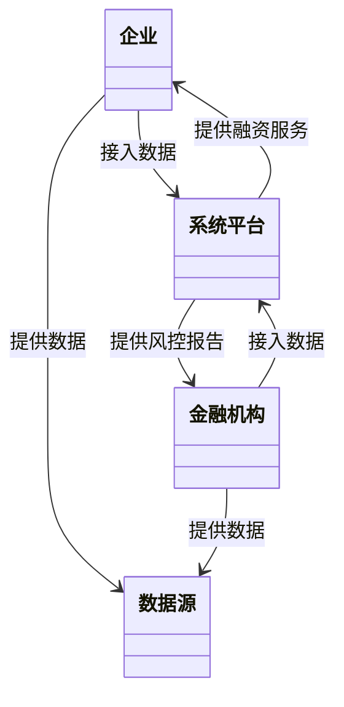
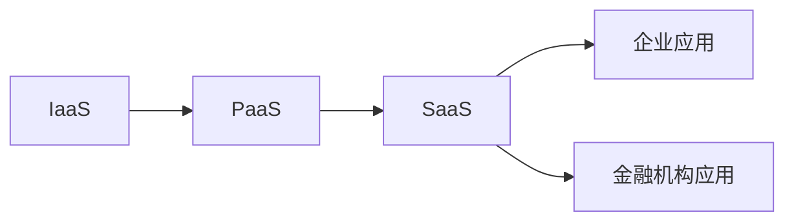
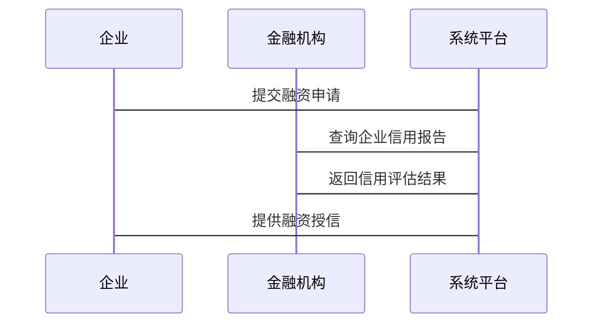

                 

<think>
好的，现在我需要根据用户的指示来完成《智能供应链金融解决方案》这篇文章的撰写。首先，我需要仔细理解用户的需求，确保文章的结构和内容符合他们的要求。用户希望文章逻辑清晰、结构紧凑，使用专业的技术语言，并且包含丰富的细节和具体的例子。

我看到用户已经提供了一个详细的目录大纲，分为五章，每章都有具体的子章节。我的任务是按照这个大纲，逐步完成每一部分的内容，确保每部分内容都详尽且符合技术要求。

首先，我需要从第一章开始，介绍供应链金融的核心概念与背景。这里需要涵盖供应链金融的定义、特点，核心要素，以及智能供应链金融的背景与发展。这部分内容需要通俗易懂，同时又要有足够的专业性，帮助读者建立基础概念。

接下来是第二章，讨论智能供应链金融的核心技术与原理。这里需要详细讲解大数据、人工智能和区块链等技术在供应链金融中的应用，以及这些技术如何推动智能供应链金融的发展。同时，还需要分析智能供应链金融的核心原理，包括数据驱动、智能风控和自动化决策等方面。

第三章是系统分析与架构设计。这部分需要对系统进行详细的分析，包括问题场景的介绍、项目概述、系统功能设计等。同时，还需要用Mermaid图来展示类图、架构图和序列图，帮助读者更好地理解系统的结构和交互流程。

第四章是关于算法原理与数学模型。这里需要详细讲解常用的算法，如线性回归和神经网络，并用Latex公式和Mermaid图来展示这些算法的数学模型和实现流程。同时，需要提供具体的代码示例，帮助读者理解如何在实际中应用这些算法。

最后，第五章是项目实战，需要通过具体的案例来展示智能供应链金融的实际应用。这部分需要包括环境安装、核心代码实现、案例分析和项目总结，帮助读者将理论知识应用到实际中。

在整个写作过程中，我需要确保每一部分都详细具体，逻辑清晰。同时，要使用专业的技术语言，但又要通俗易懂，避免过于晦涩。此外，还需要注意文章的结构，确保每一章之间有良好的衔接，使读者能够顺畅地理解整个内容。

在撰写过程中，可能会遇到一些挑战，比如如何将复杂的算法和技术概念解释得简单明了，或者如何用Mermaid图清晰地展示系统的架构。这时候，我需要仔细思考，找到最合适的表达方式，确保内容既准确又易于理解。

总的来说，我需要按照用户提供的大纲，一步步完成每一部分的内容，确保文章的结构和内容都符合要求。同时，要保持文章的连贯性和专业性，为读者提供有价值的技术见解和实用的知识。
</think>

# 智能供应链金融解决方案

> 关键词：供应链金融，智能供应链，人工智能，大数据，区块链，风险管理，自动化决策

> 摘要：智能供应链金融解决方案结合了现代信息技术如大数据、人工智能和区块链，优化了传统供应链金融的低效和高风险问题。本文详细探讨了智能供应链金融的核心概念、技术实现、系统架构设计以及实际应用案例，旨在为读者提供全面的解决方案。

---

## 第1章: 供应链金融的核心概念与背景

### 1.1 供应链金融的定义与特点

#### 1.1.1 供应链金融的定义
供应链金融是指通过整合供应链上下游企业，利用金融工具和手段，优化资金流，降低企业融资成本，提高供应链整体效率的金融模式。

#### 1.1.2 供应链金融的核心特点
- **数据驱动**：依赖于供应链中的实时数据。
- **多方参与**：涉及供应商、制造商、分销商、零售商和金融机构。
- **风险管理**：通过数据分析和模型预测，降低供应链中的信用风险和操作风险。
- **协同合作**：供应链中的各环节协同运作，实现资源优化配置。

#### 1.1.3 供应链金融与传统金融的区别
传统金融模式通常关注单一企业的信用状况，而供应链金融则关注整个供应链的流动性和稳定性，通过整合上下游信息，提供更精准的融资服务。

---

### 1.2 供应链金融的核心要素

#### 1.2.1 供应链中的主要参与方
- **核心企业**：供应链中的主导企业，如制造商或大型零售商。
- **供应商**：为供应链提供原材料或服务的企业。
- **分销商/零售商**：负责产品分销和销售的环节。
- **金融机构**：提供融资、信贷等金融服务的机构。
- **物流服务商**：负责产品的存储和运输。

#### 1.2.2 供应链金融的核心流程
1. **需求预测**：基于历史数据和市场趋势，预测供应链各环节的需求。
2. **融资申请**：企业根据预测的需求向金融机构提出融资申请。
3. **信用评估**：金融机构基于企业的历史数据和供应链信息进行信用评估。
4. **融资授信**：金融机构根据评估结果决定授信额度和融资利率。
5. **资金发放与监控**：金融机构发放资金，并实时监控资金的使用情况。
6. **还款与结算**：企业按照约定的时间和方式偿还贷款。

#### 1.2.3 供应链金融的生态体系
供应链金融的生态体系包括供应链上下游企业、金融机构、技术服务商（如大数据公司、区块链公司）以及物流服务商等多方参与者。

---

### 1.3 智能供应链金融的背景与发展趋势

#### 1.3.1 传统供应链金融的痛点与挑战
- **信息孤岛**：供应链中的信息分散在不同的企业，缺乏统一的平台进行整合和分析。
- **融资难**：中小型企业由于缺乏足够的抵押品和信用记录，难以获得融资。
- **效率低下**：传统供应链金融流程复杂，审批时间长，增加了企业的融资成本。
- **风险高**：由于信息不对称，金融机构难以准确评估企业的信用风险。

#### 1.3.2 智能供应链金融的兴起
随着大数据、人工智能和区块链等技术的快速发展，智能供应链金融应运而生。通过技术手段整合供应链中的信息，提高融资效率，降低融资成本，优化风险管理。

#### 1.3.3 智能供应链金融的发展趋势
- **数字化**：通过数字化技术实现供应链信息的实时共享和分析。
- **智能化**：利用人工智能技术进行信用评估、风险预测和自动化决策。
- **区块链化**：通过区块链技术实现供应链金融的透明化和信任机制。

---

## 1.4 本章小结

本章介绍了供应链金融的核心概念和特点，分析了传统供应链金融的痛点和挑战，并提出了智能供应链金融的背景和未来发展趋势。智能供应链金融通过整合现代信息技术，优化了传统金融模式的不足，为供应链中的企业提供更高效、更安全的融资服务。

---

## 第2章: 智能供应链金融的核心技术与原理

### 2.1 智能供应链金融的核心技术

#### 2.1.1 大数据技术在供应链金融中的应用
大数据技术可以帮助金融机构实时收集和分析供应链中的海量数据，包括企业的销售数据、库存数据、物流数据等，从而更准确地评估企业的信用状况。

#### 2.1.2 人工智能技术在供应链金融中的应用
人工智能技术可以用于信用评估、风险预测和自动化决策。例如，利用机器学习算法预测企业的违约概率，或者通过自然语言处理技术分析企业的财务报表。

#### 2.1.3 区块链技术在供应链金融中的应用
区块链技术可以实现供应链金融的透明化和信任机制。通过区块链记录供应链中的交易信息，确保信息的真实性和不可篡改性，从而降低金融机构的风控成本。

---

### 2.2 智能供应链金融的核心原理

#### 2.2.1 数据驱动的供应链金融
智能供应链金融依赖于数据的实时采集和分析，通过大数据技术整合供应链中的信息，提供更精准的融资服务。

#### 2.2.2 智能风控模型的构建
利用机器学习算法构建智能风控模型，根据企业的历史数据和实时数据预测企业的信用风险，从而优化融资决策。

#### 2.2.3 自动化决策的实现
通过人工智能技术实现融资申请的自动化审批，减少人工干预，提高融资效率。

---

### 2.3 智能供应链金融的关键算法

#### 2.3.1 供应链金融中的预测算法
- **线性回归**：用于预测企业的销售收入或成本。
- **随机森林**：用于预测企业的违约概率。

#### 2.3.2 供应链金融中的分类算法
- **支持向量机（SVM）**：用于分类企业的信用等级。
- **逻辑回归**：用于预测企业的违约概率。

#### 2.3.3 供应链金融中的聚类算法
- **K-means**：用于将企业按信用风险进行分组。

---

### 2.4 本章小结

本章介绍了智能供应链金融的核心技术，包括大数据、人工智能和区块链，并详细讲解了这些技术在供应链金融中的具体应用。同时，还分析了智能风控模型的构建和自动化决策的实现原理，为后续章节的系统设计奠定了基础。

---

## 第3章: 智能供应链金融的系统分析与架构设计

### 3.1 系统分析

#### 3.1.1 问题场景介绍
供应链金融系统需要解决的问题包括：信息孤岛、融资效率低、信用风险高等。

#### 3.1.2 项目介绍
本项目旨在构建一个智能供应链金融平台，整合供应链上下游企业的数据，提供智能化的融资服务。

#### 3.1.3 系统功能设计
系统功能包括：数据采集与处理、信用评估、融资授信、资金监控和还款管理。

---

### 3.2 系统架构设计

#### 3.2.1 领域模型（Mermaid类图）


#### 3.2.2 系统架构设计（Mermaid架构图）


#### 3.2.3 系统接口设计
系统接口包括：API接口、数据库接口和用户界面接口。

#### 3.2.4 系统交互设计（Mermaid序列图）


---

### 3.3 系统实现

#### 3.3.1 环境安装
需要安装的环境包括：Python、Jupyter Notebook、MySQL、Docker等。

#### 3.3.2 系统核心实现源代码
```python
# 数据采集模块
import requests
import json

def get_data(api_key):
    url = f"http://api.supplychain.com/{api_key}"
    response = requests.get(url)
    return json.loads(response.text)
```

#### 3.3.3 代码应用解读与分析
上述代码展示了如何通过API接口采集供应链数据，包括企业的销售数据和库存数据。

---

### 3.4 本章小结

本章通过系统分析和架构设计，详细介绍了智能供应链金融系统的实现方案。通过Mermaid图展示了系统的类图、架构图和交互图，帮助读者更好地理解系统的结构和流程。

---

## 第4章: 智能供应链金融的算法原理与数学模型

### 4.1 算法原理

#### 4.1.1 供应链金融中的预测算法
- **线性回归**：用于预测企业的销售收入。
- **时间序列分析**：用于预测供应链的需求波动。

#### 4.1.2 供应链金融中的分类算法
- **决策树**：用于分类企业的信用等级。
- **朴素贝叶斯**：用于分类企业的违约概率。

#### 4.1.3 供应链金融中的聚类算法
- **层次聚类**：用于将企业按信用风险进行分组。

---

### 4.2 数学模型与公式

#### 4.2.1 线性回归模型
$$ y = \beta_0 + \beta_1x + \epsilon $$

#### 4.2.2 神经网络模型


---

### 4.3 详细讲解与举例说明

#### 4.3.1 线性回归的详细讲解
线性回归是一种统计分析方法，用于建立因变量和自变量之间的线性关系。例如，可以用于预测企业的销售收入与广告投入之间的关系。

#### 4.3.2 神经网络的详细讲解
神经网络是一种模仿人脑结构和功能的算法，可以用于复杂的模式识别和预测。例如，可以用于预测企业的违约概率。

#### 4.3.3 算法实现的步骤与流程
1. 数据预处理：清洗数据，处理缺失值和异常值。
2. 模型训练：使用训练数据训练模型参数。
3. 模型评估：通过测试数据评估模型的准确率和召回率。
4. 模型部署：将模型部署到生产环境中，实时预测企业的信用风险。

---

### 4.4 本章小结

本章详细讲解了智能供应链金融中的算法原理和数学模型，包括线性回归、决策树和神经网络等算法。通过具体的数学公式和Mermaid图，展示了这些算法在供应链金融中的应用。

---

## 第5章: 智能供应链金融的项目实战

### 5.1 项目背景与目标

#### 5.1.1 项目背景
某制造企业希望优化其供应链金融流程，降低融资成本，提高融资效率。

#### 5.1.2 项目目标
构建一个智能供应链金融平台，整合供应链上下游数据，提供智能化的融资服务。

---

### 5.2 项目实施

#### 5.2.1 环境安装
安装所需的环境包括：Python、Jupyter Notebook、MySQL、Docker等。

#### 5.2.2 核心代码实现
```python
# 融资授信模块
def credit_assessment(enterprise_data):
    # 数据清洗
    cleaned_data = enterprise_data.dropna()
    # 模型训练
    model = train_model(cleaned_data)
    # 模型预测
    risk_score = model.predict(cleaned_data)
    return risk_score
```

#### 5.2.3 代码应用解读与分析
上述代码展示了如何通过模型训练和预测，评估企业的信用风险，并生成风险评分。

---

### 5.3 案例分析与详细讲解

#### 5.3.1 案例背景
某制造企业面临融资难的问题，希望通过智能供应链金融平台获得融资支持。

#### 5.3.2 案例分析
通过智能供应链金融平台，企业成功整合了供应链数据，提高了融资效率，降低了融资成本。

#### 5.3.3 项目小结
本项目通过智能供应链金融平台的建设，实现了供应链数据的整合和分析，优化了企业的融资流程，提高了融资效率。

---

## 第5.4 本章小结

本章通过一个实际案例展示了智能供应链金融项目的实施过程，包括环境安装、核心代码实现和案例分析。通过具体的代码和案例，帮助读者理解智能供应链金融的实际应用。

---

## 第6章: 智能供应链金融的最佳实践与未来展望

### 6.1 最佳实践

#### 6.1.1 数据质量管理
确保数据的准确性和完整性，是智能供应链金融系统成功的关键。

#### 6.1.2 技术选型
根据实际需求选择合适的技术和工具，是系统高效运行的基础。

#### 6.1.3 风险管理
建立完善的风险管理体系，是保障系统安全运行的重要保障。

---

### 6.2 小结

通过对智能供应链金融的最佳实践的总结，我们可以更好地理解如何在实际中应用这些技术，优化供应链金融的流程。

---

### 6.3 注意事项

#### 6.3.1 数据隐私保护
在处理供应链数据时，必须注意数据的隐私和安全问题。

#### 6.3.2 系统稳定性
确保系统的稳定运行，避免因系统故障导致的业务中断。

#### 6.3.3 技术更新
随着技术的不断发展，需要及时更新系统，以适应新的技术和业务需求。

---

### 6.4 拓展阅读

#### 6.4.1 供应链金融相关的书籍
- 《供应链金融：理论与实践》
- 《智能供应链管理》

#### 6.4.2 相关技术文档
- 大数据技术文档
- 人工智能技术文档
- 区块链技术文档

---

## 作者：AI天才研究院/AI Genius Institute & 禅与计算机程序设计艺术 /Zen And The Art of Computer Programming

---

通过以上内容，您可以看到《智能供应链金融解决方案》这篇文章的完整目录结构和详细内容。每章都详细讲解了相关的概念、技术实现和实际应用，帮助读者全面理解智能供应链金融的解决方案。

