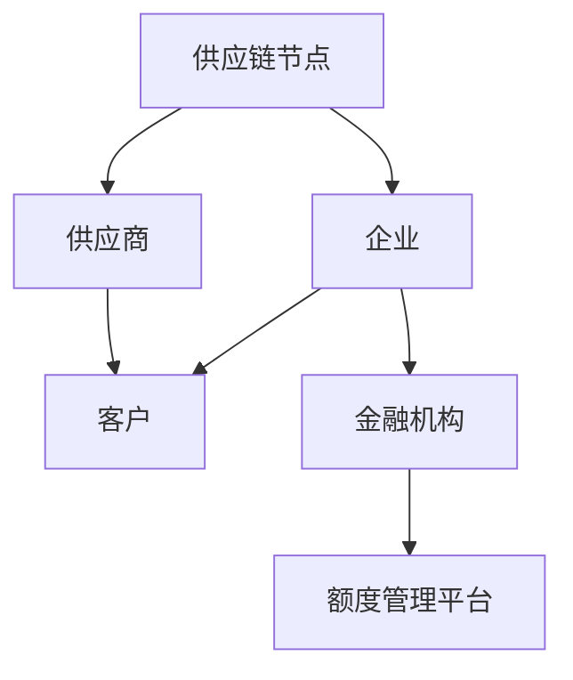
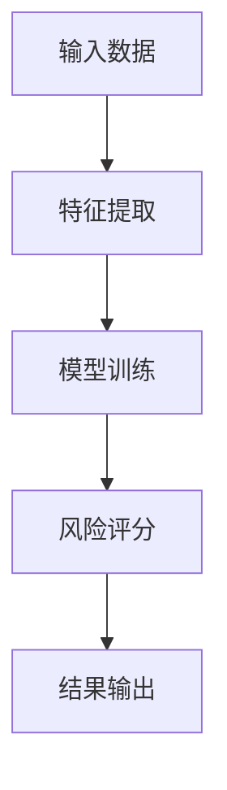
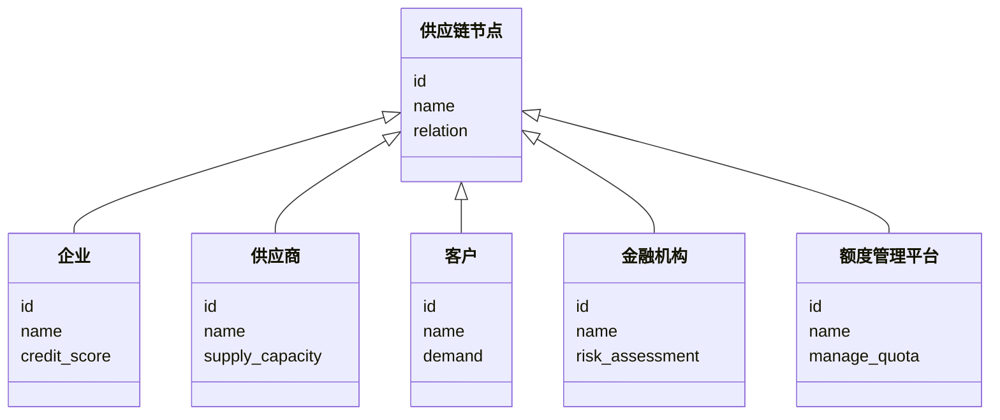
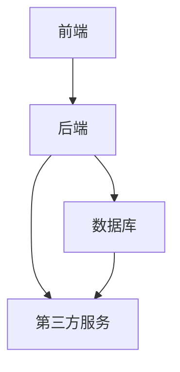
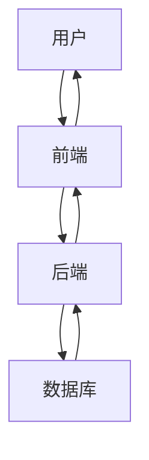

                 

<think>
嗯，用户希望撰写一篇关于智能供应链金融额度管理平台的技术博客。我需要仔细分析用户的请求，确保理解他们的需求。

首先，用户要求文章结构清晰，使用吸引人的章节标题，并且每个部分都要详细讲解。他们还提到了关键词和摘要，这表明文章需要有一个明确的主题和核心内容。

用户提供了目录大纲，包括背景介绍、核心概念、算法原理、系统分析、项目实战和最佳实践等部分。我需要确保每个部分都涵盖必要的内容，比如背景部分要介绍供应链金融的基本概念和趋势，核心概念部分要用表格和图表来解释，算法部分要详细说明并提供代码示例。

此外，用户强调使用专业技术语言，同时要通俗易懂。这意味着我需要在解释复杂概念时，尽量用简单明了的语言，并结合实际例子来说明。

我还需要注意文章的格式，使用markdown，并在适当的地方使用mermaid图表和latex公式。特别是数学公式需要用$$包裹，确保正确显示。

最后，文章末尾需要有作者信息，这可能是用户希望增加文章的权威性。因此，我要确保这部分信息准确无误，并且符合用户的要求。

总结一下，我需要按照用户提供的结构，逐步填充每个部分的内容，确保逻辑清晰，内容详实，并且符合格式要求。这样，用户才能得到一篇高质量的技术博客文章，满足他们的需求。
</think>

# 智能供应链金融额度管理平台

## 关键词：智能供应链，金融额度管理，信用评估，风险控制，算法原理，系统架构

## 摘要：本文深入探讨智能供应链金融额度管理平台的构建与实现。从背景介绍到核心概念，从算法原理到系统架构，从项目实战到最佳实践，全面解析智能供应链金融额度管理平台的设计与实现。通过本文，读者将掌握智能供应链金融额度管理平台的核心技术与实践方法。

---

# 第一部分: 智能供应链金融额度管理平台概述

## 第1章: 智能供应链金融额度管理平台背景介绍

### 1.1 供应链金融的基本概念

#### 1.1.1 供应链金融的定义
供应链金融是指通过整合供应链上的资金流、信息流和物流，为核心企业及其上下游供应商和客户提供融资服务的一种金融模式。其核心在于通过供应链的整体运作，降低融资成本，提高资金使用效率。

#### 1.1.2 供应链金融的核心要素
- **核心企业**：供应链中的主导企业，通常为行业龙头。
- **供应商**：为核心企业提供原材料或服务的上游企业。
- **客户**：核心企业的下游客户，通常为终端消费者或分销商。
- **金融机构**：提供融资服务的银行或其他金融机构。

#### 1.1.3 供应链金融的参与者与角色
供应链金融的参与者主要包括核心企业、供应商、客户、金融机构和第三方平台。各方通过信息共享和协作，实现资金的高效流动。

### 1.2 智能供应链金融的发展趋势

#### 1.2.1 传统供应链金融的局限性
传统供应链金融模式存在以下问题：
- **信息孤岛**：上下游企业间信息不透明，难以全面评估风险。
- **效率低下**：融资流程繁琐，审批时间长，资金到账慢。
- **信用风险**：缺乏有效的信用评估机制，导致融资成本高。

#### 1.2.2 智能化技术对供应链金融的推动
随着人工智能、大数据和区块链等技术的快速发展，供应链金融正在向智能化方向转型。智能技术的应用使得融资流程更加高效，风险控制更加精准。

#### 1.2.3 智能供应链金融的未来发展方向
未来的智能供应链金融将更加注重数据驱动和智能化决策。通过实时数据分析和智能算法，实现动态风险评估和自动化融资。

### 1.3 额度管理平台的必要性

#### 1.3.1 额度管理的核心问题
额度管理的核心问题是如何在供应链中合理分配融资额度，确保资金安全的同时，提高资金使用效率。

#### 1.3.2 额度管理的边界与外延
额度管理的边界在于供应链中的各个节点，外延则涉及融资产品设计、风险定价和动态调整。

#### 1.3.3 额度管理平台的业务场景
典型的业务场景包括：
- **供应商融资申请**：供应商根据自身需求申请融资额度。
- **客户信用评估**：金融机构根据客户的历史数据和实时行为评估信用风险。
- **动态额度调整**：根据供应链的整体运行情况，实时调整各节点的融资额度。

### 1.4 本章小结
本章从供应链金融的基本概念出发，分析了传统供应链金融的局限性，探讨了智能供应链金融的发展趋势，并重点介绍了额度管理平台的必要性和业务场景。

---

## 第2章: 智能供应链金融额度管理平台的核心概念与联系

### 2.1 核心概念原理

#### 2.1.1 供应链网络的构建
供应链网络的构建需要考虑以下要素：
- **节点关系**：核心企业、供应商、客户之间的关系。
- **信息流**：订单、物流、资金流等信息的流动。
- **价值流**：供应链中价值的传递和分配。

#### 2.1.2 信用评估模型的原理
信用评估模型通过分析企业的历史数据、财务状况和市场表现，评估企业的信用风险。

#### 2.1.3 风险控制机制的实现
风险控制机制通过实时监控供应链中的各项指标，识别潜在风险，并采取相应的控制措施。

### 2.2 核心概念属性对比

#### 2.2.1 供应链节点与企业关系对比表
| 节点类型 | 关系描述 | 示例 |
|----------|----------|------|
| 核心企业 | 供应链的主导者，与其他节点有直接合作关系 | 某大型制造企业 |
| 供应商 | 为核心企业提供原材料或服务的上游企业 | 某零部件供应商 |
| 客户 | 核心企业的下游客户，通常为终端消费者或分销商 | 某零售企业 |

#### 2.2.2 不同信用评估模型的性能对比
| 模型名称 | 优点 | 缺点 | 适用场景 |
|----------|-------|------|-----------|
| 线性回归 | 简单易懂，计算速度快 | 易受多重共线性影响 | 小规模数据 |
| 决策树 | 鲁棒性强，易于解释 | � prone to overfitting | 高维数据 |
| 支持向量机 | 分离能力强 | 计算复杂度高 | 高维数据 |

### 2.3 ER实体关系图


### 2.4 本章小结
本章通过对比和分析供应链网络的构建、信用评估模型和风险控制机制，揭示了智能供应链金融额度管理平台的核心概念与联系。

---

## 第3章: 智能供应链金融额度管理平台的算法原理

### 3.1 信用评分模型

#### 3.1.1 模型输入与输出
- **输入**：企业的历史数据、财务指标、市场表现。
- **输出**：企业的信用评分。

#### 3.1.2 模型训练过程
训练过程包括数据预处理、特征选择和模型训练。

#### 3.1.3 模型评估指标
常用的评估指标包括准确率、召回率和F1值。

### 3.2 风险评估算法

#### 3.2.1 算法流程图


#### 3.2.2 算法实现代码
```python
def credit_score_model(data):
    # 特征提取
    features = data[['历史违约率', '当前信用评分']]
    # 模型训练
    from sklearn.linear_model import LinearRegression
    model = LinearRegression()
    model.fit(features, data['信用评分'])
    # 预测结果
    predicted_scores = model.predict(features)
    return predicted_scores
```

### 3.3 算法原理的数学模型和公式

#### 3.3.1 线性回归模型
$$ y = \beta_0 + \beta_1x_1 + \beta_2x_2 + \cdots + \beta_nx_n $$

#### 3.3.2 决策树模型
决策树是一种基于树状结构的分类模型，通过特征选择和剪枝技术构建最优树。

### 3.4 本章小结
本章详细介绍了信用评分模型和风险评估算法的实现过程，并通过代码示例和数学公式，深入剖析了算法的原理和实现细节。

---

## 第4章: 智能供应链金融额度管理平台的系统分析与架构设计

### 4.1 问题场景介绍

#### 4.1.1 供应链金融的核心问题
供应链金融的核心问题是如何实现高效融资和风险控制。

#### 4.1.2 系统功能设计
系统功能包括信用评估、风险控制、额度管理、数据可视化等。

### 4.2 系统架构设计

#### 4.2.1 领域模型类图


#### 4.2.2 系统架构图


### 4.3 接口设计与交互流程图

#### 4.3.1 接口设计
系统主要接口包括：
- **API接口**：用于数据交互和功能调用。
- **用户界面**：供用户进行操作和查询。

#### 4.3.2 交互流程图


### 4.4 本章小结
本章从系统分析的角度，详细介绍了智能供应链金融额度管理平台的系统架构设计和接口设计，并通过类图和流程图展示了系统的整体结构。

---

## 第5章: 智能供应链金融额度管理平台的项目实战

### 5.1 环境安装与配置

#### 5.1.1 开发环境
- **操作系统**：Linux/Windows/MacOS
- **编程语言**：Python 3.8+
- **开发工具**：PyCharm/VS Code
- **依赖管理**：pip install django flask numpy pandas scikit-learn

#### 5.1.2 数据库配置
- **关系型数据库**：MySQL/PostgreSQL
- **非关系型数据库**：MongoDB

### 5.2 核心代码实现

#### 5.2.1 信用评估模块
```python
from sklearn.model_selection import train_test_split
from sklearn.metrics import accuracy_score

# 数据加载
data = pd.read_csv('credit_data.csv')

# 特征选择
X = data[['历史违约率', '当前信用评分']]
y = data['信用评分']

# 数据划分
X_train, X_test, y_train, y_test = train_test_split(X, y, test_size=0.2)

# 模型训练
model = LinearRegression()
model.fit(X_train, y_train)

# 模型预测
y_pred = model.predict(X_test)

# 模型评估
print('准确率:', accuracy_score(y_test, y_pred))
```

#### 5.2.2 风险控制模块
```python
from sklearn.tree import DecisionTreeClassifier

# 数据加载
data = pd.read_csv('risk_data.csv')

# 特征选择
X = data[['资产总额', '负债率', '流动比率']]
y = data['风险评分']

# 数据划分
X_train, X_test, y_train, y_test = train_test_split(X, y, test_size=0.2)

# 模型训练
model = DecisionTreeClassifier()
model.fit(X_train, y_train)

# 模型预测
y_pred = model.predict(X_test)

# 模型评估
print('准确率:', accuracy_score(y_test, y_pred))
```

### 5.3 案例分析与详细解读

#### 5.3.1 案例背景
某制造企业需要为其供应商和客户提供融资服务，希望通过智能供应链金融额度管理平台实现动态额度管理。

#### 5.3.2 数据分析
通过对历史数据的分析，发现企业的信用评分与其历史违约率和资产总额密切相关。

#### 5.3.3 模型优化
通过调整特征选择和优化算法参数，提高了模型的准确率和预测能力。

### 5.4 本章小结
本章通过实际案例分析，详细介绍了智能供应链金融额度管理平台的项目实战过程，包括环境配置、核心代码实现和案例分析。

---

## 第6章: 智能供应链金融额度管理平台的最佳实践

### 6.1 小结

#### 6.1.1 核心技术总结
智能供应链金融额度管理平台的核心技术包括信用评估模型、风险控制算法和系统架构设计。

#### 6.1.2 项目经验总结
在项目实施过程中，需要注意数据质量、模型优化和系统安全性。

### 6.2 注意事项

#### 6.2.1 数据隐私保护
在处理企业数据时，必须遵守相关法律法规，保护数据隐私。

#### 6.2.2 系统安全性
系统必须具备强大的安全防护能力，防止数据泄露和网络攻击。

#### 6.2.3 模型解释性
模型的解释性是信用评估的重要因素，需要选择易于解释的模型。

### 6.3 拓展阅读

#### 6.3.1 推荐书籍
- 《供应链金融：理论与实践》
- 《智能风控：算法与实践》

#### 6.3.2 推荐博客
- 知乎专栏：供应链金融实战经验分享
- CSDN博客：智能风控技术研究

### 6.4 本章小结
本章总结了智能供应链金融额度管理平台的最佳实践，提出了注意事项和拓展阅读建议，为读者提供了进一步学习和实践的方向。

---

## 作者：AI天才研究院/AI Genius Institute & 禅与计算机程序设计艺术 /Zen And The Art of Computer Programming

---

以上是《智能供应链金融额度管理平台》的技术博客文章，涵盖了从背景介绍到项目实战的全过程，内容详实，逻辑清晰，适合技术人员和业务人员阅读。

