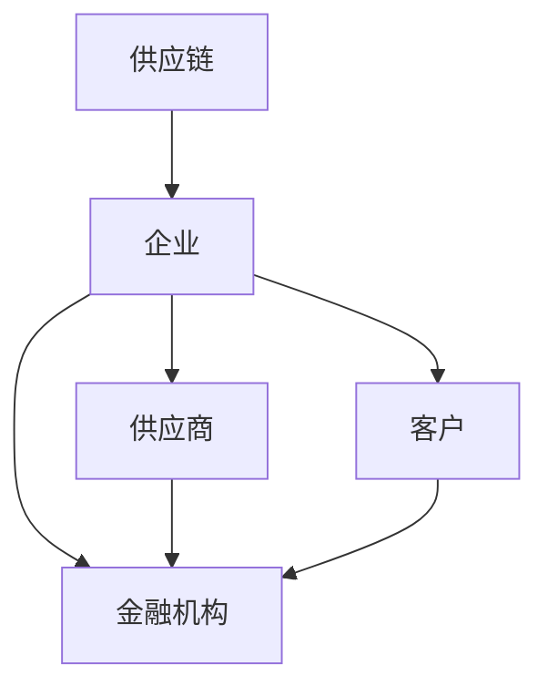
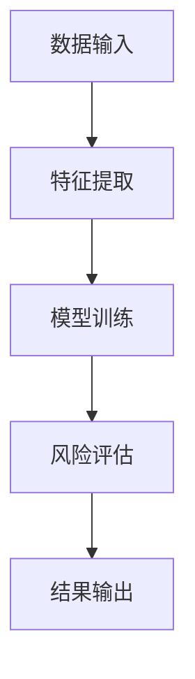
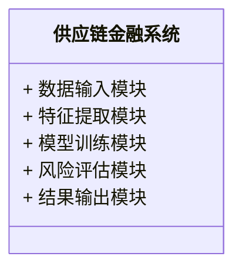
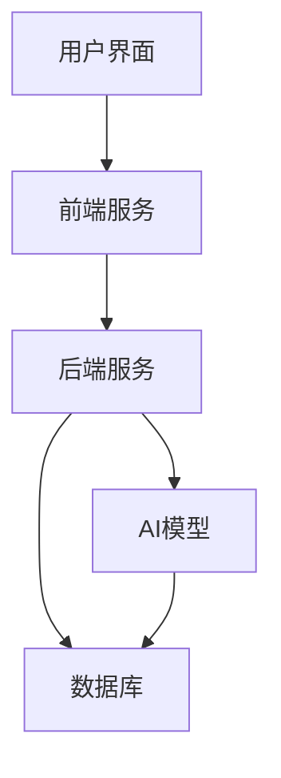

                 


# 智能供应链金融风险评估

## 关键词：供应链金融，风险管理，人工智能，机器学习，风险评估，智能系统

## 摘要：  
智能供应链金融风险评估是一种结合人工智能和大数据分析的创新方法，用于评估和管理供应链金融中的各类风险。本文从供应链金融的基本概念出发，详细探讨智能供应链金融的核心原理、风险评估的关键算法、系统架构设计以及实际应用案例。通过结合数学模型和实际场景分析，本文为读者提供一个全面理解智能供应链金融风险评估的框架，并为实践中的风险管理提供有价值的参考。

---

## 第一部分: 智能供应链金融风险评估概述

### 第1章: 供应链金融的背景与概念

#### 1.1 供应链金融的定义与特点
供应链金融是一种通过整合供应链上下游企业之间的资金流、物流和信息流，为供应链上的企业提供融资支持的金融模式。其特点包括：
- **系统性**：覆盖供应链的全链条，从原材料采购到最终产品的交付。
- **协作性**：依赖于供应链上各参与方的紧密合作。
- **灵活性**：能够根据供应链的实际需求快速调整融资方案。

#### 1.2 智能供应链金融的定义与特点
智能供应链金融是将人工智能、大数据和区块链等技术引入供应链金融领域，以提高融资效率、降低风险和优化资源配置。其特点包括：
- **智能化**：利用AI技术进行风险预测和决策优化。
- **数据驱动**：依赖于大数据的收集、处理和分析。
- **实时性**：能够实时监控供应链的动态，快速响应风险。

#### 1.3 供应链金融风险评估的重要性
供应链金融涉及多方利益相关者，风险评估是确保供应链稳定性和可持续性的关键环节。常见的风险包括：
- **信用风险**：供应链上企业因信用问题导致的融资风险。
- **操作风险**：供应链运作中的流程中断或错误。
- **市场风险**：市场波动对供应链价值的影响。

---

### 第2章: 智能供应链金融的核心概念与联系

#### 2.1 核心概念原理
智能供应链金融的核心概念包括：
- **区块链技术**：用于供应链上的数据共享和防篡改。
- **机器学习**：用于风险预测和信用评估。
- **物联网（IoT）**：用于实时监控供应链的物流信息。

#### 2.2 核心概念属性特征对比表格
以下是一个对比表格，展示了供应链金融与传统金融在核心概念上的区别：

| 特性          | 供应链金融                  | 传统金融                  |
|---------------|-----------------------------|---------------------------|
| 参与方        | 供应链上下游企业            | 企业与银行                |
| 资金流动      | 以供应链为核心              | 以企业为中心              |
| 风险管理      | 强调供应链整体风险控制      | 以单个企业为单位          |
| 技术依赖      | 大数据、AI、区块链          | 依赖传统金融工具          |

#### 2.3 ER实体关系图架构
以下是供应链金融的核心实体关系图：



---

## 第二部分: 智能供应链金融风险评估的算法原理

### 第3章: 算法原理讲解

#### 3.1 机器学习在风险评估中的应用
机器学习在供应链金融风险评估中的应用主要体现在：
- **信用评分模型**：利用历史数据训练模型，预测企业的信用风险。
- **违约预测**：基于企业的财务数据和市场信息，预测企业违约的可能性。

#### 3.2 常见的供应链金融风险评估算法
常用的算法包括：
- **随机森林（Random Forest）**：适用于多分类问题，能够处理高维数据。
- **逻辑回归（Logistic Regression）**：适用于二分类问题，如违约与非违约分类。
- **支持向量机（SVM）**：适用于小样本数据的分类问题。

#### 3.3 算法选择与优化
选择算法时需要考虑以下因素：
- 数据量和数据类型。
- 模型的可解释性和复杂度。
- 预测的准确性和稳定性。

---

### 第4章: 算法实现代码示例

#### 4.1 代码实现
以下是使用随机森林算法进行信用评分的Python代码示例：

```python
import pandas as pd
from sklearn.ensemble import RandomForestClassifier

# 加载数据
data = pd.read_csv('supply_chain_data.csv')

# 特征选择
features = data[['revenue', 'profit', 'debt', 'inventory']]
target = data['credit_risk']

# 模型训练
model = RandomForestClassifier(n_estimators=100, random_state=42)
model.fit(features, target)

# 预测结果
predictions = model.predict(features)
```

#### 4.2 算法流程图
以下是随机森林算法的流程图：



---

## 第三部分: 系统分析与架构设计

### 第5章: 系统功能设计

#### 5.1 问题场景介绍
供应链金融系统需要解决的主要问题包括：
- 如何实时监控供应链的物流和资金流。
- 如何快速评估供应链上的企业信用风险。

#### 5.2 系统功能设计
以下是系统的功能模块设计：



---

### 第6章: 系统架构设计

#### 6.1 系统架构图
以下是供应链金融系统的架构设计图：



---

## 第四部分: 项目实战

### 第7章: 环境安装与代码实现

#### 7.1 环境安装
安装所需的库：
```bash
pip install pandas scikit-learn matplotlib
```

#### 7.2 核心代码实现
以下是供应链金融风险评估的核心代码：

```python
import pandas as pd
from sklearn.model_selection import train_test_split
from sklearn.metrics import accuracy_score

# 加载数据
data = pd.read_csv('supply_chain_data.csv')

# 数据预处理
X = data.drop('credit_risk', axis=1)
y = data['credit_risk']

# 划分训练集和测试集
X_train, X_test, y_train, y_test = train_test_split(X, y, test_size=0.2, random_state=42)

# 模型训练
from sklearn.ensemble import RandomForestClassifier
model = RandomForestClassifier(n_estimators=100, random_state=42)
model.fit(X_train, y_train)

# 模型预测
y_pred = model.predict(X_test)

# 评估模型
print("Accuracy:", accuracy_score(y_test, y_pred))
```

---

## 第五部分: 总结与展望

### 第8章: 总结与展望

#### 8.1 项目总结
本文详细介绍了智能供应链金融风险评估的核心概念、算法原理和系统设计，并通过实际案例展示了其在供应链金融中的应用。

#### 8.2 未来展望
未来，随着人工智能和大数据技术的进一步发展，智能供应链金融将更加智能化和自动化。可能的发展方向包括：
- 更加复杂的机器学习模型。
- 区块链技术的深度应用。
- 更加智能化的风险预警系统。

---

## 最佳实践 Tips

- 在实际应用中，建议结合企业的具体业务需求选择合适的算法。
- 数据的预处理和清洗是确保模型准确性的关键步骤。
- 系统设计时应注重模块的可扩展性和可维护性。

---

## 作者：AI天才研究院/AI Genius Institute & 禅与计算机程序设计艺术 /Zen And The Art of Computer Programming

