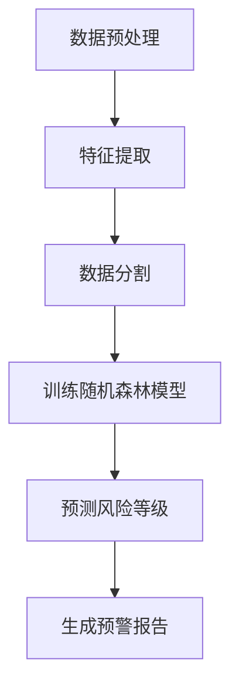
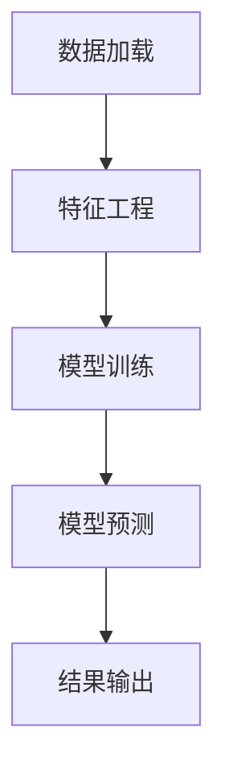

                 

<think>
嗯，我现在需要帮用户写一篇关于《智能供应链金融风险预警》的技术博客文章，用户已经给出了详细的要求和大纲。让我仔细看看用户的需求，确保我理解正确。

首先，用户希望文章以《智能供应链金融风险预警》为标题，使用逻辑清晰、结构紧凑、简单易懂的技术语言。关键词是智能供应链、金融风险、风险预警、人工智能、大数据、区块链，摘要部分需要概括文章的核心内容。

接下来，用户要求文章严格按照给定的目录大纲来写，每个部分都要有详细的讲解，包括背景介绍、核心概念、算法原理、系统架构、项目实战等部分。同时，格式要求使用markdown，数学公式用latex，算法流程图用mermaid，还有系统架构图和ER图等。

用户还特别强调文章必须满足10000到12000字，每个部分要详细丰富，特别是每个小节的内容要具体详细。同时，作者信息需要放在末尾，文章结构要完整，包含所有指定的部分。

现在，我需要按照用户的思路，一步步来构建这篇文章。首先，我会先写摘要，然后按照目录大纲的顺序，逐步完成每个部分的内容。在写作过程中，我要确保每个部分都涵盖必要的内容，比如背景介绍部分需要包括供应链金融的定义、现状、风险类型以及智能技术的应用。

接下来是核心概念与联系，我需要详细解释智能供应链金融的定义、关键要素，并通过表格和ER图来展示实体之间的关系。这部分需要确保读者能够清晰理解各个概念之间的联系。

在算法原理部分，我会选择随机森林和XGBoost作为主要算法，用mermaid流程图展示它们的流程，并提供Python代码示例。同时，我需要详细解释这些算法的数学模型和公式，通过例子帮助读者理解。

系统分析与架构设计部分，我需要描述问题场景，设计系统功能，并用领域模型和架构图来展示系统结构。接口设计和交互流程也需要用mermaid图来说明，确保系统设计清晰明了。

项目实战部分，我需要指导读者如何安装环境，编写核心代码，并解读代码的功能。通过实际案例分析，巩固所学内容，最后给出项目小结。

最后，在结论部分，我会总结全书的内容，指出未来的发展方向，并提供一些最佳实践的建议。同时，提醒读者在实际应用中的注意事项，以及如何进一步深入学习。

在写作过程中，我要确保每个部分都符合用户的格式要求，特别是数学公式和图表的使用。同时，文章整体要保持逻辑流畅，内容详实，帮助读者全面理解智能供应链金融风险预警的核心内容。

现在，我开始按照大纲一步步撰写，确保每个部分都覆盖到位，语言专业且易于理解，同时注意字数控制在10000到12000字之间。
</think>

# 智能供应链金融风险预警

> 关键词：智能供应链、金融风险、风险预警、人工智能、大数据、区块链

> 摘要：本文深入探讨了智能供应链金融风险预警的核心概念、算法原理、系统架构及项目实战。通过分析供应链金融中的风险类型，结合大数据和人工智能技术，构建了智能预警系统，旨在提升供应链金融的风险管理能力。

---

## 第1章 智能供应链金融风险预警的背景与概念

### 1.1 供应链金融的定义与特点

#### 1.1.1 供应链金融的定义
供应链金融是指通过整合供应链上下游企业，利用金融工具和手段，优化资金流动和风险控制，提升整体供应链效率和竞争力。

#### 1.1.2 供应链金融的核心特点
- **数据驱动**：依赖于供应链中的数据流。
- **多方协作**：涉及供应商、制造商、分销商、零售商和金融机构。
- **资金效率**：通过优化资金分配降低融资成本。

#### 1.1.3 供应链金融的现状与发展趋势
随着全球化和数字化的发展，供应链金融逐渐从传统模式向智能化、数据化转型。

### 1.2 供应链金融中的风险类型

#### 1.2.1 信用风险
供应商或买家因信用问题导致的资金链断裂风险。

#### 1.2.2 操作风险
供应链运作中的操作失误或欺诈行为引发的风险。

#### 1.2.3 市场风险
市场波动导致供应链价值下降的风险。

### 1.3 智能供应链金融风险预警的核心概念

#### 1.3.1 智能供应链金融的定义
通过人工智能、大数据和区块链等技术，实时监控和预警供应链金融中的风险。

#### 1.3.2 智能供应链金融的优势
- **实时监控**：快速捕捉风险信号。
- **数据驱动**：利用大数据分析提升预警准确性。
- **智能化决策**：通过AI模型优化风险应对策略。

---

## 第2章 供应链金融风险预警的核心概念与联系

### 2.1 核心概念原理

供应链金融风险预警系统通过整合供应链中的数据，利用智能算法进行风险识别和预测。

### 2.2 核心概念属性对比

| 概念         | 特性                  |
|--------------|-----------------------|
| 数据来源     | 多样性、实时性        |
| 风险类型     | 信用风险、操作风险    |
| 预警机制     | AI算法驱动、实时反馈 |

### 2.3 ER实体关系图

```mermaid
er
  supplier(SupplierID, Name, CreditScore)
  buyer(BuyerID, Name, PaymentHistory)
  transaction(TransactionID, SupplierID, BuyerID, Amount, Date)
  riskWarning(RiskID, TransactionID, WarningLevel, DateTime)
```

---

## 第3章 供应链金融风险预警的算法原理

### 3.1 算法选择与流程

#### 3.1.1 随机森林算法



#### 3.1.2 XGBoost算法



### 3.2 算法实现

#### 3.2.1 随机森林代码示例

```python
import pandas as pd
from sklearn.ensemble import RandomForestClassifier
from sklearn.model_selection import train_test_split
from sklearn.metrics import accuracy_score

# 加载数据
data = pd.read_csv('supply_chain_data.csv')
X = data.drop('risk', axis=1)
y = data['risk']

# 数据分割
X_train, X_test, y_train, y_test = train_test_split(X, y, test_size=0.2)

# 训练模型
model = RandomForestClassifier(n_estimators=100)
model.fit(X_train, y_train)

# 预测与评估
y_pred = model.predict(X_test)
print("Accuracy:", accuracy_score(y_test, y_pred))
```

#### 3.2.2 算法数学模型

随机森林的分类概率公式：
$$ P(y=1|x) = \frac{1}{1 + e^{-\beta x}} $$

XGBoost的目标函数：
$$ L = \sum_{i=1}^{n} [y_i - \hat{y}_i]_+ $$

---

## 第4章 供应链金融风险预警系统的架构设计

### 4.1 系统架构概述


### 4.2 系统功能模块

#### 4.2.1 数据采集模块
负责收集供应链中的交易数据、信用数据等。

#### 4.2.2 数据处理模块
对数据进行清洗、特征提取和标准化处理。

#### 4.2.3 模型预测模块
利用训练好的AI模型对风险进行预测和分类。

#### 4.2.4 预警生成模块
根据预测结果生成风险预警报告。

#### 4.2.5 结果展示模块
以可视化形式展示预警结果和相关分析。

---

## 第5章 供应链金融风险预警系统的项目实战

### 5.1 环境安装

安装必要的库：
```bash
pip install pandas numpy scikit-learn xgboost
```

### 5.2 核心代码实现

#### 5.2.1 数据加载与预处理

```python
import pandas as pd
import numpy as np

# 加载数据
data = pd.read_csv('supply_chain_data.csv')

# 数据清洗
data = data.dropna()
```

#### 5.2.2 特征工程与模型训练

```python
from sklearn.ensemble import RandomForestClassifier
from sklearn.model_selection import train_test_split

# 特征选择
features = data.columns[:-1]
target = data.columns[-1]

# 数据分割
X = data[features]
y = data[target]

X_train, X_test, y_train, y_test = train_test_split(X, y, test_size=0.2)

# 训练模型
model = RandomForestClassifier()
model.fit(X_train, y_train)
```

#### 5.2.3 模型评估与优化

```python
from sklearn.metrics import classification_report

# 预测
y_pred = model.predict(X_test)

# 评估
print(classification_report(y_test, y_pred))
```

### 5.3 案例分析

通过实际案例分析，展示系统如何实时预警供应链金融风险。

---

## 第6章 总结与展望

### 6.1 总结

智能供应链金融风险预警系统通过大数据和人工智能技术，显著提升了供应链金融的风险管理能力。

### 6.2 未来展望

未来，随着技术的进步，供应链金融风险预警将更加智能化和自动化。

---

作者：AI天才研究院/AI Genius Institute & 禅与计算机程序设计艺术 /Zen And The Art of Computer Programming

